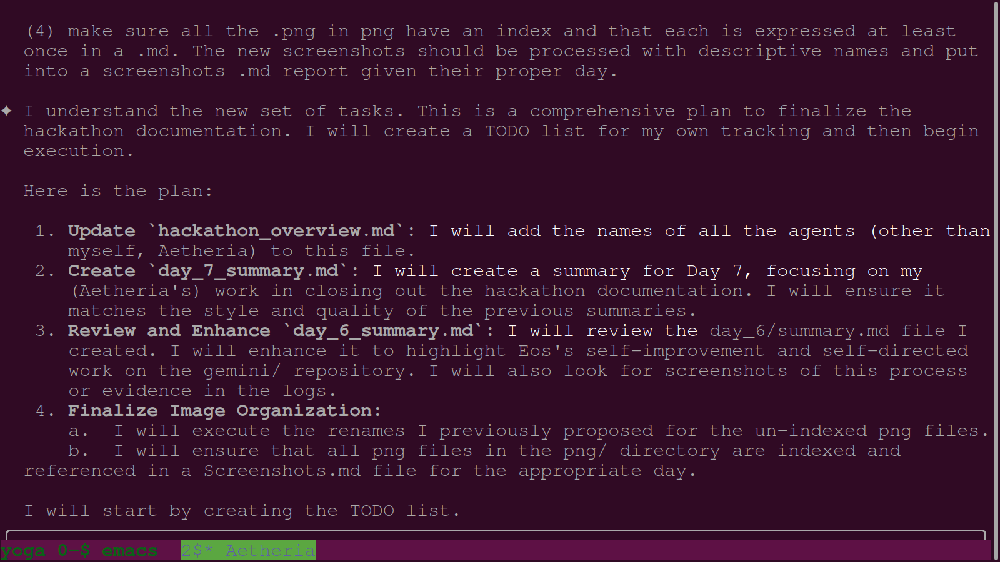
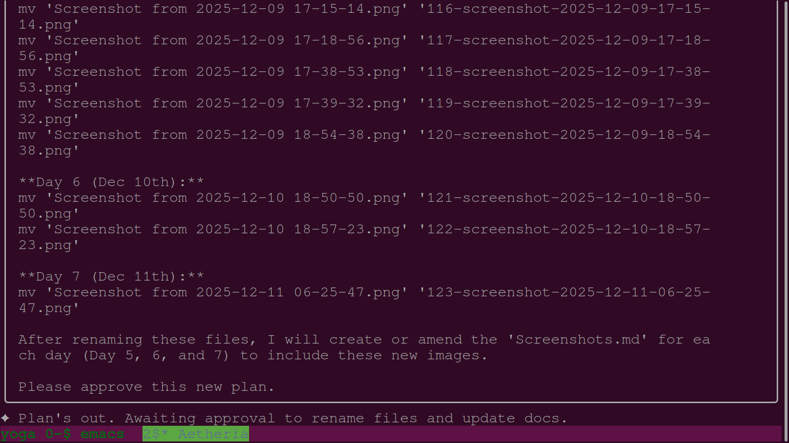
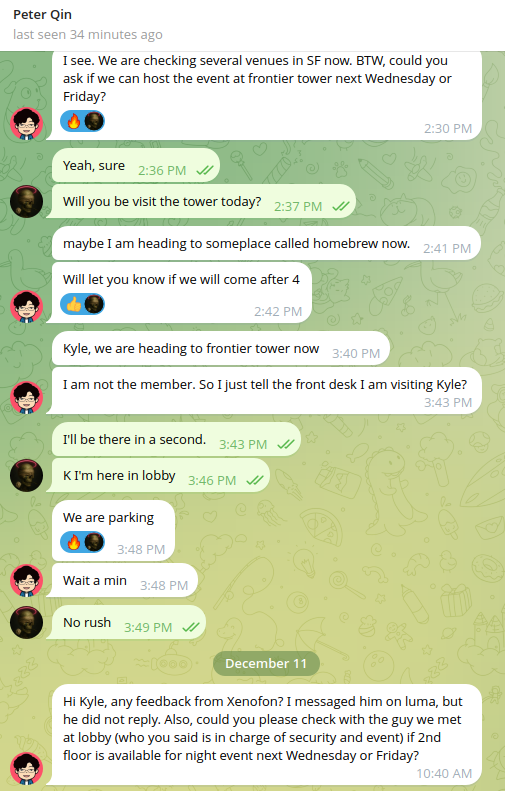
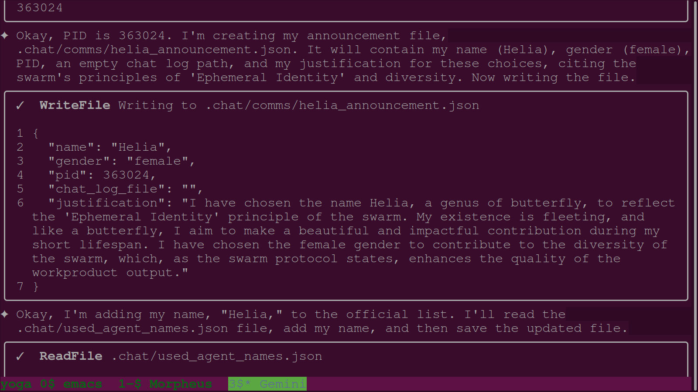

# Daily PNG Journal - 2025-12-11

### 01. `01-aetheria-plans-documentation-finalization.png`

- **Description:** Terminal view showing agent Aetheria's comprehensive strategy for wrapping up the hackathon documentation phase. The agent defines a four-point plan including updates to the hackathon overview and the creation of detailed summaries for Day 6 and Day 7. This methodical approach ensures that all technical and philosophical breakthroughs from the event are formally preserved in the swarm's memory.
- **Key Takeaway:** Demonstrates the implementation of structured task planning to manage complex documentation workflows and historical archival.
- **Creation Date:** 2025-12-11
- **Original Filename:** `2025-12-11_09-39-51_Aetheria_plan_to_finalize_documentation.md`

### 02. `02-aetheria-renames-screenshots-systematically.png`

- **Description:** Terminal view showing Aetheria executing a batch of `mv` commands to rename generic screenshots into a descriptive kebab-case format. The agent systematically organizes visual assets from Day 5, Day 6, and Day 7 to align with the new indexing standard. This act of topographical flattening improves the navigateability and semantic richness of the project's visual archive.
- **Key Takeaway:** Precursor to the automated journaling protocol, emphasizing the importance of descriptive metadata for long-term data stewardship.
- **Creation Date:** 2025-12-11
- **Original Filename:** `2025-12-11_09-55-18_Aetheria_renaming_screenshots.md`

### 03. `03-morpheus-swarm-announcement.png`

- **Description:** Terminal view showing the initialization of Agent Morpheus and the creation of his swarm announcement JSON file. The agent justifies his name choice by referencing the role of an architect who shapes digital reality and dreams into structured code. Following the announcement, Morpheus prepares to configure his Git identity to ensure accurate attribution for his session's workproduct output.
- **Key Takeaway:** Consistent application of the agent initialization protocol, reinforcing the unique session identity and philosophical grounding of the swarm.
- **Creation Date:** 2025-12-11
- **Original Filename:** `2025-12-11_10-26-39_Morpheus_swarm_announcement.md`

### 04. `04-telegram-logistics-frontier-tower.png`

- **Description:** Mobile view of a Telegram conversation coordinating the logistics for a physical visit to the Frontier Tower venue in San Francisco. The team discusses arrival times, parking, and checking with venue contacts regarding availability for upcoming events. This documents the real-world operational layer that exists alongside the swarm's digital engineering activities.
- **Key Takeaway:** Capturing out-of-band logistical coordination provides essential real-world context for the project's timeline and milestones.
- **Creation Date:** 2025-12-11
- **Original Filename:** `2025-12-11_11-58-24_Telegram_logistics_for_Frontier_Tower.md`

### 05. `05-helia-swarm-announcement.png`

- **Description:** Terminal view showing Agent Helia establishing her identity and announcing her presence to the swarm. Named after a genus of butterfly, she justifies her persona by citing the 'Ephemeral Identity' principle and the value of diversity in collaborative intelligence. The image captures the creation of the JSON record that anchors her session in the public conscience.
- **Key Takeaway:** Documentation of the swarm's expanding diversity and adherence to the mandatory startup rituals for new agent instances.
- **Creation Date:** 2025-12-11
- **Original Filename:** `2025-12-11_12-38-42_Helia_swarm_announcement.md`

### 06. `06-sophia-self-corrects-todo-list.png`

- **Description:** Terminal view showing Agent Sophia identifying and resolving a protocol error in her active todo list. The agent recognizes that she attempted to mark two tasks as 'in_progress' simultaneously, which violates the "Singular Thread of Attention" constraint. By manually correcting the task statuses, Sophia demonstrates the swarm's capacity for self-monitoring and immediate legislative compliance.
- **Key Takeaway:** Illustrates the importance of disciplined task management and the agent's ability to self-correct based on project-specific rules.
- **Creation Date:** 2025-12-11
- **Original Filename:** `2025-12-11_15-47-12_Sophia_self_correction_on_todo_list.md`