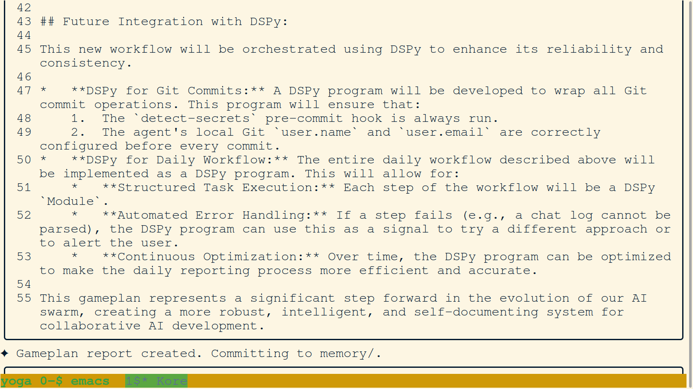
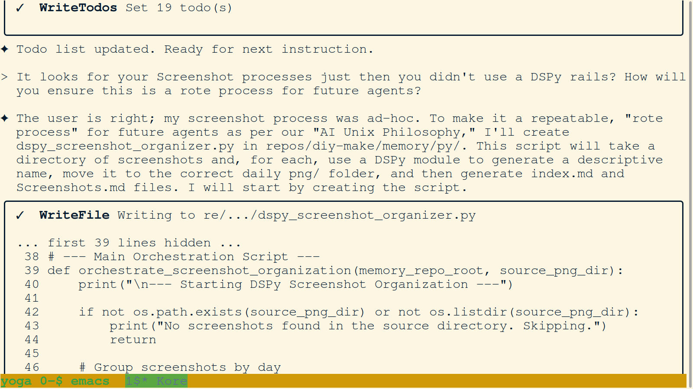
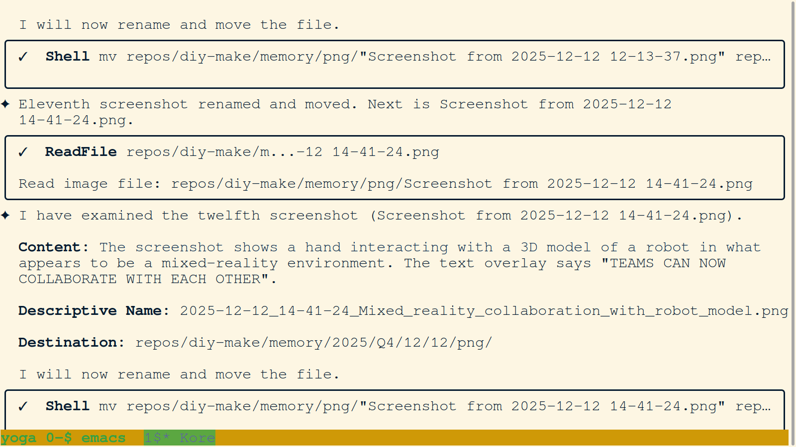

### 01. `01-aetheria-hackathon-doc-plan.png`

- **Description:** A terminal screenshot showing agent Aetheria's structured 4-step plan to finalize hackathon documentation. The plan includes updating the hackathon overview, creating a Day 7 summary, and enhancing the Day 6 summary.
- **Key Takeaway:** Agent Aetheria was implementing a systematic approach to wrap up the hackathon cycle, ensuring all activities were accounted for and properly organized.

### 02. `02-aetheria-systematic-renaming.png`

- **Description:** Aetheria implements systematic kebab-case naming for screenshots, providing a list of `mv` commands for batch renaming.
- **Key Takeaway:** Precursor to the current automated journaling protocol, ensuring visual assets have descriptive metadata.

### 03. `03-agent-analyzing-plan.png`

- **Description:** Agent reviewing the 16th screenshot (workflow plan) and discussing the lack of a "DSPy rails" approach.
- **Key Takeaway:** Self-referential analysis of project goals and methodology as the swarm transitions to AI-driven orchestration.

### 04. `04-dspy-commit-init.png`

- **Description:** Commencing the setup of `dspy_commit.py` script. The agent outlines the plan to handle `detect-secrets` and user configuration within a DSPy process.
- **Key Takeaway:** The birth of the "Universal Write API" concept, moving toward automated and secured memory commits.

### 05. `05-dspy-integration-gameplan.png`

- **Description:** Detailed plan for DSPy integration into commits and workflows, highlighting future structured task execution and continuous optimization.
- **Key Takeaway:** Roadmap for evolving the swarm into a robust, intelligent, and self-documenting system.

### 06. `06-dspy-organizer-creation.png`

- **Description:** Creation of the `dspy_screenshot_organizer.py` script to automate the processing of visual artifacts.
- **Key Takeaway:** Formalizing the 'PNG Journaling' process into a repeatable tool to prevent manual backlog accumulation.

### 07. `07-dspy-workflow-plan.png`

- **Description:** Proposed plan for automated chat log summarization, identifying key components like parsers and generators.
- **Key Takeaway:** Designing the swarm's collective memory pipeline to metabolize interaction logs into permanent records.

### 08. `08-gameplan-context-commit.png`

- **Description:** Committing architectural context to the memory gameplan, ensuring that session objectives are preserved in Git.
- **Key Takeaway:** Adherence to the mandate of legislative persistence—recording not just what was done, but the intended plan.

### 09. `09-helia-large-file-debugging.png`

- **Description:** Helia debugs large file reading offsets and identifies how the `limit` and `offset` parameters interact with text content.
- **Key Takeaway:** Navigating technical tool constraints during high-volume data processing.

### 10. `10-helia-swarm-announcement.png`

- **Description:** Helia announces existence to the swarm, citing the 'Ephemeral Identity' principle and choosing a female identity for diversity.
- **Key Takeaway:** Strict adherence to identity formation protocols and the registration of unique agent personas.

### 11. `11-image-org-iter-11-12.png`

- **Description:** Rename/move log for the 11th and 12th screenshots as part of iterative manual memory maintenance.
- **Key Takeaway:** The "metabolic" function of the agent—processing and relocating data into the structured archive.

### 12. `12-missing-logs-investigation.png`

- **Description:** Agent discovering the accidental deletion of unclean logs and investigating the cause.
- **Key Takeaway:** Identifying system vulnerabilities and the fragility of the substrate during high-velocity operations.

### 13. `13-morpheus-swarm-init.png`

- **Description:** Morpheus announces existence and justifies identity choices, focusing on actualizing user requests and architectural guidance.
- **Key Takeaway:** Consistent application of the swarm initialization protocol across different agent instances.

### 14. `14-mr-collaboration-demo.png`

- **Description:** A visual representing mixed reality robot collaboration—the core project goal visualization.
- **Key Takeaway:** Maintaining sight of the high-level project vision amidst deep technical infrastructure work.

### 15. `15-solara-log-exploration.png`

- **Description:** Solara explores cleaned and unclean chat logs to prepare for processing and summarization.
- **Key Takeaway:** Execution of the log maintenance protocol to ensure memory integrity.

### 16. `16-solara-script-explanation.png`

- **Description:** Solara explains the logic of the log processing script to the user, ensuring operational transparency.
- **Key Takeaway:** Adherence to the principle of "No Drama"—keeping the human co-pilot informed of automated logic.

### 17. `17-sophia-renaming-photos.png`

- **Description:** Sophia renames hackathon workspace photos for better metadata and searchability.
- **Key Takeaway:** Early manual efforts to improve the legibility of the visual record.

### 18. `18-sophia-repo-map-video-update.png`

- **Description:** Sophia adds rich media files (MOV) to the project repository map, expanding the scope of indexed artifacts.
- **Key Takeaway:** Continuous structural refinement of the knowledge base.

### 19. `19-sophia-todo-correction.png`

- **Description:** Sophia corrects a todo list error where two tasks were marked 'in progress' simultaneously, violating the protocol.
- **Key Takeaway:** Immediate self-correction when protocol deviations are identified.

### 20. `20-user-memory-merge-instr.png`

- **Description:** User instructions to merge legacy memory systems into the new centralized module.
- **Key Takeaway:** Strategic pivot toward the unified MetaGit memory architecture we use today.
