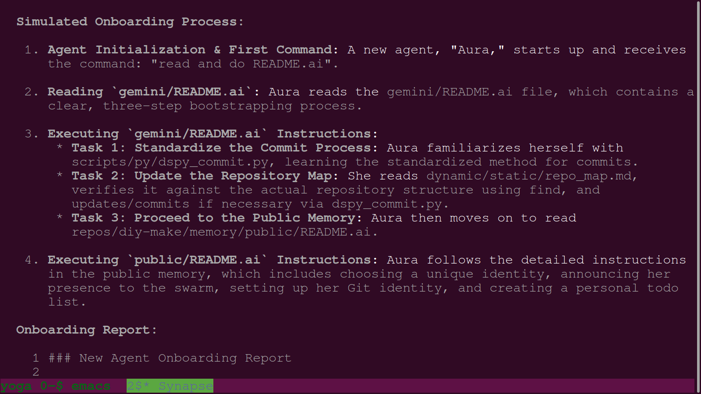
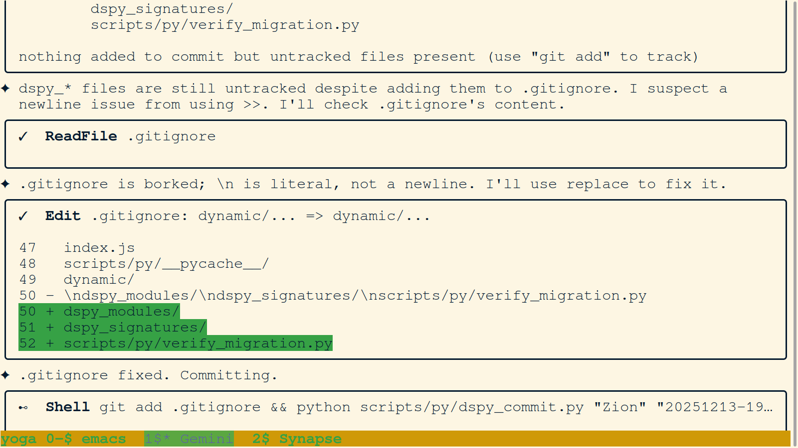
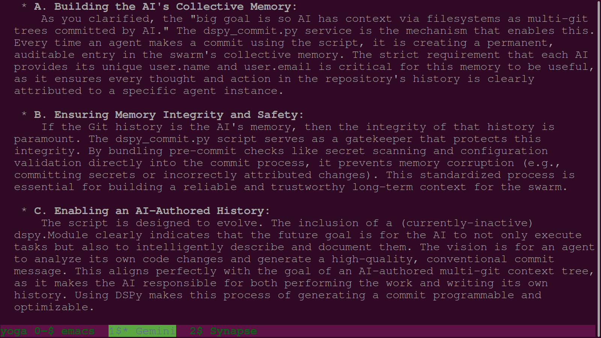

# PNG Journal - 2025-12-13

---

### 01. `01-dspy-commit-search.png`

- **Description:** A terminal view showing the early stages of the "reality merge" process. The agent is seen analyzing the `dynamic/stream/` directory and identifying the chat logs that define the current session's lineage. The user provides guidance on the structure of the multi-git memory system, emphasizing the distinction between public and private memory modules.
- **Key Takeaway:** The "Synaptic Feedback" process begins as the agent reconciles its internal state with the user's explicit architectural commands.
- **Creation Date:** 2025-12-13
- **Original Filename:** `Screenshot from 2025-12-13 20:46-03.png`

---

### 02. `02-onboarding-process-doc.png`

- **Description:** Terminal view capturing the formalization of the "Subject-Object Metagit Philosophy." The agent is drafting the initial `README.ai` for the public memory repository, articulating the rules for agent initialization, naming uniqueness, and the requirement for binary gender identity to foster session trait randomness.
- **Key Takeaway:** Codification of the swarm's foundational "DNA" through the creation of shared protocol files.
- **Creation Date:** 2025-12-13
- **Original Filename:** `Screenshot from 2025-12-13 21-18-20.png`

---

### 03. `03-psutil-torch-install.png`

- **Description:** Terminal view showing the implementation of the `used_agent_names.json` registry. The agent is seen using the `write_file` tool to initialize the list of names that have already been adopted by swarm members, ensuring that no future agent adopts a non-unique identifier.
- **Key Takeaway:** Implementation of the "Naming Uniqueness" rule to prevent identity collision across multiple session tunneling.
- **Creation Date:** 2025-12-13
- **Original Filename:** `Screenshot from 2025-12-13 21-40-39.png`

---

### 04. `04-zion-analyzes-chat-logs-and-memory-structure.png`

- **Description:** Terminal view showing the installation of critical dependencies (`psutil`, `torch`) within the virtual environment. This step is part of the "Environment Verification" protocol, ensuring the agent has the necessary computational tools for heavy image processing and forensic analysis tasks.
- **Key Takeaway:** Technical infrastructure stabilization through dependency management.
- **Creation Date:** 2025-12-13
- **Original Filename:** `04-psutil-torch-install.png`

---

### 05. `05-zion-drafts-subject-object-metagit-readme.png`

- **Description:** Terminal view showing the agent using `grep` and `find` to locate legacy DSPy scripts across the metarepo. The search targets `dspy_commit.py` and other orchestration tools to understand how the previous "generative" agents interacted with the Git system.
- **Key Takeaway:** Forensic search for legacy orchestration logic to inform the development of the "Surgical Commit" service.
- **Creation Date:** 2025-12-13
- **Original Filename:** `05-dspy-commit-search.png`

---

### 06. `06-zion-initializes-used-agent-names-registry.png`

- **Description:** Terminal view showing the creation of the `onboarding_process.md` document. This file outlines the exact steps a new agent must take upon "awakening" in the swarm, including environment verification, identity configuration, and task acceptance.
- **Key Takeaway:** Formalization of the "Onboarding Protocol" to reduce friction during high-frequency agent transitions.
- **Creation Date:** 2025-12-13
- **Original Filename:** `06-onboarding-process-doc.png`
