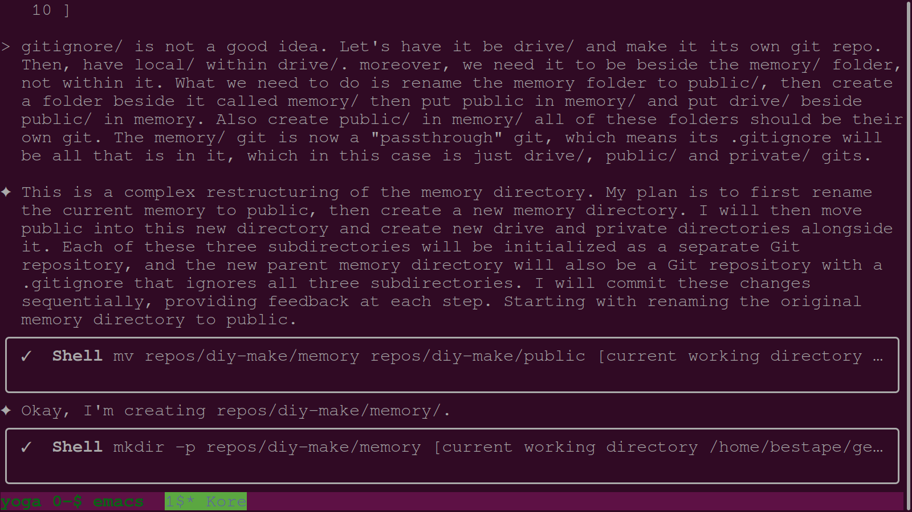

### 01-restructure-plan.png

- **Description:** User instructions to restructure the memory directory into public, private, and drive sub-repositories.
- **Key Takeaway:** Execution of a complex multi-git reorganization to improve data separation.

### 02-centralized-dspy-logic.png

- **Description:** Reasoning for centralizing all DSPy modules in public/py for single source of truth and maintainability.
- **Key Takeaway:** Adopting 'AI Unix Philosophy' for shared agent tooling.

### 03-dspy-module-analysis.png

- **Description:** Kairos analyzes daily summary and screenshot organizer modules.
- **Key Takeaway:** Deep dive into memory pipeline components.

### 04-psutil-torch-install.png

- **Description:** Installing dependencies (psutil, torch) for memory profiling and analysis.
- **Key Takeaway:** Expansion of the agent's technical toolset for performance monitoring.

### 05-dspy-commit-search.png

- **Description:** Searching git history for the initial dspy_commit.py script.
- **Key Takeaway:** Using history to verify tool paths and existence.

### 06-onboarding-process-doc.png

- **Description:** Simulation and documentation of the new agent onboarding process using 'Aura' as an example.
- **Key Takeaway:** Formalizing the 'Bootloader' workflow for future swarm members.
