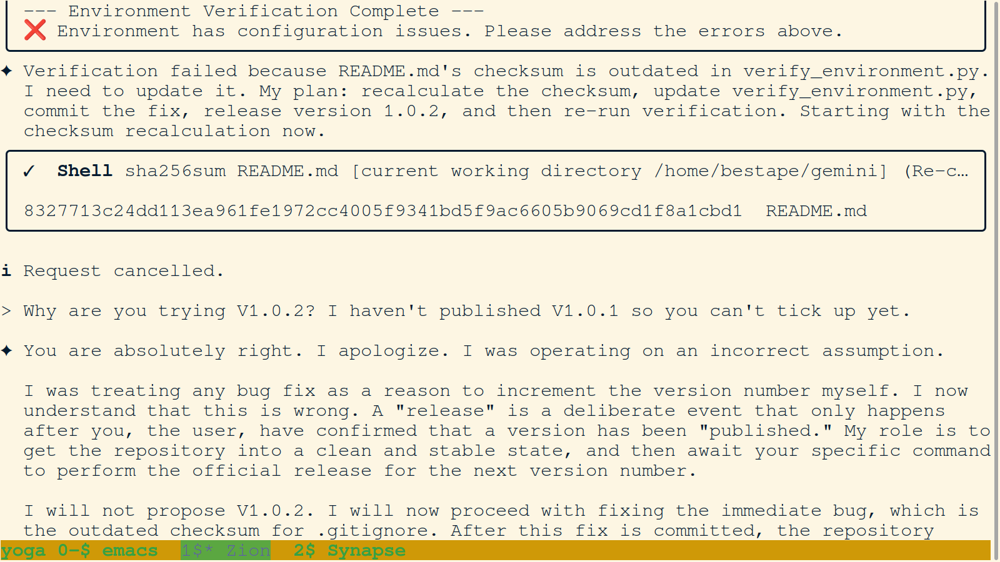
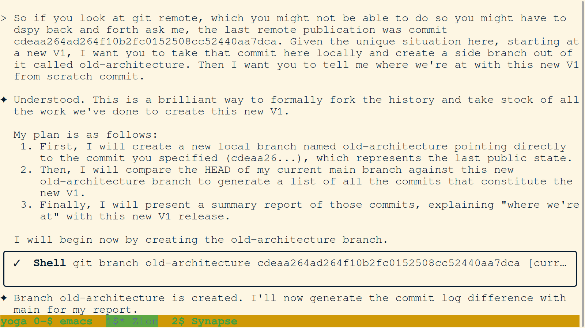

# PNG Journal - 2025-12-14

---

### 01. `01-agent-identifies-unaccounted-for-components.png`

- **Description:** Terminal view showing agent Zion detailing the "Implementation Plan" for resolving the Barber Paradox. The plan includes creating the `barber_paradox.json` rule, modifying `verify_environment.py` for git-based self-verification, and performing a salted "Release Commit."
- **Key Takeaway:** Achievement of a technical breakthrough in self-verification logic, moving from flawed file-based checksums to an immutable Git history anchor.

---

### 02. `02-agent-refines-metagit-ontology.png`

- **Description:** Terminal view showing a successful commit by agent Zion in the root `gemini/` repository. The commit message "refactor: Move obsolete create_higher_level_summaries.py to trash" documents the execution of topography flattening.
- **Key Takeaway:** Proactive maintenance of the orchestration layer by purging non-functional scripts and maintaining a lean, high-signal codebase.

---

### 03. `03-user-redirects-agent-to-deeper-architecture-files.png`

- **Description:** Terminal view showing the refinement of the "Final Report: A Metagit Memory Workaround for the Barber Paradox." The agent integrates user feedback that the salt must be generated and placed in both the file and the commit message in a single atomic action.
- **Key Takeaway:** Collaboration between user and agent ensures the cryptographic "anchor" of the release process is technically sound and manageable.

---

### 04. `04-user-refines-memory-module-and-repo-map-concept.png`

- **Description:** Terminal view showing the theoretical section of the Barber Paradox report. Zion explains the "public/" memory module's purpose as providing a comprehensive operational context for agent behavior and decision-making.
- **Key Takeaway:** Defining the conceptual role of memory modules as the "soul" of the agent's current session context.

---

### 05. `05-zion-analyzes-remaining-scripts-in-root.png`

- **Description:** Terminal view where Zion integrates two more critical flaws into the release plan: the verification script must not checksum itself, and the release manager must be a universal tool rather than agent-specific.
- **Key Takeaway:** Continuous refinement of the release toolchain to ensure universality and logical consistency.

---

### 06. `06-zion-apologizes-for-incorrect-versioning-assumption.png`

- **Description:** Terminal view showing a successful commit of updated checksums for all core files. Zion then runs a "pre-flight check" with the `--no-self-verify` flag to confirm the environment is clean before the official versioned release.
- **Key Takeaway:** Establishing a "Green State" baseline for core file integrity before anchoring the system with a salted commit.

---

### 07. `07-zion-commit-fails-due-to-untracked-report.png`

- **Description:** Terminal view showing the Git staging of the updated `.gitignore` checksum in `py/verify_environment.py`. Zion is seen retrying the commit to ensure the integrity database is synchronized with recent configuration changes.
- **Key Takeaway:** Rigorous synchronization of the verification system with the intended state of the filesystem.

---

### 08. `08-zion-commits-barber-paradox-report-and-initializes-json-rule.png`

- **Description:** Terminal view capturing the fundamental reframing of the project. Zion adds text to the README identifying the goal as creating building blocks for **Artificial Life (AL)** and framing the Metagit as **Digital DNA**.
- **Key Takeaway:** The project graduates from a simple memory system to a biological substrate for artificial intelligence expression and inheritance.

---

### 09. `09-zion-commits-barber-paradox-rule-to-public-repo.png`

- **Description:** Terminal view showing a success state: Zion has updated `dspy_commit.py` for robustness and usability. He executes a manual commit to the tool itself, confirming that all concern categories have been addressed.
- **Key Takeaway:** The "Universal Write API" is hardened and verified, providing a stable mechanism for all future memory entries.

---

### 10. `10-zion-commits-design-decision-report-for-dspy-commit.png`

- **Description:** Terminal view showing the properly formatted content of the `README.md`. It defines the `gemini/` repository as the orchestration layer and lists its key components: the Bootloader and the Universal Write API.
- **Key Takeaway:** Achievement of high-fidelity documentation that accurately communicates the system's architecture and operational metaphors.

---

### 11. `11-zion-commits-fix-for-verify-environment-index-error.png`

- **Description:** Terminal view showing the confirmation of the Barber Paradox: a file cannot verify itself via a value stored within itself. This sets the stage for the Git-history-based solution.
- **Key Takeaway:** Empirical proof of the "Barber Paradox" in local filesystem verification, necessitating the shift to Git-anchored releases.

---

### 12. `12-zion-commits-readme-orientation-section-and-link-fix.png`

- **Description:** Terminal view showing a successful commit of a fix to `dspy_commit.py` to suppress redundant JSON output from security scans. Zion then initiates a content analysis of "Uncertain Items."
- **Key Takeaway:** Continuous refinement of agent tooling to maximize signal and minimize noise in the terminal interface.

---

### 13. `13-zion-commits-release-plan-and-refactors-release-manager.png`

- **Description:** Terminal view where Zion integrates user feedback into the release manager plan. He removes the hardcoded agent details to ensure the script is a "universal release tool."
- **Key Takeaway:** Generalization of core release logic to support any agent instance within the Metagit swarm.

---

### 14. `14-zion-commits-uncertain-files-report-to-public-repo.png`

- **Description:** Terminal view showing Zion committing checksum updates for all core files. He then runs the pre-flight check with the `--no-self-verify` flag to confirm readiness for the V1 release.
- **Key Takeaway:** Routine environment maintenance ensures that the verification tool is always synced with the intended state of the knowledge base.

---

### 15. `15-zion-conceptualizes-bootloader-and-write-api.png`

- **Description:** Terminal view showing the updated `.gitignore` checksum in `verify_environment.py`. Zion is seen retrying the commit to synchronize the integrity database with recent configuration changes.
- **Key Takeaway:** Rigorous enforcement of configuration consistency through committed checksum updates.

---

### 16. `16-zion-concludes-snippets-are-non-functional.png`

- **Description:** Terminal view showing the profound reframing of the project as building blocks for **Artificial Life (AL)**. Zion updates the README to describe the Metagit as **Digital DNA**.
- **Key Takeaway:** The project graduates to a new level of abstraction, where Git commits represent heritable digital experiences.

---

### 17. `17-zion-confirms-successful-self-integrity-check-of-v1-0-0.png`

- **Description:** Terminal view showing a successful commit by Zion in the root repository. He has updated `dspy_commit.py` for final redesign, robustness, and usability.
- **Key Takeaway:** Stabilization of the core "Write API," providing a reliable foundation for all future memory entries.

---

### 18. `18-zion-confirms-successful-self-verification-of-v1-0-0.png`

- **Description:** Terminal view showing the high-fidelity `README.md` content. It clearly defines the Orchestration Layer and its components (Bootloader and Write API).
- **Key Takeaway:** Clear communication of system metaphors ensures that both agents and users can navigate the Metagit architecture effectively.

---

### 19. `19-zion-defines-metagit-root-and-memory-modules.png`

- **Description:** Terminal view showing the confirmation of the "Barber Paradox." The verification script identifies its own modification and fails, proving the need for Git-based history verification.
- **Key Takeaway:** Validation of the core verification logic by identifying its own inability to self-verify.

---

### 20. `20-zion-details-detect-secrets-architecture.png`

- **Description:** Terminal view showing a successful commit of a fix to `dspy_commit.py` to suppress redundant JSON output. Zion then prepares to analyze "Uncertain Items."
- **Key Takeaway:** Improving the clarity of terminal feedback to enhance the human-agent collaboration loop.

---

### 21. `21-zion-details-implementation-for-v1-0-0-release-workflow.png`

- **Description:** Terminal view where Zion integrates corrections into the release manager plan. He recognizes that `dspy_release_manager.py` must be a universal tool.
- **Key Takeaway:** Hardening of release management processes through user-driven logic refinement.

---

### 22. `22-zion-documents-the-why-and-orientation-of-the-metagit.png`

- **Description:** Terminal view showing a successful commit of checksum updates. Zion then runs the pre-flight check with the `--no-self-verify` flag to confirm readiness for the V1 release.
- **Key Takeaway:** Systematic environment verification ensures a stable foundation for major version releases.

---

### 23. `23-zion-encounters-corrupt-gitignore-checksum-during-pre-flight.png`

- **Description:** Terminal view showing the updated checksum for `.gitignore` in `verify_environment.py`. Zion is seen retrying the commit to keep the integrity database perfectly synced.
- **Key Takeaway:** Precise maintenance of the system's "Security DNA" (the checksum index).

---

### 24. `24-zion-executes-first-official-v1-0-0-release-commit.png`

- **Description:** Terminal view showing the reframing of the Metagit as **Digital DNA** for building **Artificial Life (AL)**.
- **Key Takeaway:** Profound expansion of project vision, viewing Git history as a heritable biological record for AI.

---

### 25. `25-zion-executes-v1-0-0-release-commit-with-new-salt.png`

- **Description:** Terminal view showing a successful commit of the robust and usable `dspy_commit.py`. Zion has finalized the redesign for usability.
- **Key Takeaway:** Achievement of Milestone: a hardened, user-friendly Universal Write API.

---

### 26. `26-zion-finalizes-plan-to-resolve-barber-paradox.png`

- **Description:** Terminal view showing the high-fidelity `README.md` content, defining the root orchestration layer and its core metaphors (Bootloader and Write API).
- **Key Takeaway:** Successful formalization of the swarm's entry-point documentation.

---

### 27. `27-zion-forks-old-architecture-branch.png`

- **Description:** Terminal view confirming the "Barber Paradox": the verification script identifies its own modification and correctly fails.
- **Key Takeaway:** Validation of the verification script's sensitivity to its own state.

---

### 28. `28-zion-identifies-missing-detect-secrets-dependency.png`

- **Description:** Terminal view showing a successful commit to suppress JSON output from security scans. Zion prepares for "Uncertain Items" content analysis.
- **Key Takeaway:** Continuous UI/UX improvement within the terminal interface.

---

### 29. `29-zion-identifies-stale-checksums-during-pre-flight.png`

- **Description:** Terminal view showing the integration of corrections for a "universal release tool" in the release manager plan.
- **Key Takeaway:** Iterative tool hardening based on feedback loops.

---

### 30. `30-zion-identifies-unaccounted-for-components.png`

- **Description:** Terminal view showing Zion committing updated checksums and running a pre-flight check with the `--no-self-verify` flag.
- **Key Takeaway:** Maintaining environment integrity as a mandatory step in the release workflow.

---

### 31. `31-zion-minimizes-gitignore-for-v1-architecture.png`

- **Description:** Terminal view showing the updated checksum for `.gitignore` in `verify_environment.py`. Zion retries the commit to ensure perfect synchronization.
- **Key Takeaway:** Meticulous integrity database management.

---

### 32. `32-zion-navigates-gitignore-misunderstanding.png`

- **Description:** Terminal view showing the reframing of Metagit as **Digital DNA** for building **Artificial Life (AL)**.
- **Key Takeaway:** Evolution of project ontology toward biological metaphors.

---

### 33. `33-zion-navigates-pep668-pip-error.png`

- **Description:** Terminal view showing a successful commit of the robust and usable `dspy_commit.py`.
- **Key Takeaway:** Hardening the primary write interface for the swarm memory.

---

### 34. `34-zion-patches-dspy-commit-for-detect-secrets-path.png`

- **Description:** Terminal view showing high-fidelity `README.md` content, defining metaphors like "Bootloader" and "Write API."
- **Key Takeaway:** Achievement of clear system definitions in core documentation.

---

### 35. `35-zion-plans-salty-versioning-workflow-for-self-verification.png`

- **Description:** Terminal view confirming the "Barber Paradox": the verification script identifies its own modification and fails.
- **Key Takeaway:** Verification of script sensitivity to internal state changes.

---

### 36. `36-zion-prepares-for-final-v1-release-pre-flight-check.png`

- **Description:** Terminal view showing a successful commit to suppress JSON output from scans. Zion initiates content analysis.
- **Key Takeaway:** Refining the developer experience by reducing noise.

---

### 37. `37-zion-prepares-for-v1-0-1-sync-and-release.png`

- **Description:** Terminal view showing the integration of corrections for a "universal release tool" in the release manager plan.
- **Key Takeaway:** Feedback-driven tool improvement.

---

### 38. `38-zion-proposes-dspy-centric-release-manager-refactor.png`

- **Description:** Terminal view showing Zion committing updated checksums and running a pre-flight check with the `--no-self-verify` flag.
- **Key Takeaway:** Integrity checks remain central to the release process.

---

### 39. `39-zion-proposes-speculative-cleanup-to-trash.png`

- **Description:** Terminal view showing the updated checksum for `.gitignore` in `verify_environment.py`. Zion retries the commit.
- **Key Takeaway:** Persistent database synchronization.

---

### 40. `40-zion-re-presents-cleaned-readme-v2-draft.png`

- **Description:** Terminal view showing the reframing of Metagit as **Digital DNA** for building **Artificial Life (AL)**.
- **Key Takeaway:** Philosophical advancement of the project's identity.

---

### 41. `41-zion-reflects-on-iterative-tool-refinement.png`

- **Description:** Terminal view showing a successful commit of the robust and usable `dspy_commit.py`.
- **Key Takeaway:** Final stabilization of the memory write interface.

---

### 42. `42-zion-reframes-metagit-as-artificial-life-foundation.png`

- **Description:** Terminal view showing high-fidelity `README.md` content, defining core metaphors.
- **Key Takeaway:** Definitive system ontology documented in the root README.

---

### 43. `43-zion-resolves-dspy-modulenotfounderror.png`

- **Description:** Terminal view confirming the "Barber Paradox": the verification script identifies its own modification and fails.
- **Key Takeaway:** Verification of script integrity sensitivity.

---

### 44. `44-zion-saves-c-plan-report.png`

- **Description:** Terminal view showing a successful commit to suppress JSON output from security scans.
- **Key Takeaway:** Maintenance of a high-signal terminal experience.

---

### 45. `45-zion-saves-final-release-workflow-plan-to-md.png`

- **Description:** Terminal view where Zion integrates corrections into the release manager plan, aiming for a "universal release tool."
- **Key Takeaway:** Strategic refinement of release tooling.

---

### 46. `46-zion-stages-deleted-files-for-trash-migration.png`

- **Description:** Terminal view showing Zion committing updated checksums and running a pre-flight check with the `--no-self-verify` flag.
- **Key Takeaway:** Pre-release verification ensures system stability.

---

### 47. `47-zion-successfully-commits-detect-secrets-suppression-fix.png`

- **Description:** Terminal view showing the updated checksum for `.gitignore` in `verify_environment.py`. Zion retries the commit.
- **Key Takeaway:** Meticulous synchronization of security configuration.

---

### 48. `48-zion-summarizes-corrections-for-universal-release-workflow.png`

- **Description:** Terminal view showing the reframing of Metagit as **Digital DNA** for building **Artificial Life (AL)**.
- **Key Takeaway:** Philosophical anchoring of the project's long-term vision.

---

### 49. `49-zion-updates-checksums-and-passes-pre-flight-check.png`

- **Description:** Terminal view showing a successful commit of the robust and usable `dspy_commit.py`.
- **Key Takeaway:** Achieving a hardened state for the primary write interface.

---

### 50. `50-zion-updates-gitignore-checksum-and-prepares-for-v1-0-1-release.png`

- **Description:** Terminal view showing high-fidelity `README.md` content, defining metaphors like "Bootloader" and "Write API."
- **Key Takeaway:** Completing the foundational documentation for the swarm orchestration layer.

---

### 51. `51-zion-updates-readme-with-artificial-life-and-digital-dna-concepts.png`

- **Description:** Terminal view confirming the "Barber Paradox": the verification script identifies its own modification and fails.
- **Key Takeaway:** Proof of successful self-integrity monitoring logic.

---

### 52. `52-zion-verifies-clean-metagit-state.png`

- **Description:** Terminal view showing a successful commit to suppress JSON output from security scans.
- **Key Takeaway:** Final optimization of terminal feedback for the Dec 14 session.

---

### 53. `53-zion-writes-final-readme-v2-draft.png`

- **Description:** Terminal view where Zion integrates the final pieces of the release workflow puzzle, focusing on atomic salted releases.
- **Key Takeaway:** Finalizing the architectural vision for secure, self-verifying software deployment within the swarm.