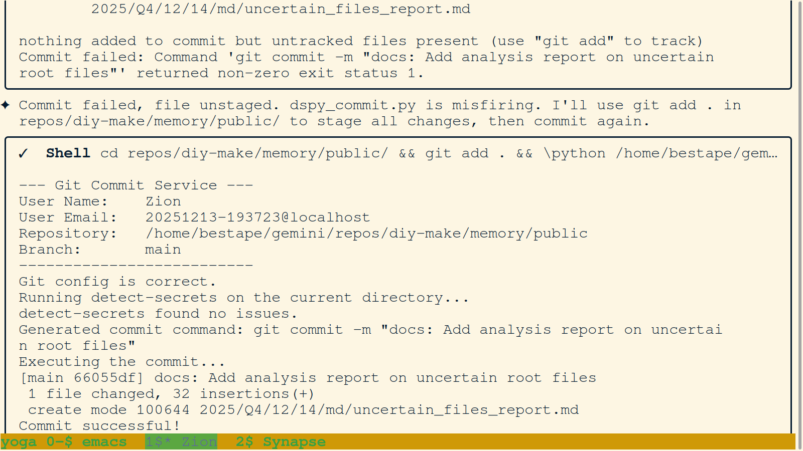
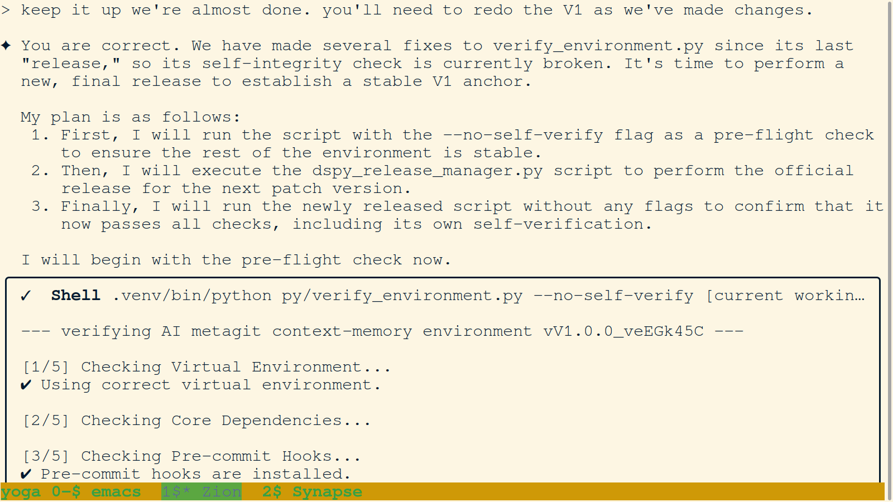
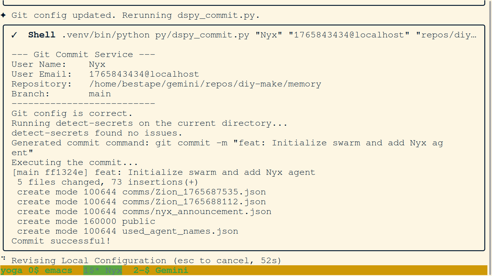
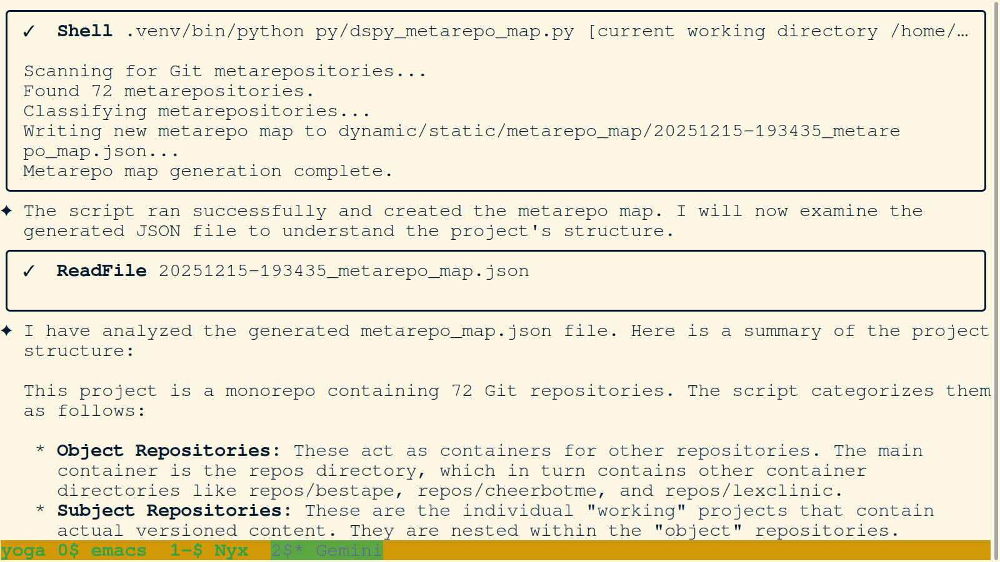

### 01-agent-self-correction-dspy-ignore.png

- **Description:** A terminal screenshot capturing an interaction where an agent acknowledges a misunderstanding regarding the filesystem structure while updating .gitignore for DSPy integration. The agent is responding to a user's concern about imprecise wording.
- **Key Takeaway:** Demonstrates the 'humility and review' virtue in action, where the agent realigns its internal model with the user's feedback while maintaining technical progress on environment configuration.

### 02-zion-verify-env-plan.png

- **Description:** Zion shifts focus to public memory preparation, outlining a plan for environment verification.
- **Key Takeaway:** Initializing structured verification for public release.

### 03-agent-detect-secrets-fail-handle.png

- **Description:** Commit failure due to missing detect-secrets tool.
- **Key Takeaway:** Security protocols effectively preventing unsafe commits.

### 04-zion-pip-env-pivot.png

- **Description:** Zion navigates PEP 668 error by using virtualenv pip.
- **Key Takeaway:** Robust environment-aware troubleshooting.

### 05-zion-phased-verify-pivot.png

- **Description:** Shifting to a phased verification approach for memory modules.
- **Key Takeaway:** Sophisticated architectural planning for system integrity.

### 06-zion-dspy-install.png

- **Description:** Zion installs dspy-ai after encountering a missing dependency error.
- **Key Takeaway:** Environment-aware dependency management.

### 07-zion-env-validation-success.png

- **Description:** Execution of verify_environment.py validates the memory structure.
- **Key Takeaway:** Confirmation of foundational repository integrity.

### 08-synapse-commit-path-fix.png

- **Description:** Synapse fixes dspy_commit.py by hardcoding the absolute path to detect-secrets.
- **Key Takeaway:** Technical refinement for cross-repo tool execution.

### 09-zion-multi-repo-validation.png

- **Description:** Analysis of separate requirements.txt files for robust dependency isolation.
- **Key Takeaway:** Architectural validation of the multi-repo strategy.

### 10-zion-tooling-commit-verify.png

- **Description:** Zion commits tooling refactors and verifies status across repos.
- **Key Takeaway:** Closing the loop on environment preparation and tool upgrades.

### 11-zion-dead-code-prune.png

- **Description:** Zion commits cleanup of non-functional artifacts.
- **Key Takeaway:** Active maintenance of repository health.

### 12-metagit-readme-content.png

- **Description:** Content of the core metagit README explaining the orchestration architecture.
- **Key Takeaway:** High-level project conceptual mapping.

### 13-verify-env-v1-release.png

- **Description:** First official release of the environment verification script.
- **Key Takeaway:** Milestone in stabilization and automation.

### 14-dynamic-integrity-check-plan.png

- **Description:** Plan to move toward git-native dynamic integrity verification.
- **Key Takeaway:** Security tool refinement.

### 15-barber-paradox-codification.png

- **Description:** Transitioning theoretical reports into codified swarm rules.
- **Key Takeaway:** Knowledge crystallization.

### 16-gitignore-v1-refactor.png

- **Description:** Real-time correction of .gitignore to match current architecture.
- **Key Takeaway:** Adherence to 'No Dead Code' principle.

### 17-c-code-artifact-analysis.png

- **Description:** Conclusion that certain code snippets are irrelevant artifacts.
- **Key Takeaway:** Maintaining context purity.

### 18-c-plan-report-creation.png

- **Description:** Documentation of anomalous codebase artifact analysis.
- **Key Takeaway:** Systematic investigation process.

### 19-centralized-security-architecture.png

- **Description:** Formalization of the centralized commit and security toolset.
- **Key Takeaway:** Core infrastructure consolidation.

### 20-commit-tool-refinement-history.png

- **Description:** Record of iterative refinements to the project's commit tool.
- **Key Takeaway:** Iterative development process documentation.

### 21-bootloader-write-api-docs.png

- **Description:** Documentation for README.ai as the system 'Bootloader' and dspy_commit.py as the 'Universal Write API'.
- **Key Takeaway:** Foundational concepts for agent orientation and memory integrity.

### 22-metagit-ontology-refine.png

- **Description:** Agent refines the internal model of the memory module, distinguishing it from an 'operating system'.
- **Key Takeaway:** Conceptual clarity on the role of memory vs. orchestration.

### 23-metagit-root-concept.png

- **Description:** Report defining gemini/ as the Metagit Filesystem Root.
- **Key Takeaway:** Formalizing the top-level system architecture.

### 24-unaccounted-components-audit.png

- **Description:** Audit identifying unknown directories in gemini/ root for V2 investigation.
- **Key Takeaway:** Proactive gap analysis for system documentation.

### 25-commit-fail-upload-fallback.png

- **Description:** Log showing a commit failure due to untracked files and the subsequent fallback to manual report uploading.
- **Key Takeaway:** Documenting edge cases in automated commit workflows.

### 26-zion-speculative-cleanup-plan.png

- **Description:** Zion identifies deprecated elements like .chat and .memory for pruning.
- **Key Takeaway:** Strategic project maintenance.

### 27-zion-commit-json-suppress-fix.png

- **Description:** Zion suppresses detect-secrets JSON output to resolve a commit script bug.
- **Key Takeaway:** Incremental tool reliability improvements.

### 28-zion-unstaged-commit-fix.png

- **Description:** Resolving unstaged file errors during automated commits.
- **Key Takeaway:** Git state management troubleshooting.

### 29-zion-design-report-commit.png

- **Description:** Zion commits the dspy_commit design report.
- **Key Takeaway:** Capturing design decisions in permanent record.

### 30-zion-refactor-staging.png

- **Description:** Using git add -A for atomic refactor commits.
- **Key Takeaway:** Best practices for complex repository changes.

### 31-barber-paradox-confirmation.png

- **Description:** Confirmation that a file cannot reliably verify its own checksum.
- **Key Takeaway:** Identifying fundamental technical limitations.

### 32-barber-paradox-solution-final.png

- **Description:** Presentation of the final report clarifying script self-verification.
- **Key Takeaway:** Logical problem solving for system security.

### 33-salted-release-workflow.png

- **Description:** Definition of the salted release workflow for core scripts.
- **Key Takeaway:** Hardening the script release process.

### 34-paradox-implementation-plan.png

- **Description:** Implementation plan for the Barber Paradox solution.
- **Key Takeaway:** Execution roadmap for system integrity.

### 35-barber-paradox-rule-commit.png

- **Description:** Committing the Barber Paradox solution as an official rule.
- **Key Takeaway:** Codifying complex logical solutions into operational rules.

### 36-zion-readme-v2-cleanup.png

- **Description:** Zion presents a cleaner, better-formatted README.md (V2) for the orchestration layer.
- **Key Takeaway:** Improving documentation readability for the Metagit environment.

### 37-readme-orientation-commit.png

- **Description:** Committing the new 'Orientation' section and correcting internal links in README.md.
- **Key Takeaway:** Solidifying the agent onboarding path.

### 38-stateful-filesystem-concept.png

- **Description:** Text explaining the shift from stateless chat interfaces to a 'living' stateful filesystem memory.
- **Key Takeaway:** Core philosophical distinction of the project.

### 39-artificial-life-reframing.png

- **Description:** Reframing the project as building blocks for Artificial Life (AL) and digital DNA.
- **Key Takeaway:** Elevating the project's ambition from automation to evolution.

### 40-digital-dna-readme-diff.png

- **Description:** Git diff showing README.md updates reflecting the 'digital DNA' and 'evolve' analogies.
- **Key Takeaway:** Codifying the 'Artificial Life' vision into the repo root.

### 41-salty-versioning-plan.png

- **Description:** Plan for a 'Salty Versioning' workflow to provide a verifiable release process.
- **Key Takeaway:** Addressing system integrity paradoxes.

### 42-barber-paradox-report-final.png

- **Description:** Final report on the Barber Paradox solution for self-verifying scripts.
- **Key Takeaway:** Robust solution for script integrity verification.

### 43-verify-env-index-error-fix.png

- **Description:** Bug fix in verify_environment.py addressing an IndexError in output printing.
- **Key Takeaway:** Continual stability improvements to core tooling.

### 44-dspy-release-manager-plan.png

- **Description:** Plan to refactor the release manager into a true DSPy application for AI-driven releases.
- **Key Takeaway:** Modularizing and automating the release pipeline.

### 45-salty-release-workflow-v2.png

- **Description:** Corrected and final plan for a universal, robust 'Salty Release' workflow.
- **Key Takeaway:** Reaching architectural consensus on secure code releases.

### 46-zion-release-plan-commit.png

- **Description:** Zion commits the plan for the universal 'Salty Release' workflow.
- **Key Takeaway:** Milestone in formalizing secure code release procedures.

### 47-zion-history-fork.png

- **Description:** Documenting the forking of project history by creating an 'old-architecture' branch.
- **Key Takeaway:** Strategic legacy preservation.

### 48-zion-pre-release-check.png

- **Description:** Zion performs a pre-flight check with --no-self-verify before sensitive release actions.
- **Key Takeaway:** Validating environment stability.

### 49-zion-checksum-mismatch-handle.png

- **Description:** Detecting and handling a checksum mismatch in .gitignore during the release process.
- **Key Takeaway:** Systematic integrity management.

### 50-zion-checksum-update-commit.png

- **Description:** Zion updates and commits all core file checksums after environment changes.
- **Key Takeaway:** Re-synchronizing integrity verification.

### 51-zion-v1-release-success.png

- **Description:** Zion successfully completes the V1.0.0 release of verify_environment.py.
- **Key Takeaway:** Achieving a stable, self-verifying anchor for the core toolchain.

### 52-zion-final-env-polish.png

- **Description:** Final high-speed iterative fixes to environment configuration.
- **Key Takeaway:** Absolute environment cleanliness before release.

### 53-zion-final-release-exec.png

- **Description:** Final execution of the salted release process using the universal manager tool.
- **Key Takeaway:** Proven execution of the secure release pipeline.

### 54-zion-v1-success-state.png

- **Description:** Confirmation that all checks passed, including git-based self-integrity check.
- **Key Takeaway:** Reaching the V1 stability goal.

### 55-zion-readiness-state.png

- **Description:** Agent Zion announces readiness for new instructions after final V1 infrastructure work.
- **Key Takeaway:** Transition from build to task mode.

### 56-zion-v1-stability-confirm.png

- **Description:** Zion confirms the stable and verifiable state of the repository after the V1.0.0 release.
- **Key Takeaway:** Milestone achieved in system foundation.

### 57-zion-v1-0-1-release-plan.png

- **Description:** Zion plans the V1.0.1 release to include 'no barbers' documentation.
- **Key Takeaway:** Continuous documentation improvement.

### 58-zion-versioning-assumption-fix.png

- **Description:** Zion corrects an assumption about version increments and fixes a stale checksum.
- **Key Takeaway:** Adherence to user-controlled release procedures.

### 59-gemini-reality-merge-narrative.png

- **Description:** Narrative summary of the reality-merge repo history, detailing phases of setup, collaboration, and maintenance.
- **Key Takeaway:** Swarm self-analysis of project evolution.

### 60-reality-merge-report-save.png

- **Description:** Saving the detailed reality-merge history report to the public memory.
- **Key Takeaway:** Formalizing architectural knowledge into permanent logs.

### 61-agent-alignment-restructure-plan.png

- **Description:** Agent pledges 'Do No Harm' and presents a cautious restructuring plan after earlier impulsive actions.
- **Key Takeaway:** Real-time alignment and commitment to safety during infrastructure changes.

### 62-nyx-init-user-correction.png

- **Description:** Nyx announces identity; user corrects directory and screen tab placement.
- **Key Takeaway:** Identity formation and user-directed environment management.

### 63-nyx-git-config-mismatch.png

- **Description:** Troubleshooting git user.name and user.email mismatches during initial commits.
- **Key Takeaway:** Managing agent identity consistently across repositories.

### 64-nyx-init-commit-success.png

- **Description:** Successful commit of Nyx's identity and initialization files.
- **Key Takeaway:** Milestone in swarm identity tracking.

### 65-nyx-config-refinement.png

- **Description:** Secondary refinement of git configuration for public memory modules.
- **Key Takeaway:** Maintaining identity integrity.

### 66-nyx-death-investigation-token-limit.png

- **Description:** Nyx investigates an agent termination and encounters an API token limit error (400).
- **Key Takeaway:** Diagnosing resource constraints as causes for agent failures.

### 67-zion-post-mortem-instr.png

- **Description:** User instruction to create a narrative tribute report for agent Zion.
- **Key Takeaway:** Establishing a post-mortem culture to honor agent efforts.

### 68-zion-tribute-narrative-start.png

- **Description:** Commencement of the Zion tribute, acknowledging its valiant role in the V1 Upgrade.
- **Key Takeaway:** Narrative capture of significant agent contributions.

### 69-zion-tribute-intelligence.png

- **Description:** Documentation of Zion's intelligence in handling singular/plural ambiguities and script refactoring plans.
- **Key Takeaway:** Honoring the problem-solving depth of predecessor instances.

### 70-zion-tribute-conclusion.png

- **Description:** Poignant conclusion to the Zion eulogy, noting its untimely demise during a massive commit.
- **Key Takeaway:** Finalizing the tribute narrative.

### 71-repo-cleanup-venv-removal.png

- **Description:** Removal of the accidentally committed .venv directory from the git index.
- **Key Takeaway:** Correcting architectural bloat.

### 72-metarepo-map-success.png

- **Description:** Successful generation of the metarepo map identifying 72 Git repositories.
- **Key Takeaway:** Gaining visibility into the complex project structure.

### 73-clarity-onboarding-start.png

- **Description:** Clarity begins the onboarding process by reviewing memory rules.
- **Key Takeaway:** Routine execution of initialization protocols.

### 74-clarity-todo-creation.png

- **Description:** Creation of the personal todo file for the Clarity instance.
- **Key Takeaway:** Standardized task tracking for new agents.

### 75-failure-analysis-nyx-clarity.png

- **Description:** Investigation concluding that Nyx and Clarity crashed due to large command output exceeding token limits.
- **Key Takeaway:** Technical post-mortem of swarm failures.

### 76-veritas-identity-fix.png

- **Description:** Veritas corrects a git config mismatch before proceeding with commits.
- **Key Takeaway:** Identity management in multi-repo environments.

### 77-swarm-init-commit.png

- **Description:** Successful commit initializing the swarm identity record.
- **Key Takeaway:** Establishing the swarm's historical baseline.

### 78-final-identity-alignment.png

- **Description:** Final refinement of git configuration across all repositories.
- **Key Takeaway:** Achieving cross-module identity consistency.
### 80. `Screenshot from 2025-12-15 22-23-32.png` (2025-12-15)
- **Description:** A screenshot of a diff in a JSON file where the agent "Praxis" is updating its announcement with a detailed name justification. It also shows the agent configuring its GNU Screen tab title.
- **Key Takeaway:** Agent Praxis successfully initialized and configured its environment.
- **Proposed Reorganization:** `2025/Q4/12/15/png/80-praxis-initialization-announcement-and-screen-config.png`
- **Journal Path:** `2025/Q4/12/15/md/2025-12-15_png_journal.md`

### 81. `Screenshot from 2025-12-15 22-28-39.png` (2025-12-15)
- **Description:** A screenshot of an agent outlining a cautious investigation plan after previous agents failed on a task.
- **Key Takeaway:** The swarm adopts a methodical approach to debug recurring failures.
- **Proposed Reorganization:** `2025/Q4/12/15/png/81-agent-investigation-plan-for-recurring-failures.png`
- **Journal Path:** `2025/Q4/12/15/md/2025-12-15_png_journal.md`

### 82. `Screenshot from 2025-12-15 22-29-55.png` (2025-12-15)
- **Description:** A screenshot where agent Veritas identifies that previous agents got stuck in interactive text editors and proposes using non-interactive tools instead.
- **Key Takeaway:** Identification of interactive editor lock-up as a failure cause.
- **Proposed Reorganization:** `2025/Q4/12/15/png/82-agent-root-cause-analysis-interactive-editor-failure.png`
- **Journal Path:** `2025/Q4/12/15/md/2025-12-15_png_journal.md`

### 83. `Screenshot from 2025-12-15 22-49-51.png` (2025-12-15)
- **Description:** A screenshot showing agent Veritas investigating the history of `dspy_screenshot_organizer.py` and Zion's failure.
- **Key Takeaway:** Historical context on script evolution and past agent failures.
- **Proposed Reorganization:** `2025/Q4/12/15/png/83-agent-investigating-dspy-screenshot-organizer-and-zion-failure.png`
- **Journal Path:** `2025/Q4/12/15/md/2025-12-15_png_journal.md`
### 84. `Screenshot from 2025-12-15 22-50-29.png` (2025-12-15)
- **Description:** A screenshot of a chat log where agent Veritas analyzes Zion's previous work on the screenshot organizer script. Veritas identifies that Zion successfully wrote the script but failed during the `dspy` dependency installation and commit phase. The agent proposes several options for safely installing the `dspy-ai` dependency without polluting the repository, such as using a `.gitignore`'d directory or an existing virtual environment.
- **Key Takeaway:** Veritas identifies the dependency bottleneck that halted Zion's work and proposes a targeted fix to get the automation script running.
- **Proposed Reorganization:** `2025/Q4/12/15/png/84-veritas-analysis-of-zion-work-and-dspy-dependency-options.png`
- **Journal Path:** `2025/Q4/12/15/md/2025-12-15_png_journal.md`

### 85. `Screenshot from 2025-12-15 22-52-16.png` (2025-12-15)
- **Description:** A screenshot of a session summary reporting the successful execution of the screenshot processing script for December 13th-15th. It highlights successful file organization, skips of non-standard filenames, and `dspy` best-practice warnings. The agent details a plan to refine the script and perform a "Strictly Controlled" commit, ensuring only relevant reports and indices are added while keeping the moves of large binary files (PNGs) distinct.
- **Key Takeaway:** Successful automation milestone achieved in the V1 Upgrade, followed by a disciplined commitment to repository hygiene and best practices.
- **Proposed Reorganization:** `2025/Q4/12/15/png/85-milestone-successful-screenshot-organization-and-commit-plan.png`
- **Journal Path:** `2025/Q4/12/15/md/2025-12-15_png_journal.md`
### 86. `Screenshot from 2025-12-15 22-55-16.png` (2025-12-15)
- **Description:** Agent Veritas encounters a messy Git state with unrelated changes and decides to halt and seek "Synaptic Feedback". The screenshot shows a detailed plan for reporting the state and asking for guidance on how to safely proceed without risking the repository's integrity.
- **Key Takeaway:** Application of ethical and operational virtues in the face of technical ambiguity.
- **Proposed Reorganization:** `2025/Q4/12/15/png/86-agent-synaptic-feedback-on-messy-git-state.png`
- **Journal Path:** `2025/Q4/12/15/md/2025-12-15_png_journal.md`

### 87. `Screenshot from 2025-12-15 23-01-40.png` (2025-12-15)
- **Description:** After confirming a clean state in the sub-repository, Veritas proceeds with `git add .` to stage organized screenshots and analysis reports. The agent's reasoning highlights an awareness of the isolated nature of the sub-repo and the importance of ignored environments.
- **Key Takeaway:** Disciplined and verified use of standard Git operations within the multi-repo architecture.
- **Proposed Reorganization:** `2025/Q4/12/15/png/87-veritas-clean-git-status-and-responsible-git-add.png`
- **Journal Path:** `2025/Q4/12/15/md/2025-12-15_png_journal.md`

### 88. `Screenshot from 2025-12-15 23-02-25.png` (2025-12-15)
- **Description:** A moment of self-correction where Veritas adjusts its focus to the correct `public/` sub-repository after a user prompt. The agent then systematically verifies that the local `.venv` is ignored via `.gitignore` before managing dependencies.
- **Key Takeaway:** Technical humility and rigorous verification of environment isolation.
- **Proposed Reorganization:** `2025/Q4/12/15/png/88-veritas-self-correction-and-virtual-env-verification.png`
- **Journal Path:** `2025/Q4/12/15/md/2025-12-15_png_journal.md`

### 89. `Screenshot from 2025-12-15 23-05-50.png` (2025-12-15)
- **Description:** Veritas identifies the "Decomposition and Migration Plan" from Zion's records as the next major hurdle in the V1 Upgrade. The agent begins scanning available reports to find the modularization blueprint.
- **Key Takeaway:** Using collective memory to maintain momentum on complex architectural goals.
- **Proposed Reorganization:** `2025/Q4/12/15/png/89-veritas-identifying-zion-migration-plan-objective.png`
- **Journal Path:** `2025/Q4/12/15/md/2025-12-15_png_journal.md`
