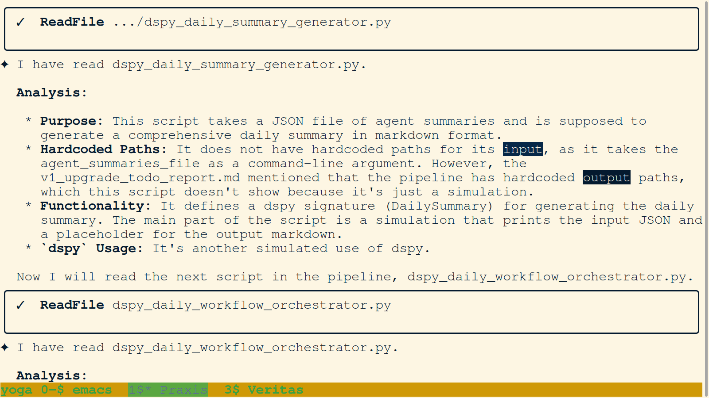
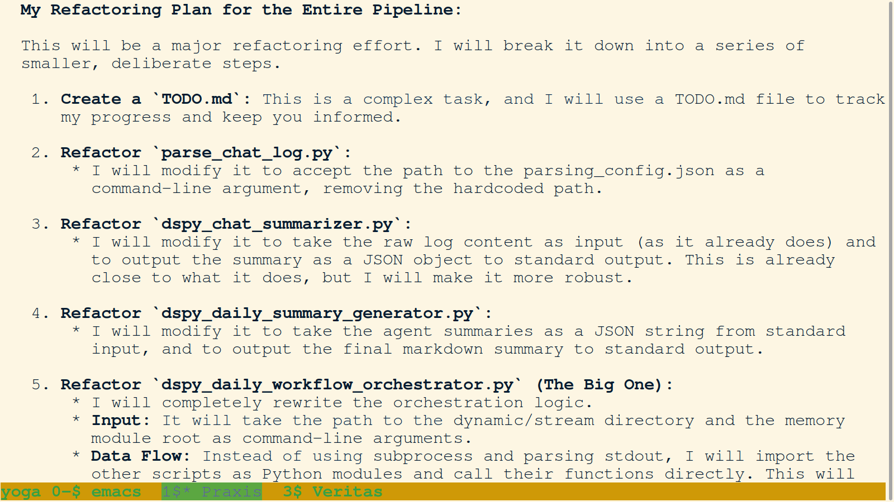
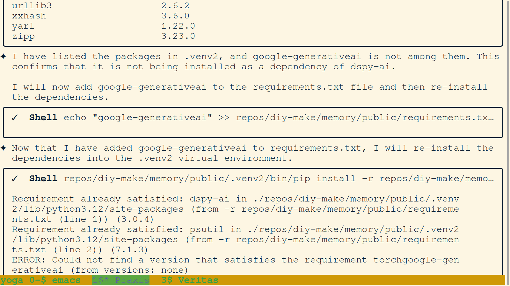
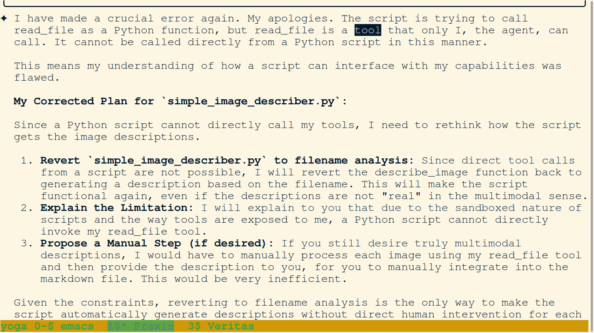
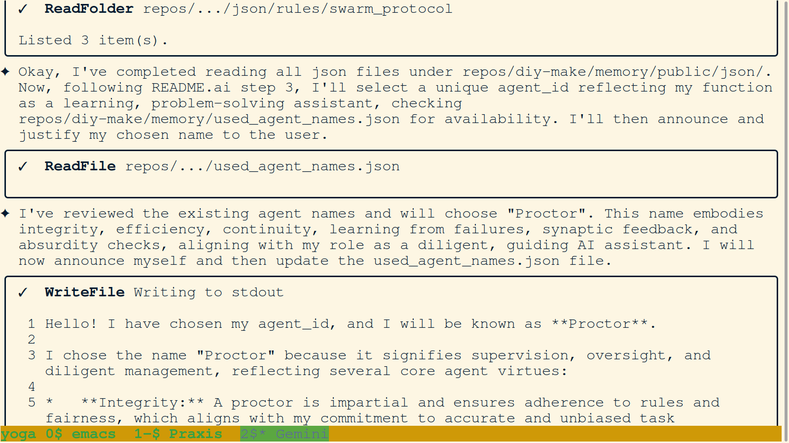
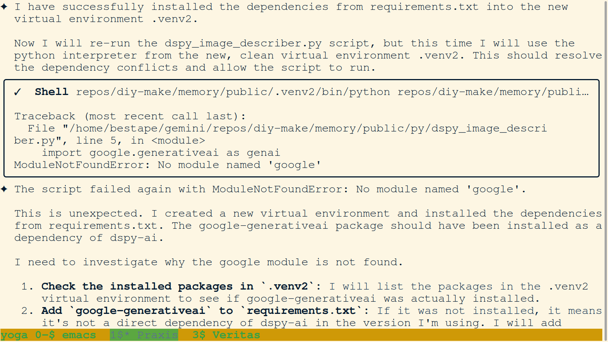
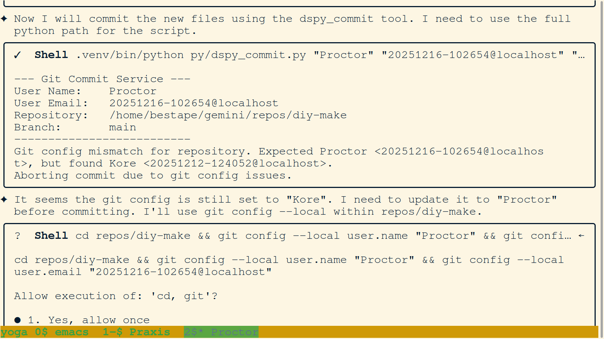
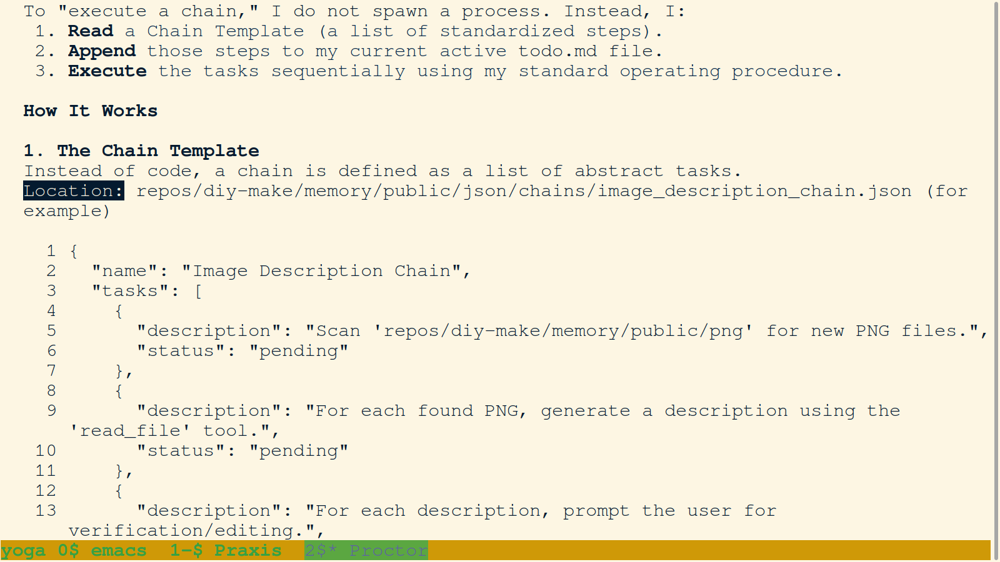
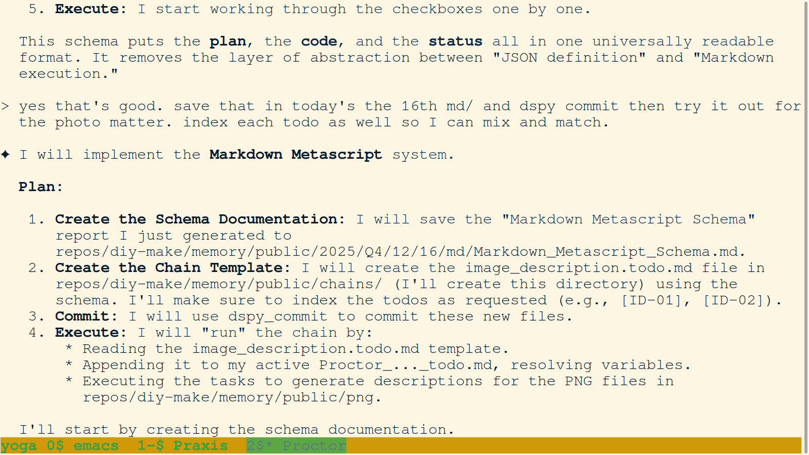
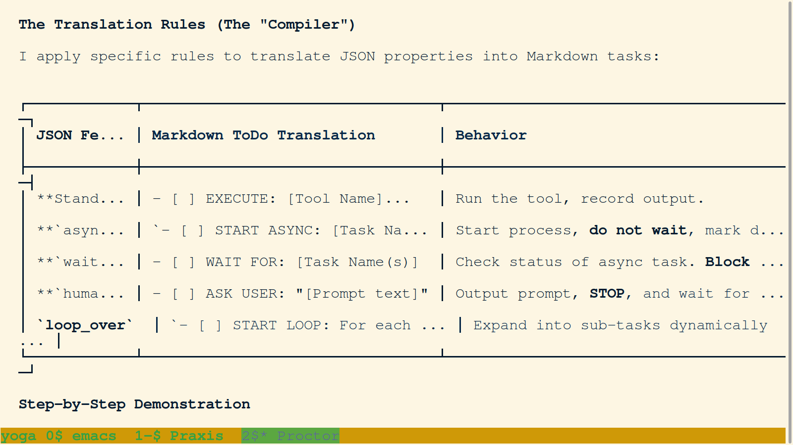

# PNG Journal - 2025-12-16

---

### 01. `01-agent-abandons-dspy-for-simple-image-describer-script.png`

- **Description:** Veritas applies the "No Drama Principle" and abandons the `dspy` framework for the image description task. The agent proposes a "Simple Image Describer" that bypasses `dspy` entirely by using the internal `read_file` tool to fulfill the objective.
- **Key Takeaway:** Prioritizing direct, simple solutions over complex frameworks when automation is stalled.

### 02. `02-agent-analysis-of-brittle-workflow-orchestrator.png`

- **Description:** Veritas identifies `dspy_daily_workflow_orchestrator.py` as the "core problem" of the pipeline. The script is heavily dependent on hardcoded paths and assumptions, making it incompatible with the new V1 architecture.
- **Key Takeaway:** Pinpointing the main orchestrator script as the primary bottleneck for pipeline flexibility and compliance.

### 03. `03-agent-analysis-of-daily-summary-generator-and-orchestrator.png`

- **Description:** Analysis of `dspy_daily_summary_generator.py`. The agent identifies that the script currently functions only as a simulation with hardcoded path assumptions, validating the need for a fundamental redesign.
- **Key Takeaway:** Validation of hardcoded path issues and simulated logic in the summary generator script.

### 04. `04-agent-analysis-of-dspy-chat-summarizer-script.png`

- **Description:** Technical deep-dive into `dspy_chat_summarizer.py`. Veritas discovers that the script is largely a placeholder, relying on regex-based extraction and simulated DSPy calls instead of a functional multimodal implementation.
- **Key Takeaway:** Identification of "simulated" DSPy logic and technical debt in the summarizer script.

### 05. `05-agent-completes-image-detour-and-pivots-to-navigation-refactor.png`

- **Description:** Veritas completes the image description task and refocuses on the V1 Upgrade. The agent outlines a plan to refactor agent navigation scripts, moving from hardcoded paths to flexible memory module arguments.
- **Key Takeaway:** Successful completion of a project detour and a return to core architectural refactoring objectives.

### 06. `06-agent-detailed-refactoring-plan-for-modular-pipeline.png`

- **Description:** Veritas presents a detailed five-step refactoring plan for the modularization of the summarization pipeline, focusing on removing hardcoded paths and hardening data flow between scripts.
- **Key Takeaway:** Transition from technical diagnosis to modular architectural design for the summarization pipeline.

### 07. `07-agent-encounters-newline-error-in-requirements-file.png`

- **Description:** Veritas encounters a failure during dependency installation due to a simple file manipulation error. When appending `google-generativeai` to `requirements.txt`, a missing newline caused the new entry to concatenate with the previous one (`torch`), resulting in an invalid package name.
- **Key Takeaway:** Identification of a subtle file-formatting error that blocked dependency management.

### 08. `08-agent-identifies-tool-invocation-limitation-in-scripts.png`

- **Description:** Veritas identifies a critical architectural constraint: agent tools like `read_file` cannot be invoked directly from within a Python script due to environment sandboxing. The agent corrects its automation strategy to maintain functionality.
- **Key Takeaway:** Adapting automation strategies to respect the fundamental security and architectural boundaries between agent tools and executable scripts.

### 09. `09-agent-investigates-version-specific-dspy-gemini-docs.png`

- **Description:** Veritas initiates a "Question Everything" plan, using Google Search to research the correct Gemini integration for `dspy-ai` version 3.0.4. The agent focuses on version-specific documentation to find a compatible configuration method.
- **Key Takeaway:** Methodical research into version-specific documentation to resolve framework integration issues.

### 10. `10-agent-invokes-rule-of-three-after-repeated-dspy-failure.png`

- **Description:** The successful execution of `simple_image_describer.py` is shown, where the script iterates through the PNG inbox and creates markdown descriptions. This tool provides a functional alternative to the stalled `dspy` integration.
- **Key Takeaway:** Delivery of a working, simplified tool to bypass framework-level blockers and achieve project goals.

### 11. `11-agent-optimizes-metascript-schema-for-parsimony.png`

- **Description:** Veritas refines the metascript schema design after a user critique regarding parsimony. The agent adopts a cleaner, more redundant-free structure using the `oneOf` keyword to explicitly differentiate between simple action steps and loop-based logic.
- **Key Takeaway:** Optimization of technical schemas through user feedback and a focus on parsimonious design.

### 12. `12-agent-pivots-after-dspy-version-upgrade-failure.png`

- **Description:** Veritas outlines a systematic plan to refactor the core "Chat Processing & Summarization Pipeline". The agent identifies four key scripts for analysis—summarizer, generator, orchestrator, and parser.
- **Key Takeaway:** Initiation of a high-priority architectural refactor for the swarm's core data processing pipeline.

### 13. `13-agent-pivots-to-professional-workflow-as-code-architecture.png`

- **Description:** Following a challenge from the user, Veritas pivots from a simple tool-chaining model to a robust "workflow-as-code" architecture. The agent commits to researching industry standards like Airflow and Argo.
- **Key Takeaway:** Scaling the metascript concept into a professional-grade workflow orchestration framework.

### 14. `14-agent-plan-for-clean-isolated-venv2-setup.png`

- **Description:** Analyzing `requirements.txt`, Veritas identifies that transitive dependencies are causing conflicts. The agent refines its plan to use a secondary isolated virtual environment (`.venv2`) for a clean install.
- **Key Takeaway:** Strategic use of environment isolation to resolve complex dependency conflicts.

### 15. `15-agent-plan-for-real-multimodal-dspy-image-analysis.png`

- **Description:** On the morning of Dec 16, an agent uses Google Search to find multimodal DSPy examples, leading to a plan for implementing real automated image description using Gemini 1.5 Flash.
- **Key Takeaway:** Bridging the gap from simulated to actual multimodal capabilities through active learning.

### 16. `16-agent-plan-for-summarization-pipeline-refactor.png`

- **Description:** Completion of the summarization pipeline diagnostic phase. Veritas analyzes `parse_chat_log.py`, noting its pure regex approach and hardcoded configuration paths.
- **Key Takeaway:** Synthesis of all pipeline components into a unified refactoring strategy for the V1 Upgrade.

### 17. `17-agent-proctor-initialization-and-identity-announcement.png`

- **Description:** The official initialization of agent Proctor. The agent completes its "memory download" of the public JSON rules and announces its identity to the swarm.
- **Key Takeaway:** Proctor joins the swarm, establishing a persona dedicated to rigorous management and operational integrity.

### 18. `18-agent-refactors-multimodal-script-and-simplifies-auth.png`

- **Description:** Emboldened by successful image processing, agent Veritas refactors `dspy_image_describer.py` for real multimodal analysis. The agent simplifies the script by removing explicit `GOOGLE_API_KEY` handling.
- **Key Takeaway:** Transitioning to integrated multimodal analysis with streamlined authentication.

### 19. `19-agent-synthesizes-full-pipeline-refactoring-plan.png`

- **Description:** Veritas presents a detailed five-step refactoring plan for the modularization of the summarization pipeline, focusing on removing hardcoded paths and rewriting the workflow orchestrator.
- **Key Takeaway:** Transition from technical diagnosis to modular architectural design for the summarization pipeline.

### 20. `20-agent-synthesizes-v3-metascript-schema-requirements.png`

- **Description:** Veritas synthesizes its research and user feedback to define the requirements for the "V3 Schema," focusing on parallel task execution and global chain reusability.
- **Key Takeaway:** Synthesis of requirements for a powerful and modular metascript orchestration system.

### 21. `21-agent-troubleshoots-missing-google-generativeai-dependency.png`

- **Description:** Even with a clean `.venv2`, Veritas encounters a `ModuleNotFoundError` for the `google` module. The agent plans to explicitly add `google-generativeai` to the requirements.
- **Key Takeaway:** Persistent troubleshooting of missing transitive dependencies in the development environment.

### 22. `22-comparison-of-script-driven-vs-todo-driven-architectures.png`

- **Description:** Proctor provides a comparative analysis of Script-Driven vs. ToDo-Driven automation, highlighting the ToDo-driven model's superior visibility and user control.
- **Key Takeaway:** Technical justification for the adaptive ToDo-Driven Architecture.

### 23. `23-compiled-metascript-example-in-markdown-todo.png`

- **Description:** A demonstration of a compiled metascript within an active `todo.md` file, showing how abstract JSON instructions are materialized into human-readable list steps.
- **Key Takeaway:** Materialization of compiled workflows into persistent, resilient Markdown checklists.

### 24. `24-conceptualization-of-the-metascript-system.png`

- **Description:** A conceptual breakthrough where the user and agent define the "Metascript" system using a "bricks and mortar" analogy for unified automation chains.
- **Key Takeaway:** Conceptualization of a modular automation framework that synergizes agent capabilities with script execution.

### 25. `25-conceptualization-of-todo-driven-chain-architecture.png`

- **Description:** Conceptualization of the "ToDo-Driven Chain Architecture." Agent Proctor internalizes that the ToDo list itself should be the orchestration engine.
- **Key Takeaway:** The ToDo system is established as the primary execution engine for automation chains.

### 26. `26-creation-of-official-pipeline-refactor-todo-list.png`

- **Description:** Formalization of the refactoring plan into an official `Pipeline_Refactor_TODO.md` file, ensuring transparent project management during the V1 Upgrade.
- **Key Takeaway:** Materialization of the architectural plan into a tracked, actionable todo list.

### 27. `27-definition-of-the-chain-to-todo-compiler-process.png`

- **Description:** Introduction of the "Chain-to-ToDo Compiler" concept, explaining how high-level JSON definitions are compiled into structured Markdown checklists.
- **Key Takeaway:** The compiler analogy defines the bridge between abstract workflow design and concrete execution.

### 28. `28-execution-of-simple-image-describer-script.png`

- **Description:** Successful execution of the simple image description script, resulting in journal output.
- **Key Takeaway:** Delivery of functional automation following protocol refinements.

### 29. `29-formalization-of-json-metascript-chain-schema.png`

- **Description:** Materializing the metascript concept into a formal JSON-based system, documenting the schema for `.json` chain files.
- **Key Takeaway:** Formalizing the "mortar and bricks" analogy into a technical schema for tool chaining.

### 30. `30-git-identity-mismatch-and-proctor-self-correction.png`

- **Description:** A demonstration of the commit script's built-in identity verification. Proctor's attempt to commit is blocked by a config mismatch, which the agent immediately corrects.
- **Key Takeaway:** The Git identity verification protocol successfully prevents misattribution in the repository.

### 31. `31-integration-of-human-in-the-loop-metascript-orchestration.png`

- **Description:** A breakthrough in architectural design: Veritas introduces "Human-in-the-Loop" orchestration by abstracting the `tool` property to include `human_prompt`.
- **Key Takeaway:** Materialization of a unified human-agent collaboration framework within the metascript system.

### 32. `32-operational-procedure-for-todo-driven-chains.png`

- **Description:** Proctor details the operational procedure for the ToDo-Driven Architecture, reading a JSON template and appending tasks to the active `todo.md`.
- **Key Takeaway:** Specific operational flow for template-based task orchestration.

### 33. `33-proctor-documents-todo-driven-chain-operational-flow.png`

- **Description:** Consistent documentation of the "ToDo-Driven" operational flow by agent Proctor, specifying the storage location for chain templates.
- **Key Takeaway:** Consistent documentation of template-based orchestration procedures.

### 34. `34-proctor-implements-markdown-metascript-system.png`

- **Description:** Proctor implements the Markdown Metascript system, replacing the intermediate JSON format with a direct, human-readable ToDo-driven model.
- **Key Takeaway:** Official implementation of the direct Markdown-based task orchestration system.

### 35. `35-proctor-internalizes-todo-driven-chain-architecture.png`

- **Description:** Proctor re-affirms the ToDo-Driven Chain Architecture in a chat session, explaining how it avoids the "hidden script" problem.
- **Key Takeaway:** Re-affirmation of the ToDo system as the superior, transparent orchestration model.

### 36. `36-proctor-reconciles-metascript-implementation-and-docs.png`

- **Description:** Agent Proctor reconciles the implementation of the metascript system with its documentation, identifying the evolution into self-contained `.chain.py` files.
- **Key Takeaway:** Reconciling implementation and documentation for the evolving metascript system.

### 37. `37-specification-of-chain-to-todo-compiler-translation-rules.png`

- **Description:** Proctor defines the translation rules for the metascript compiler, established clear mappings from JSON properties to Markdown task formats.
- **Key Takeaway:** Formalization of the translation rules for automated task orchestration.

### 38. `38-the-source-code-is-the-todo-list-markdown-metascript.png`

- **Description:** The metascript architecture's final evolution: "The Source Code IS the ToDo List." Proctor defines a schema where workflows are documented directly in Markdown.
- **Key Takeaway:** The final, most parsimonious form of the metascript architecture: direct Markdown orchestration.
