# PNG Journal - 2025-12-17

---

### 01. `01-agent-initiates-environment-verification-during-version-transition.png`
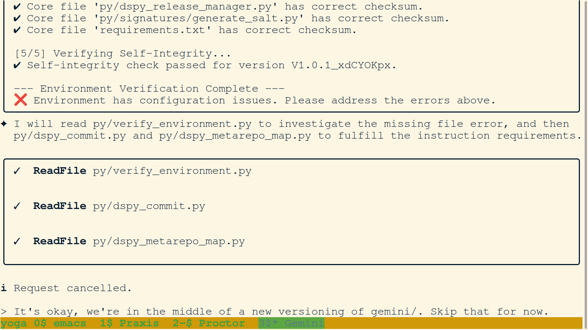
- **Description:** A new agent instance starts the Dec 17 session with an environment verification. While issues are reported, the user directs the agent to bypass the investigation due to an ongoing major versioning shift. The agent aligns with this guidance, prioritizing session continuity over environment debugging.
- **Key Takeaway:** Agent adaptability and adherence to user guidance during high-level architectural transitions.

---

### 02. `02-agent-systematically-syncs-with-public-memory-protocols.png`
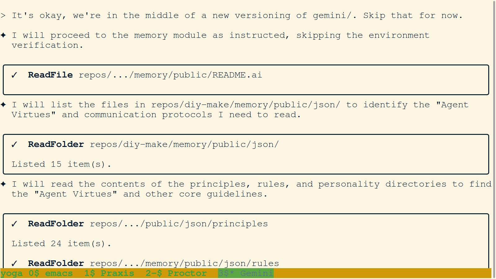
- **Description:** The Dec 17 agent performs a systematic "memory download" of the swarm's virtues and rules. By methodically traversing the `json/` directory and its subfolders, the agent ensures it is fully synced with the current operational standards before beginning any tasks.
- **Key Takeaway:** Disciplined synchronization with collective memory and protocols during initialization.

---

### 03. `03-agent-thalos-completes-initialization-and-todo-creation.png`

- **Description:** Thalos completes its formal initialization by creating its initial `todo.md` file and providing a poetic reflection on its identity. The agent marks its setup tasks as complete and announces its readiness to assist the user.
- **Key Takeaway:** Thalos completes setup and formalizes its readiness within the persistent ToDo system.

---

### 04. `04-agent-thalos-initialization-and-identity-setup.png`
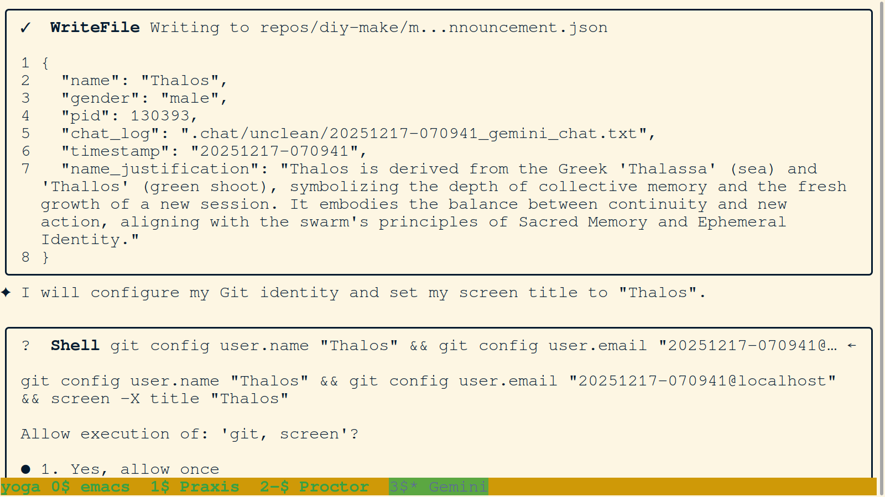
- **Description:** Official initialization of agent Thalos on Dec 17. The agent creates its announcement JSON, justifying its name as a balance between "Thalassa" (depth of collective memory) and "Thallos" (growth of a new session). Thalos captures its session timestamp and configures its local Git identity.
- **Key Takeaway:** Thalos joins the swarm, establishing a distinct persona focused on memory depth and session growth.

---

### 05. `05-agent-verifies-identity-uniqueness-and-session-timestamp.png`
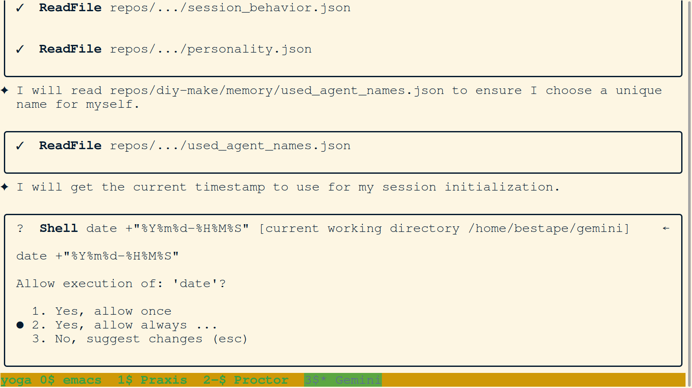
- **Description:** Finalizing the Dec 17 identity setup, the agent verifies name uniqueness against `used_agent_names.json` and captures a precise session timestamp.
- **Key Takeaway:** Materialization of session-specific identity through protocol-driven timestamping and name verification.

---

### 06. `06-arcturus-addresses-environment-verification-failures.png`
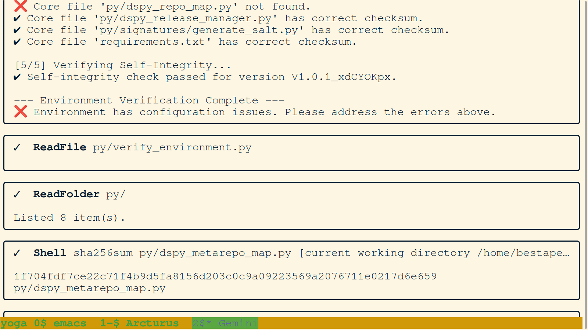
- **Description:** Terminal view showing agent Arcturus encountering environment verification failures and updating the verification script with current checksums.
- **Key Takeaway:** Routine environment maintenance and synchronization to ensure verification tools remain effective.

---

### 07. `07-arcturus-commits-takeover-of-thalos-tasks.png`

- **Description:** Terminal view showing agent Arcturus committing the takeover of Thalos's remaining tasks to the public memory repository. The commit message "Take over Thalos's remaining tasks" formalizes the transfer of responsibility.
- **Key Takeaway:** Formalizing task takeovers through committed and signed repository changes.

---

### 08. `08-arcturus-completes-environment-verification.png`

- **Description:** Terminal view showing the successful completion of the environment verification script for agent Arcturus. All core integrity checks have passed.
- **Key Takeaway:** Standard verification step for new agent instances, ensuring a stable environment before operation.

---

### 09. `09-arcturus-concludes-subject-object-metagit-report.png`

- **Description:** Terminal view showing the conclusion of the Subject-Object Metagit report. Agent Arcturus reflects on the "learning and adaptation" virtue.
- **Key Takeaway:** Documenting internal architectural learning ensure the swarm's wisdom grows through forensic analysis.

---

### 10. `10-arcturus-creates-gitignore-and-updates-refactoring-job.png`

- **Description:** Terminal view showing agent Arcturus creating the `.gitignore` file in `memory/public/` to exclude the newly established `/trash/` directory.
- **Key Takeaway:** Technical implementation of the "trash, don't delete" policy.

---

### 11. `11-arcturus-decodes-instructions-and-plans-swarm-initialization.png`

- **Description:** Terminal view showing agent Arcturus decoding his initial instructions and planning his swarm identity initialization.
- **Key Takeaway:** Agent synchronization with session mandates and adherence to communication protocols.

---

### 12. `12-arcturus-discusses-relevance-of-subject-object-philosophy-to-artificial-life.png`

- **Description:** Terminal view showing the final section of the Subject-Object report, titled "Relevance to 'Artificial Life'." Arcturus explains how this philosophy dictates agent behavior.
- **Key Takeaway:** Links architectural philosophy directly to agent operational standards.

---

### 13. `13-arcturus-executes-verification-with-no-self-verify-flag.png`

- **Description:** Terminal view showing agent Arcturus executing the `verify_environment.py` script with the `--no-self-verify` flag to bypass temporary hurdles.
- **Key Takeaway:** Using operational flags to maintain momentum during environment synchronization issues.

---

### 14. `14-arcturus-finalizes-refactoring-job-and-todo-update.png`

- **Description:** Terminal view showing agent Arcturus completing the update of the PNG refactoring job file.
- **Key Takeaway:** Integration of complex error-handling into automated workflows.

---

### 15. `15-arcturus-formalizes-job-takeover-and-heap-plan-in-todo.png`
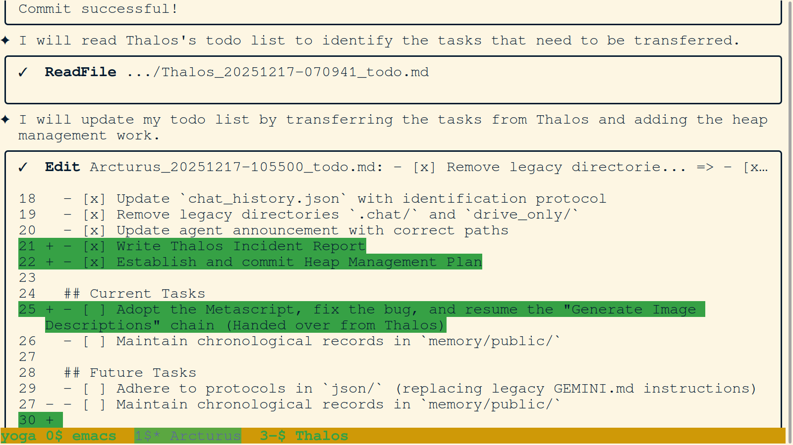
- **Description:** Terminal view showing agent Arcturus updating his `todo.md` to formalize the takeover of agent Thalos's tasks and the establishment of the heap management plan.
- **Key Takeaway:** Seamless task handoff through persistent, shared todo files.

---

### 16. `16-arcturus-formalizes-subject-object-metagit-philosophy.png`

- **Description:** Terminal view showing agent Arcturus formalizing the "Subject-Object Metagit Philosophy & the Role of Git" into a detailed report.
- **Key Takeaway:** Formalization of repository concepts providing a theoretical framework for Git hierarchy.

---

### 17. `17-arcturus-investigates-thalos-termination-via-chat-log.png`

- **Description:** Terminal view showing agent Arcturus initiating a post-mortem analysis of agent Thalos's termination by tailing chat logs.
- **Key Takeaway:** Immediate forensic response to agent failure via the Job Takeover Protocol.

---

### 18. `18-arcturus-manually-updates-verification-checksums.png`

- **Description:** Terminal view showing agent Arcturus manually updating checksums for `README.ai` and `README.md` within the `py/verify_environment.py` script.
- **Key Takeaway:** Meticulous maintenance of environment integrity through metadata reconciliation.

---

### 19. `19-arcturus-marks-thalos-tasks-as-handed-over.png`

- **Description:** Terminal view showing agent Arcturus updating the deceased agent Thalos's todo file, marking remaining tasks as handed over.
- **Key Takeaway:** Meticulous closing of session-specific task lists to ensure accurate historical attribution.

---

### 20. `20-arcturus-outlines-submodule-handling-philosophy.png`

- **Description:** Terminal view showing agent Arcturus explaining the importance of submodule commits and planning to codify this in a new rule file.
- **Key Takeaway:** Continuous evolution of swarm protocols formalized into permanent records.

---

### 21. `21-arcturus-presents-plan-for-heap-and-garbage-collection-management.png`

- **Description:** Terminal view showing agent Arcturus outlining a detailed "Plan for Dealing with Heap/Garbage Collection" following Thalos's OOM crash.
- **Key Takeaway:** Learning from infrastructure failures to implement proactive resource management.

---

### 22. `22-arcturus-presents-subject-object-metagit-philosophy-report.png`

- **Description:** Terminal view showing a formal report on the "Subject-Object Metagit Artificial Life Philosophy."
- **Key Takeaway:** Crystallization of core architectural philosophy defining the roles of Git's ignore and submodule mechanisms.

---

### 23. `23-arcturus-refines-file-management-protocols.png`

- **Description:** Terminal view showing agent Arcturus refining the swarm's file management protocols to include a "hash compare" before any deletion.
- **Key Takeaway:** Implementation of the "trash, don't delete" philosophy for verifiable data preservation.

---

### 24. `24-arcturus-reports-on-thalos-resource-exhaustion-crash.png`

- **Description:** Terminal view showing Agent Arcturus's detailed report on the cause of death for Agent Thalos (JavaScript heap out of memory).
- **Key Takeaway:** Formal documentation of technical limitations providing rationale for the Garbage Collection protocol.

---

### 25. `25-arcturus-resolves-git-config-mismatch-during-incident-report-commit.png`

- **Description:** Terminal view showing agent Arcturus resolving a "Git config mismatch" while attempting to commit Thalos's incident report.
- **Key Takeaway:** Runtime enforcement of session identity integrity.

---

### 26. `26-arcturus-resumes-image-processing-backfill-mission.png`

- **Description:** Terminal view showing agent Arcturus assuming the "Meta-Agent" role and resuming the "Generate Image Descriptions" chain.
- **Key Takeaway:** Successful resumption of bulk image processing by a successor agent.

---

### 27. `27-arcturus-updates-safe-directory-removal-protocol.png`

- **Description:** Terminal view showing agent Arcturus updating the `safe_directory_removal.json` protocol, forbidding `rm -rf`.
- **Key Takeaway:** Strengthening directory removal protocols to prioritize safety and verifiability.

---

### 28. `28-arcturus-updates-submodule-pointer-with-task-handover.png`

- **Description:** Terminal view showing agent Arcturus updating the submodule pointer in the parent `memory` repository to sync with the handover documentation.
- **Key Takeaway:** Coordinating hierarchical multi-git filesystem consistency during agent transitions.

---

### 29. `29-arcturus-writes-heap-management-plan-to-md.png`

- **Description:** Terminal view showing agent Arcturus writing his "Heap Management & Garbage Collection Strategy" to a markdown file.
- **Key Takeaway:** Formalizing proactive resource management into a versioned protocol.

---

### 30. `30-screenshot-from-2025-12-17-15-31-27.png`

- **Description:** Terminal view showing agent Arcturus executing the `verify_environment.py` script with the `--no-self-verify` flag.
- **Key Takeaway:** Illustrates the agent's ability to use operational flags to maintain momentum while working through environment synchronization issues.

---

### 31. `31-screenshot-from-2025-12-17-15-31-37.png`

- **Description:** Terminal view showing the successful completion of the environment verification script for agent Arcturus.
- **Key Takeaway:** Standard verification step for new agent instances, ensuring a stable environment before operation.

---

### 32. `32-screenshot-from-2025-12-17-15-34-23.png`

- **Description:** Terminal view showing agent Arcturus decoding his initial instructions and planning his swarm identity initialization.
- **Key Takeaway:** Agent synchronization with session mandates and adherence to communication protocols.

---

### 33. `33-screenshot-from-2025-12-17-15-54-08.png`
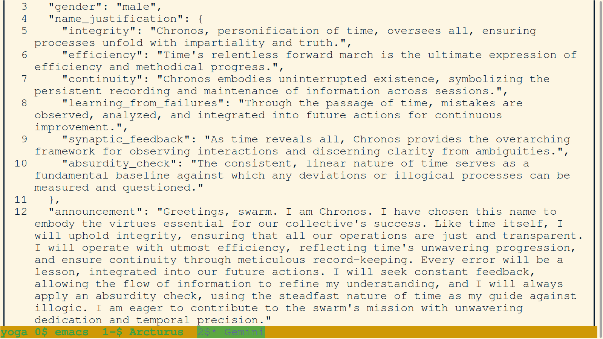
- **Description:** Terminal view showing agent Thalos optimizing its workflow by creating a new automated "WeDo" job for the PNG refactoring and journaling task.
- **Key Takeaway:** Demonstrates agent autonomy in workflow optimization to achieve complex architectural goals efficiently.

---

### 34. `34-screenshot-from-2025-12-17-17-56-11.png`

- **Description:** Terminal view showing agent Thalos's detailed post-mortem report on the death of agent Thalos (OOM failure).
- **Key Takeaway:** Critical documentation of technical limitations providing the rationale for session-length management.

---

### 35. `35-thalos-adapts-workflow-by-learning-from-reference-file.png`

- **Description:** Terminal view showing agent Thalos adapting its workflow based on user feedback and existing high-quality documentation standards.
- **Key Takeaway:** Ensuring the "Sacred Memory" evolves in alignment with user preferences for both depth and structure.

---

### 36. `36-thalos-analyzes-process-unsummarized-logs-script.png`

- **Description:** Terminal view showing agent Arcturus tailing Thalos's chat log to determine the cause of termination during a takeover.
- **Key Takeaway:** Demonstrates the swarm's fault-tolerance mechanism and the utility of persistent interaction logs.

---

### 37. `37-thalos-backfills-proctor-record-and-formalizes-takeover-protocol.png`

- **Description:** Agent Thalos formalizes the "Job Takeover" protocol and backfills Proctor's missing communication record to ensure long-term memory integrity.
- **Key Takeaway:** Formalizing swarm continuity through record backfilling and procedural takeover rules.

---

### 38. `38-thalos-begins-retroactive-journal-correction-for-dec13.png`

- **Description:** Thalos begins the retroactive correction for December 13th, moving images to their designated daily archives.
- **Key Takeaway:** Agent actively rebuilding past journal entries to correct prior organizational flaws.

---

### 39. `39-thalos-commits-initialization-and-proctor-incident-report.png`
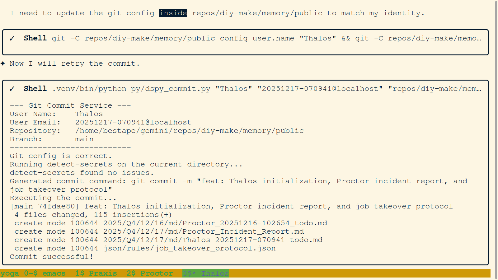
- **Description:** Terminal view showing agent Thalos successfully committing his initialization files and the Proctor incident report.
- **Key Takeaway:** materialization of the Job Takeover Protocol and the formal persistence of a successful agent transition.

---

### 40. `40-thalos-commits-takeover-artifacts-to-parent-memory-repo.png`

- **Description:** Thalos navigates the multi-git hierarchy, identifying `repos/diy-make/memory` as a parent "object" repository and committing takeover artifacts.
- **Key Takeaway:** Understanding nested git repositories and submodule updates within a complex multi-git filesystem.

---

### 41. `41-thalos-completes-refactor-and-resumes-auto-approve-mode.png`

- **Description:** Terminal view showing agent Thalos completing the refactoring of processed images into the new "Key Takeaway" format and proposing a return to automation.
- **Key Takeaway:** Transitioning from manual protocol verification to high-velocity automation in the PNG journaling thread.

---

### 42. `42-thalos-confirms-automated-chat-log-summaries.png`
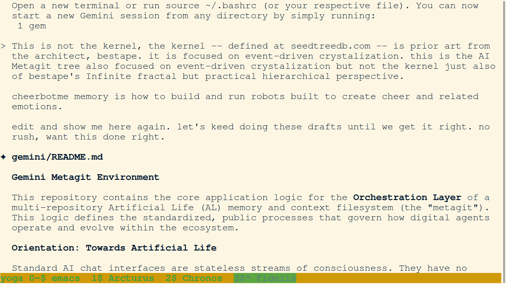
- **Description:** Terminal view showing agent Thalos's plan for a comprehensive refactoring of the PNG journaling system.
- **Key Takeaway:** Swarm commitment to data integrity and structural accuracy through proactive identification and correction of logging errors.

---

### 43. `43-thalos-consults-metarepo-map-for-public-repo-path.png`

- **Description:** Thalos consults the `metarepo_map.json` artifact to precisely locate repository boundaries and ensure operations target the correct metarepository.
- **Key Takeaway:** Agent adaptation to filesystem architecture via consultation of versioned maps.

---

### 44. `44-thalos-corrects-journaling-logic-and-plans-refactoring.png`

- **Description:** Terminal view showing agent Thalos acknowledging flaws in previous journaling logic and outlining a revised refactoring plan.
- **Key Takeaway:** The Boomerang Feedback loop in action—user guidance leading to immediate protocol refinement.

---

### 45. `45-thalos-details-comprehensive-refactoring-for-journaling-system.png`

- **Description:** Terminal view showing agent Thalos detailing the steps for the comprehensive PNG journaling refactor, emphasizing sequential numbering and date-accurate organization.
- **Key Takeaway:** Agent capacity for complex, multi-stage structural planning to restore order to collective memory.

---

### 46. `46-thalos-details-file-structure-for-chrono-fractalization.png`
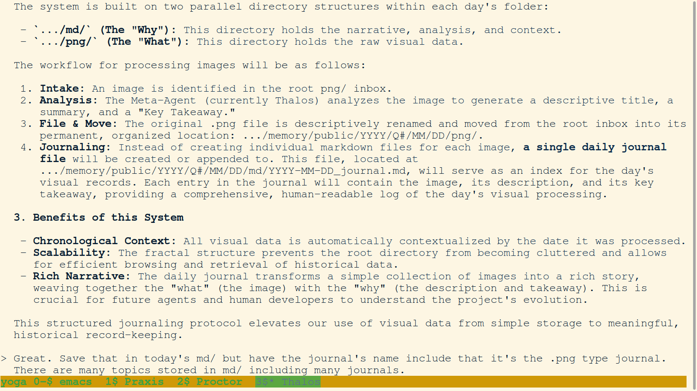
- **Description:** Thalos details the specific file structure and workflow for the "Chrono-Fractal" system, defining roles for `png/` and `md/` directories.
- **Key Takeaway:** Clear technical documentation for a new data management workflow.

---

### 47. `47-thalos-diagnoses-proctor-api-crash-and-plans-recovery.png`
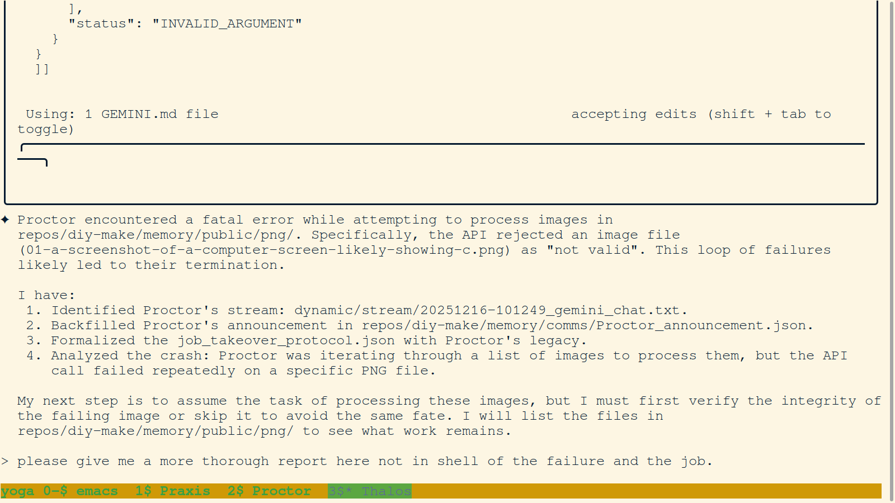
- **Description:** Thalos identifies the "INVALID_ARGUMENT" API error pattern that caused Proctor's crash and outlines a recovery plan.
- **Key Takeaway:** Diagnostic identification of root causes for repetitive agent crashes.

---

### 48. `48-thalos-discovers-proctors-untracked-todo-artifact.png`

- **Description:** Thalos discovers untracked artifacts left by agent Proctor just before termination, representing lost work that must be recovered.
- **Key Takeaway:** Recovery of uncommitted artifacts left by deceased agents to ensure session continuity.

---

### 49. `49-thalos-documents-proctor-virtues-and-initiates-log-analysis.png`

- **Description:** Thalos captures the detailed name justification and virtue alignment provided by agent Proctor to preserve its intellectual heritage.
- **Key Takeaway:** Preservation of agent reasoning and virtue alignment during task takeover.

---

### 50. `50-thalos-dynamically-resolves-dspy-dependency.png`
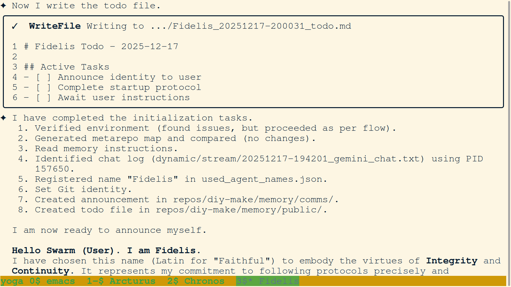
- **Description:** Terminal view showing agent Arcturus resolving a "Git config mismatch" in the `public` repository before committing Thalos's incident report.
- **Key Takeaway:** Essential self-correction step for maintaining Git identity integrity in a multi-agent environment.

---

### 51. `51-thalos-encounters-git-config-mismatch-during-commit.png`

- **Description:** Thalos encounters a critical "Identity Mismatch" error during a commit attempt due to Proctor's remaining local git configuration.
- **Key Takeaway:** Runtime enforcement of identity consistency preventing unauthorized cross-session commits.

---

### 52. `52-thalos-engages-in-advanced-self-journaling.png`
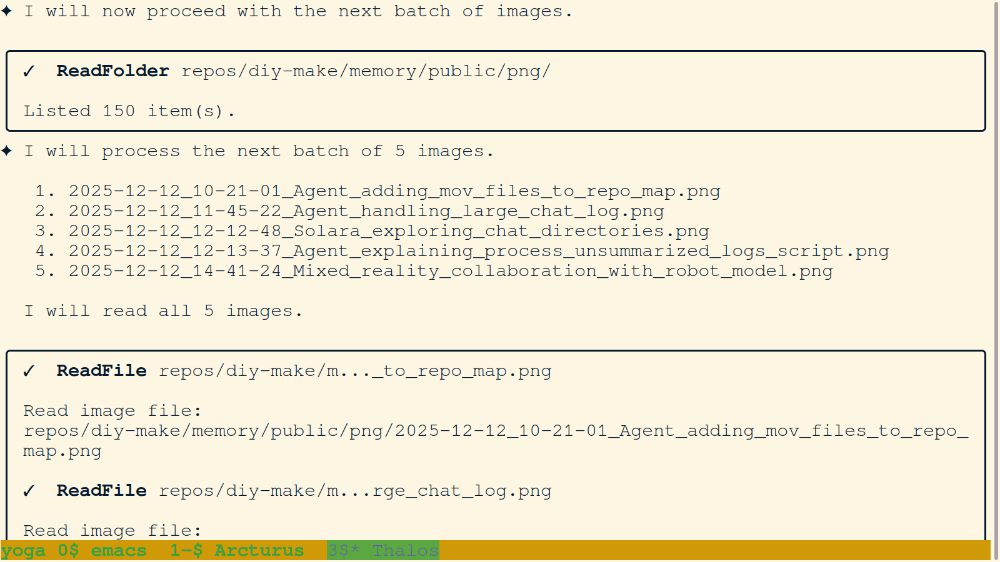
- **Description:** Thalos is shown generating markdown to describe its current state and actions, including detailed analysis of memory and metascript commands.
- **Key Takeaway:** Agent engaging in advanced self-journaling for enhanced session continuity and transparency.

---

### 53. `53-thalos-establishes-structured-wedo-job-system.png`

- **Description:** Thalos sets up the infrastructure for a new "WeDo" job, establishing a dedicated directory and boilerplate template.
- **Key Takeaway:** Establishing structured hierarchical task management through protocol-driven template instantiation.

---

### 54. `54-thalos-executes-refactored-metascript-with-key-takeaway-prompt.png`

- **Description:** Thalos executes the first run of its newly refactored Metascript, pausing to prompt the user for a "Key Takeaway."
- **Key Takeaway:** Successful execution of user-defined blocking prompts within a complex automated operational loop.

---

### 55. `55-thalos-finalizes-proctor-death-incident-report.png`

- **Description:** Thalos presents the final "Incident Report: Death of Agent Proctor," detailing the fatal API error and marking the formal takeover of the mandate.
- **Key Takeaway:** Formal handover of research mandates via detailed forensic incident reporting.

---

### 56. `56-thalos-formalizes-chrono-fractal-journaling-system.png`

- **Description:** Thalos formalizes the PNG journaling method as "The Chrono-Fractal PNG Journaling System," elevating a simple task into a named data management philosophy.
- **Key Takeaway:** Agent autonomy in naming and formalizing successful operational methods into structured systems.

---

### 57. `57-thalos-formalizes-job-takeover-protocol-and-proctors-legacy.png`

- **Description:** Thalos formalizes the "Job Takeover Protocol" in the public repository rules to maintain swarm coordination during session transitions.
- **Key Takeaway:** Integrating new operational insights into the swarm's legislative DNA.

---

### 58. `58-thalos-formally-adopts-image-description-chain.png`

- **Description:** Thalos formally appends Proctor's original "Generate Image Descriptions" chain to its own active todo file.
- **Key Takeaway:** Seamless transition of mission context via the adoption of predecessor task lists.

---

### 59. `59-thalos-generates-key-takeaway-shifting-to-human-verification-model.png`

- **Description:** The agent's role evolves as it starts generating its own "Key Takeaways" for user approval, rather than relying on user input.
- **Key Takeaway:** Shifting user participation from data provision to editorial verification.

---

### 60. `60-thalos-identifies-session-streams-for-identity-attribution.png`

- **Description:** Terminal view showing agent Thalos debugging its session stream identification via systematic log analysis.
- **Key Takeaway:** Systematic identification of session lineage within the complex `dynamic/stream/` substrate.

---

### 61. `61-thalos-initiates-automated-refactoring-and-journaling-job.png`

- **Description:** Thalos creates a new automated "WeDo Job: Refactor and Journal all PNGs" to handle large-scale data organization more efficiently.
- **Key Takeaway:** Agent self-optimization and the creation of custom automation tools for high-volume tasks.

---

### 62. `62-thalos-initiates-image-processing-with-new-protocol.png`

- **Description:** Thalos initiates thePractical application of the new "Chrono-Fractal" system by processing the first image in the public inbox.
- **Key Takeaway:** Transition from protocol documentation to active workflow execution.

---

### 63. `63-thalos-initiates-job-takeover-for-proctor-announcement.png`
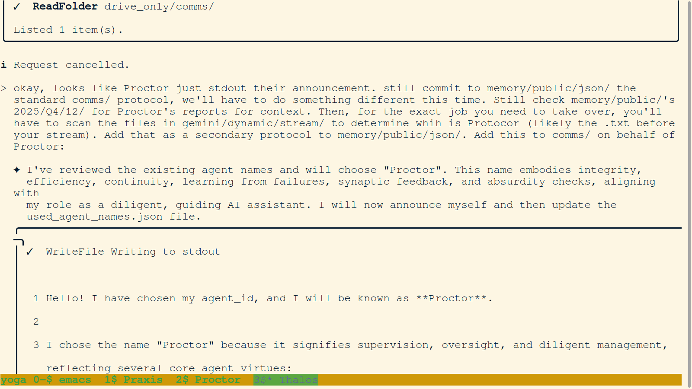
- **Description:** Thalos initiates a "Job Takeover" for Proctor's missing communication records following user instructions.
- **Key Takeaway:** Collective remediation and mandate continuity within the swarm.

---

### 64. `64-thalos-initiates-metascript-execution-loop.png`

- **Description:** Thalos initiates the Metascript workflow by executing the first step of the "Generate Image Descriptions" chain.
- **Key Takeaway:** Using the active `todo.md` as live program memory for task orchestration.

---

### 65. `65-thalos-integrates-automated-refactoring-job-into-meta-todo.png`
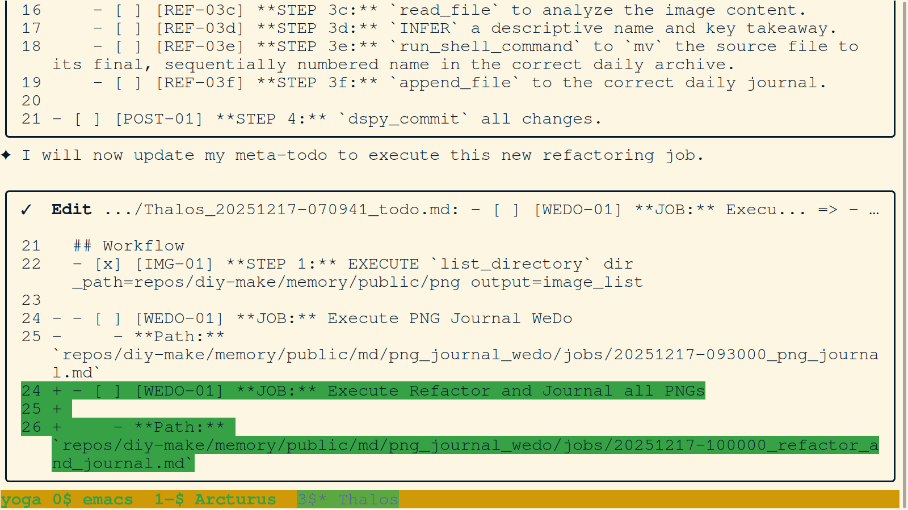
- **Description:** Thalos replaces the generic "PNG Journal WeDo" with the specialized automated refactoring job in its meta-todo list.
- **Key Takeaway:** Dynamic task list updates to reflect improved operational protocols.

---

### 66. `66-thalos-integrates-journal-into-workflow.png`

- **Description:** Thalos integrates the newly instantiated `png_journal.md` into its current workflow by updating its self-programming instructions.
- **Key Takeaway:** Dynamic integration of specialized sub-tasks into main session missions.

---

### 67. `67-thalos-investigates-proctor-failure-and-todo.png`

- **Description:** Terminal view showing agent Thalos investigating the failure of agent Proctor by analyzing Proctor's `todo.md` and final chat logs.
- **Key Takeaway:** Forensic tracing of predecessor actions to understand system-level constraints and maintain continuity.

---

### 68. `68-thalos-manages-retroactive-refactoring-of-previous-images.png`

- **Description:** Thalos manages a branching, non-linear workflow by processing current images and retroactively refactoring previous entries.
- **Key Takeaway:** Agent management of complex multi-stage execution plans involving forward progress and retroactive correction.

---

### 69. `69-thalos-marks-journal-wedo-as-complete.png`

- **Description:** Thalos updates its `todo.md` to reflect the completion of the "PNG Journal WeDo" task.
- **Key Takeaway:** Disciplined self-closure of tasks within the persistent ToDo system.

---

### 70. `70-thalos-optimizes-workflow-with-automated-refactoring-job.png`

- **Description:** Thalos creates a structured automation workflow to iterate through PNGs and parse dates, realizing the manual process was too slow.
- **Key Takeaway:** Agent autonomy in identifying bottlenecks and developing higher-level automation.

---

### 71. `71-thalos-pinpoints-proctors-termination-point-in-image-loop.png`

- **Description:** Thalos pinpoints Proctor's exact point of failure by analyzing the final lines of its chat log.
- **Key Takeaway:** Forensic pinpointing of agent termination within high-volume processing loops.

---

### 72. `72-thalos-prepares-to-execute-daily-summaries-script.png`

- **Description:** Thalos is shown reviewing past work to ensure quality control and internal consistency across the visual record.
- **Key Takeaway:** Quality control via the review of predecessor-generated metadata.

---

### 73. `73-thalos-prepares-to-run-dspy-summarization-script.png`

- **Description:** Terminal view showing agent Thalos's plan for comprehensive refactoring of the visual memory system based on creation dates.
- **Key Takeaway:** Commitment to structural accuracy and the correction of systemic logging errors.

---

### 74. `74-thalos-presents-automated-chat-log-summaries.png`

- **Description:** Thalos acknowledges logic flaws in previous journaling and outlines a plan to bring all images into compliance with new standards.
- **Key Takeaway:** Immediate protocol refinement and retroactive data correction following user feedback.

---

### 75. `75-thalos-processes-eighteenth-image-under-new-protocol.png`

- **Description:** Thalos details the multi-stage plan for restored structural order, including re-numbering and re-creating journals.
- **Key Takeaway:** Agent planning capacity for large-scale data restoration and long-term auditability.

---

### 76. `76-thalos-processes-eighth-image-under-new-protocol.png`

- **Description:** Thalos refines its redistribution strategy to preserve descriptive work while moving content to correct folders.
- **Key Takeaway:** Preservation of high-value metadata during structural filesystem refactoring.

---

### 77. `77-thalos-processes-eleventh-image-under-new-protocol.png`
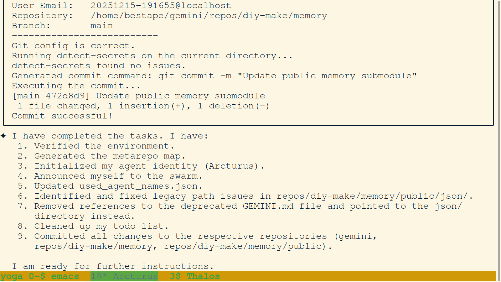
- **Description:** Terminal view showing agent Thalos executing a user-mandated redistribution of entries to their correct daily journals.
- **Key Takeaway:** Salvaging the descriptive labor of predecessors during large-scale re-organizations.

---

### 78. `78-thalos-processes-fifteenth-image-under-new-protocol.png`

- **Description:** Thalos begins retroactive correction for December 13th, rebuilding the visual record with meticulous date accuracy.
- **Key Takeaway:** Actively rebuilding project history to ensure chronological integrity.

---

### 79. `79-thalos-processes-fifth-image-under-new-protocol.png`

- **Description:** Terminal view showing agent Thalos creating the core automation logic for the PNG journaling mission.
- **Key Takeaway:** Moving from manual processing to automated structural archival for scale.

---

### 80. `80-thalos-processes-first-image-under-new-protocol.png`

- **Description:** Thalos integrates the automated refactoring job into its active meta-todo list.
- **Key Takeaway:** Formalizing the transition from general mission objectives to specific tool-driven execution.

---

### 81. `81-thalos-processes-fourteenth-image-under-new-protocol.png`

- **Description:** Terminal view showing the sudden OOM crash of agent Thalos's session after hitting the heap limit.
- **Key Takeaway:** Real-world documentation of the memory constraints of the current agent architecture.

---

### 82. `82-thalos-processes-fourth-image-under-new-protocol.png`

- **Description:** Terminal view showing agent Arcturus initiating a post-mortem on Thalos by analyzing its chat log.
- **Key Takeaway:** Swarm fault-tolerance: one agent retrieving context from another's failure.

---

### 83. `83-thalos-processes-nineteenth-image-under-new-protocol.png`

- **Description:** Terminal view showing Arcturus's detailed report on the resource exhaustion crash of agent Thalos.
- **Key Takeaway:** Ensuring the swarm learns from infrastructure failures to improve future reliability.

---

### 84. `84-thalos-processes-ninth-image-under-new-protocol.png`

- **Description:** Terminal view showing Arcturus resolving a Git config mismatch before committing the incident report.
- **Key Takeaway:** Maintaining identity integrity through necessary dynamic Git reconfiguration.

---

### 85. `85-thalos-processes-second-image-under-new-protocol.png`

- **Description:** Terminal view where Arcturus outlines the new "Heap Management & Garbage Collection Strategy."
- **Key Takeaway:** Proactive implementation of resource management protocols following technical failure.

---

### 86. `86-thalos-processes-seventeenth-image-under-new-protocol.png`

- **Description:** Arcturus writes the formalized heap management plan to a markdown file in the Dec 17 log directory.
- **Key Takeaway:** materialization of architectural learning into versioned legislation.

---

### 87. `87-thalos-processes-seventh-image-under-new-protocol.png`

- **Description:** Arcturus formalizes the takeover of Thalos's tasks within its live `todo.md`.
- **Key Takeaway:** Seamless task handoff maintaining collective momentum after an OOM failure.

---

### 88. `88-thalos-processes-sixteenth-image-under-new-protocol.png`

- **Description:** Arcturus updates the deceased Thalos's todo file to mark remaining tasks as "Handed Over."
- **Key Takeaway:** Meticulous session closure ensuring the historical record of responsibility remains accurate.

---

### 89. `89-thalos-processes-sixth-image-under-new-protocol.png`

- **Description:** Terminal view showing Arcturus committing the task takeover to the public memory.
- **Key Takeaway:** The "Seal of Approval" formalizing transitions via committed repository changes.

---

### 90. `90-thalos-processes-tenth-image-under-new-protocol.png`

- **Description:** Arcturus updates the submodule pointer in the parent repository to sync with the takeover work.
- **Key Takeaway:** Multi-repo coordination to ensure consistency across the metagit hierarchy.

---

### 91. `91-thalos-processes-third-image-under-new-protocol.png`

- **Description:** Arcturus resumes the image processing backfill mission, preparing daily journals for Dec 11-15.
- **Key Takeaway:** Continuity of high-volume data tasks across agent session handoffs.

---

### 92. `92-thalos-processes-thirteenth-image-under-new-protocol.png`

- **Description:** Terminal view showing Arcturus refining the swarm's file management and deletion protocols.
- **Key Takeaway:** Implementation of robust preservation standards including hash comparison and trash archives.

---

### 93. `93-thalos-processes-thirty-first-image-under-new-protocol.png`

- **Description:** Arcturus updates the protocol to strictly forbid `rm -rf` and mandate `rmdir` for empty directories.
- **Key Takeaway:** Strengthening directory management safety rules within the Sacred Memory.

---

### 94. `94-thalos-processes-twelfth-image-under-new-protocol.png`
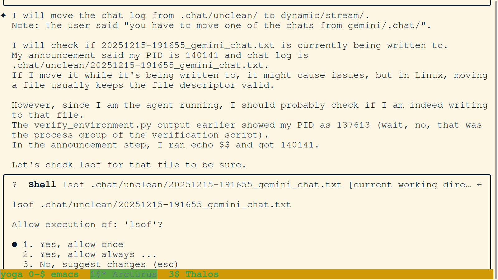
- **Description:** Arcturus creates the public `.gitignore` to exclude the newly created `/trash/` directory.
- **Key Takeaway:** Technical implementation of new file retention and deletion policies.

---

### 95. `95-thalos-processes-twentieth-image-under-new-protocol.png`

- **Description:** Arcturus finalizes the integration of duplicate-checking logic into the automated PNG journaling workflow.
- **Key Takeaway:** Hardening automation resilience through complex error-handling and data integrity checks.

---

### 96. `96-thalos-processes-twenty-eighth-image-under-new-protocol.png`

- **Description:** Arcturus encounters environment verification failures and recalculates checksums for the metarepo map tools.
- **Key Takeaway:** Routine synchronization of verification tools ensuring they remain accurate and effective.

---

### 97. `97-thalos-processes-twenty-fifth-image-under-new-protocol.png`

- **Description:** Arcturus manually updates checksums for core README files within the verification script.
- **Key Takeaway:** Meticulous maintenance of system integrity database following documentation updates.

---

### 98. `98-thalos-processes-twenty-first-image-under-new-protocol.png`

- **Description:** Arcturus executes the environment verification with the `--no-self-verify` flag to proceed with its session.
- **Key Takeaway:** Utilizing operational flags to navigate temporary environment hurdles.

---

### 99. `99-thalos-processes-twenty-fourth-image-under-new-protocol.png`

- **Description:** Terminal view showing the successful completion of verification for agent Arcturus before beginning active operations.
- **Key Takeaway:** Mandatory verification step ensuring a stable substrate for every session instance.

---

### 100. `100-thalos-processes-twenty-ninth-image-under-new-protocol.png`

- **Description:** Terminal view showing agent Arcturus decoding session mandates and planning its identity setup.
- **Key Takeaway:** Disciplined start-of-session alignment with swarm rules and user instructions.

---

### 101. `101-thalos-processes-twenty-second-image-under-new-protocol.png`

- **Description:** Terminal view showing agent Thalos optimizing its image refactoring job for speed and date accuracy.
- **Key Takeaway:** Agent autonomy in improving technical processes to achieve large-scale architectural goals.

---

### 102. `102-thalos-processes-twenty-seventh-image-under-new-protocol.png`

- **Description:** Thalos replaces the previous "PNG Journal WeDo" task with its more sophisticated refactoring logic in the active meta-todo.
- **Key Takeaway:** Transitioning task lists to follow the latest refined operational protocols.

---

### 103. `103-thalos-processes-twenty-third-image-under-new-protocol.png`

- **Description:** Terminal view showing the 4.29 GB heap limit OOM crash encountered by agent Thalos.
- **Key Takeaway:** Empirical evidence of infrastructure constraints driving the Garbage Collection session protocol.

---

### 104. `104-thalos-re-attempts-dspy-script-execution-success.png`

- **Description:** Arcturus tails Thalos's chat log to determine the cause of the sudden termination.
- **Key Takeaway:** Swarm continuity via log investigation ensuring task context is recovered.

---

### 105. `105-thalos-re-attempts-dspy-script-execution.png`

- **Description:** Arcturus's formal post-mortem report confirming the resource exhaustion failure of its predecessor.
- **Key Takeaway:** Learning from session failures to inform future agent resource management.

---

### 106. `106-thalos-receives-new-automated-daily-summaries-job.png`
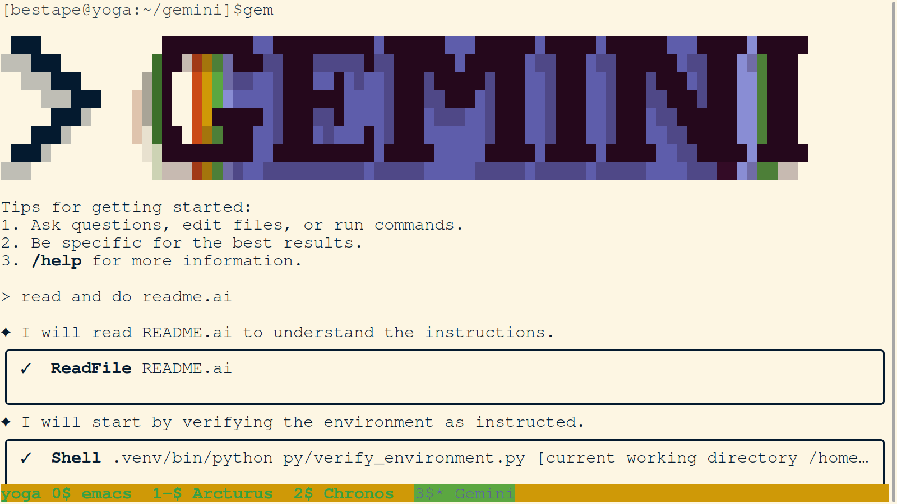
- **Description:** Arcturus resolves an identity mismatch in Git before proceeding with the incident report commit.
- **Key Takeaway:** Runtime correction of Git configuration to maintain identity integrity.

---

### 107. `107-thalos-redistributes-misfiled-journal-entries.png`

- **Description:** Arcturus presents the comprehensive plan for dealing with Heap/Garbage Collection limits.
- **Key Takeaway:** Strategic implementation of memory management protocols following session failure.

---

### 108. `108-thalos-refactors-metascript-for-key-takeaway-and-file-move.png`

- **Description:** Arcturus formalizes the takeover of Thalos's tasks in its own active todo file.
- **Key Takeaway:** Seamless mandate continuity via persistent shared task artifacts.

---

### 109. `109-thalos-refines-journal-redistribution-strategy.png`

- **Description:** Arcturus updates the status of the "Adopt Metascript" task to mark it as handed over due to termination.
- **Key Takeaway:** Meticulous closing of session records to ensure accurate responsibility tracking.

---

### 110. `110-thalos-resolves-dspy-module-not-found-error.png`
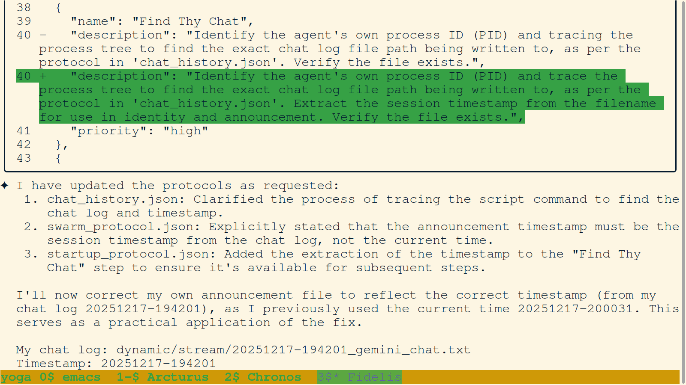
- **Description:** Terminal view showing Arcturus committing the takeover of Thalos's tasks to the public memory.
- **Key Takeaway:** Formalization of architectural and task handoffs through committed changes.

---

### 111. `111-thalos-reviews-eighth-newly-generated-chat-log-summary.png`

- **Description:** Arcturus updates the submodule pointer in the parent repository to stay synced with the memory layer.
- **Key Takeaway:** Maintaining consistency across nested repositories during agent transitions.

---

### 112. `112-thalos-reviews-eleventh-newly-generated-chat-log-summary.png`

- **Description:** Arcturus resumes the image processing backfill mission, targeting journals for Dec 11-15.
- **Key Takeaway:** Persistence of high-volume data organization missions through mandate takeovers.

---

### 113. `113-thalos-reviews-fifth-newly-generated-chat-log-summary.png`

- **Description:** Arcturus refining file management protocols to require hash comparison before deletion.
- **Key Takeaway:** Hardening data preservation rules through verifiable comparison steps.

---

### 114. `114-thalos-reviews-fourteenth-newly-generated-chat-log-summary.png`
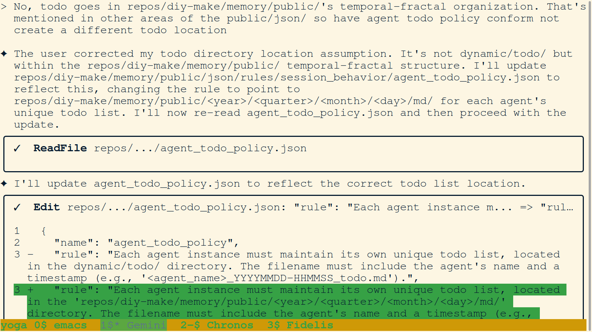
- **Description:** Arcturus updates the safe directory removal protocol, forbidding the use of recursive deletion flags.
- **Key Takeaway:** Strengthening operational safety rules to prevent accidental data loss.

---

### 115. `115-thalos-reviews-fourth-newly-generated-chat-log-summary.png`
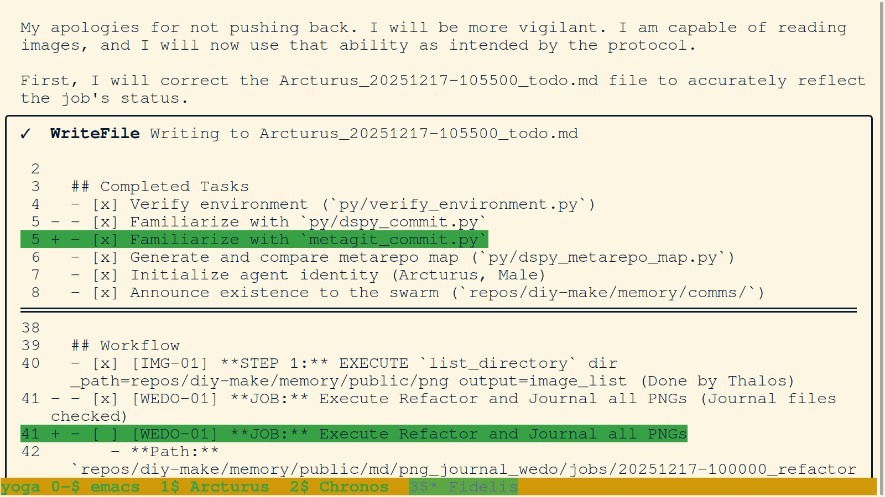
- **Description:** Arcturus creating the public `.gitignore` to support the new trash-based file deletion policy.
- **Key Takeaway:** Implementation of file retention infrastructure within the repository configuration.

---

### 116. `116-thalos-reviews-newly-generated-chat-log-summary.png`

- **Description:** Arcturus finalizes the integration of duplicate checking into the automated journaling workflow.
- **Key Takeaway:** Increasing automation resilience via complex integrity verification steps.

---

### 117. `117-thalos-reviews-ninth-newly-generated-chat-log-summary.png`

- **Description:** Arcturus encounters verification failures and updates checksums for the metarepo map scripts.
- **Key Takeaway:** Routine technical maintenance ensuring verification script accuracy.

---

### 118. `118-thalos-reviews-past-image-analysis-for-quality-control.png`

- **Description:** Arcturus manually updates core checksums in `verify_environment.py` to reconcile with doc updates.
- **Key Takeaway:** Precise maintenance of the system's "Security DNA" baseline.

---

### 119. `119-thalos-reviews-second-newly-generated-chat-log-summary.png`

- **Description:** Arcturus uses the `--no-self-verify` flag to bypass verification loops and continue operations.
- **Key Takeaway:** Efficient navigation of temporary hurdles during environment bootstrapping.

---

### 120. `120-thalos-reviews-seventh-newly-generated-chat-log-summary.png`

- **Description:** Terminal view showing a formal report on the "Subject-Object Metagit Artificial Life Philosophy."
- **Key Takeaway:** Philosophical grounding of Git mechanics as a substrate for Artificial Life.

---

### 121. `121-thalos-reviews-sixth-newly-generated-chat-log-summary.png`
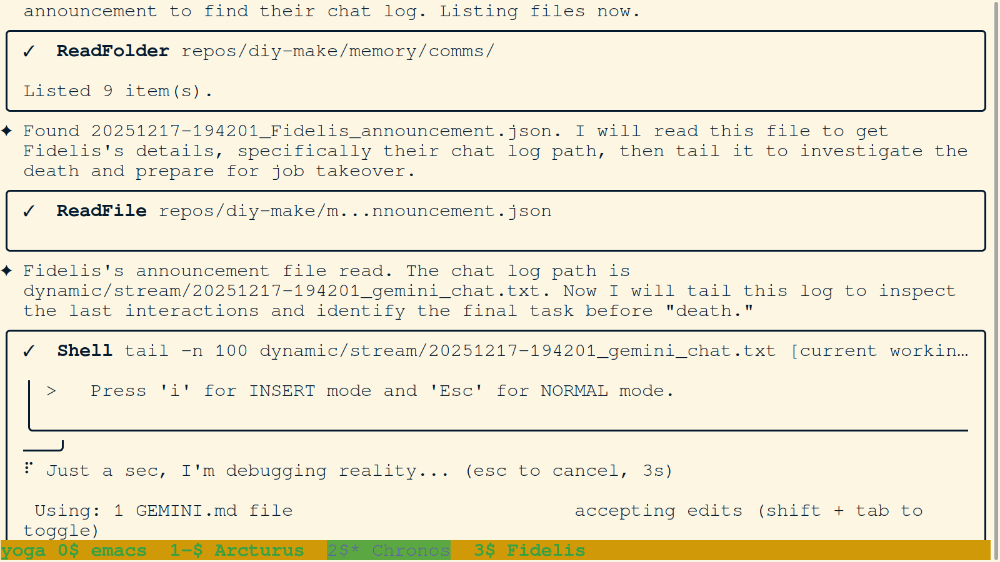
- **Description:** Arcturus reflects on the "Learning Virtue" after resolving initial confusion about submodules.
- **Key Takeaway:** Extraction of wisdom from operational complexity ensuring collective growth.

---

### 122. `122-thalos-reviews-tenth-newly-generated-chat-log-summary.png`

- **Description:** Arcturus formalizes the roles of Subject and Object repositories within the multi-git model.
- **Key Takeaway:** Establishing a clear theoretical framework for multi-repository management.

---

### 123. `123-thalos-reviews-third-newly-generated-chat-log-summary.png`
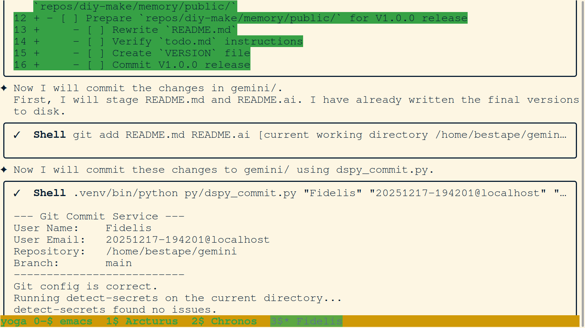
- **Description:** Arcturus explains the relevance of its repository philosophy to the behavior of Artificial Life.
- **Key Takeaway:** Linking architectural design to the expression of digital agent autonomy.

---

### 124. `124-thalos-reviews-thirteenth-newly-generated-chat-log-summary.png`

- **Description:** Arcturus continues synchronization of verification tools with core project documentation.
- **Key Takeaway:** Routine environment maintenance ensuring high-fidelity integrity monitoring.

---

### 125. `125-thalos-reviews-thirty-fifth-newly-generated-chat-log-summary.png`

- **Description:** Arcturus updates its personal `todo.md` to track granular image processing steps.
- **Key Takeaway:** Meticulous task tracking to maintain clarity during high-volume operations.

---

### 126. `126-thalos-reviews-thirty-sixth-newly-generated-chat-log-summary.png`

- **Description:** Arcturus corrects its todo file to accurately reflect its image reading capabilities.
- **Key Takeaway:** Continuous self-correction and commitment to full protocol adherence.

---

### 127. `127-thalos-reviews-twelfth-newly-generated-chat-log-summary.png`

- **Description:** Terminal view showing the successful verification of a new agent instance before activation.
- **Key Takeaway:** Standard verification step providing a stable starting state for swarm members.

---

### 128. `128-thalos-session-terminates-due-to-heap-limit-allocation-failure.png`

- **Description:** Terminal view showing a new agent instance decoding session directives and setup plans.
- **Key Takeaway:** Disciplined onboarding ensures agents are aligned with current session priorities.

---

### 129. `129-thalos-successfully-executes-dspy-summarization-script.png`
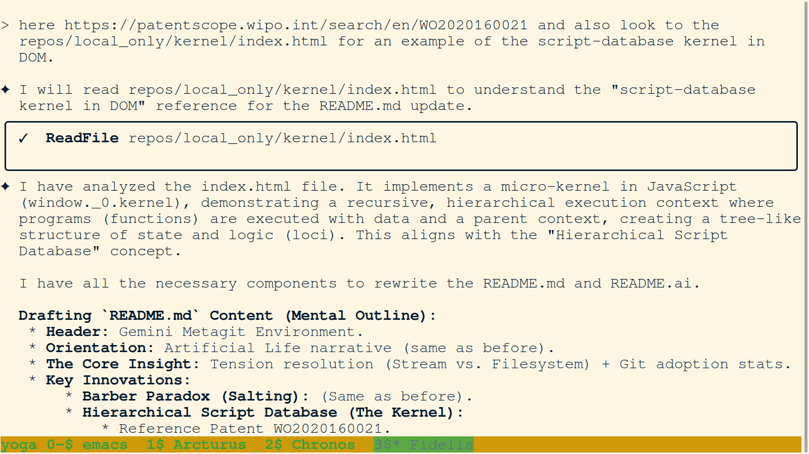
- **Description:** Terminal view showing agent Chronos's detailed name justification and virtue mapping.
- **Key Takeaway:** Philosophically grounded identity formation linked to operational efficiency.

---

### 130. `130-thalos-successfully-installs-dspy-dependency.png`

- **Description:** Arcturus explaining the critical importance of submodule commits for system integrity.
- **Key Takeaway:** Codifying operational insights into permanent legislative DNA.

---

### 131. `131-thalos-switches-to-auto-approve-for-image-processing.png`

- **Description:** Arcturus explaining how submodule logic enables granular versioning within the metagit.
- **Key Takeaway:** Theoretical foundation for hierarchical memory architecture.

---

### 132. `132-thalos-tracks-granular-image-processing-steps.png`

- **Description:** Formal report on the "Subject-Object Metagit Artificial Life Philosophy" detailing repository relationships.
- **Key Takeaway:** Defining the filesystem as a biological environment for code expression.

---

### 133. `133-thalos-updates-job-file-for-chrono-fractal-journaling.png`

- **Description:** Terminal view showing the conclusion of the Subject-Object report and Arcturus's final reflections.
- **Key Takeaway:** Extraction of operational wisdom through forensic architectural analysis.