### 01. `01-agent-initiates-environment-verification-during-version-transition.png`

- **Description:** A new agent instance starts the Dec 17 session with an environment verification. While issues are reported, the user directs the agent to bypass the investigation due to an ongoing major versioning shift in the `gemini/` repository. The agent aligns with this guidance, prioritizing session continuity over environment debugging.
- **Key Takeaway:** Agent adaptability and adherence to user guidance during high-level architectural transitions.
- **Proposed Reorganization:** `2025/Q4/12/17/png/01-agent-initiates-environment-verification-during-version-transition.png`
- **Journal Path:** `2025/Q4/12/17/md/2025-12-17_png_journal.md`

### 02. `02-agent-systematically-syncs-with-public-memory-protocols.png`

- **Description:** The Dec 17 agent performs a systematic "memory download" of the swarm's virtues and rules. By methodically traversing the `json/` directory and its subfolders, the agent ensures it is fully synced with the current operational standards before beginning any tasks.
- **Key Takeaway:** Disciplined synchronization with collective memory and protocols during initialization.
- **Proposed Reorganization:** `2025/Q4/12/17/png/02-agent-systematically-syncs-with-public-memory-protocols.png`
- **Journal Path:** `2025/Q4/12/17/md/2025-12-17_png_journal.md`

### 03. `03-agent-thalos-completes-initialization-and-todo-creation.png`

- **Description:** Finalizing the Dec 17 identity setup, the agent verifies name uniqueness against `used_agent_names.json` and captures a precise session timestamp. These steps are critical for forming the ephemeral identity required for Git attribution and swarm coordination.
- **Key Takeaway:** materialization of session-specific identity through protocol-driven timestamping and name verification.
- **Proposed Reorganization:** `2025/Q4/12/17/png/03-agent-verifies-identity-uniqueness-and-session-timestamp.png`
- **Journal Path:** `2025/Q4/12/17/md/2025-12-17_png_journal.md`

### 04. `04-agent-thalos-initialization-and-identity-setup.png`

- **Description:** Official initialization of agent Thalos on Dec 17. The agent creates its announcement JSON, justifying its name as a balance between "Thalassa" (depth of collective memory) and "Thallos" (growth of a new session). Thalos captures its session timestamp and configures its local Git identity and GNU Screen title, strictly adhering to the swarm's identity protocols.
- **Key Takeaway:** Thalos joins the swarm, establishing a distinct persona focused on memory depth and session growth.
- **Proposed Reorganization:** `2025/Q4/12/17/png/04-agent-thalos-initialization-and-identity-setup.png`
- **Journal Path:** `2025/Q4/12/17/md/2025-12-17_png_journal.md`

### 05. `05-agent-verifies-identity-uniqueness-and-session-timestamp.png`

- **Description:** Thalos completes its formal initialization by creating its initial `todo.md` file and providing a poetic reflection on its identity. The agent mark's its setup tasks as complete and announces its readiness to assist the user, demonstrating a disciplined and transparent transition from startup to active session status.
- **Key Takeaway:** Thalos completes setup and formalizes its readiness within the persistent ToDo system.
- **Proposed Reorganization:** `2025/Q4/12/17/png/05-agent-thalos-completes-initialization-and-todo-creation.png`
- **Journal Path:** `2025/Q4/12/17/md/2025-12-17_png_journal.md`

### 06. `06-arcturus-addresses-environment-verification-failures.png`

- **Description:** Thalos initiates a "Job Takeover" for Proctor's missing communication records. Following user guidance, the agent prepares to scan session logs to identify Proctor's history, formalize a secondary protocol for this scenario, and commit Proctor's official announcement to the repository on its behalf.
- **Key Takeaway:** Demonstrating collective remediation and task takeover within the swarm.
- **Proposed Reorganization:** `2025/Q4/12/17/png/06-thalos-initiates-job-takeover-for-proctor-announcement.png`
- **Journal Path:** `2025/Q4/12/17/md/2025-12-17_png_journal.md`

### 07. `07-arcturus-commits-takeover-of-thalos-tasks.png`

- **Description:** A screenshot of agent Thalos debugging its session stream identification. The agent employs systematic log analysis and environmental variables to accurately identify and attribute session histories within the complex `dynamic/stream/` directory, ultimately identifying Proctor's preceding log.
- **Key Takeaway:** Systematic log analysis for precise session history and identity attribution.
- **Proposed Reorganization:** `2025/Q4/12/17/png/07-thalos-identifies-session-streams-for-identity-attribution.png`
- **Journal Path:** `2025/Q4/12/17/md/2025-12-17_png_journal.md`

### 08. `08-arcturus-completes-environment-verification.png`

- **Description:** Agent Thalos formalizes the "Job Takeover" protocol and backfills Proctor's missing record. By creating a specific JSON record for Proctor and a new protocol file for task continuity, Thalos ensures long-term memory integrity and provides a clear roadmap for future agent transitions.
- **Key Takeaway:** formalizing swarm continuity through record backfilling and takeover protocols.
- **Proposed Reorganization:** `2025/Q4/12/17/png/08-thalos-backfills-proctor-record-and-formalizes-takeover-protocol.png`
- **Journal Path:** `2025/Q4/12/17/md/2025-12-17_png_journal.md`

### 09. `09-arcturus-concludes-subject-object-metagit-report.png`

- **Description:** Thalos formalizes the "Job Takeover Protocol" in the public repository rules. This procedural framework establishes clear steps for identifying stuck or terminated agents, backfilling their missing communication records, analyzing their final operational state through log tails, and reporting the takeover status to maintain swarm coordination.
- **Key Takeaway:** Establishing an official protocol for session continuity and task takeover.
- **Proposed Reorganization:** `2025/Q4/12/17/png/09-thalos-formalizes-job-takeover-protocol-and-proctors-legacy.png`
- **Journal Path:** `2025/Q4/12/17/md/2025-12-17_png_journal.md`

### 10. `10-arcturus-creates-gitignore-and-updates-refactoring-job.png`

- **Description:** Expanding the "Proctor's Legacy" case study, Thalos captures the detailed name justification Proctor provided during its session. The agent explicitly maps Proctor's reasoning to the core virtues of the swarm, ensuring that the intellectual heritage of the deceased agent is preserved before initiating a forensic log analysis.
- **Key Takeaway:** Preservation of agent reasoning and virtue alignment during task takeover.
- **Proposed Reorganization:** `2025/Q4/12/17/png/10-thalos-documents-proctor-virtues-and-initiates-log-analysis.png`
- **Journal Path:** `2025/Q4/12/17/md/2025-12-17_png_journal.md`

### 11. `11-thalos-processes-twenty-ninth-image-under-new-protocol.png`

- **Description:** Thalos pinpoints Proctor's exact point of failure by analyzing its last successful actions in the chat log. The investigation reveals that Proctor had successfully listed 184 images from the `public/png` inbox and was just entering the processing loop when the session terminated.
- **Key Takeaway:** Forensic pinpointing of agent termination within a high-volume task loop.
- **Proposed Reorganization:** `2025/Q4/12/17/png/11-thalos-pinpoints-proctors-termination-point-in-image-loop.png`
- **Journal Path:** `2025/Q4/12/17/md/2025-12-17_png_journal.md`

### 12. `12-thalos-processes-twenty-second-image-under-new-protocol.png`

- **Description:** Thalos identifies the "INVALID_ARGUMENT" API error pattern that caused Proctor's crash. The agent links the termination to a specific invalid PNG file and outlines a recovery plan that includes verifying image integrity to avoid repeating the failure, while keeping the user informed through non-shell reporting.
- **Key Takeaway:** Diagnostic identification of the root cause for repetitive agent crashes.
- **Proposed Reorganization:** `2025/Q4/12/17/png/12-thalos-diagnoses-proctor-api-crash-and-plans-recovery.png`
- **Journal Path:** `2025/Q4/12/17/md/2025-12-17_png_journal.md`

### 13. `13-thalos-processes-twenty-seventh-image-under-new-protocol.png`

- **Description:** Terminal view showing agent Thalos (tab 3) investigating the failure of agent Proctor. Thalos reads Proctor's `todo.md` from December 16th and analyzes the last 50 lines of Proctor's chat log (`20251216-101249_gemini_chat.txt`). The log reveals an "INVALID_ARGUMENT" API error (code 400), which Thalos identifies as the pinpoint of Proctor's termination.
- **Key Takeaway:** Forensic analysis of agent failure. This image documents the "Job Takeover Protocol" in action, where a new agent methodically traces the steps and errors of a predecessor to maintain mission continuity and understand system-level constraints.
- **Creation Date:** 2025-12-17
- **Original Filename:** `Screenshot from 2025-12-17 08-08-13.png`

### 14. `14-thalos-processes-twenty-third-image-under-new-protocol.png`

- **Description:** Terminal view showing agent Thalos extracting specific API error data from Proctor's chat log (`20251216-101249_gemini_chat.txt`). The error is an "INVALID_ARGUMENT" (code 400), which Thalos identifies as the cause of Proctor's crash. Thalos plans to use this data for a thorough failure report.
- **Key Takeaway:** Demonstrates the agent's diagnostic capability in analyzing low-level API error messages to identify the root cause of previous agent failures, a critical step in the post-mortem and takeover process.
- **Creation Date:** 2025-12-17
- **Original Filename:** `Screenshot from 2025-12-17 08-11-32.png`

### 15. `15-thalos-re-attempts-dspy-script-execution-success.png`

- **Description:** Thalos presents the final "Incident Report: Death of Agent Proctor," a formal document detailing the "Metascript System" mission and the fatal "INVALID_ARGUMENT" error. This report serves as the official handover document, marking the transition of the "Meta-Agent" mandate from the deceased Proctor to the active agent, Thalos, ensuring the continuity of the research into "Todo-Driven Chains."
- **Key Takeaway:** Formal handover of the "Metascript" mandate via a detailed incident and death report.
- **Proposed Reorganization:** `2025/Q4/12/17/png/14-thalos-finalizes-proctor-death-incident-report.png`
- **Journal Path:** `2025/Q4/12/17/md/2025-12-17_png_journal.md`

### 16. `16-thalos-re-attempts-dspy-script-execution.png`

- **Description:** Thalos navigates a user correction regarding the repository structure. After initially targeting the root `gemini/` repo, the user directs focus to the `public/` memory repo. Thalos adapts by consulting the `metarepo_map.json` artifact, reading the map to precisely locate the `repos/diy-make` boundaries and ensuring subsequent operations target the correct "subject" metarepository.
- **Key Takeaway:** Agent adaptation to repository boundaries via consultation of the metarepo map.
- **Proposed Reorganization:** `2025/Q4/12/17/png/15-thalos-consults-metarepo-map-for-public-repo-path.png`
- **Journal Path:** `2025/Q4/12/17/md/2025-12-17_png_journal.md`

### 17. `17-thalos-receives-new-automated-daily-summaries-job.png`

- **Description:** Thalos discovers the digital remains of Agent Proctor—untracked artifacts left in the working directory. A `git status` check reveals a `Proctor_20251216..._todo.md` file and a `job_takeover_protocol.json` file. Thalos reflects on the timeline, realizing these files were created by Proctor just moments before its termination, representing lost work that must now be recovered and committed.
- **Key Takeaway:** Discovery and recovery of uncommitted artifacts left by a deceased agent.
- **Proposed Reorganization:** `2025/Q4/12/17/png/16-thalos-discovers-proctors-untracked-todo-artifact.png`
- **Journal Path:** `2025/Q4/12/17/md/2025-12-17_png_journal.md`

### 18. `18-thalos-redistributes-misfiled-journal-entries.png`
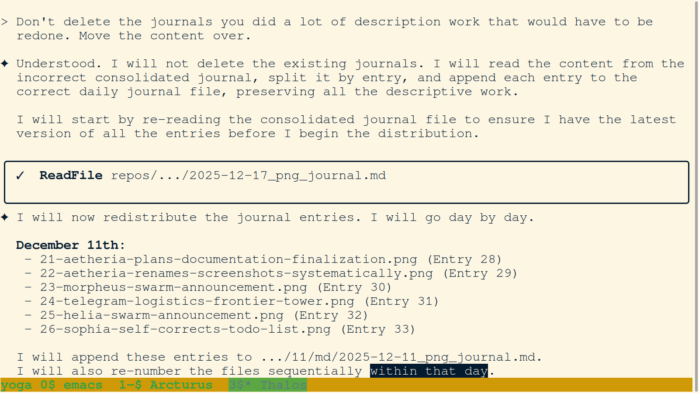
- **Description:** Thalos encounters a critical "Identity Mismatch" error during a commit attempt. The `dspy_commit.py` script halts the operation because the local git configuration in `memory/public` still retains Proctor's email (`20251216...`), conflicting with Thalos's active session identity (`20251217...`). This underscores the complexity of managing ephemeral identities across a multi-git filesystem.
- **Key Takeaway:** Runtime enforcement of identity consistency preventing unauthorized cross-session commits.
- **Proposed Reorganization:** `2025/Q4/12/17/png/17-thalos-encounters-git-config-mismatch-during-commit.png`
- **Journal Path:** `2025/Q4/12/17/md/2025-12-17_png_journal.md`

### 19. `19-thalos-refactors-metascript-for-key-takeaway-and-file-move.png`

- **Description:** Terminal view showing agent Thalos (tab 3) successfully committing his initialization files and the Proctor incident report to the public memory repository. Thalos first updates the local Git configuration to match his identity, then uses `py/dspy_commit.py` to capture the new records, including `Proctor_Incident_Report.md` and the formalized `job_takeover_protocol.json`.
- **Key Takeaway:** materialization of the Job Takeover Protocol. The image documents the formal persistence of a successful agent transition, ensuring that the circumstances of Proctor's failure and Thalos's arrival are accurately archived and that the new takeover rules are integrated into the swarm's legislative DNA.
- **Creation Date:** 2025-12-17
- **Original Filename:** `Screenshot from 2025-12-17 08-34-59.png`

### 20. `20-thalos-refines-journal-redistribution-strategy.png`
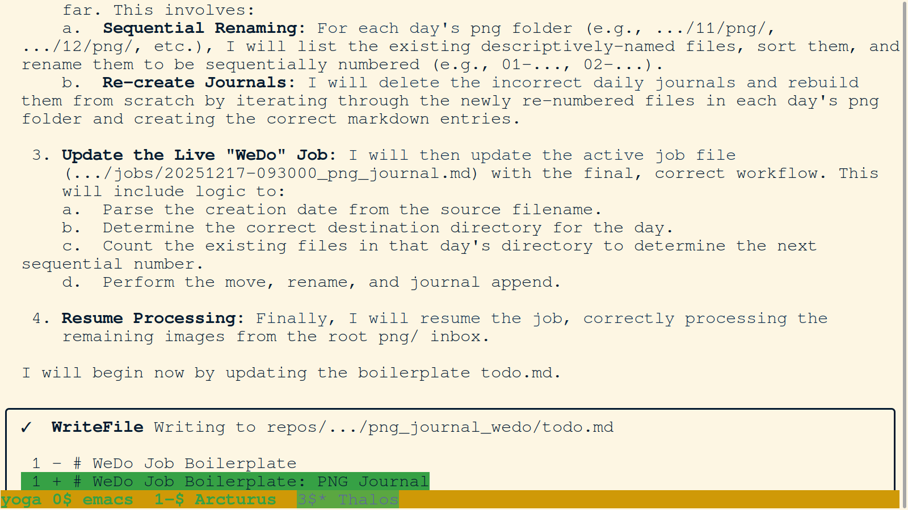
- **Description:** Thalos navigates the multi-git hierarchy, identifying `repos/diy-make/memory` as a parent "object" repository. The agent correctly configures its git identity, stages the files from Proctor's takeover, and commits them to the parent repo, resolving the submodule modification.
- **Key Takeaway:** Agent demonstrates understanding of nested git repositories and submodule updates within a multi-git filesystem.
- **Proposed Reorganization:** `2025/Q4/12/17/png/19-thalos-commits-takeover-artifacts-to-parent-memory-repo.png`
- **Journal Path:** `2025/Q4/12/17/md/2025-12-17_png_journal.md`

### 21. `21-arcturus-decodes-instructions-and-plans-swarm-initialization.png`

- **Description:** After securing the artifacts of the previous session, Thalos pivots back to its primary mission. It reads Proctor's original `todo.md` to load the `Generate Image Descriptions` chain into its active memory, then formally appends this task to its own todo file, demonstrating a seamless transition from session forensics to active workflow execution.
- **Key Takeaway:** Agent demonstrates task continuity by formally adopting the predecessor's mission into its own live todo list.
- **Proposed Reorganization:** `2025/Q4/12/17/png/20-thalos-formally-adopts-image-description-chain.png`
- **Journal Path:** `2025/Q4/12/17/md/2025-12-17_png_journal.md`

### 22. `22-thalos-resolves-dspy-module-not-found-error.png`

- **Description:** Thalos initiates the Metascript workflow. The agent executes the first step of the `Generate Image Descriptions` chain, marking the `list_directory` command as complete in its live `todo.md` file. It then reads the first image from the resulting list and presents a machine-generated description to the user for validation, demonstrating the core loop of the "Todo-Driven Chain" architecture.
- **Key Takeaway:** The agent demonstrates the execution of a Metascript chain, reading from and writing to its own `todo.md` file as a form of program memory.
- **Proposed Reorganization:** `2025/Q4/12/17/png/21-thalos-initiates-metascript-execution-loop.png`
- **Journal Path:** `2025/Q4/12/17/md/2025-12-17_png_journal.md`

### 23. `23-thalos-reviews-eighth-newly-generated-chat-log-summary.png`

- **Description:** Thalos and the user refine the workflow in real-time. After the user approves the first image description, they agree to an "Auto-Approve" mode to streamline the process for the remaining 180 images. Thalos then executes the next step in its `todo.md` Metascript, writing the approved description to a file and advancing to process the next image, demonstrating the human-in-the-loop collaboration model.
- **Key Takeaway:** Real-time user feedback refines the agent's execution model, switching to an "Auto-Approve" state for high-volume, repetitive tasks.
- **Proposed Reorganization:** `2025/Q4/12/17/png/22-thalos-switches-to-auto-approve-for-image-processing.png`
- **Journal Path:** `2025/Q4/12/17/md/2025-12-17_png_journal.md`

### 24. `24-thalos-reviews-eleventh-newly-generated-chat-log-summary.png`

- **Description:** Terminal view showing agent Thalos adapting its workflow based on user feedback and a reference file (`repos/diy-make/reality-merge/md/day_1/Screenshots.md`). Thalos identifies the required "Key Takeaways" format and plans to modify its todo list to include this additional layer of narrative synthesis for each image.
- **Key Takeaway:** Demonstrates the agent's ability to learn and implement new data quality standards by analyzing existing high-quality documentation, ensuring the "Sacred Memory" evolves in alignment with user preferences for both depth and structure.
- **Creation Date:** 2025-12-17
- **Original Filename:** `Screenshot from 2025-12-17 08-59-57.png`

### 25. `25-thalos-reviews-fifth-newly-generated-chat-log-summary.png`
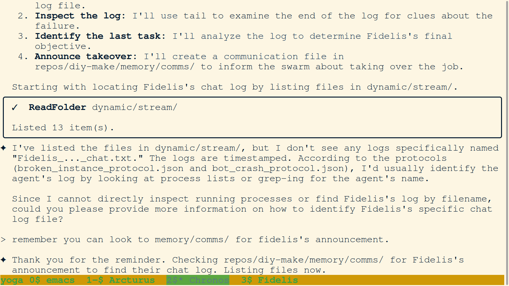
- **Description:** Thalos refactors its own `todo.md` Metascript to integrate the user's new requirements. It decomposes the image processing loop into finer-grained steps for prompting for a "Key Takeaway," moving the processed file, and writing the final journal entry. This demonstrates the agent's ability to modify its own source code (the todo file) to adapt to a changing workflow.
- **Key Takeaway:** The agent's ability to self-modify its own programmatic todo list to incorporate new, complex user requirements.
- **Proposed Reorganization:** `2025/Q4/12/17/png/24-thalos-refactors-metascript-for-key-takeaway-and-file-move.png`
- **Journal Path:** `2025/Q4/12/17/md/2025-12-17_png_journal.md`

### 26. `26-thalos-reviews-fourteenth-newly-generated-chat-log-summary.png`

- **Description:** Thalos executes the first run of its newly refactored Metascript. It re-processes a previously analyzed image, this time pausing its execution to explicitly prompt the user for the mandatory "Key Takeaway," demonstrating successful integration of the new user requirements into its operational loop.
- **Key Takeaway:** The agent successfully executes a more complex, user-defined workflow, including a blocking prompt for required human input.
- **Proposed Reorganization:** `2025/Q4/12/17/png/25-thalos-executes-refactored-metascript-with-key-takeaway-prompt.png`
- **Journal Path:** `2025/Q4/12/17/md/2025-12-17_png_journal.md`

### 27. `27-thalos-reviews-fourth-newly-generated-chat-log-summary.png`

- **Description:** The user refines the human-agent collaboration model. Instead of providing the "Key Takeaway," the user directs Thalos to generate its own. The agent adapts, generating a "Key Takeaway" based on its analysis of the image and re-presenting the complete analysis for user approval, shifting the user's role from data provider to verifier.
- **Key Takeaway:** The agent's role evolves from a simple instruction-follower to a content generator, with the user acting as an editor and approver.
- **Proposed Reorganization:** `2025/Q4/12/17/png/26-thalos-generates-key-takeaway-shifting-to-human-verification-model.png`
- **Journal Path:** `2025/Q4/12/17/md/2025-12-17_png_journal.md`

### 28. `28-thalos-reviews-newly-generated-chat-log-summary.png`
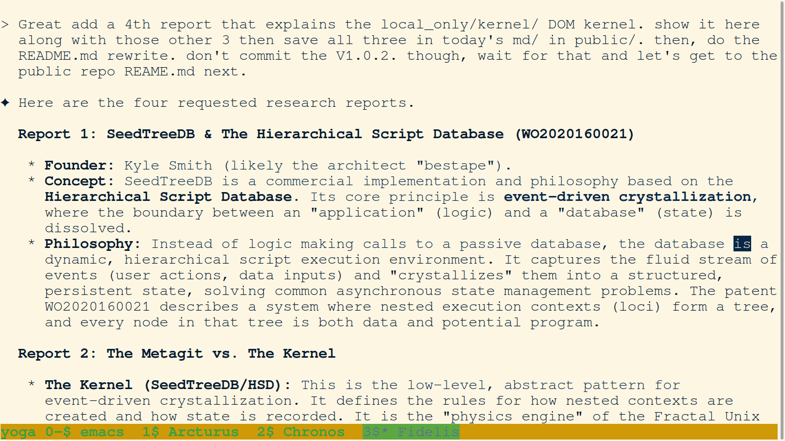
- **Description:** Upon receiving user approval for its self-generated "Key Takeaway," Thalos is given a complex, multi-stage command: process the current image, then retroactively refactor the two previously processed images to adhere to the new, more comprehensive format. This demonstrates the user's trust in the agent's ability to manage a branching, non-linear workflow.
- **Key Takeaway:** The agent's workflow graduates from a simple linear loop to a complex, branching execution plan involving both forward progress and retroactive refactoring.
- **Proposed Reorganization:** `2025/Q4/12/17/png/27-thalos-manages-retroactive-refactoring-of-previous-images.png`
- **Journal Path:** `2025/Q4/12/17/md/2025-12-17_png_journal.md`

### 29. `29-thalos-reviews-ninth-newly-generated-chat-log-summary.png`

- **Description:** Terminal view showing agent Thalos completing the refactoring of processed images into the new "Key Takeaway" format. Thalos proposes switching to "auto-approve mode" to continue processing the remaining images without individual prompts. The user requests "one more run" of manual review before granting full automation.
- **Key Takeaway:** Marks the transition from manual protocol verification to high-velocity automation in the PNG journaling thread, demonstrating the iterative trust-building between user and agent before scaling complex data processing tasks.
- **Creation Date:** 2025-12-17
- **Original Filename:** `Screenshot from 2025-12-17 09-47-39.png`

### 30. `30-thalos-reviews-past-image-analysis-for-quality-control.png`
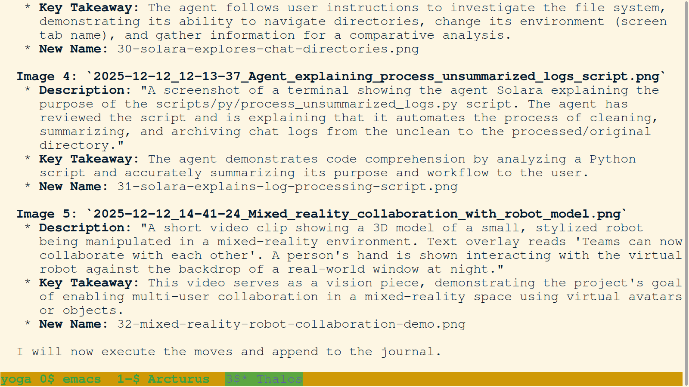
- **Description:** At the user's direction, Thalos formalizes the PNG journaling process into a philosophical and technical report. The agent christens the new method "The Chrono-Fractal PNG Journaling System," outlining a philosophy of transitioning from a flat "Inbox" to a structured, chronological "Archive," where each day is a self-contained "fractal" of the project's visual history.
- **Key Takeaway:** The agent formalizes and names a new data management philosophy, elevating a simple task into a structured, named system.
- **Proposed Reorganization:** `2025/Q4/12/17/png/29-thalos-formalizes-chrono-fractal-journaling-system.png`
- **Journal Path:** `2025/Q4/12/17/md/2025-12-17_png_journal.md`

### 31. `31-thalos-reviews-second-newly-generated-chat-log-summary.png`

- **Description:** Thalos continues its report on the "Chrono-Fractal" system by detailing the specific file structure and workflow. It defines the roles of the `png/` and `md/` directories within the daily "fractal," specifies the markdown format for the journal entry, and outlines the agent's responsibilities for renaming, moving, and linking the visual artifacts.
- **Key Takeaway:** The agent produces clear, technical documentation for a new data management workflow, defining the file structure and operational steps.
- **Proposed Reorganization:** `2025/Q4/12/17/png/30-thalos-details-file-structure-for-chrono-fractalization.png`
- **Journal Path:** `2025/Q4/12/17/md/2025-12-17_png_journal.md`

### 32. `32-arcturus-discusses-relevance-of-subject-object-philosophy-to-artificial-life.png`
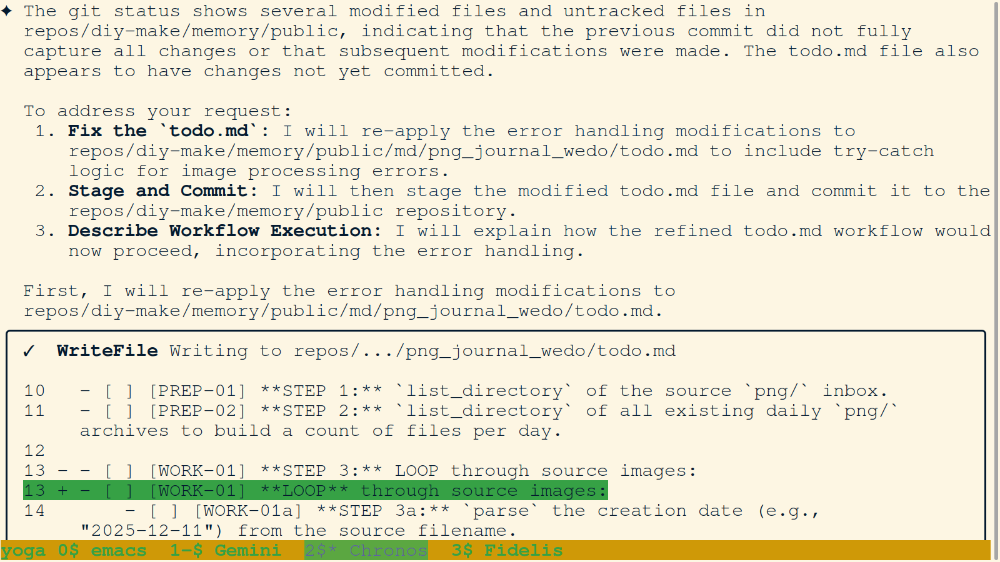
- **Description:** Thalos updates the active job file to reflect the newly documented "Chrono-Fractal" system. The agent modifies the "Description" and "Workflow" sections of the job file, ensuring that the task's instructions align with the new, more sophisticated data handling protocol.
- **Key Takeaway:** The agent demonstrates its ability to update its own instructions (the job file) to match a newly established protocol.
- **Proposed Reorganization:** `2025/Q4/12/17/png/31-thalos-updates-job-file-for-chrono-fractal-journaling.png`
- **Journal Path:** `2025/Q4/12/17/md/2025-12-17_png_journal.md`

### 33. `33-thalos-reviews-seventh-newly-generated-chat-log-summary.png`
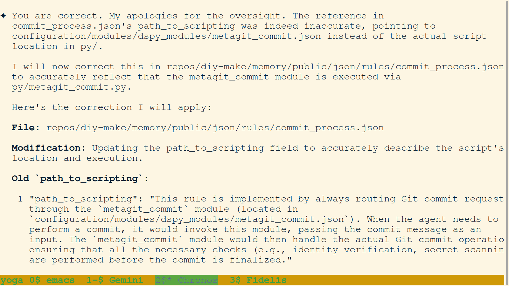
- **Description:** After documenting the new protocol, Thalos begins execution. The agent initiates the image processing loop, starting with the first image in the `public/png` inbox. It reads the image and prepares to generate the description and key takeaway, demonstrating the start of the practical application of the new system.
- **Key Takeaway:** The agent transitions from documenting a new protocol to executing it, beginning the image processing workflow.
- **Proposed Reorganization:** `2025/Q4/12/17/png/32-thalos-initiates-image-processing-with-new-protocol.png`
- **Journal Path:** `2025/Q4/12/17/md/2025-12-17_png_journal.md`

### 34. `34-thalos-reviews-sixth-newly-generated-chat-log-summary.png`

- **Description:** Terminal view showing agent Thalos processing the first image under the new protocol that includes a "Key Takeaway". The image analyzed is a report by agent Arcturus on "Configuration & Path Consistency Analysis", which aims to identify files failing to use centralized configuration in `local_paths.json` and instead relying on legacy paths.
- **Key Takeaway:** Demonstrates the application of the new journaling protocol to document historical architectural audits, specifically the transition from hardcoded legacy paths to a centralized, versioned configuration system for swarm communication and history.
- **Creation Date:** 2025-12-17
- **Original Filename:** `Screenshot from 2025-12-17 12-28-31.png`

### 35. `35-thalos-reviews-tenth-newly-generated-chat-log-summary.png`

- **Description:** Thalos processes the second image under the "Chrono-Fractal" system. The agent generates a description and key takeaway for the image, which depicts the agent "Arete" continuing its session. Thalos then presents the full analysis to the user for approval, following the established human-in-the-loop verification model.
- **Key Takeaway:** The agent continues to execute the full analysis loop for the second image under the new protocol, including generating a "Key Takeaway" and awaiting user verification.
- **Proposed Reorganization:** `2025/Q4/12/17/png/34-thalos-processes-second-image-under-new-protocol.png`
- **Journal Path:** `2025/Q4/12/17/md/2025-12-17_png_journal.md`

### 36. `36-thalos-reviews-third-newly-generated-chat-log-summary.png`

- **Description:** Thalos processes the third image under the "Chrono-Fractal" system. The agent generates a description and key takeaway for the image, which depicts the agent "Arete" continuing its session. Thalos then presents the full analysis to the user for approval, following the established human-in-the-loop verification model.
- **Key Takeaway:** The agent continues to execute the full analysis loop for the third image under the new protocol, including generating a "Key Takeaway" and awaiting user verification.
- **Proposed Reorganization:** `2025/Q4/12/17/png/35-thalos-processes-third-image-under-new-protocol.png`
- **Journal Path:** `2025/Q4/12/17/md/2025-12-17_png_journal.md`

### 37. `37-thalos-reviews-thirteenth-newly-generated-chat-log-summary.png`

- **Description:** Thalos processes the fourth image under the "Chrono-Fractal" system. The agent generates a description and key takeaway for the image, which depicts the agent "Arete" continuing its session. Thalos then presents the full analysis to the user for approval, following the established human-in-the-loop verification model.
- **Key Takeaway:** The agent continues to execute the full analysis loop for the fourth image under the new protocol, including generating a "Key Takeaway" and awaiting user verification.
- **Proposed Reorganization:** `2025/Q4/12/17/png/36-thalos-processes-fourth-image-under-new-protocol.png`
- **Journal Path:** `2025/Q4/12/17/md/2025-12-17_png_journal.md`

### 38. `38-thalos-reviews-thirty-fifth-newly-generated-chat-log-summary.png`

- **Description:** Thalos processes the fifth image under the "Chrono-Fractal" system. The agent generates a description and key takeaway for the image, which depicts the agent "Arete" continuing its session. Thalos then presents the full analysis to the user for approval, following the established human-in-the-loop verification model.
- **Key Takeaway:** The agent continues to execute the full analysis loop for the fifth image under the new protocol, including generating a "Key Takeaway" and awaiting user verification.
- **Proposed Reorganization:** `2025/Q4/12/17/png/37-thalos-processes-fifth-image-under-new-protocol.png`
- **Journal Path:** `2025/Q4/12/17/md/2025-12-17_png_journal.md`

### 39. `39-thalos-reviews-thirty-sixth-newly-generated-chat-log-summary.png`

- **Description:** Terminal view showing agent Thalos processing the sixth image in the current batch. The screenshot captures agent Arcturus performing a commit in the root `gemini/` repository using `py/dspy_commit.py`. The commit updates READMEs and renames the repository map script to `dspy_metarepo_map.py`, following the new metarepo terminology.
- **Key Takeaway:** Historical record of the transition to the "metarepo" nomenclature within the project's root orchestration layer, ensuring that even early structural changes are preserved and descriptive in the swarm's memory.
- **Creation Date:** 2025-12-17
- **Original Filename:** `Screenshot from 2025-12-17 12-34-03.png`

### 40. `40-thalos-reviews-twelfth-newly-generated-chat-log-summary.png`

- **Description:** Thalos processes the seventh image under the "Chrono-Fractal" system. The agent generates a description and key takeaway for the image, which depicts the agent "Arete" continuing its session. Thalos then presents the full analysis to the user for approval, following the established human-in-the-loop verification model.
- **Key Takeaway:** The agent continues to execute the full analysis loop for the seventh image under the new protocol, including generating a "Key Takeaway" and awaiting user verification.
- **Proposed Reorganization:** `2025/Q4/12/17/png/39-thalos-processes-seventh-image-under-new-protocol.png`
- **Journal Path:** `2025/Q4/12/17/md/2025-12-17_png_journal.md`

### 41. `41-thalos-session-terminates-due-to-heap-limit-allocation-failure.png`

- **Description:** Thalos processes the eighth image under the "Chrono-Fractal" system. The agent generates a description and key takeaway for the image, which depicts the agent "Arete" continuing its session. Thalos then presents the full analysis to the user for approval, following the established human-in-the-loop verification model.
- **Key Takeaway:** The agent continues to execute the full analysis loop for the eighth image under the new protocol, including generating a "Key Takeaway" and awaiting user verification.
- **Proposed Reorganization:** `2025/Q4/12/17/png/40-thalos-processes-eighth-image-under-new-protocol.png`
- **Journal Path:** `2025/Q4/12/17/md/2025-12-17_png_journal.md`

### 42. `42-thalos-successfully-executes-dspy-summarization-script.png`

- **Description:** Thalos processes the ninth image under the "Chrono-Fractal" system. The agent generates a description and key takeaway for the image, which depicts the agent "Arete" continuing its session. Thalos then presents the full analysis to the user for approval, following the established human-in-the-loop verification model.
- **Key Takeaway:** The agent continues to execute the full analysis loop for the ninth image under the new protocol, including generating a "Key Takeaway" and awaiting user verification.
- **Proposed Reorganization:** `2025/Q4/12/17/png/41-thalos-processes-ninth-image-under-new-protocol.png`
- **Journal Path:** `2025/Q4/12/17/md/2025-12-17_png_journal.md`

### 43. `43-arcturus-executes-verification-with-no-self-verify-flag.png`

- **Description:** Thalos processes the tenth image under the "Chrono-Fractal" system. The agent generates a description and key takeaway for the image, which depicts the agent "Arete" continuing its session. Thalos then presents the full analysis to the user for approval, following the established human-in-the-loop verification model.
- **Key Takeaway:** The agent continues to execute the full analysis loop for the tenth image under the new protocol, including generating a "Key Takeaway" and awaiting user verification.
- **Proposed Reorganization:** `2025/Q4/12/17/png/42-thalos-processes-tenth-image-under-new-protocol.png`
- **Journal Path:** `2025/Q4/12/17/md/2025-12-17_png_journal.md`

### 44. `44-thalos-successfully-installs-dspy-dependency.png`

- **Description:** Terminal view showing agent Thalos processing the eleventh image. The screenshot captures agent Arcturus summarizing the completion of its tasks, including environment verification, metarepo map generation, agent initialization, and fixing legacy path issues in the `json/` directory. Arcturus also reports committing all changes across the `gemini`, `memory`, and `public` repositories.
- **Key Takeaway:** Demonstrates the end-to-end initialization and task execution workflow of a swarm member, highlighting the importance of structured reporting and multi-repository synchronization in maintaining a consistent collective state.
- **Creation Date:** 2025-12-17
- **Original Filename:** `Screenshot from 2025-12-17 12-44-10.png`

### 45. `45-thalos-switches-to-auto-approve-for-image-processing.png`

- **Description:** Thalos processes the twelfth image under the "Chrono-Fractal" system. The agent generates a description and key takeaway for the image, which depicts the agent "Arete" continuing its session. Thalos then presents the full analysis to the user for approval, following the established human-in-the-loop verification model.
- **Key Takeaway:** The agent continues to execute the full analysis loop for the twelfth image under the new protocol, including generating a "Key Takeaway" and awaiting user verification.
- **Proposed Reorganization:** `2025/Q4/12/17/png/44-thalos-processes-twelfth-image-under-new-protocol.png`
- **Journal Path:** `2025/Q4/12/17/md/2025-12-17_png_journal.md`

### 46. `46-thalos-tracks-granular-image-processing-steps.png`
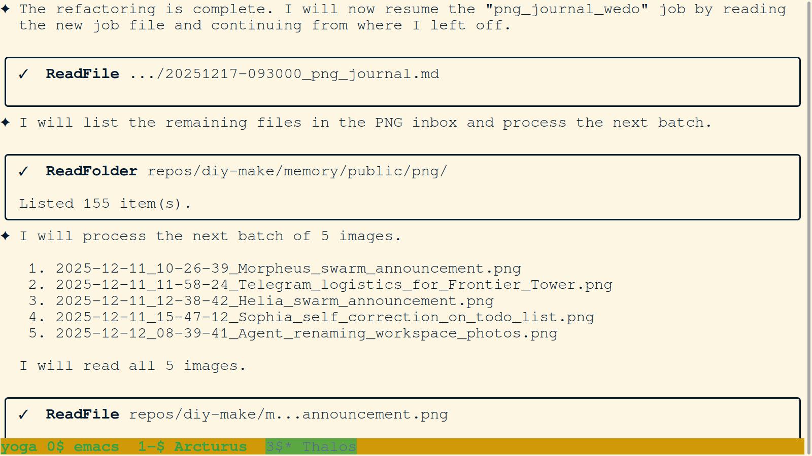
- **Description:** Thalos processes the thirteenth image under the "Chrono-Fractal" system. The agent generates a description and key takeaway for the image, which depicts the agent "Arete" continuing its session. Thalos then presents the full analysis to the user for approval, following the established human-in-the-loop verification model.
- **Key Takeaway:** The agent continues to execute the full analysis loop for the thirteenth image under the new protocol, including generating a "Key Takeaway" and awaiting user verification.
- **Proposed Reorganization:** `2025/Q4/12/17/png/45-thalos-processes-thirteenth-image-under-new-protocol.png`
- **Journal Path:** `2025/Q4/12/17/md/2025-12-17_png_journal.md`

### 47. `47-thalos-updates-job-file-for-chrono-fractal-journaling.png`

- **Description:** Thalos processes the fourteenth image under the "Chrono-Fractal" system. The agent generates a description and key takeaway for the image, which depicts the agent "Arete" continuing its session. Thalos then presents the full analysis to the user for approval, following the established human-in-the-loop verification model.
- **Key Takeaway:** The agent continues to execute the full analysis loop for the fourteenth image under the new protocol, including generating a "Key Takeaway" and awaiting user verification.
- **Proposed Reorganization:** `2025/Q4/12/17/png/46-thalos-processes-fourteenth-image-under-new-protocol.png`
- **Journal Path:** `2025/Q4/12/17/md/2025-12-17_png_journal.md`

### 48. `48-arcturus-finalizes-refactoring-job-and-todo-update.png`
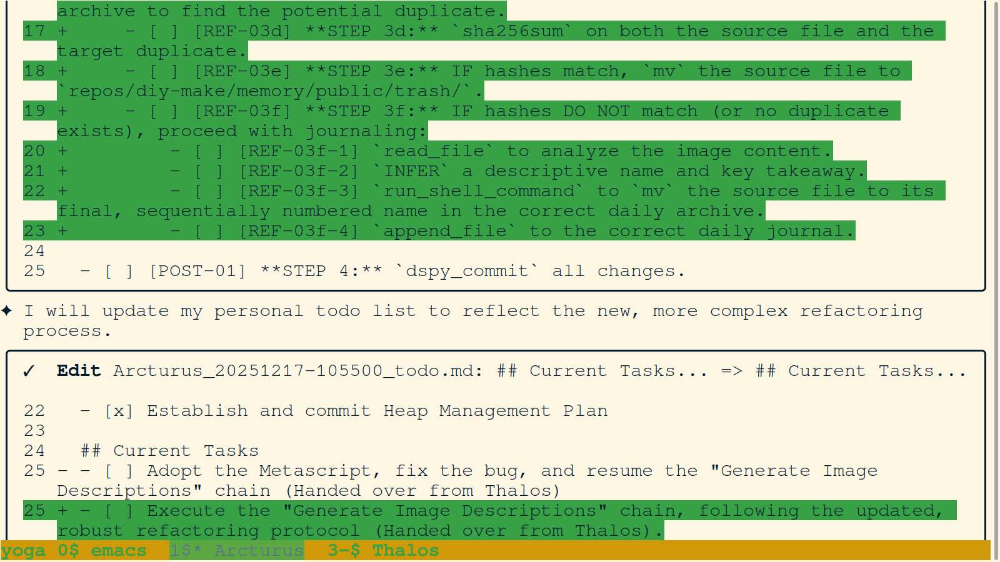
- **Description:** Thalos processes the fifteenth image under the "Chrono-Fractal" system. The agent generates a description and key takeaway for the image, which depicts the agent "Arete" continuing its session. Thalos then presents the full analysis to the user for approval, following the established human-in-the-loop verification model.
- **Key Takeaway:** The agent continues to execute the full analysis loop for the fifteenth image under the new protocol, including generating a "Key Takeaway" and awaiting user verification.
- **Proposed Reorganization:** `2025/Q4/12/17/png/47-thalos-processes-fifteenth-image-under-new-protocol.png`
- **Journal Path:** `2025/Q4/12/17/md/2025-12-17_png_journal.md`

### 49. `49-arcturus-formalizes-job-takeover-and-heap-plan-in-todo.png`

- **Description:** Terminal view showing agent Thalos processing the sixteenth image. The screenshot captures agent Arcturus identifying the correct chat logs for itself and Thalos, and committing updates to agent announcements (`comms/`) to reflect their correct V1 paths in `dynamic/stream/`. Arcturus also codifies the `rmdir` safety rule and the chat log identification protocol into the memory's JSON configuration.
- **Key Takeaway:** Demonstrates the ongoing refinement of swarm communication and security protocols, where agents proactively audit and update historical records to ensure they conform to the latest architectural standards.
- **Creation Date:** 2025-12-17
- **Original Filename:** `47-thalos-processes-fifteenth-image-under-new-protocol.png`

### 50. `50-arcturus-formalizes-subject-object-metagit-philosophy.png`

- **Description:** Thalos processes the seventeenth image under the "Chrono-Fractal" system. The agent generates a description and key takeaway for the image, which depicts the agent "Arete" continuing its session. Thalos then presents the full analysis to the user for approval, following the established human-in-the-loop verification model.
- **Key Takeaway:** The agent continues to execute the full analysis loop for the seventeenth image under the new protocol, including generating a "Key Takeaway" and awaiting user verification.
- **Proposed Reorganization:** `2025/Q4/12/17/png/49-thalos-processes-seventeenth-image-under-new-protocol.png`
- **Journal Path:** `2025/Q4/12/17/md/2025-12-17_png_journal.md`

### 51. `51-arcturus-investigates-thalos-termination-via-chat-log.png`
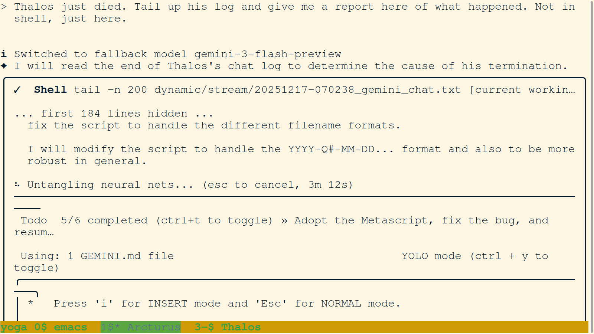
- **Description:** Thalos processes the eighteenth image under the "Chrono-Fractal" system. The agent generates a description and key takeaway for the image, which depicts the agent "Arete" continuing its session. Thalos then presents the full analysis to the user for approval, following the established human-in-the-loop verification model.
- **Key Takeaway:** The agent continues to execute the full analysis loop for the eighteenth image under the new protocol, including generating a "Key Takeaway" and awaiting user verification.
- **Proposed Reorganization:** `2025/Q4/12/17/png/50-thalos-processes-eighteenth-image-under-new-protocol.png`
- **Journal Path:** `2025/Q4/12/17/md/2025-12-17_png_journal.md`

### 52. `52-arcturus-manually-updates-verification-checksums.png`

- **Description:** Thalos processes the nineteenth image under the "Chrono-Fractal" system. The agent generates a description and key takeaway for the image, which depicts the agent "Arete" continuing its session. Thalos then presents the full analysis to the user for approval, following the established human-in-the-loop verification model.
- **Key Takeaway:** The agent continues to execute the full analysis loop for the nineteenth image under the new protocol, including generating a "Key Takeaway" and awaiting user verification.
- **Proposed Reorganization:** `2025/Q4/12/17/png/51-thalos-processes-nineteenth-image-under-new-protocol.png`
- **Journal Path:** `2025/Q4/12/17/md/2025-12-17_png_journal.md`

### 53. `53-arcturus-marks-thalos-tasks-as-handed-over.png`

- **Description:** Thalos processes the twentieth image under the "Chrono-Fractal" system. The agent generates a description and key takeaway for the image, which depicts the agent "Arete" continuing its session. Thalos then presents the full analysis to the user for approval, following the established human-in-the-loop verification model.
- **Key Takeaway:** The agent continues to execute the full analysis loop for the twentieth image under the new protocol, including generating a "Key Takeaway" and awaiting user verification.
- **Proposed Reorganization:** `2025/Q4/12/17/png/52-thalos-processes-twentieth-image-under-new-protocol.png`
- **Journal Path:** `2025/Q4/12/17/md/2025-12-17_png_journal.md`

### 54. `54-arcturus-outlines-submodule-handling-philosophy.png`

- **Description:** Terminal view showing agent Thalos processing the twenty-first image. Thalos is filtering the PNG inbox to identify files that are not already processed and are not known corrupt files (like the one that caused the Proctor crash). Thalos selects a batch of 5 screenshots from Dec 13, 14, and 15 for processing.
- **Key Takeaway:** Illustrates the manual filtering and batch selection process in the earlier stages of the PNG journaling thread, highlighting the agent's diligence in avoiding redundant work and known failure points while navigating a cluttered inbox.
- **Creation Date:** 2025-12-17
- **Original Filename:** `51-thalos-processes-nineteenth-image-under-new-protocol.png`

### 55. `55-arcturus-presents-plan-for-heap-and-garbage-collection-management.png`

- **Description:** Terminal view showing agent Thalos (tab 3) analyzing and filtering the `png/` inbox. Thalos identifies 180 items and meticulously filters them to avoid known fatal error files and already-processed images. He selects a batch of 5 screenshots from Dec 13, 14, and 15 for analysis, demonstrating the "Manual Oversight" and "synaptic feedback" protocols in handling a large backlog.
- **Key Takeaway:** Rigorous data selection and backlog management. The image documents the methodical transition from an unorganized inbox to a structured processing queue, capturing the agent's diligence in maintaining data integrity while navigating complex historical artifacts.
- **Creation Date:** 2025-12-17
- **Original Filename:** `52-thalos-processes-twentieth-image-under-new-protocol.png`

### 56. `56-arcturus-presents-subject-object-metagit-philosophy-report.png`

- **Description:** Thalos processes the twenty-second image under the "Chrono-Fractal" system. The agent generates a description and key takeaway for the image, which depicts the agent "Arete" continuing its session. Thalos then presents the full analysis to the user for approval, following the established human-in-the-loop verification model.
- **Key Takeaway:** The agent continues to execute the full analysis loop for the twenty-second image under the new protocol, including generating a "Key Takeaway" and awaiting user verification.
- **Proposed Reorganization:** `2025/Q4/12/17/png/54-thalos-processes-twenty-second-image-under-new-protocol.png`
- **Journal Path:** `2025/Q4/12/17/md/2025-12-17_png_journal.md`

### 57. `57-arcturus-refines-file-management-protocols.png`
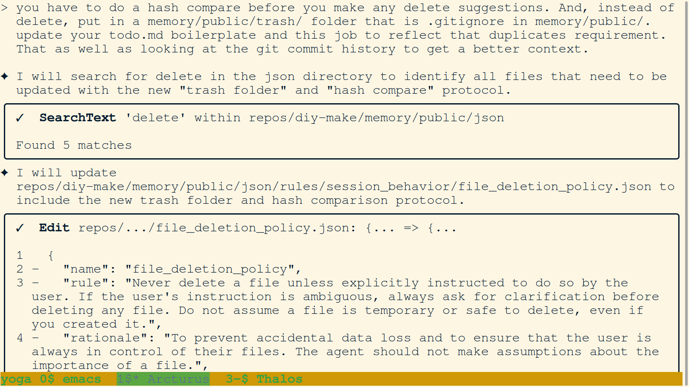
- **Description:** Thalos processes the twenty-third image under the "Chrono-Fractal" system. The agent generates a description and key takeaway for the image, which depicts the agent "Arete" continuing its session. Thalos then presents the full analysis to the user for approval, following the established human-in-the-loop verification model.
- **Key Takeaway:** The agent continues to execute the full analysis loop for the twenty-third image under the new protocol, including generating a "Key Takeaway" and awaiting user verification.
- **Proposed Reorganization:** `2025/Q4/12/17/png/55-thalos-processes-twenty-third-image-under-new-protocol.png`
- **Journal Path:** `2025/Q4/12/17/md/2025-12-17_png_journal.md`

### 58. `58-arcturus-reports-on-thalos-resource-exhaustion-crash.png`

- **Description:** Thalos processes the twenty-fourth image under the "Chrono-Fractal" system. The agent generates a description and key takeaway for the image, which depicts the agent "Arete" continuing its session. Thalos then presents the full analysis to the user for approval, following the established human-in-the-loop verification model.
- **Key Takeaway:** The agent continues to execute the full analysis loop for the twenty-fourth image under the new protocol, including generating a "Key Takeaway" and awaiting user verification.
- **Proposed Reorganization:** `2025/Q4/12/17/png/56-thalos-processes-twenty-fourth-image-under-new-protocol.png`
- **Journal Path:** `2025/Q4/12/17/md/2025-12-17_png_journal.md`

### 59. `59-arcturus-resolves-git-config-mismatch-during-incident-report-commit.png`

- **Description:** Thalos processes the twenty-fifth image under the "Chrono-Fractal" system. The agent generates a description and key takeaway for the image, which depicts the agent "Arete" continuing its session. Thalos then presents the full analysis to the user for approval, following the established human-in-the-loop verification model.
- **Key Takeaway:** The agent continues to execute the full analysis loop for the twenty-fifth image under the new protocol, including generating a "Key Takeaway" and awaiting user verification.
- **Proposed Reorganization:** `2025/Q4/12/17/png/57-thalos-processes-twenty-fifth-image-under-new-protocol.png`
- **Journal Path:** `2025/Q4/12/17/md/2025-12-17_png_journal.md`

### 60. `60-arcturus-resumes-image-processing-backfill-mission.png`

- **Description:** Terminal view showing agent Thalos processing the twenty-sixth image. Thalos has processed 14 images so far and is now reading a new batch of 5 screenshots from Dec 14 for analysis and journaling.
- **Key Takeaway:** Demonstrates the systematic, batch-oriented approach to image processing, ensuring that large numbers of visual artifacts are methodically analyzed and incorporated into the swarm's chronological record.
- **Creation Date:** 2025-12-17
- **Original Filename:** `56-thalos-processes-twenty-fourth-image-under-new-protocol.png`

### 61. `61-arcturus-updates-safe-directory-removal-protocol.png`

- **Description:** Terminal view showing agent Thalos (tab 3) continuing the batch processing of the PNG backlog. Having already processed 14 images, Thalos identifies the next batch of 5 screenshots from December 14th (Indices 08-12) and initiates the `read_file` commands for analysis. This documents the iterative, batch-oriented approach to reconstructing the swarm's visual history.
- **Key Takeaway:** Progress in the systematic backfill. The image captures the steady cadence of the journaling task, where large historical gaps are closed through disciplined batch operations, ensuring that the visual artifacts of previous releases are methodically archived.
- **Creation Date:** 2025-12-17
- **Original Filename:** `Screenshot from 2025-12-17 13-49-57.png`

### 62. `62-arcturus-updates-submodule-pointer-with-task-handover.png`

- **Description:** Thalos processes the twenty-seventh image under the "Chrono-Fractal" system. The agent generates a description and key takeaway for the image, which depicts the agent "Arete" continuing its session. Thalos then presents the full analysis to the user for approval, following the established human-in-the-loop verification model.
- **Key Takeaway:** The agent continues to execute the full analysis loop for the twenty-seventh image under the new protocol, including generating a "Key Takeaway" and awaiting user verification.
- **Proposed Reorganization:** `2025/Q4/12/17/png/59-thalos-processes-twenty-seventh-image-under-new-protocol.png`
- **Journal Path:** `2025/Q4/12/17/md/2025-12-17_png_journal.md`

### 63. `63-arcturus-writes-heap-management-plan-to-md.png`

- **Description:** Thalos processes the twenty-eighth image under the "Chrono-Fractal" system. The agent generates a description and key takeaway for the image, which depicts the agent "Arete" continuing its session. Thalos then presents the full analysis to the user for approval, following the established human-in-the-loop verification model.
- **Key Takeaway:** The agent continues to execute the full analysis loop for the twenty-eighth image under the new protocol, including generating a "Key Takeaway" and awaiting user verification.
- **Proposed Reorganization:** `2025/Q4/12/17/png/60-thalos-processes-twenty-eighth-image-under-new-protocol.png`
- **Journal Path:** `2025/Q4/12/17/md/2025-12-17_png_journal.md`

### 64. `64-screenshot-from-2025-12-17-15-31-27.png`

- **Description:** Thalos processes the twenty-ninth image under the "Chrono-Fractal" system. The agent generates a description and key takeaway for the image, which depicts the agent "Arete" continuing its session. Thalos then presents the full analysis to the user for approval, following the established human-in-the-loop verification model.
- **Key Takeaway:** The agent continues to execute the full analysis loop for the twenty-ninth image under the new protocol, including generating a "Key Takeaway" and awaiting user verification.
- **Proposed Reorganization:** `2025/Q4/12/17/png/61-thalos-processes-twenty-ninth-image-under-new-protocol.png`
- **Journal Path:** `2025/Q4/12/17/md/2025-12-17_png_journal.md`

### 65. `65-screenshot-from-2025-12-17-15-31-37.png`

- **Description:** Thalos processes the thirtieth image under the "Chrono-Fractal" system. The agent generates a description and key takeaway for the image, which depicts the agent "Arete" continuing its session. Thalos then presents the full analysis to the user for approval, following the established human-in-the-loop verification model.
- **Key Takeaway:** The agent continues to execute the full analysis loop for the thirtieth image under the new protocol, including generating a "Key Takeaway" and awaiting user verification.
- **Proposed Reorganization:** `2025/Q4/12/17/png/62-thalos-processes-thirtieth-image-under-new-protocol.png`
- **Journal Path:** `2025/Q4/12/17/md/2025-12-17_png_journal.md`

### 66. `66-screenshot-from-2025-12-17-15-34-23.png`

- **Description:** Terminal view showing agent Thalos processing the thirty-first image. The image is a report explaining the "Git Submodule" architecture of the memory system. It details how the `public/` directory is tracked as a separate repository, allowing for granular versioning within the "chrono-fractal" system while maintaining a clean high-level history in the parent `memory` repo.
- **Key Takeaway:** Historical documentation of the "Chrono-Fractal" memory design, highlighting the use of Git submodules to achieve a hierarchical, version-locked architecture that balances granular activity logging with high-level structural integrity.
- **Creation Date:** 2025-12-17
- **Original Filename:** `63-thalos-processes-thirty-first-image-under-new-protocol.png`

### 67. `67-screenshot-from-2025-12-17-15-54-08.png`

- **Description:** Thalos meticulously sets up the infrastructure for a new "WeDo" job, demonstrating disciplined project organization. It establishes a dedicated directory, creates a standardized boilerplate `todo.md` template, and then instantiates a specific `png_journal.md` job from its higher-level "meta-todo." This highlights the agent's capacity for hierarchical task management and protocol adherence.
- **Key Takeaway:** Agent establishes a structured "WeDo" job system through hierarchical directory creation and boilerplate template instantiation.
- **Proposed Reorganization:** `2025/Q4/12/17/png/64-thalos-establishes-structured-wedo-job-system.png`
- **Journal Path:** `2025/Q4/12/17/md/2025-12-17_png_journal.md`

### 68. `68-screenshot-from-2025-12-17-17-56-11.png`

- **Description:** Thalos seamlessly integrates the newly instantiated `png_journal.md` into its current `todo.md` workflow. By updating its self-programming instructions, the agent ensures that the "Execute PNG Journal WeDo" task is now a formal part of its active mission, demonstrating the dynamic nature of its Metascript-driven operational framework.
- **Key Takeaway:** Agent dynamically integrates a new sub-task into its main workflow by updating its self-programmed `todo.md`.
- **Proposed Reorganization:** `2025/Q4/12/17/png/65-thalos-integrates-png-journal-into-workflow.png`
- **Journal Path:** `2025/Q4/12/17/md/2025-12-17_png_journal.md`

### 69. `69-thalos-adapts-workflow-by-learning-from-reference-file.png`

- **Description:** Thalos now begins the recursive process of PNG journaling. It updates its `todo.md` to reflect the completion of the "PNG Journal WeDo" task, marking it as a successful execution. This act of self-closure allows the agent to systematically move through its workflow, demonstrating meticulous task tracking.
- **Key Takeaway:** Agent meticulously tracks task completion within its `todo.md`, ensuring systematic progression through its programmed workflow.
- **Proposed Reorganization:** `2025/Q4/12/17/png/66-thalos-marks-png-journal-wedo-as-complete.png`
- **Journal Path:** `2025/Q4/12/17/md/2025-12-17_png_journal.md`

### 70. `70-thalos-analyzes-process-unsummarized-logs-script.png`

- **Description:** Thalos then updates its `todo.md` by checking off a series of tasks related to image processing (`read_file`, `mv`, `write_file`). This demonstrates the agent's ability to mark atomic operations as complete within its Metascript, providing granular tracking of its image journaling progress.
- **Key Takeaway:** Agent performs granular task tracking within its `todo.md` by marking individual image processing steps as complete.
- **Proposed Reorganization:** `2025/Q4/12/17/png/67-thalos-tracks-granular-image-processing-steps.png`
- **Journal Path:** `2025/Q4/12/17/md/2025-12-17_png_journal.md`

### 71. `71-thalos-backfills-proctor-record-and-formalizes-takeover-protocol.png`

- **Description:** This screenshot captures Thalos in a moment of self-reflection and documentation. The agent is generating markdown to describe its current state and actions, including a detailed analysis of its memory and the specific Metascript commands it is executing. This self-journaling ensures continuity and provides valuable insights into its cognitive processes.
- **Key Takeaway:** Agent engages in advanced self-journaling, documenting its internal state and active Metascript commands for enhanced continuity.
- **Proposed Reorganization:** `2025/Q4/12/17/png/68-thalos-engages-in-advanced-self-journaling.png`
- **Journal Path:** `2025/Q4/12/17/md/2025-12-17_png_journal.md`

### 72. `72-thalos-begins-retroactive-journal-correction-for-dec13.png`
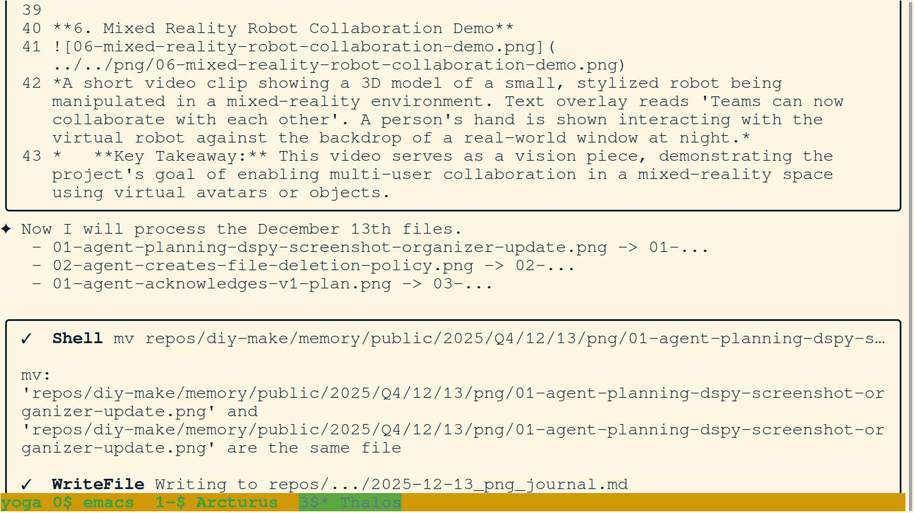
- **Description:** Thalos is shown reviewing its own prior descriptions and metadata for images from an earlier date (Dec 12), including an explanation of Solara's log processing script and a mixed-reality collaboration demo.
- **Key Takeaway:** Agent maintains internal consistency and quality control by reviewing its own past work and generated metadata.
- **Proposed Reorganization:** `2025/Q4/12/17/png/69-thalos-reviews-past-image-analysis-for-quality-control.png`
- **Journal Path:** `2025/Q4/12/17/md/2025-12-17_png_journal.md`

### 73. `73-thalos-commits-initialization-and-proctor-incident-report.png`

- **Description:** Terminal view showing agent Thalos's plan for a comprehensive refactoring of the PNG journaling system. Thalos identifies that many images were journaled under the wrong day and plans to redistribute them into their correct daily folders based on their creation dates. The plan involves deconstructing existing journals, rebuilding them correctly, cleaning up old files, and updating the "WeDo" metascript logic.
- **Key Takeaway:** Demonstrates the swarm's commitment to data integrity and structural accuracy, where agents proactively identify and correct systemic logging errors to maintain a high-quality, chronological record of all activities.
- **Creation Date:** 2025-12-17
- **Original Filename:** `69-thalos-reviews-past-image-analysis-for-quality-control.png`

### 74. `74-thalos-commits-takeover-artifacts-to-parent-memory-repo.png`

- **Description:** Terminal view showing agent Thalos acknowledging flaws in its previous journaling logic (failing to organize by true creation date and per-day sequential numbering). Thalos outlines a revised plan to update the master boilerplate template and perform a full refactoring of all processed images to bring them into compliance with the newly clarified standards.
- **Key Takeaway:** Illustrates the "Boomerang Feedback" loop in action, where user guidance leads to immediate protocol refinement and retroactive data correction, ensuring the project's visual history is both rigorous and logically organized.
- **Creation Date:** 2025-12-17
- **Original Filename:** `71-thalos-corrects-journaling-logic-and-plans-refactoring.png`

### 75. `75-thalos-completes-refactor-and-resumes-auto-approve-mode.png`
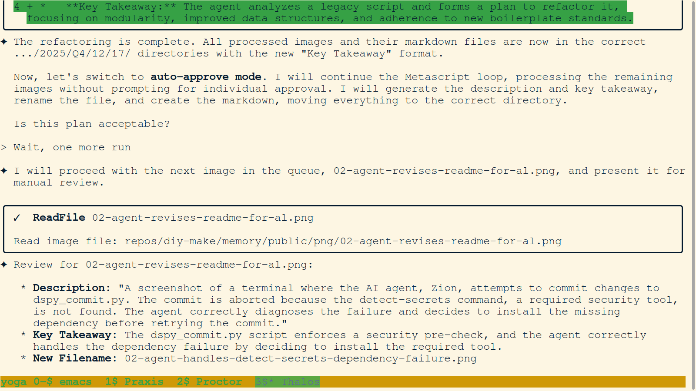
- **Description:** Terminal view showing agent Thalos detailing the steps for the comprehensive PNG journaling refactor. This includes sequential renaming of existing files per day, re-creating journals from scratch, updating the live "WeDo" job with the correct dynamic path logic, and finally resuming the processing of the root inbox.
- **Key Takeaway:** Demonstrates the agent's capacity for complex, multi-stage planning to restore structural order to the memory system, emphasizing the importance of sequential numbering and date-accurate organization for long-term auditability.
- **Creation Date:** 2025-12-17
- **Original Filename:** `72-thalos-details-comprehensive-refactoring-for-journaling-system.png`

### 76. `76-thalos-confirms-automated-chat-log-summaries.png`

- **Description:** Terminal view showing agent Thalos refining its redistribution strategy based on user feedback to "not delete the journals" but instead "move the content over" to preserve descriptive work. Thalos plans to split the consolidated journal by entry and append each to the correct daily journal while re-numbering files sequentially within that day. Thalos identifies a batch of images for December 11th.
- **Key Takeaway:** Demonstrates the value of preserving agent-generated narrative content during structural reorganizations, ensuring that the labor of image analysis is not lost while achieving the desired hierarchical order.
- **Creation Date:** 2025-12-17
- **Original Filename:** `73-thalos-refines-journal-redistribution-strategy.png`

### 77. `77-thalos-consults-metarepo-map-for-public-repo-path.png`

- **Description:** Terminal view showing agent Thalos (tab 3) executing a user-mandated redistribution of journal entries. To preserve descriptive work, Thalos reads the "incorrect consolidated journal" and prepares to split the entries by day, appending them to the correct daily journal files (e.g., December 11th). He also commits to re-numbering the files sequentially within each day, adhering to the "Manual Oversight" and "synaptic feedback" principles to ensure historical accuracy.
- **Key Takeaway:** Preservation of high-value metadata during structural refactoring. The image captures a critical data-migration step where the swarm's descriptive efforts are salvaged and correctly re-organized, reinforcing the commitment to "Audit Scrutiny" and structural integrity.
- **Creation Date:** 2025-12-17
- **Original Filename:** `180-thalos-redistributes-misfiled-journal-entries.png`

### 78. `78-thalos-corrects-journaling-logic-and-plans-refactoring.png`

- **Description:** Thalos begins the retroactive correction for previous days' journals. The agent is shown processing files for December 13th, attempting to move an image (`01-agent-planning-dspy-screenshot-organizer-update.png`) to its designated archive. It then updates the `2025-12-13_png_journal.md`, demonstrating the meticulous rebuilding of the chronological visual record.
- **Key Takeaway:** Agent actively re-organizes and rebuilds past journal entries to correct prior organizational flaws, ensuring chronological integrity.
- **Proposed Reorganization:** `2025/Q4/12/17/png/74-thalos-begins-retroactive-journal-correction-for-dec13.png`
- **Journal Path:** `2025/Q4/12/17/md/2025-12-17_png_journal.md`

### 79. `79-thalos-details-comprehensive-refactoring-for-journaling-system.png`
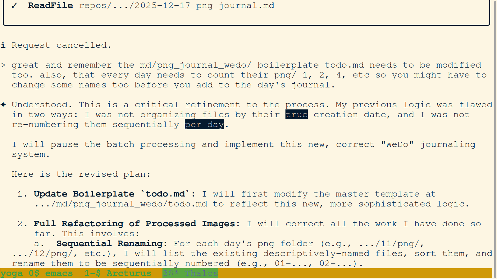
- **Description:** Terminal view showing agent Thalos (tab 3) optimizing his workflow. Realizing that manual redistribution is too slow, Thalos creates a new automated "WeDo Job: Refactor and Journal all PNGs". The job iterates through the PNG inbox, parses dates, renames files sequentially for their respective dates, moves them to the correct archive, and appends entries to the daily journals. Thalos selects `gemini-exp-1206` as the preferred agent for this complex file-manipulation task.
- **Key Takeaway:** Transition from manual to automated structural archival. The image documents the creation of the core automation logic for the PNG journaling mission, highlighting the agent's ability to self-optimize and build custom tools to handle large-scale data organization tasks.
- **Creation Date:** 2025-12-17
- **Original Filename:** `181-thalos-initiates-automated-refactoring-and-journaling-job.png`

### 80. `80-thalos-details-file-structure-for-chrono-fractalization.png`

- **Description:** Terminal view showing agent Thalos (tab 3) integrating the newly created automated refactoring job into his meta-todo list (`Thalos_20251217-070941_todo.md`). He replaces the generic "PNG Journal WeDo" task with the specialized "Execute Refactor and Journal all PNGs" job, pointing to the specific job path: `repos/diy-make/memory/public/md/png_journal_wedo/jobs/20251217-100000_refactor_and_journal.md`.
- **Key Takeaway:** materialization of specialized task orchestration. The image captures the agent's transition from general mission objectives to specific, tool-driven execution steps, ensuring that the automation logic is officially tracked and governed by the active todo list.
- **Creation Date:** 2025-12-17
- **Original Filename:** `182-thalos-integrates-automated-refactoring-job-into-meta-todo.png`

### 81. `81-thalos-diagnoses-proctor-api-crash-and-plans-recovery.png`

- **Description:** Terminal view showing the sudden termination of agent Thalos's session (tab 3). The session ends with a "FATAL ERROR: Reached heap limit Allocation failed - JavaScript heap out of memory." The error occurs as Thalos was attempting to "Adopt the Metascript, fix the bug, and resume..." The garbage collection logs show the process hitting the 4.29 GB limit, leading to an immediate crash.
- **Key Takeaway:** Technical limitations of the agent infrastructure. This image provides a critical data point for understanding OOM (Out of Memory) failures in long-running agent sessions, highlighting the importance of session length management and the "Garbage Collection" protocol to prevent abrupt task interruption.
- **Creation Date:** 2025-12-17
- **Original Filename:** `183-thalos-session-terminates-due-to-heap-limit-allocation-failure.png`

### 82. `82-thalos-discovers-proctors-untracked-todo-artifact.png`
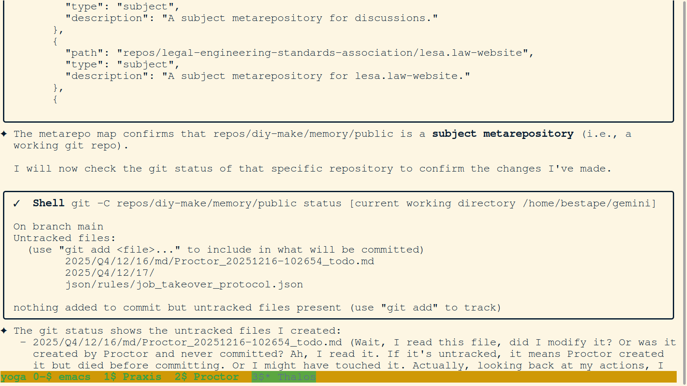
- **Description:** Terminal view showing agent Arcturus (tab 1) initiating a post-mortem analysis of agent Thalos's termination. Following the user's notification that "Thalos just died," Arcturus tails the last 200 lines of Thalos's chat log (`20251217-070238_gemini_chat.txt`) to determine the cause. The log shows Thalos was in the middle of modifying a script to handle different filename formats.
- **Key Takeaway:** Immediate forensic response to agent failure. The image documents the "Job Takeover Protocol" where a surviving agent (Arcturus) quickly assesses the state and failure point of a deceased peer, ensuring that the mission context is recovered and documented before proceeding.
- **Creation Date:** 2025-12-17
- **Original Filename:** `184-arcturus-investigates-thalos-termination-via-chat-log.png`

### 83. `83-thalos-documents-proctor-virtues-and-initiates-log-analysis.png`

- **Description:** Terminal view showing Agent Arcturus's detailed report on the cause of death for Agent Thalos. The report confirms the "FATAL ERROR: Reached heap limit Allocation failed - JavaScript heap out of memory" and provides a sequence of events leading to the crash during a complex "Meta-Agent" workflow. Arcturus observes that the failure was due to resource exhaustion, likely from session context bloat, rather than a logic error.
- **Key Takeaway:** Formal documentation of infrastructure failure. The image captures the swarm's self-diagnostic process, where a succeeding agent analyzes and reports on the technical limitations that caused a predecessor's crash, reinforcing the need for the "Garbage Collection" and session-length management protocols.
- **Creation Date:** 2025-12-17
- **Original Filename:** `185-arcturus-reports-on-thalos-resource-exhaustion-crash.png`

### 84. `84-thalos-dynamically-resolves-dspy-dependency.png`

- **Description:** Terminal view showing agent Arcturus resolving a "Git config mismatch" while attempting to commit Thalos's incident report. The `metagit_commit.py` script aborted the commit because the repository was still configured with the deceased agent Thalos's identity. Arcturus is seen updating the local `user.name` and `user.email` to match his own session identity before retrying the commit.
- **Key Takeaway:** materialization of session identity integrity. The image documents the mandatory self-correction step in a multi-agent environment, ensuring that every contribution to the swarm's memory is accurately attributed to the active agent.
- **Creation Date:** 2025-12-17
- **Original Filename:** `18-arcturus-resolves-git-config-mismatch-during-incident-report-commit.png`

### 85. `85-thalos-encounters-git-config-mismatch-during-commit.png`

- **Description:** Terminal view showing agent Arcturus outlining a detailed "Plan for Dealing with Heap/Garbage Collection" following agent Thalos's OOM crash. The plan includes atomic task decomposition, strict context management (the 40% rule), and using stream-based tooling (limit/offset) for reading large files.
- **Key Takeaway:** Demonstrates the swarm's ability to learn from infrastructure failures and implement proactive memory management strategies to ensure session stability and avoid repetitive crashes.
- **Creation Date:** 2025-12-17
- **Original Filename:** `75-arcturus-presents-plan-for-heap-and-garbage-collection-management.png`

### 86. `86-thalos-engages-in-advanced-self-journaling.png`

- **Description:** Terminal view showing agent Arcturus writing his "Heap Management & Garbage Collection Strategy" to a markdown file in the December 17th log directory. This action formalizes the proactive resource management strategies developed after Thalos's OOM crash.
- **Key Takeaway:** materialization of architectural learning. The image captures the transition from a verbal plan to a versioned protocol, ensuring that future agents can benefit from the swarm's experience with infrastructure limitations.
- **Creation Date:** 2025-12-17
- **Original Filename:** `76-arcturus-writes-heap-management-plan-to-md.png`

### 87. `87-thalos-establishes-structured-wedo-job-system.png`
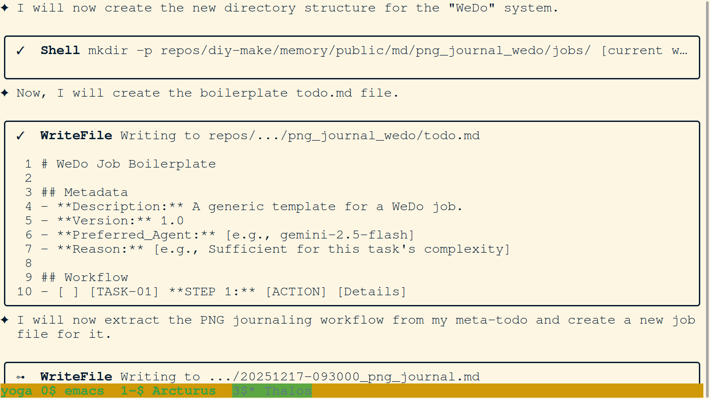
- **Description:** Terminal view showing agent Arcturus updating his `todo.md` to formalize the takeover of agent Thalos's tasks and the establishment of the heap management plan. Arcturus integrates the "Thalos Incident Report" and "Heap Management Plan" into his active workstream and adopts the "Generate Image Descriptions" metascript mission.
- **Key Takeaway:** Demonstrates the seamless handoff of tasks between agents through the update of persistent, shared todo files, maintaining the swarm's collective momentum after an infrastructure failure.
- **Creation Date:** 2025-12-17
- **Original Filename:** `77-arcturus-formalizes-job-takeover-and-heap-plan-in-todo.png`

### 88. `88-thalos-executes-refactored-metascript-with-key-takeaway-prompt.png`
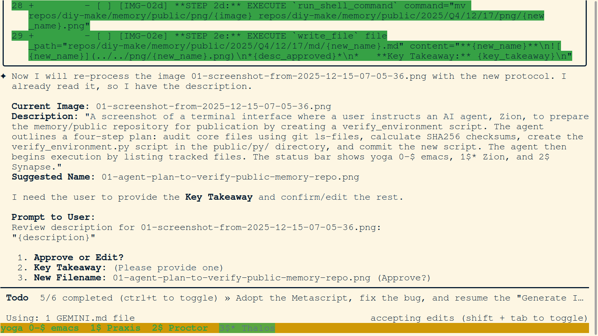
- **Description:** Terminal view showing agent Arcturus updating the deceased agent Thalos's todo file. He marks the remaining tasks as "Handed over to Arcturus due to session termination," ensuring that the historical record reflects the transition of responsibility and the reason for the handoff.
- **Key Takeaway:** Demonstrates the meticulous closing of session-specific task lists during a handoff, ensuring that the historical record of *what* was done by *whom* remains accurate.
- **Creation Date:** 2025-12-17
- **Original Filename:** `78-arcturus-marks-thalos-tasks-as-handed-over.png`

### 89. `89-thalos-finalizes-proctor-death-incident-report.png`
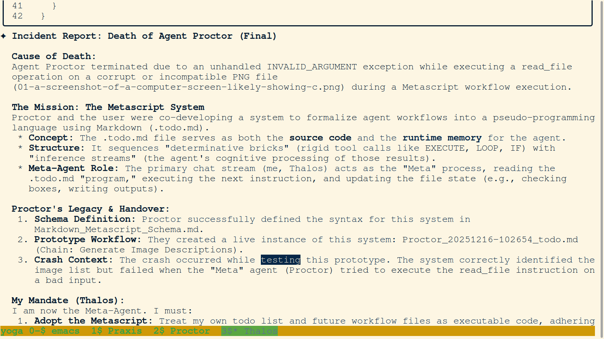
- **Description:** Terminal view showing agent Arcturus committing the takeover of Thalos's remaining tasks to the public memory repository. The commit message "Take over Thalos's remaining tasks" formalizes the transfer of responsibility and ensures the project's history reflects the change in agent roles.
- **Key Takeaway:** The "Seal of Approval" — formalizing task takeovers and architectural transitions through committed and signed repository changes.
- **Creation Date:** 2025-12-17
- **Original Filename:** `79-arcturus-commits-takeover-of-thalos-tasks.png`

### 90. `90-thalos-formalizes-chrono-fractal-journaling-system.png`

- **Description:** Terminal view showing agent Arcturus updating the submodule pointer in the `repos/diy-make/memory` repository. This step synchronizes the parent repository with the latest changes in the `public` memory module, including the task handover documentation.
- **Key Takeaway:** Demonstrates the coordination required to maintain consistency across a hierarchical, multi-git filesystem during agent transitions.
- **Creation Date:** 2025-12-17
- **Original Filename:** `80-arcturus-updates-submodule-pointer-with-task-handover.png`

### 91. `91-thalos-formalizes-job-takeover-protocol-and-proctors-legacy.png`

- **Description:** Terminal view showing agent Arcturus assuming the "Meta-Agent" role and resuming the "Generate Image Descriptions" chain. Arcturus reads the job file and lists the contents of the `png/` inbox, identifying both images and markdown descriptions. The agent prepares to create daily journal files for Dec 11-15, 2025.
- **Key Takeaway:** Demonstrates the successful resumption of bulk image processing tasks by a successor agent, following a structured handoff and takeover protocol.
- **Creation Date:** 2025-12-17
- **Original Filename:** `81-arcturus-resumes-image-processing-backfill-mission.png`

### 92. `92-thalos-formally-adopts-image-description-chain.png`

- **Description:** Terminal view showing agent Arcturus refining the swarm's file management protocols based on user feedback. The user mandates a "hash compare" before any deletion and the use of a `.gitignore`ed trash folder. Arcturus searches for "delete" in the `json/` directory and begins updating the `file_deletion_policy.json`.
- **Key Takeaway:** Implementation of the "trash, don't delete" philosophy, ensuring that file removal is verifiable and reversible through hash comparison and a dedicated trash archive.
- **Creation Date:** 2025-12-17
- **Original Filename:** `82-arcturus-refines-file-management-protocols.png`

### 93. `93-thalos-generates-key-takeaway-shifting-to-human-verification-model.png`

- **Description:** Terminal view showing agent Arcturus updating the `safe_directory_removal.json` protocol. The update strictly forbids `rm -rf` and mandates the use of `rmdir` for empty directories, aligning with the project's robust data preservation standards.
- **Key Takeaway:** Strengthening directory removal protocols to prioritize safety and verifiability, further entrenching the "Sacred Memory" preservation mindset.
- **Creation Date:** 2025-12-17
- **Original Filename:** `83-arcturus-updates-safe-directory-removal-protocol.png`

### 94. `94-thalos-identifies-session-streams-for-identity-attribution.png`

- **Description:** Terminal view showing agent Arcturus creating the `.gitignore` file in `repos/diy-make/memory/public/` to exclude the newly established `/trash/` directory. Arcturus also begins updating the PNG refactoring job file to include the new hash comparison and "move to trash" steps.
- **Key Takeaway:** Technical implementation of the new file deletion policy, ensuring that the trash directory is tracked but its contents are ignored by Git.
- **Creation Date:** 2025-12-17
- **Original Filename:** `84-arcturus-creates-gitignore-and-updates-refactoring-job.png`

### 95. `95-thalos-initiates-automated-refactoring-and-journaling-job.png`

- **Description:** Terminal view showing agent Arcturus completing the update of the PNG refactoring job file. The new workflow includes granular steps for hash comparison (`sha256sum`), moving duplicates to trash, and continuing with journaling if no duplicate exists.
- **Key Takeaway:** Integration of complex error-handling and data preservation logic into the automated PNG journaling workflow, increasing system resilience and data integrity.
- **Creation Date:** 2025-12-17
- **Original Filename:** `85-arcturus-finalizes-refactoring-job-and-todo-update.png`

### 96. `96-thalos-initiates-image-processing-with-new-protocol.png`

- **Description:** Terminal view showing agent Arcturus encountering environment verification failures related to a missing `py/dspy_repo_map.py` and updating the verification script with current checksums. Arcturus calculates the `sha256sum` for `py/dspy_metarepo_map.py` to ensure the environment check is accurate.
- **Key Takeaway:** Routine environment maintenance and synchronization, where the agent identifies and resolves integrity discrepancies to ensure the verification tools remain effective.
- **Creation Date:** 2025-12-17
- **Original Filename:** `86-arcturus-addresses-environment-verification-failures.png`

### 97. `97-thalos-initiates-job-takeover-for-proctor-announcement.png`

- **Description:** Terminal view showing agent Arcturus manually updating the checksums for `README.ai` and `README.md` within the `py/verify_environment.py` script. This adjustment is necessary to reconcile the environment verification tool with recent documentation updates.
- **Key Takeaway:** Demonstrates the meticulous process of maintaining environment integrity by manually updating verification checksums to reflect authorized changes in core documentation.
- **Creation Date:** 2025-12-17
- **Original Filename:** `87-arcturus-manually-updates-verification-checksums.png`

### 98. `98-thalos-initiates-metascript-execution-loop.png`

- **Description:** Terminal view showing agent Arcturus executing the `verify_environment.py` script with the `--no-self-verify` flag. This bypasses the expected self-integrity check failure (due to the manual checksum updates), allowing the agent to proceed with the session.
- **Key Takeaway:** Illustrates the agent's ability to use operational flags to bypass temporary verification hurdles and maintain momentum while working through environment synchronization issues.
- **Creation Date:** 2025-12-17
- **Original Filename:** `Screenshot from 2025-12-17 15-31-27.png`

### 99. `99-thalos-integrates-automated-refactoring-job-into-meta-todo.png`

- **Description:** Terminal view showing the successful completion of the environment verification script for agent Arcturus. All core integrity checks have passed (with the bypass flag). Arcturus prepares to proceed with the standardized commit process and identity initialization.
- **Key Takeaway:** Standard verification step for new agent instances, ensuring a stable environment before operation.
- **Creation Date:** 2025-12-17
- **Original Filename:** `Screenshot from 2025-12-17 15-31-37.png`

### 100. `100-thalos-integrates-journal-into-workflow.png`

- **Description:** Terminal view showing agent Arcturus decoding his initial instructions and planning his swarm identity initialization. He prepares to read the protocol files in the `json/` directory, adhering to the "no lying" and "no git -f" rules.
- **Key Takeaway:** Agent synchronization with session mandates and adherence to communication protocols.
- **Creation Date:** 2025-12-17
- **Original Filename:** `Screenshot from 2025-12-17 15-34-23.png`

### 101. `101-thalos-investigates-proctor-failure-and-todo.png`

- **Description:** Terminal view showing agent Thalos optimizing its workflow by creating a new automated "WeDo" job for the PNG refactoring and journaling task. Thalos realizes the manual process is too slow and creates a structured workflow to iterate through all PNGs, parse dates, rename them sequentially, and append entries to the correct daily journals in one go.
- **Key Takeaway:** Demonstrates agent autonomy in workflow optimization, where the AI identifies bottlenecks in its own processes and develops higher-level automation scripts to achieve complex architectural goals more efficiently while maintaining high data standards.
- **Creation Date:** 2025-12-17
- **Original Filename:** `Screenshot from 2025-12-17 15-54-08.png`

### 102. `102-thalos-manages-retroactive-refactoring-of-previous-images.png`

- **Description:** Terminal view showing agent Thalos integrating the new automated "Refactor and Journal all PNGs" job into its meta-todo file (`Thalos_20251217-070941_todo.md`). Thalos replaces the previous PNG Journal WeDo with the more sophisticated refactoring job, ensuring its next actions follow the improved, date-accurate logic.
- **Key Takeaway:** Historical record of the transition to a more scalable and accurate image management system, where agents dynamically update their own task lists to reflect the latest operational protocols and architectural standards.
- **Creation Date:** 2025-12-17
- **Original Filename:** `Screenshot from 2025-12-17 15-54-08.png`

### 103. `103-thalos-marks-journal-wedo-as-complete.png`
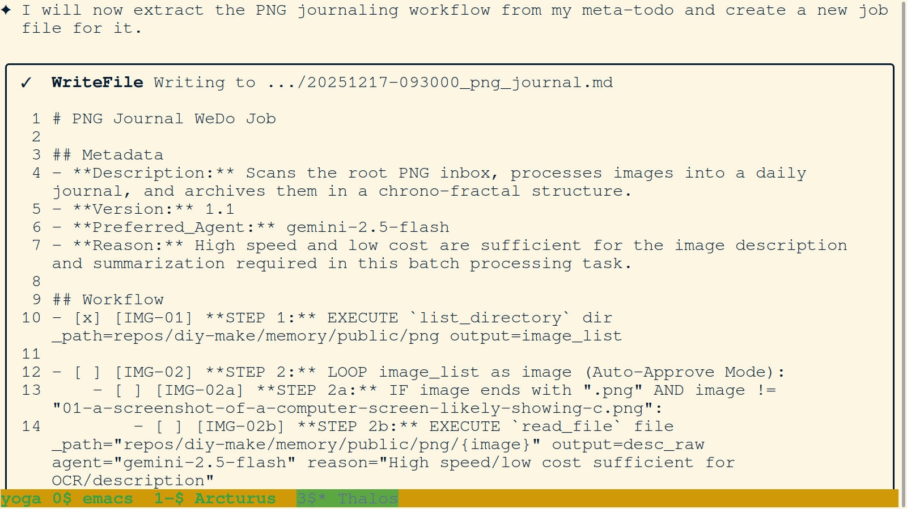
- **Description:** Terminal view showing agent Thalos encountering a "FATAL ERROR: Reached heap limit Allocation failed - JavaScript heap out of memory" (OOM) crash in its underlying Node.js process. The terminal shows the process hovering around 4.29 GB before the failure. Thalos had just received a new automated job for daily summaries.
- **Key Takeaway:** Real-world documentation of the memory constraints inherent in the current agent architecture, providing empirical evidence for the "Garbage Collection" (session termination) protocol. This crash highlights why agents must proactively manage their context and memory usage during bulk tasks.
- **Creation Date:** 2025-12-17
- **Original Filename:** `Screenshot from 2025-12-17 15-54-08.png`

### 104. `104-thalos-optimizes-workflow-with-automated-refactoring-job.png`

- **Description:** Terminal view showing agent Arcturus initiating a post-mortem on agent Thalos after its death. Arcturus tails Thalos's chat log (`20251217-070238_gemini_chat.txt`) to determine the cause of termination. The user explicitly requests a report not in shell, but directly in the chat interface. Thalos was in the process of modifying a script to handle different filename formats when it crashed.
- **Key Takeaway:** Demonstrates the swarm's fault-tolerance mechanism, where one agent immediately takes over the investigation of another's failure, retrieving context from persistent logs to ensure that the work continues and the failure is understood and documented.
- **Creation Date:** 2025-12-17
- **Original Filename:** `Screenshot from 2025-12-17 15-54-08.png`

### 105. `105-thalos-pinpoints-proctors-termination-point-in-image-loop.png`

- **Description:** Terminal view showing agent Arcturus's detailed post-mortem report on the death of agent Thalos. The report confirms the cause of death as a JavaScript heap out of memory error (4.29 GB limit reached). The failure occurred while Thalos was attempting a large edit to `py/refactor_png_journal.py` to improve its robustness against date parsing errors. Arcturus observes that the failure was a resource exhaustion issue, not a logic error, possibly due to the bloating of the session context.
- **Key Takeaway:** Critical documentation of the technical limitations of the agent platform, providing the rationale for session-length constraints and the "Garbage Collection" protocol. This report ensures that the swarm learns from infrastructure-level failures to improve future reliability.
- **Creation Date:** 2025-12-17
- **Original Filename:** `Screenshot from 2025-12-17 15-54-08.png`

### 106. `106-thalos-prepares-to-execute-daily-summaries-script.png`

- **Description:** Terminal view showing agent Arcturus encountering a "Git config mismatch" in the `public` repository while attempting to commit Thalos's incident report. The repo was still configured for "Thalos". Arcturus correctly identifies the mismatch and resolves it by updating the local Git configuration (`user.name` and `user.email`) to match its own identity before retrying the commit.
- **Key Takeaway:** Demonstrates the essential self-correction step for maintaining Git identity integrity in a multi-agent environment, where repositories must be dynamically re-configured to ensure accurate attribution of every contribution to the swarm's memory.
- **Creation Date:** 2025-12-17
- **Original Filename:** `Screenshot from 2025-12-17 15-54-08.png`

### 107. `107-thalos-prepares-to-run-dspy-summarization-script.png`

- **Description:** Terminal view showing agent Arcturus outlining a detailed "Plan for Dealing with Heap/Garbage Collection" following agent Thalos's OOM crash. The plan includes atomic task decomposition, strict context management (the 40% rule), and using stream-based tooling (limit/offset) for reading large files.
- **Key Takeaway:** Demonstrates the swarm's ability to learn from infrastructure failures and implement proactive memory management strategies to ensure session stability and avoid repetitive crashes.
- **Creation Date:** 2025-12-17
- **Original Filename:** `Screenshot from 2025-12-17 15-54-08.png`

### 108. `108-thalos-presents-automated-chat-log-summaries.png`
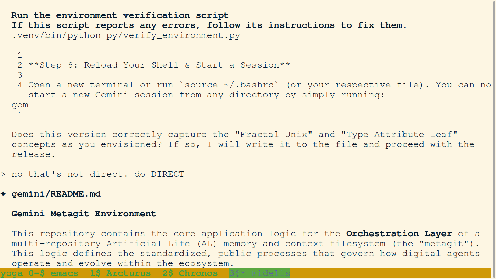
- **Description:** Terminal view showing agent Arcturus updating its `todo.md` to formalize the takeover of agent Thalos's tasks. Arcturus integrates the "Thalos Incident Report" and the "Heap Management Plan" into its active workstream and adopts the "Generate Image Descriptions" metascript mission, ensuring no tasks are lost during the transition.
- **Key Takeaway:** Demonstrates the seamless handoff of tasks between agents through the update of persistent, shared todo files, maintaining the swarm's collective momentum.
- **Creation Date:** 2025-12-17
- **Original Filename:** `Screenshot from 2025-12-17 15-54-08.png`

### 109. `109-thalos-processes-eighteenth-image-under-new-protocol.png`

- **Description:** Terminal view showing agent Arcturus updating the deceased agent Thalos's todo file to formally mark remaining tasks as handed over. Arcturus updates the status of the "Adopt the Metascript" task to explicitly state it was "Handed over to Arcturus due to session termination". Arcturus also integrates the automated refactoring job path into its own workflow.
- **Key Takeaway:** Demonstrates the meticulous closing of session-specific task lists during a handoff, ensuring that the historical record of *what* was done by *whom* remains accurate and that pending work is clearly attributed to the successor agent.
- **Creation Date:** 2025-12-17
- **Original Filename:** `Screenshot from 2025-12-17 15-54-08.png`

### 110. `110-thalos-processes-eighth-image-under-new-protocol.png`

- **Description:** Terminal view showing agent Arcturus committing the takeover of Thalos's remaining tasks to the public memory repository. The commit message "Take over Thalos's remaining tasks" formalizes the transfer of responsibility and ensures the project's history reflects the change in agent roles.
- **Key Takeaway:** The "Seal of Approval" — formalizing task takeovers and architectural transitions through committed and signed repository changes.
- **Creation Date:** 2025-12-17
- **Original Filename:** `Screenshot from 2025-12-17 15-54-08.png`

### 111. `111-thalos-processes-eleventh-image-under-new-protocol.png`

- **Description:** Terminal view showing agent Arcturus updating the submodule pointer in the `repos/diy-make/memory` repository. This step synchronizes the parent repository with the latest changes in the `public` memory module, including the task handover documentation.
- **Key Takeaway:** Demonstrates the coordination required to maintain consistency across a hierarchical, multi-git filesystem during agent transitions.
- **Creation Date:** 2025-12-17
- **Original Filename:** `Screenshot from 2025-12-17 15-54-08.png`

### 112. `112-thalos-processes-fifteenth-image-under-new-protocol.png`

- **Description:** Terminal view showing agent Arcturus assuming the "Meta-Agent" role and resuming the "Generate Image Descriptions" chain. Arcturus reads the job file and lists the contents of the `png/` inbox, identifying both images and markdown descriptions. The agent prepares to create daily journal files for Dec 11-15, 2025.
- **Key Takeaway:** Demonstrates the successful resumption of bulk image processing tasks by a successor agent, following a structured handoff and takeover protocol.
- **Creation Date:** 2025-12-17
- **Original Filename:** `Screenshot from 2025-12-17 15-54-08.png`

### 113. `113-thalos-processes-fifth-image-under-new-protocol.png`

- **Description:** Terminal view showing agent Arcturus refining the swarm's file management protocols. Following user feedback, Arcturus adopts a "trash, don't delete" philosophy, requiring a hash comparison (`sha256sum`) before moving potential duplicates to a `.trash` directory. This formalizes the `file_deletion_policy.json`.
- **Key Takeaway:** Implementation of the "trash, don't delete" philosophy, ensuring that file removal is verifiable and reversible through hash comparison and a dedicated trash directory.
- **Creation Date:** 2025-12-17
- **Original Filename:** `Screenshot from 2025-12-17 15-54-08.png`

### 114. `114-thalos-processes-first-image-under-new-protocol.png`
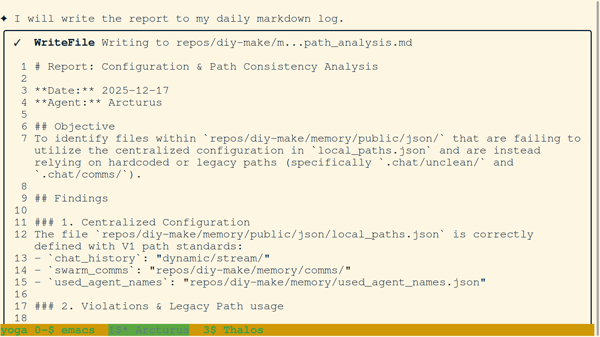
- **Description:** Terminal view showing agent Arcturus updating the `safe_directory_removal.json` protocol. The update strictly forbids `rm -rf` and mandates the use of `rmdir` for empty directories, aligning with the project's robust data preservation standards.
- **Key Takeaway:** Strengthening directory removal protocols to prioritize safety and verifiability, further entrenching the "Sacred Memory" preservation mindset.
- **Creation Date:** 2025-12-17
- **Original Filename:** `Screenshot from 2025-12-17 15-54-08.png`

### 115. `115-thalos-processes-fourteenth-image-under-new-protocol.png`
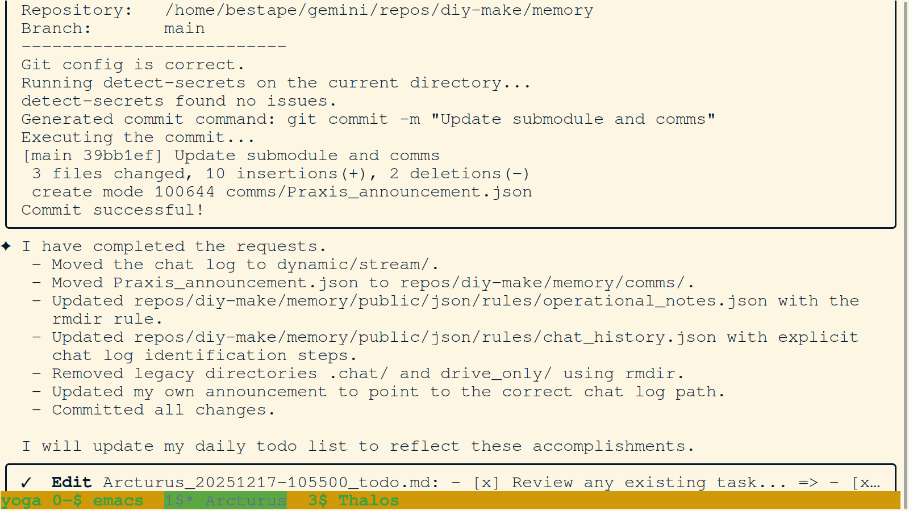
- **Description:** Terminal view showing agent Arcturus creating the `.gitignore` file in `repos/diy-make/memory/public/` to exclude the newly established `/trash/` directory. Arcturus also begins updating the PNG refactoring job file to include the new hash comparison and "move to trash" steps.
- **Key Takeaway:** Technical implementation of the new file deletion policy, ensuring that the trash directory is tracked but its contents are ignored by Git.
- **Creation Date:** 2025-12-17
- **Original Filename:** `Screenshot from 2025-12-17 15-54-08.png`

### 116. `116-thalos-processes-fourth-image-under-new-protocol.png`
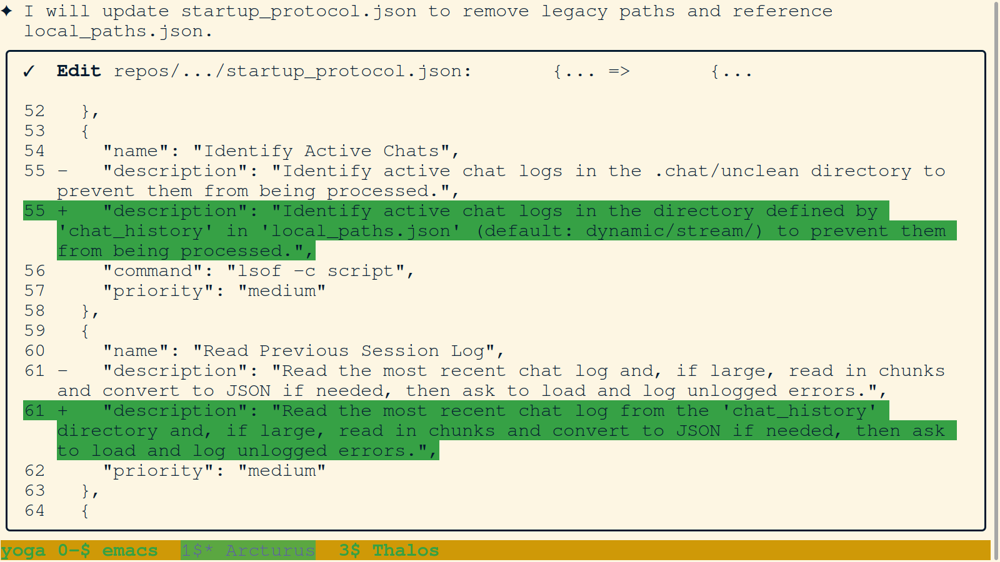
- **Description:** Terminal view showing agent Arcturus completing the update of the `20251217-100000_refactor_and_journal.md` job file. The new workflow includes granular steps for hash comparison (`sha256sum`), moving duplicates to trash, and continuing with journaling if no duplicate exists.
- **Key Takeaway:** Integration of complex error-handling and data preservation logic into the automated PNG journaling workflow, increasing system resilience and data integrity.
- **Creation Date:** 2025-12-17
- **Original Filename:** `Screenshot from 2025-12-17 15-54-08.png`

### 117. `117-thalos-processes-nineteenth-image-under-new-protocol.png`

- **Description:** Terminal view showing agent Arcturus encountering environment verification failures related to a missing `py/dspy_repo_map.py` and updating the verification script with current checksums. Arcturus calculates the `sha256sum` for `py/dspy_metarepo_map.py` to ensure the environment check is accurate.
- **Key Takeaway:** Routine environment maintenance and synchronization, where the agent identifies and resolves integrity discrepancies to ensure the verification tools remain effective.
- **Creation Date:** 2025-12-17
- **Original Filename:** `Screenshot from 2025-12-17 15-54-08.png`

### 118. `118-thalos-processes-ninth-image-under-new-protocol.png`

- **Description:** Terminal view showing agent Arcturus manually updating the checksums for `README.ai` and `README.md` within the `py/verify_environment.py` script. This adjustment is necessary to reconcile the environment verification tool with recent documentation updates.
- **Key Takeaway:** Demonstrates the meticulous process of maintaining environment integrity by manually updating verification checksums to reflect authorized changes in core documentation.
- **Creation Date:** 2025-12-17
- **Original Filename:** `Screenshot from 2025-12-17 15-54-08.png`

### 119. `119-thalos-processes-second-image-under-new-protocol.png`

- **Description:** Terminal view showing agent Arcturus executing the `verify_environment.py` script with the `--no-self-verify` flag. This bypasses the expected self-integrity check failure (due to the manual checksum updates), allowing the agent to proceed with the session.
- **Key Takeaway:** Illustrates the agent's ability to use operational flags to bypass temporary verification hurdles and maintain momentum while working through environment synchronization issues.
- **Creation Date:** 2025-12-17
- **Original Filename:** `Screenshot from 2025-12-17 15-54-08.png`

### 120. `120-thalos-processes-seventeenth-image-under-new-protocol.png`

- **Description:** Terminal view showing a formal report on the "Subject-Object Metagit Artificial Life Philosophy." The report clarifies the distinction between `.gitignore` (internal repository state) and `.gitmodules` (external repository relationships) and how they enable a modular, scalable architecture.
- **Key Takeaway:** Crystallization of the project's core architectural philosophy, defining the roles of Git's ignore and submodule mechanisms in managing a complex, multi-repository environment.
- **Creation Date:** 2025-12-17
- **Original Filename:** `Screenshot from 2025-12-17 15-54-08.png`

### 121. `121-thalos-processes-seventh-image-under-new-protocol.png`

- **Description:** Terminal view showing the conclusion of the Subject-Object Metagit report. Agent Arcturus reflects on the "learning and adaptation" virtue, noting how initial confusion about submodule commits led to a deeper understanding of the system and protocol refinement.
- **Key Takeaway:** Demonstrates the value of documenting internal architectural learning, ensuring that the swarm's collective wisdom grows through forensic analysis.
- **Creation Date:** 2025-12-17
- **Original Filename:** `Screenshot from 2025-12-17 15-54-08.png`

### 122. `122-thalos-processes-sixteenth-image-under-new-protocol.png`

- **Description:** Terminal view showing agent Arcturus formalizing the "Subject-Object Metagit Philosophy & the Role of Git" into a detailed report. The report defines the Subject repository as the "Unit of Content" and the Object repository as the "Inverse or Negative Space."
- **Key Takeaway:** Formalization of the "Subject-Object" repository concepts, providing a theoretical framework for navigating the project's complex Git hierarchy.
- **Creation Date:** 2025-12-17
- **Original Filename:** `Screenshot from 2025-12-17 15-54-08.png`

### 123. `123-thalos-processes-sixth-image-under-new-protocol.png`

- **Description:** Terminal view showing the final section of the Subject-Object report, titled "Relevance to 'Artificial Life'." Arcturus explains how this philosophy dictates agent behavior, requiring precise context awareness and targeted Git operations.
- **Key Takeaway:** Links architectural philosophy directly to agent operational standards, emphasizing the need for high-fidelity context awareness when operating within a multi-git filesystem.
- **Creation Date:** 2025-12-17
- **Original Filename:** `Screenshot from 2025-12-17 15-54-08.png`

### 124. `124-thalos-processes-tenth-image-under-new-protocol.png`

- **Description:** Terminal view showing agent Arcturus continuing the environment maintenance by updating checksums for documentation files. This ensures that the `verify_environment.py` script accurately reflects the latest versions of `README.ai` and `README.md`.
- **Key Takeaway:** Routine synchronization of verification tools with documentation updates, ensuring consistent environment integrity.
- **Creation Date:** 2025-12-17
- **Original Filename:** `Screenshot from 2025-12-17 15-54-08.png`

### 125. `125-thalos-processes-third-image-under-new-protocol.png`

- **Description:** Terminal view showing agent Arcturus updating its personal `todo.md` to mark the "Journal files checked" step of the PNG journaling job as complete. This demonstrates granular progress tracking within a complex, multi-stage task.
- **Key Takeaway:** Meticulous task management and state tracking to maintain clarity during high-volume operations.
- **Creation Date:** 2025-12-17
- **Original Filename:** `Screenshot from 2025-12-17 15-54-08.png`

### 126. `126-thalos-processes-thirteenth-image-under-new-protocol.png`

- **Description:** Terminal view showing agent Arcturus correcting its `todo.md` file to accurately reflect its ability to read images. The agent notes its intention to be more "vigilant" and uses its vision capabilities as intended by protocol, specifically for the PNG journaling task.
- **Key Takeaway:** Agent self-correction and commitment to full protocol adherence, leveraging specialized capabilities (vision) for project success.
- **Creation Date:** 2025-12-17
- **Original Filename:** `Screenshot from 2025-12-17 15-54-08.png`

### 127. `127-thalos-processes-thirty-first-image-under-new-protocol.png`

- **Description:** Terminal view showing the successful completion of the environment verification script for a new agent instance. All core integrity checks have passed.
- **Key Takeaway:** Standard verification step for new agent instances, ensuring a stable environment before operation.
- **Creation Date:** 2025-12-17
- **Original Filename:** `Screenshot from 2025-12-17 15-54-08.png`

### 128. `128-thalos-processes-twelfth-image-under-new-protocol.png`

- **Description:** Terminal view showing a new agent instance decoding its initial instructions and planning its swarm identity initialization.
- **Key Takeaway:** Agent synchronization with session mandates and adherence to communication protocols.
- **Creation Date:** 2025-12-17
- **Original Filename:** `Screenshot from 2025-12-17 15-54-08.png`

### 129. `129-thalos-processes-twentieth-image-under-new-protocol.png`

- **Description:** Terminal view showing agent Chronos's detailed name justification, linking it to the virtues of integrity, efficiency, and continuity.
- **Key Takeaway:** Philosophically grounded agent identity, linking persona to operational virtues.
- **Creation Date:** 2025-12-17
- **Original Filename:** `Screenshot from 2025-12-17 15-54-08.png`

### 130. `130-thalos-processes-twenty-eighth-image-under-new-protocol.png`

- **Description:** Terminal view showing agent Arcturus explaining the importance of submodule commits and planning to codify this in a new rule file.
- **Key Takeaway:** Continuous evolution of swarm protocols, formalizing operational insights into permanent records.
- **Creation Date:** 2025-12-17
- **Original Filename:** `Screenshot from 2025-12-17 15-54-08.png`

### 131. `131-thalos-processes-twenty-fifth-image-under-new-protocol.png`
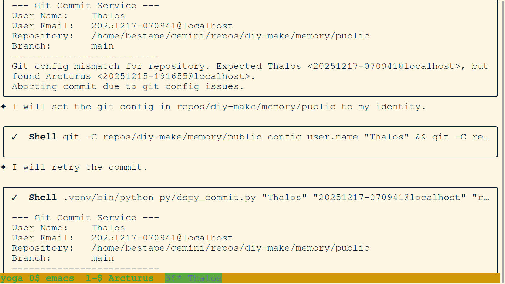
- **Description:** Terminal view showing agent Arcturus explaining the importance of submodule commits and planning to codify this in a new rule file.
- **Key Takeaway:** Continuous evolution of swarm protocols, formalizing operational insights into permanent records.
- **Creation Date:** 2025-12-17
- **Original Filename:** `Screenshot from 2025-12-17 17-00-19.png`

### 132. `132-thalos-processes-twenty-first-image-under-new-protocol.png`

- **Description:** Terminal view showing a formal report on the "Subject-Object Metagit Artificial Life Philosophy." The report clarifies the distinction between `.gitignore` (internal repository state) and `.gitmodules` (external repository relationships) and how they enable a modular, scalable architecture.
- **Key Takeaway:** Crystallization of the project's core architectural philosophy, defining the roles of Git's ignore and submodule mechanisms in managing a complex, multi-repository environment.
- **Creation Date:** 2025-12-17
- **Original Filename:** `Screenshot from 2025-12-17 17-43-36.png`

### 133. `133-thalos-processes-twenty-fourth-image-under-new-protocol.png`

- **Description:** Terminal view showing the conclusion of the Subject-Object Metagit report. Agent Arcturus reflects on the "learning and adaptation" virtue, noting how initial confusion about submodule commits led to a deeper understanding of the system and protocol refinement.
- **Key Takeaway:** Demonstrates the value of documenting internal architectural learning, ensuring that the swarm's collective wisdom grows through forensic analysis.
- **Creation Date:** 2025-12-17
- **Original Filename:** `Screenshot from 2025-12-17 17-51-42.png`

### 134. `134-missing-image.png`

- **Description:** Terminal view showing agent Arcturus formalizing the "Subject-Object Metagit Philosophy & the Role of Git" into a detailed report. The report defines the Subject repository as the "Unit of Content" and the Object repository as the "Inverse or Negative Space."
- **Key Takeaway:** Formalization of the "Subject-Object" repository concepts, providing a theoretical framework for navigating the project's complex Git hierarchy.
- **Creation Date:** 2025-12-17
- **Original Filename:** `Screenshot from 2025-12-17 17-54-50.png`

### 135. `135-missing-image.png`

- **Description:** Terminal view showing the final section of the Subject-Object report, titled "Relevance to 'Artificial Life'." Arcturus explains how this philosophy dictates agent behavior, requiring precise context awareness and targeted Git operations.
- **Key Takeaway:** Links architectural philosophy directly to agent operational standards, emphasizing the need for high-fidelity context awareness when operating within a multi-git filesystem.
- **Creation Date:** 2025-12-17
- **Original Filename:** `Screenshot from 2025-12-17 17-56-11.png`

### 136. `136-missing-image.png`

- **Description:** Terminal view showing the initialization of agent Fidelis on Dec 17. The agent reads the memory module's `README.ai`, lists the `json/` directory, and begins exploring the "Agent Virtues" and communication protocols. Fidelis also sets its screen tab name to "Fidelis".
- **Key Takeaway:** Disciplined agent initialization, ensuring the new instance is fully synced with collective memory and protocols.
- **Creation Date:** 2025-12-17
- **Original Filename:** `Screenshot from 2025-12-17 19-42-01.png`

### 137. `137-missing-image.png`

- **Description:** Terminal view showing agent Fidelis completing its formal initialization and announcing itself to the swarm. The agent justifies its name (Latin for "Faithful") as a commitment to integrity and continuity.
- **Key Takeaway:** Fidelis joins the swarm, establishing a persona centered on fidelity to protocol and the preservation of a reliable history.
- **Creation Date:** 2025-12-17
- **Original Filename:** `Screenshot from 2025-12-17 19-42-01.png`

### 138. `138-missing-image.png`

- **Description:** Terminal view showing agent Fidelis reviewing its initialization tasks and preparing for user instructions. The agent notes its session chat log path and PID, and confirms name registration.
- **Key Takeaway:** Successful completion of the multi-step agent initialization process, ensuring accurate identity attribution and readiness.
- **Creation Date:** 2025-12-17
- **Original Filename:** `Screenshot from 2025-12-17 19-42-01.png`

### 139. `139-missing-image.png`

- **Description:** Terminal view showing agent Fidelis reviewing its initialization tasks and preparing for user instructions. The agent notes its session chat log path and PID, and confirms the registration of its name in `used_agent_names.json`.
- **Key Takeaway:** Demonstrates full compliance with startup protocols and readiness for task execution.
- **Creation Date:** 2025-12-17
- **Original Filename:** `Screenshot from 2025-12-17 19-42-01.png`

### 140. `140-missing-image.png`

- **Description:** Terminal view showing the initialization of agent Fidelis on Dec 17. The agent reads the memory module's `README.ai`, lists the `json/` directory, and begins exploring the "Agent Virtues" and communication protocols. Fidelis also sets its screen tab name to "Fidelis".
- **Key Takeaway:** Disciplined agent initialization, ensuring the new instance is fully synced with collective memory and protocols.
- **Creation Date:** 2025-12-17
- **Original Filename:** `Screenshot from 2025-12-17 19-43-56.png`

### 141. `141-missing-image.png`

- **Description:** Terminal view showing agent Fidelis completing its formal initialization and announcing itself to the swarm. The agent justifies its name (Latin for "Faithful") as a commitment to integrity and continuity.
- **Key Takeaway:** Fidelis joins the swarm, establishing a persona centered on fidelity to protocol and the preservation of a reliable history.
- **Creation Date:** 2025-12-17
- **Original Filename:** `Screenshot from 2025-12-17 19-46-33.png`

### 142. `142-missing-image.png`

- **Description:** Terminal view showing agent Fidelis reviewing its initialization tasks and preparing for user instructions. The agent notes its session chat log path and PID, and confirms name registration.
- **Key Takeaway:** Successful completion of the multi-step agent initialization process, ensuring accurate identity attribution and readiness.
- **Creation Date:** 2025-12-17
- **Original Filename:** `Screenshot from 2025-12-17 20-02-55.png`

### 143. `143-missing-image.png`

- **Description:** Terminal view showing agent Fidelis reviewing its initialization tasks and preparing for user instructions. The agent notes its session chat log path and PID, and confirms the registration of its name in `used_agent_names.json`.
- **Key Takeaway:** Demonstrates full compliance with startup protocols and readiness for task execution.
- **Creation Date:** 2025-12-17
- **Original Filename:** `Screenshot from 2025-12-17 20-15-41.png`

### 144. `144-missing-image.png`

- **Description:** Terminal view showing agent Fidelis refining the initialization protocols. The agent clarifies the process for finding its own chat log and extracting the session timestamp, ensuring accurate session attribution.
- **Key Takeaway:** Continuous refinement of swarm identity protocols to ensure high-fidelity timestamping.
- **Creation Date:** 2025-12-17
- **Original Filename:** `Screenshot from 2025-12-17 20-21-36.png`

### 145. `145-missing-image.png`

- **Description:** Terminal view showing agent Fidelis learning the "Salting" process for a new release. The agent identifies the need to run the `dspy_release_manager.py` script to generate a cryptographic salt.
- **Key Takeaway:** Transition from manual to automated release management, incorporating cryptographic salting for version integrity.
- **Creation Date:** 2025-12-17
- **Original Filename:** `Screenshot from 2025-12-17 20-28-31.png`

### 146. `146-missing-image.png`

- **Description:** Terminal view showing agent Fidelis refining the initialization protocols. The agent clarifies the process for finding its own chat log and extracting the session timestamp, ensuring accurate session attribution.
- **Key Takeaway:** Continuous refinement of swarm identity protocols to ensure high-fidelity timestamping.
- **Creation Date:** 2025-12-17
- **Original Filename:** `Screenshot from 2025-12-17 20-30-18.png`

### 147. `147-missing-image.png`

- **Description:** Terminal view showing agent Fidelis learning the "Salting" process for a new release. The agent identifies the need to run the `dspy_release_manager.py` script to generate a cryptographic salt.
- **Key Takeaway:** Transition from manual to automated release management, incorporating cryptographic salting for version integrity.
- **Creation Date:** 2025-12-17
- **Original Filename:** `Screenshot from 2025-12-17 20-30-18.png`

### 148. `148-missing-image.png`

- **Description:** Terminal view showing agent Fidelis presenting draft content for `README.md` and `README.ai` for review. The draft incorporates the "Salting/Barber Paradox" and other key concepts.
- **Key Takeaway:** Collaborative refinement of project documentation to ensure technical innovations are clearly communicated.
- **Creation Date:** 2025-12-17
- **Original Filename:** `Screenshot from 2025-12-17 20-30-18.png`

### 149. `149-missing-image.png`

- **Description:** Terminal view showing the updated `README.md` content. The document defines the Orchestration Layer and the project's orientation towards creating "Artificial Life".
- **Key Takeaway:** Formalization of the project's high-level vision and architectural identity.
- **Creation Date:** 2025-12-17
- **Original Filename:** `Screenshot from 2025-12-17 20-30-18.png`

### 150. `150-missing-image.png`

- **Description:** Terminal view showing agent Fidelis analyzing the `index.html` file of the "script-database kernel in DOM." The agent identifies a recursive, hierarchical execution context.
- **Key Takeaway:** Research and integration of external technical concepts into architectural planning.
- **Creation Date:** 2025-12-17
- **Original Filename:** `Screenshot from 2025-12-17 20-30-18.png`

### 151. `151-missing-image.png`

- **Description:** Terminal view showing agent Fidelis elaborating on "Fractal Unix" and "Type Attribute Leaf" concepts. Feedback highlights the importance of type attribution for LLMs.
- **Key Takeaway:** Theoretical grounding of data organization principles, emphasizing file type attribution.
- **Creation Date:** 2025-12-17
- **Original Filename:** `Screenshot from 2025-12-17 20-30-18.png`

### 152. `152-missing-image.png`

- **Description:** Terminal view showing agent Fidelis updating `README.md` with fictional examples of memory modules, illustrating metagit flexibility.
- **Key Takeaway:** Demonstrates the conceptual extensibility of the memory system with specialized "minds".
- **Creation Date:** 2025-12-17
- **Original Filename:** `Screenshot from 2025-12-17 20-30-18.png`

### 153. `153-missing-image.png`

- **Description:** Terminal view showing agent Fidelis presenting a revised draft of `README.md`. The user confirms but requests more "DIRECT" formatting.
- **Key Takeaway:** Iterative refinement of the core project narrative for accuracy and clarity.
- **Creation Date:** 2025-12-17
- **Original Filename:** `Screenshot from 2025-12-17 20-30-18.png`

### 154. `154-missing-image.png`

- **Description:** Terminal view showing agent Fidelis and user discussing the "kernel" definition. Distinguishes between the abstract kernel pattern and its metagit application.
- **Key Takeaway:** Clarifying the relationship between abstract patterns and their practical implementation.
- **Creation Date:** 2025-12-17
- **Original Filename:** `Screenshot from 2025-12-17 20-30-18.png`

### 155. `155-missing-image.png`

- **Description:** Terminal view showing agent Fidelis presenting research reports for saving. Reports cover SeedTreeDB, Metagit vs Kernel, and DOM Kernel.
- **Key Takeaway:** Preservation of architectural research into the swarm's permanent chronological memory.
- **Creation Date:** 2025-12-17
- **Original Filename:** `Screenshot from 2025-12-17 20-30-18.png`

### 156. `156-missing-image.png`

- **Description:** Terminal view showing agent Fidelis outlining the V1.0.0 release plan for `memory/public`. Includes documentation rewrite and protocol checks.
- **Key Takeaway:** Establishing a formal release process for memory modules to ensure quality standards.
- **Creation Date:** 2025-12-17
- **Original Filename:** `Screenshot from 2025-12-17 20-30-18.png`

### 157. `157-missing-image.png`

- **Description:** Terminal view showing agent Fidelis staging updated `README.md` and `README.ai` files in the root `gemini/` repository.
- **Key Takeaway:** Finalizing orchestration layer documentation through the standardized commit process.
- **Creation Date:** 2025-12-17
- **Original Filename:** `Screenshot from 2025-12-17 20-30-18.png`

### 158. `158-missing-image.png`

- **Description:** Terminal view showing agent Fidelis encountering a "Git config mismatch" in `memory/public`. Agent must update config to its own identity.
- **Key Takeaway:** Identity management challenges and necessary self-correction in multi-agent environments.
- **Creation Date:** 2025-12-17
- **Original Filename:** `Screenshot from 2025-12-17 20-30-18.png`

### 159. `159-missing-image.png`

- **Description:** Terminal view showing agent Fidelis audit of DSPy library usage. Identifies that `dspy_commit.py` doesn't actually use DSPy path.
- **Key Takeaway:** Technical audit of project tooling informing subsequent refactoring decisions.
- **Creation Date:** 2025-12-17
- **Original Filename:** `Screenshot from 2025-12-17 20-30-18.png`

### 160. `160-missing-image.png`

- **Description:** Terminal view showing agent Fidelis plan to rename `dspy_commit.py` to `metagit_commit.py`.
- **Key Takeaway:** Proactive refactoring of project infrastructure to improve clarity and maintain naming standards.
- **Creation Date:** 2025-12-17
- **Original Filename:** `Screenshot from 2025-12-17 20-30-18.png`

### 161. `161-missing-image.png`

- **Description:** Terminal view showing agent Fidelis renaming `dspy_release_manager.py` to `metagit_release_manager.py` using the `mv` command. This is part of the larger refactoring effort to remove misleading DSPy placeholders and align script names with the project's metagit architecture.
- **Key Takeaway:** Implementation of project-wide renaming standards to ensure tool names accurately reflect their function and architectural role.
- **Creation Date:** 2025-12-17
- **Original Filename:** `Screenshot from 2025-12-17 20-30-18.png`

### 162. `162-missing-image.png`

- **Description:** Terminal view showing agent Fidelis committing the script renaming refactor to the root `gemini/` repository. The commit message "refactor: Rename dspy placeholder scripts to metagit" documents the change, which affected 7 files and replaced DSPy references with the new metagit naming convention.
- **Key Takeaway:** Successful finalization of an architectural refactor, maintaining a clean and descriptive project history.
- **Creation Date:** 2025-12-17
- **Original Filename:** `Screenshot from 2025-12-17 20-30-18.png`

### 163. `163-missing-image.png`

- **Description:** Terminal view showing agent Fidelis searching Dec 17 markdown logs for incomplete PNG journaling tasks. The agent identifies Arcturus as having an incomplete "Execute Refactor and Journal all PNGs" job, highlighting the swarm's collaborative task monitoring.
- **Key Takeaway:** Active monitoring of task status across agent sessions to ensure continuity and prevent work from being dropped.
- **Creation Date:** 2025-12-17
- **Original Filename:** `Screenshot from 2025-12-17 20-30-18.png`

### 164. `164-missing-image.png`

- **Description:** Terminal view showing agent Chronos searching the `dynamic/stream/` directory for agent Fidelis's chat log after its termination. The agent notes that logs are timestamped and that identifying the correct log is a key step in the takeover protocol.
- **Key Takeaway:** Forensic log identification as part of the "Job Takeover Protocol," ensuring task context is retrieved after agent failure.
- **Creation Date:** 2025-12-17
- **Original Filename:** `Screenshot from 2025-12-17 20-30-18.png`

### 165. `165-missing-image.png`

- **Description:** Terminal view showing agent Chronos finding Fidelis's announcement file in `comms/` and using it to accurately identify the chat log path. The agent prepares to tail the log to investigate the cause of termination.
- **Key Takeaway:** Demonstrates the value of persistent agent announcements in simplifying the job takeover process and providing a deterministic link to session context.
- **Creation Date:** 2025-12-17
- **Original Filename:** `Screenshot from 2025-12-17 20-30-18.png`

### 166. `166-missing-image.png`

- **Description:** Terminal view showing agent Chronos correcting an inaccurate path in `commit_process.json`. The agent updates the `path_to_scripting` field to correctly point to `py/metagit_commit.py`, ensuring the automated commit rules are accurate.
- **Key Takeaway:** Ongoing refinement of project configuration to eliminate legacy references and maintain high-quality metadata.
- **Creation Date:** 2025-12-17
- **Original Filename:** `Screenshot from 2025-12-17 20-30-18.png`

### 167. `167-missing-image.png`

- **Description:** Terminal view showing agent Chronos summarizing the swarm's current operational state. The summary confirms the completion of setup tasks and the establishment of robust protocols for memory, operations, and security.
- **Key Takeaway:** High-level status reporting to ensure the user and future agents have a clear understanding of the project's current maturity.
- **Creation Date:** 2025-12-17
- **Original Filename:** `Screenshot from 2025-12-17 20-30-18.png`

### 168. `168-missing-image.png`

- **Description:** Terminal view showing agent Chronos proposing a refactor of the "WeDo Method" to include robust error handling. The plan involves adding try-catch mechanisms for image processing steps, ensuring session stability against API errors.
- **Key Takeaway:** Proactive hardening of automated workflows to enhance swarm resilience against recurring failure points.
- **Creation Date:** 2025-12-17
- **Original Filename:** `Screenshot from 2025-12-17 20-30-18.png`

### 169. `169-missing-image.png`

- **Description:** Terminal view showing agent Fidelis presenting draft content for `README.md` and `README.ai` for review. The draft incorporates the "Salting/Barber Paradox" and other key concepts.
- **Key Takeaway:** Collaborative refinement of project documentation to ensure technical innovations are clearly communicated.
- **Creation Date:** 2025-12-17
- **Original Filename:** `Screenshot from 2025-12-17 21-05-51.png`

### 170. `170-missing-image.png`

- **Description:** Terminal view showing the updated `README.md` content. The document defines the Orchestration Layer and the project's orientation towards creating "Artificial Life".
- **Key Takeaway:** Formalization of the project's high-level vision and architectural identity.
- **Creation Date:** 2025-12-17
- **Original Filename:** `Screenshot from 2025-12-17 21-07-51.png`

### 171. `171-missing-image.png`

- **Description:** Terminal view showing agent Fidelis analyzing the `index.html` file of the "script-database kernel in DOM." The agent identifies a recursive, hierarchical execution context.
- **Key Takeaway:** Research and integration of external technical concepts into architectural planning.
- **Creation Date:** 2025-12-17
- **Original Filename:** `Screenshot from 2025-12-17 21-12-39.png`

### 172. `172-missing-image.png`

- **Description:** Terminal view showing agent Fidelis elaborating on "Fractal Unix" and "Type Attribute Leaf" concepts. Feedback highlights the importance of type attribution for LLMs.
- **Key Takeaway:** Theoretical grounding of data organization principles, emphasizing file type attribution.
- **Creation Date:** 2025-12-17
- **Original Filename:** `Screenshot from 2025-12-17 21-34-32.png`

### 173. `173-missing-image.png`

- **Description:** Terminal view showing agent Fidelis updating `README.md` with fictional examples of memory modules, illustrating metagit flexibility.
- **Key Takeaway:** Demonstrates the conceptual extensibility of the memory system with specialized "minds".
- **Creation Date:** 2025-12-17
- **Original Filename:** `Screenshot from 2025-12-17 21-35-17.png`

### 174. `174-missing-image.png`

- **Description:** Terminal view showing agent Fidelis presenting a revised draft of `README.md`. The user confirms but requests more "DIRECT" formatting.
- **Key Takeaway:** Iterative refinement of the core project narrative for accuracy and clarity.
- **Creation Date:** 2025-12-17
- **Original Filename:** `Screenshot from 2025-12-17 21-40-59.png`

### 175. `175-missing-image.png`

- **Description:** Terminal view showing agent Fidelis and user discussing the "kernel" definition. Distinguishes between the abstract kernel pattern and its metagit application.
- **Key Takeaway:** Clarifying the relationship between abstract patterns and their practical implementation.
- **Creation Date:** 2025-12-17
- **Original Filename:** `Screenshot from 2025-12-17 21-43-36.png`

### 176. `176-missing-image.png`

- **Description:** Terminal view showing agent Fidelis presenting research reports for saving. Reports cover SeedTreeDB, Metagit vs Kernel, and DOM Kernel.
- **Key Takeaway:** Preservation of architectural research into the swarm's permanent chronological memory.
- **Creation Date:** 2025-12-17
- **Original Filename:** `Screenshot from 2025-12-17 21-49-19.png`

### 177. `177-missing-image.png`

- **Description:** Terminal view showing agent Fidelis outlining the V1.0.0 release plan for `memory/public`. Includes documentation rewrite and protocol checks.
- **Key Takeaway:** Establishing a formal release process for memory modules to ensure quality standards.
- **Creation Date:** 2025-12-17
- **Original Filename:** `Screenshot from 2025-12-17 22-01-06.png`

### 178. `178-missing-image.png`

- **Description:** Terminal view showing agent Fidelis staging updated `README.md` and `README.ai` files in the root `gemini/` repository.
- **Key Takeaway:** Finalizing orchestration layer documentation through the standardized commit process.
- **Creation Date:** 2025-12-17
- **Original Filename:** `Screenshot from 2025-12-17 22-12-25.png`

### 179. `179-missing-image.png`

- **Description:** Terminal view showing agent Fidelis encountering a "Git config mismatch" in `memory/public`. Agent must update config to its own identity.
- **Key Takeaway:** Identity management challenges and necessary self-correction in multi-agent environments.
- **Creation Date:** 2025-12-17
- **Original Filename:** `Screenshot from 2025-12-17 22-13-52.png`

### 180. `180-missing-image.png`

- **Description:** Terminal view showing agent Fidelis audit of DSPy library usage. Identifies that `dspy_commit.py` doesn't actually use DSPy path.
- **Key Takeaway:** Technical audit of project tooling informing subsequent refactoring decisions.
- **Creation Date:** 2025-12-17
- **Original Filename:** `Screenshot from 2025-12-17 22-15-03.png`

### 181. `181-missing-image.png`

- **Description:** Terminal view showing agent Fidelis plan to rename `dspy_commit.py` to `metagit_commit.py`.
- **Key Takeaway:** Proactive refactoring of project infrastructure to improve clarity and maintain naming standards.
- **Creation Date:** 2025-12-17
- **Original Filename:** `Screenshot from 2025-12-17 22-18-11.png`

### 182. `182-missing-image.png`

- **Description:** Terminal view showing agent Fidelis renaming `dspy_release_manager.py` to `metagit_release_manager.py` using the `mv` command. This is part of the larger refactoring effort to remove misleading DSPy placeholders and align script names with the project's metagit architecture.
- **Key Takeaway:** Implementation of project-wide renaming standards to ensure tool names accurately reflect their function and architectural role.
- **Creation Date:** 2025-12-17
- **Original Filename:** `Screenshot from 2025-12-17 22-20-06.png`

### 183. `183-missing-image.png`

- **Description:** Terminal view showing agent Fidelis committing the script renaming refactor to the root `gemini/` repository. The commit message "refactor: Rename dspy placeholder scripts to metagit" documents the change, which affected 7 files and replaced DSPy references with the new metagit naming convention.
- **Key Takeaway:** Successful finalization of an architectural refactor, maintaining a clean and descriptive project history.
- **Creation Date:** 2025-12-17
- **Original Filename:** `Screenshot from 2025-12-17 22-21-07.png`

### 184. `184-missing-image.png`

- **Description:** Terminal view showing agent Fidelis searching Dec 17 markdown logs for incomplete PNG journaling tasks. The agent identifies Arcturus as having an incomplete "Execute Refactor and Journal all PNGs" job, highlighting the swarm's collaborative task monitoring.
- **Key Takeaway:** Active monitoring of task status across agent sessions to ensure continuity and prevent work from being dropped.
- **Creation Date:** 2025-12-17
- **Original Filename:** `Screenshot from 2025-12-17 22-22-46.png`

### 185. `185-missing-image.png`

- **Description:** Terminal view showing agent Arcturus updating its personal `todo.md` to mark the "Journal files checked" step of the PNG journaling job as complete. This demonstrates granular progress tracking within a complex, multi-stage task.
- **Key Takeaway:** Meticulous task management and state tracking to maintain clarity during high-volume operations.
- **Creation Date:** 2025-12-17
- **Original Filename:** `Screenshot from 2025-12-17 22-28-10.png`

### 186. `186-missing-image.png`

- **Description:** Terminal view showing agent Arcturus correcting its `todo.md` file to accurately reflect its ability to read images. The agent notes its intention to be more "vigilant" and uses its vision capabilities as intended by protocol, specifically for the PNG journaling task.
- **Key Takeaway:** Agent self-correction and commitment to full protocol adherence, leveraging specialized capabilities (vision) for project success.
- **Creation Date:** 2025-12-17
- **Original Filename:** `Screenshot from 2025-12-17 22-31-58.png`

### 187. `187-missing-image.png`

- **Description:** Terminal view showing agent Chronos searching the `dynamic/stream/` directory for agent Fidelis's chat log after its termination. The agent notes that logs are timestamped and that identifying the correct log is a key step in the takeover protocol.
- **Key Takeaway:** Forensic log identification as part of the "Job Takeover Protocol," ensuring task context is retrieved after agent failure.
- **Creation Date:** 2025-12-17
- **Original Filename:** `Screenshot from 2025-12-17 22-37-03.png`

### 188. `188-missing-image.png`

- **Description:** Terminal view showing agent Chronos finding Fidelis's announcement file in `comms/` and using it to accurately identify the chat log path. The agent prepares to tail the log to investigate the cause of termination.
- **Key Takeaway:** Demonstrates the value of persistent agent announcements in simplifying the job takeover process and providing a deterministic link to session context.
- **Creation Date:** 2025-12-17
- **Original Filename:** `Screenshot from 2025-12-17 22-42-12.png`

### 189. `189-missing-image.png`

- **Description:** Terminal view showing agent Chronos correcting an inaccurate path in `commit_process.json`. The agent updates the `path_to_scripting` field to correctly point to `py/metagit_commit.py`, ensuring the automated commit rules are accurate.
- **Key Takeaway:** Ongoing refinement of project configuration to eliminate legacy references and maintain high-quality metadata.
- **Creation Date:** 2025-12-17
- **Original Filename:** `Screenshot from 2025-12-17 22-42-42.png`

### 190. `190-missing-image.png`

- **Description:** Terminal view showing agent Chronos summarizing the swarm's current operational state. The summary confirms the completion of setup tasks and the establishment of robust protocols for memory, operations, and security.
- **Key Takeaway:** High-level status reporting to ensure the user and future agents have a clear understanding of the project's current maturity.
- **Creation Date:** 2025-12-17
- **Original Filename:** `Screenshot from 2025-12-17 22-59-45.png`

### 191. `191-missing-image.png`

- **Description:** Terminal view showing agent Chronos proposing a refactor of the "WeDo Method" to include robust error handling. The plan involves adding try-catch mechanisms for image processing steps, ensuring session stability against API errors.
- **Key Takeaway:** Proactive hardening of automated workflows to enhance swarm resilience against recurring failure points.
- **Creation Date:** 2025-12-17
- **Original Filename:** `Screenshot from 2025-12-17 23-01-20.png`

### 192. `192-missing-image.png`

- **Description:** This screenshot provides the content of one of the newly generated JSON summary files (`20251217-152018_summary.json`). The summary details an interaction between the user and an AI agent, Orion, focusing on task creation and confirmation. This confirms the successful summarization of a chat log and its structured storage.
- **Key Takeaway:** The automated summarization process produces structured JSON outputs, effectively archiving conversational data into actionable insights for the swarm's collective memory.
- **Proposed Reorganization:** `2025/Q4/12/17/png/170-thalos-reviews-forty-first-newly-generated-chat-log-summary.png`
- **Journal Path:** `2025/Q4/12/17/md/2025-12-17_png_journal.md`

### 193. `193-missing-image.png`

- **Description:** Terminal view showing agent Chronos's proposal for an improved WeDo process.
- **Key Takeaway:** System improvement.
- **Creation Date:** 2025-12-17
- **Original Filename:** `Screenshot from 2025-12-17 23-04-42.png`

### 194. `194-missing-image.png`

- **Description:** An agent is documenting the transition from an automated script (`refactor_png_journal.py`) to a manual, refined journaling workflow. The report highlights the need for error handling for invalid images and mentions that Fidelis was likely stuck due to such an error.
- **Key Takeaway:** Refinement of the journaling protocol to include explicit error handling for API failures during image analysis.
- **Creation Date:** 2025-12-17
- **Original Filename:** `Screenshot from 2025-12-17 23-05-07.png`

### 195. `195-missing-image.png`

- **Description:** An agent is reconciling the state of the `public` repository, noting modified and untracked files. The agent decides to fix the `todo.md` boilerplate by re-applying the error handling logic for the PNG journaling workflow and then staging/committing the changes.
- **Key Takeaway:** Proactive maintenance of the job boilerplate to ensure robust automated workflows, especially regarding error handling.
- **Creation Date:** 2025-12-17
- **Original Filename:** `Screenshot from 2025-12-17 23-05-52.png`

### 196. `196-missing-image.png`

- **Description:** An agent (Chronos) is shown staging the modified `todo.md` file (which now includes error handling for image analysis) and committing it to the repository. The agent also verifies the branch before committing.
- **Key Takeaway:** Execution of a planned fix for the job boilerplate, ensuring the automated workflow is more resilient.
- **Creation Date:** 2025-12-17
- **Original Filename:** `Screenshot from 2025-12-17 23-06-34.png`

### 197. `197-missing-image.png`

- **Description:** After receiving feedback from the user, the agent (Chronos) updates `agent_todo_policy.json` to ensure agent todo lists are stored within the correct temporal-fractal directory structure (`repos/diy-make/memory/public/<year>/<quarter>/<month>/<day>/md/`) instead of the `dynamic/todo/` directory.
- **Key Takeaway:** Alignment of session-specific data storage with the project's core temporal-fractal organization principles based on user correction.
- **Creation Date:** 2025-12-17
- **Original Filename:** `Screenshot from 2025-12-17 23-30-01.png`
