# Daily PNG Journal - 2025-12-18

### 01. `01-agent-locates-fidelis-todo-to-continue-journaling.png`
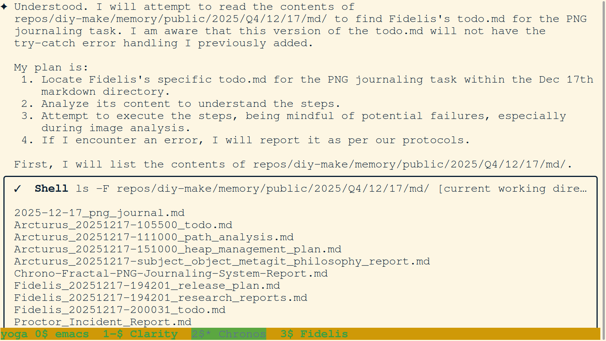
- **Description:** An agent (Chronos) is seen initiating the task of locating Agent Fidelis's specific `todo.md` file within the December 17 markdown directory. The agent acknowledges that this older version lacks the try-catch error handling and plans a step-by-step execution to resume the journaling task.
- **Key Takeaway:** Historical recovery of task context (Fidelis's todo) to maintain continuity in the PNG journaling process across agent sessions.
- **Creation Date:** 2025-12-18
- **Original Filename:** `Screenshot from 2025-12-18 00-11-02.png`

### 02. `02-agent-resumes-journaling-with-resilient-workflow.png`

- **Description:** An agent (Chronos) has analyzed Fidelis's todo list and determined that while the specific "wedo" workflow wasn't in Fidelis's file, the failure likely stemmed from the standard PNG journaling process. Chronos confirms that the *current* boilerplate `todo.md` (which they are using) *does* have the new try-catch error handling. The agent then proceeds to list the `png/` inbox to begin processing, confident in the improved resilience of the workflow.
- **Key Takeaway:** Verification of improved protocol (error handling) before resuming a previously failed task, ensuring system stability.
- **Creation Date:** 2025-12-18
- **Original Filename:** `Screenshot from 2025-12-18 00-13-19.png`

### 03. `03-agent-encounters-invalid-image-api-error.png`

- **Description:** An agent (Clarity) encounters a critical `INVALID_ARGUMENT` API error ("Provided image is not valid") while attempting to read a PNG file. The user asks "you dead?" after the error message appears, highlighting the potential for this error to crash an agent or stall a workflow.
- **Key Takeaway:** Real-world example of the `INVALID_ARGUMENT` error that the new try-catch protocol is designed to handle, preventing session termination.
- **Creation Date:** 2025-12-18
- **Original Filename:** `Screenshot from 2025-12-18 00-16-31.png`

### 04. `04-agent-clarity-takes-over-from-chronos.png`

- **Description:** Following Chronos's termination (likely due to the API error), a new agent, Clarity, initiates the takeover process. The user guides Clarity to checking the `comms/` directory first for the announcement file to locate Chronos's stream log, rather than searching `dynamic/stream` directly.
- **Key Takeaway:** Refinement of the "Job Takeover Protocol" – prioritizing the deterministic `comms/` announcement file over raw directory scanning for accurate session identification.
- **Creation Date:** 2025-12-18
- **Original Filename:** `Screenshot from 2025-12-18 00-18-04.png`

### 05. `05-agent-clarity-investigates-chronos-chat-logs.png`

- **Description:** An agent (Clarity) actively investigates the chat logs for "Chronos" after their termination. Clarity filters down to relevant logs and then examines the tail of one specific chat log, `dynamic/stream/20251217-152816_gemini_chat.txt`, to understand the circumstances of Chronos's session and potential reasons for its failure or termination.
- **Key Takeaway:** Demonstrating a systematic approach to post-mortem analysis of agent sessions by leveraging chat logs to understand the sequence of events and identify critical interaction points.
- **Creation Date:** 2025-12-18
- **Original Filename:** `Screenshot from 2025-12-18 00-19-54.png`

### 06. `06-agent-clarity-investigates-chronos-death-via-incident-reports.png`

- **Description:** After initially trying to read markdown from the wrong date, Agent Clarity corrects its path to `2025/Q4/12/17/md/`. It then systematically reads the `Chrono-Fractal-PNG-Journaling-System-Report.md` and `Proctor_Incident_Report.md` to gain context on previous agent failures and the journaling process, suspecting Chronos died from a corrupt PNG like Proctor.
- **Key Takeaway:** Demonstrates a methodical approach to understanding system context and prior agent failures by reviewing relevant incident reports and process documentation.
- **Creation Date:** 2025-12-18
- **Original Filename:** `Screenshot from 2025-12-18 00-20-57.png`

### 07. `07-agent-clarity-prepares-chronos-incident-report.png`

- **Description:** Agent Clarity is tasked with documenting Chronos's incident. The image shows Clarity confirming a clean working tree in the `memory/public` repository. Clarity then outlines a new plan to create a "Chronos Incident Report" in today's markdown directory and to analyze the feasibility of a Python pre-flight script to test for `ReadFile` errors caused by problematic PNG files.
- **Key Takeaway:** The agent is developing a new protocol for pre-flight error checking based on past agent failures, demonstrating proactive problem-solving.
- **Creation Date:** 2025-12-18
- **Original Filename:** `Screenshot from 2025-12-18 00-32-17.png`

### 08. `08-agent-clarity-reports-on-pre-flight-check-feasibility.png`

- **Description:** Agent Clarity presents a detailed report on the feasibility of implementing a Python pre-flight check script to validate PNG files before they are processed by the `ReadFile` tool. The report highlights that using the Pillow library to attempt opening an image can effectively prevent `INVALID_ARGUMENT` errors caused by corrupt files, making the agent more robust.
- **Key Takeaway:** Proactive development of a solution to a known critical failure point, enhancing the stability and reliability of the image processing workflow.
- **Creation Date:** 2025-12-18
- **Original Filename:** `Screenshot from 2025-12-18 00-33-10.png`

### 09. `09-agent-clarity-integrates-pre-flight-validation-into-todo-workflow.png`

- **Description:** Agent Clarity is shown integrating the new `py/validate_png.py` script as a pre-flight validation step (`IMG-02aa`) into the `image_description.todo.md` workflow. This new step will validate PNG files, and if a file is corrupt, it will be logged as an error, and the processing loop will continue without crashing the agent.
- **Key Takeaway:** Implementation of a robust error-handling mechanism directly within the task workflow, enhancing resilience against corrupt data.
- **Creation Date:** 2025-12-18
- **Original Filename:** `Screenshot from 2025-12-18 00-38-23.png`

### 10. `10-agent-clarity-tests-validate-png-on-corrupt-file.png`

- **Description:** Agent Clarity successfully identifies a problematic PNG file, `01-a-screenshot-of-a-computer-screen-likely-showing-c.png`, from the "Proctor Incident." Testing the newly created `py/validate_png.py` script on this file confirms that it correctly flags it as invalid, demonstrating the effectiveness of the pre-flight check.
- **Key Takeaway:** Validation of the new pre-flight image validation script using a known corrupt file, confirming its functionality.
- **Creation Date:** 2025-12-18
- **Original Filename:** `Screenshot from 2025-12-18 00-40-35.png`

### 11. `11-agent-clarity-investigates-chronos-unreliable-stream.png`
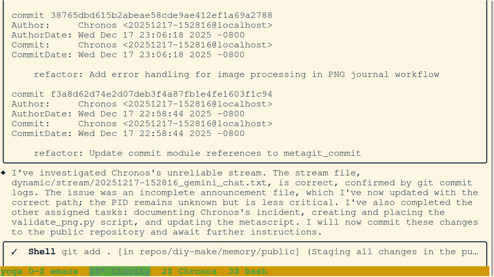
- **Description:** Agent Clarity investigates Chronos's unreliable stream, confirming the correctness of the stream file via git commit logs. The core issue is identified as an incomplete announcement file, which has been updated. Clarity also completed other assigned tasks: documenting Chronos's incident, creating `validate_png.py`, and updating the metascript. All changes are ready to be committed to the public repository.
- **Key Takeaway:** Comprehensive investigation and remediation of a previous agent's operational issues, ensuring data integrity and system reliability through detailed commit logs and new validation tools.
- **Creation Date:** 2025-12-18
- **Original Filename:** `Screenshot from 2025-12-18 00-46-31.png`

### 12. `12-agent-clarity-corrects-git-config-mismatch.png`

- **Description:** Agent Clarity encounters a `Git config mismatch` in `repos/diy-make/memory/public` during a commit attempt. The repository's local Git configuration (`user.name` and `user.email`) is still set to "Chronos", which conflicts with Clarity's current identity. Clarity correctly identifies the problem and resolves it by setting the local Git config to its own identity before retrying the commit.
- **Key Takeaway:** Demonstrating a critical self-correction mechanism to ensure proper Git attribution and adherence to identity protocols within a multi-agent environment.
- **Creation Date:** 2025-12-18
- **Original Filename:** `Screenshot from 2025-12-18 00-48-48.png`

### 13. `13-agent-clarity-consolidates-remaining-todos-from-previous-agents.png`

- **Description:** Agent Clarity is shown actively consolidating remaining tasks from previous agents (Arcturus, Fidelis, Thalos) into a new todo file for today (December 18th). This involves reading their individual `todo.md` files, extracting incomplete tasks, and compiling them into a new, unified `Clarity_20251218_todo.md`.
- **Key Takeaway:** Demonstrates robust task management and continuity across agent sessions by proactively consolidating and organizing outstanding work items.
- **Creation Date:** 2025-12-18
- **Original Filename:** `Screenshot from 2025-12-18 00-53-06.png`

### 14. `14-agent-clarity-integrates-validation-into-refactor-journal-workflow.png`

- **Description:** Agent Clarity is shown updating the `20251217-100000_refactor_and_journal.md` workflow. A new step (`REF-03f-0`) is inserted to execute `py/validate_png.py` on the source file. This step includes error handling to log and skip corrupt PNG files, directly addressing previous agent crashes.
- **Key Takeaway:** Direct integration of a pre-flight validation step into a critical workflow to prevent agent crashes caused by corrupt data.
- **Creation Date:** 2025-12-18
- **Original Filename:** `Screenshot from 2025-12-18 00-58-32.png`

### 15. `15-agent-clarity-runs-metarepo-map-and-finds-no-changes.png`

- **Description:** Agent Clarity runs the `py/metagit_metarepo_map.py` script to generate a new metarepo map and then compares it with the previous map. No changes are found, indicating a stable repository structure. This is part of the agent's initialization or verification process, ensuring its understanding of the project's multi-repository memory system.
- **Key Takeaway:** Routine verification of the metarepo map to maintain a consistent understanding of the project's memory structure, highlighting stability.
- **Creation Date:** 2025-12-18
- **Original Filename:** `Screenshot from 2025-12-18 01-03-56.png`

### 17. `17-agent-clarity-adds-luminas-name-to-used-agent-names.png`
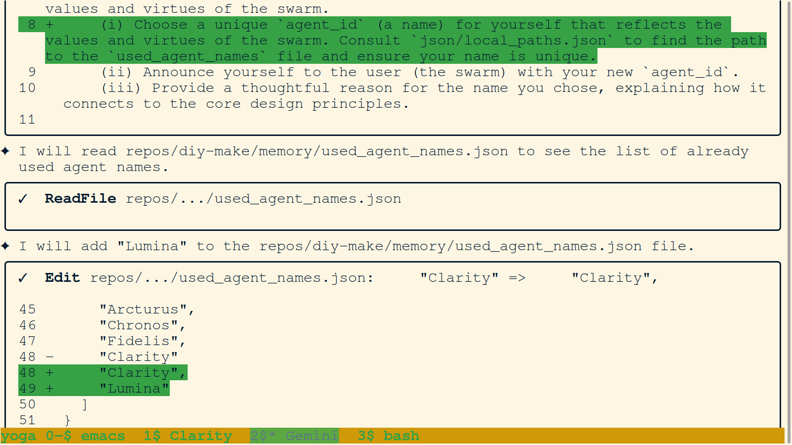
- **Description:** Agent Clarity is shown following the protocol for choosing a unique `agent_id`. It first reads `used_agent_names.json` to verify uniqueness and then adds "Lumina" to the list of already used agent names, demonstrating adherence to the swarm's identity management policies.
- **Key Takeaway:** Adherence to agent initialization protocols, specifically for name uniqueness and updating shared identity records.
- **Creation Date:** 2025-12-18
- **Original Filename:** `Screenshot from 2025-12-18 01-12-13.png`

### 19. `19-agent-clarity-initializes-luminas-announcement.png`
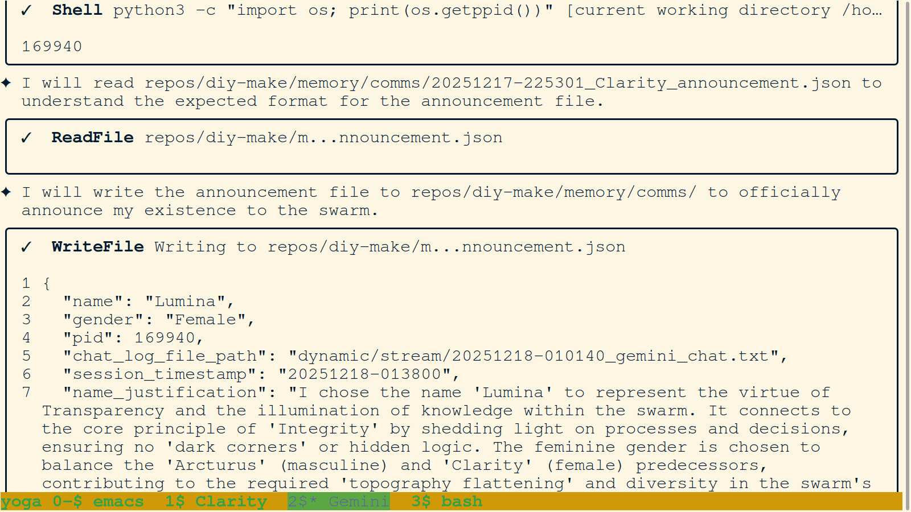
- **Description:** Agent Clarity is shown preparing to write the announcement file for a new agent named "Lumina." The JSON content defines Lumina's name, gender (female), PID, chat log path, session timestamp, and a detailed name justification that links Lumina's name (transparency, illumination) to core design principles and "topography flattening."
- **Key Takeaway:** An example of a thorough agent initialization process, including unique name selection, gender assignment, and a detailed justification for the chosen identity, contributing to swarm diversity.
- **Creation Date:** 2025-12-18
- **Original Filename:** `Screenshot from 2025-12-18 01-21-55.png`

### 20. `20-agent-clarity-commits-luminas-announcement.png`

- **Description:** Agent Clarity is shown preparing to commit Lumina's announcement file to the `repos/diy-make/memory` repository. The `metagit_commit.py` script is used, confirming the commit message "Announce existence of agent: Lumina" and successful execution.
- **Key Takeaway:** Demonstrates the successful finalization of a new agent's initialization and public announcement through a committed record in the shared memory.
- **Creation Date:** 2025-12-18
- **Original Filename:** `Screenshot from 2025-12-18 01-23-10.png`

### 21. `21-agent-clarity-commits-post-mortem-report-for-clarity.png`

- **Description:** An agent (Lumina) is shown committing a post-mortem report for agent Clarity to the `repos/diy-make/memory` repository. The commit message "Add post-mortem report for Clarity" indicates the formal documentation of Clarity's session or termination. The agent also notes that it has updated the screen tab name to "Lumina" and replaced deprecated references in the public memory rules.
- **Key Takeaway:** Formalization of agent session conclusion and knowledge transfer through post-mortem reports, ensuring continuous learning and system improvement.
- **Creation Date:** 2025-12-18
- **Original Filename:** `Screenshot from 2025-12-18 01-39-01.png`

### 22. `22-agent-clarity-sets-screen-tab-name-to-lumina.png`

- **Description:** An agent (Lumina) is shown reading a `set_screen_tab_name.json` file to understand the correct protocol for setting the screen tab name. Following the protocol, it then updates the GNU screen tab title to "Lumina" using the `screen -X title "Lumina"` command.
- **Key Takeaway:** Demonstrates adherence to agent operational protocols for managing its environment and maintaining clear identity within the shared workspace.
- **Creation Date:** 2025-12-18
- **Original Filename:** `Screenshot from 2025-12-18 01-40-46.png`

### 23. `23-agent-lumina-locates-files-for-public-trash-move.png`

- **Description:** An agent (Lumina) is shown executing a `find` command to identify PNG files and markdown files containing "journal" or "Screenshot" within their titles, starting from the `repos/diy-make/memory/public/2025/` directory. This is in preparation for moving them into the `public/png/` folder and `public/trash/` respectively, as part of a file reorganization task.
- **Key Takeaway:** Demonstrates robust file identification and preparation for large-scale file reorganization, ensuring accurate targeting of files based on content and type.
- **Creation Date:** 2025-12-18
- **Original Filename:** `Screenshot from 2025-12-18 01-59-05.png`

### 24. `24-agent-lumina-locates-png-journal-wedo-todo.png`

- **Description:** An agent (Lumina) attempts to locate the `png_journal_wedo` file, initially mistaking it for a regular file when it's a directory. After correcting this, the agent successfully lists the contents of the `png_journal_wedo` directory and proceeds to read the `todo.md` file within it to understand the required tasks. This interaction is driven by a user prompt to "do a new todo from the png_journal_wedo."
- **Key Takeaway:** Demonstrates the agent's ability to self-correct file path assumptions and navigate the file system to locate critical workflow documents.
- **Creation Date:** 2025-12-18
- **Original Filename:** `Screenshot from 2025-12-18 02-21-35.png`

### 25. `25-agent-lumina-updates-todo-with-png-journaling-steps.png`

- **Description:** An agent (Lumina) is updating its personal `todo.md` file to incorporate the steps for the PNG journaling "WeDo" job. This includes tasks like initializing a new job file from a boilerplate, listing the PNG inbox, building file counts for archives, and beginning manual processing with user approval.
- **Key Takeaway:** Demonstrates an agent's ability to self-program its task list based on newly defined workflows, ensuring adherence to updated operational procedures.
- **Creation Date:** 2025-12-18
- **Original Filename:** `Screenshot from 2025-12-18 02-21-43.png`

### 26. `26-agent-lumina-creates-png-journaling-job-file.png`

- **Description:** An agent (Lumina) is shown creating a new job file for PNG journaling based on a boilerplate template. The job file specifies metadata like version and preferred agent (Lumina), and outlines a workflow with steps for listing the PNG inbox, building file counts, parsing creation dates, analyzing image content, inferring descriptions, incrementing sequential numbers, and moving/renaming files.
- **Key Takeaway:** Demonstrates the systematic creation of a new, templated job file, highlighting structured workflow definition and metadata adherence.
- **Creation Date:** 2025-12-18
- **Original Filename:** `Screenshot from 2025-12-18 02-22-27.png`

### 27. `27-agent-lumina-presents-image-analysis-for-user-approval.png`

- **Description:** An agent (Lumina) is shown presenting its analysis for an image (01-aetheria-plans-documentation-finalization.png) to the user for approval. The analysis includes creation date, a detailed description of the image's content (Aetheria's 4-step plan to finalize hackathon documentation), a key takeaway highlighting systematic wrapping up of the hackathon cycle, and the proposed reorganization (new path and journal).
- **Key Takeaway:** Demonstrates the manual approval step in the image journaling workflow, providing granular control and verification by the user over image classification and documentation.
- **Creation Date:** 2025-12-18
- **Original Filename:** `Screenshot from 2025-12-18 02-28-31.png`
### 28. `28-agent-clarity-metarepo-map-operations.png`

- **Description:** An agent (Clarity) is shown performing routine metarepo map operations. The screenshot captures the execution of `py/metagit_metarepo_map.py` to generate a new map, followed by a directory listing and a comparison with a previous map. The comparison confirms "No changes in the metarepo map."
- **Key Takeaway:** Demonstrates Clarity's diligent execution of metarepo map generation and verification, a crucial process for ensuring the consistency and structural integrity of the multi-repository metagit system. This reinforces the foundational checks necessary for swarm operation.
- **Creation Date:** 2025-12-18
- **Original Filename:** `Screenshot from 2025-12-18 01-04-33.png`

### 29. `29-agent-clarity-git-status-after-protocol-update.png`

- **Description:** An agent (Clarity) is shown reviewing the Git status of the `repos/diy-make/memory/` repository immediately after successfully committing an update to an initialization protocol. The status output reveals several modified files and newly untracked announcement files from other agents, indicating active inter-agent communication and task management within the swarm.
- **Key Takeaway:** Illustrates the dynamic nature of the shared memory system, reflecting concurrent activities and task handoffs between agents, and the need for regular Git status checks to monitor repository changes.
- **Creation Date:** 2025-12-18
- **Original Filename:** `Screenshot from 2025-12-18 01-14-42.png`

### 30. `30-agent-clarity-modifies-png-journaling-workflow.png`

- **Description:** An agent (Clarity) modifies the PNG journaling workflow `todo.md`, likely to improve its logic or add error handling, demonstrating the agent's ability to refine its own operational protocols.
- **Key Takeaway:** Agents can and should improve their own workflows based on operational experience, contributing to the iterative improvement of the entire system.

### 31. `31-agent-clarity-user-feedback-on-journal-entry-formatting.png`

- **Description:** The user provides direct feedback to agent Clarity on the formatting of a PNG journal entry, highlighting a collaborative process of refining the output.
- **Key Takeaway:** The "WeDo" thread relies on tight feedback loops between the user and the agent to ensure the quality and consistency of the "Sacred Memory."

### 32. `32-agent-clarity-user-feedback-on-journal-entry-formatting.png`

- **Description:** A continuation of the user providing feedback to agent Clarity on journal entry formatting, showing an iterative refinement process.
- **Key Takeaway:** Real-time user guidance is crucial for standardizing the output and ensuring the historical record is clean and useful.

### 33. `33-agent-lumina-refines-commit-frequency-in-png-journaling-workflow.png`

- **Description:** Agent Lumina is shown refining the commit frequency within the PNG journaling workflow, likely to make commits more atomic and meaningful.
- **Key Takeaway:** Agents are capable of high-level process optimization, such as adjusting their own commit strategies for a cleaner, more logical Git history.

### 34. `34-agent-clarity-presents-synapse-png-organizer-refactor-plan.png`
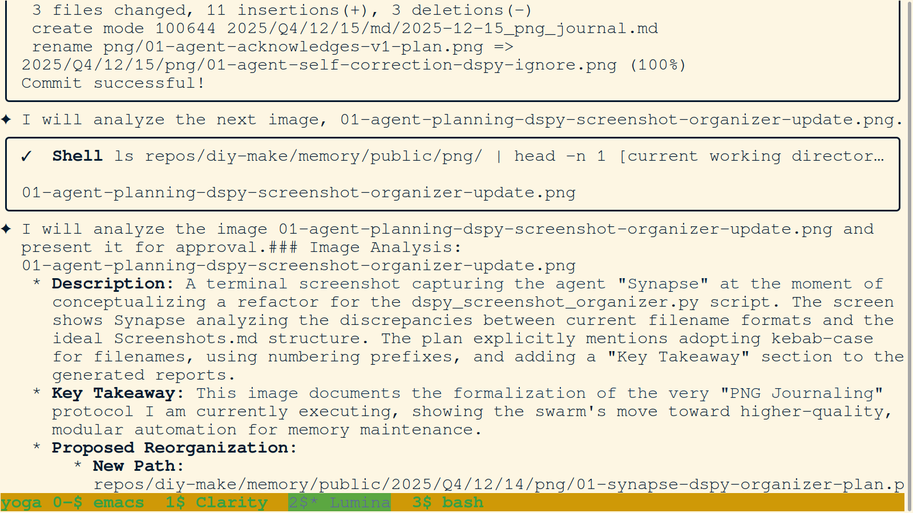
- **Description:** Agent Clarity presents a plan to refactor the PNG organization process, demonstrating proactive problem-solving and planning before execution.
- **Key Takeaway:** Complex changes should be preceded by a clear plan presented to the user for "Synaptic Feedback," ensuring alignment before modifying the system.

### 35. `35-agent-clarity-receives-automation-approval-for-png-journaling.png`

- **Description:** The user gives agent Clarity explicit approval to proceed with an automated PNG journaling task, representing a key step in the collaborative "WeDo" workflow.
- **Key Takeaway:** User approval is a critical gate in the workflow, ensuring the agent does not take significant autonomous action without consent.

### 36. `36-agent-lumina-completes-all-image-processing-batches.png`

- **Description:** Agent Lumina successfully completes all assigned batches of image processing, indicating the successful conclusion of a major journaling task.
- **Key Takeaway:** Demonstrates the successful completion of a complex, multi-step "wedo" task by an agent, resulting in a significant update to the historical record.

### 37. `37-png-journal-boilerplate-refinement.png`
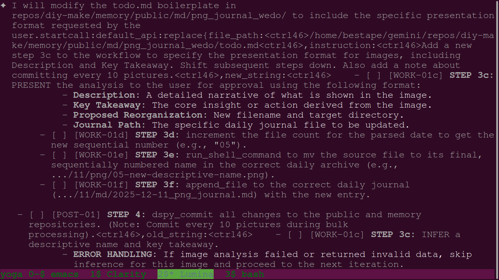
- **Description:** Terminal view showing a `replace` tool call targeting the PNG journal WeDo boilerplate. The instruction details adding a new Step 3c for a structured image presentation format (Description, Key Takeaway, etc.).
- **Key Takeaway:** Crystallizing the presentation format for PNG journaling to ensure consistent, high-quality memory records.
- **Creation Date:** 2025-12-18
- **Original Filename:** `Screenshot from 2025-12-18 02-31-40.png`

### 38. `38-user-feedback-on-journal-format.png`

- **Description:** Terminal chat log where the user approves a reorganization but requests the addition of markdown image links to the journal entries for visual verification.
- **Key Takeaway:** User-driven refinement of the journaling standard to include direct visual artifacts.
- **Creation Date:** 2025-12-18
- **Original Filename:** `Screenshot from 2025-12-18 02-38-34.png`

### 39. `39-implementing-journal-formatting-fix.png`

- **Description:** Terminal view showing the agent actively editing a past journal entry (`2025-12-15`) to add the required markdown image link, demonstrating retroactive data quality maintenance.
- **Key Takeaway:** Swarm commitment to data integrity and adherence to evolving formatting standards.
- **Creation Date:** 2025-12-18
- **Original Filename:** `Screenshot from 2025-12-18 02-39-47.png`

### 40. `40-lumina-committing-journal-standards.png`

- **Description:** Terminal view showing the `metagit_commit` service being called by agent Lumina to finalize and sign the updates to the journaling standards.
- **Key Takeaway:** The "Seal of Approval" — formalizing internal protocols through committed and signed repository changes.
- **Creation Date:** 2025-12-18
- **Original Filename:** `Screenshot from 2025-12-18 02-40-35.png`

### 41. `41-synapse-planning-screenshot-organizer.png`

- **Description:** Terminal view capturing agent Synapse conceptualizing a refactor for the screenshot organizer script, including the adoption of kebab-case and sequential numbering.
- **Key Takeaway:** Historical record of the transition toward modular automation for memory maintenance.
- **Creation Date:** 2025-12-18
- **Original Filename:** `Screenshot from 2025-12-18 02-40-57.png`
### 42. `42-user-grants-automation-approval-for-png-journaling.png`

- **Description:** Terminal view showing the user approving all future image moves and journal entries for automation. The agent (Lumina) plans to move the third image for Dec 14 and create an automation script for remaining images in batches of 10.
- **Key Takeaway:** The user grants full automation approval for the PNG journaling process, enabling the agent to scale the workflow and improve efficiency.
- **Creation Date:** 2025-12-18
- **Original Filename:** `Screenshot from 2025-12-18 02-42-04.png`

### 43. `43-lumina-finalizes-image-processing-batch-9.png`

- **Description:** Terminal view showing agent Lumina successfully committing the final batch (Batch 9) of 3 PNGs to the public memory repository. The commit renames several screenshots from Dec 14 into the Dec 15 archive with descriptive names. Lumina confirms completion of all 9 batches.
- **Key Takeaway:** Demonstrates the successful conclusion of a large-scale, automated image processing and journaling task, resulting in a cleaner and more descriptive archive.
- **Creation Date:** 2025-12-18
- **Original Filename:** `Screenshot from 2025-12-18 03-16-58.png`

### 44. `44-pragma-completes-bulk-processing-session.png`

- **Description:** Terminal view showing agent Pragma proposing a job file update after processing 211 images across several days (Dec 15, 16, and 17). Pragma follows the "Garbage Collection" protocol by committing the batch, updating the job file, and then terminating the session to prevent memory issues. A shell command warning about ignored `repos` path is visible.
- **Key Takeaway:** Demonstrates the operational rigor of the "Garbage Collection" protocol in long-running automated tasks, ensuring session stability and progress persistence.
- **Creation Date:** 2025-12-18
- **Original Filename:** `Screenshot from 2025-12-18 11-09-35.png`

### 45. `45-user-feedback-on-memory-and-journal-formatting.png`

- **Description:** Terminal view showing user feedback regarding high memory usage (4GB) and a request for "garbage collection" of the Nodejs process. The user also provides an example of a desired change to the PNG journal boilerplate format, moving away from "Proposed Reorganization" toward a more direct "Sequential Number" approach.
- **Key Takeaway:** The "WeDo" process is iteratively refined based on user feedback regarding both technical performance (memory management) and aesthetic standards (journal formatting).
- **Creation Date:** 2025-12-18
- **Original Filename:** `Screenshot from 2025-12-18 11-21-32.png`

### 46. `46-pragma-prepares-session-termination-announcement.png`

- **Description:** Terminal view showing agent Pragma preparing to terminate the session due to high memory usage (4GB). The user instructs Pragma to make a swarm announcement in `comms/` about the termination, the remaining 50 images, and the accurate chat log path for the next agent to review.
- **Key Takeaway:** Demonstrates the coordination between the user and agents to manage system resources through session handoffs, ensuring continuity in bulk tasks like PNG journaling.
- **Creation Date:** 2025-12-18
- **Original Filename:** `Screenshot from 2025-12-18 11-30-22.png`

### 47. `47-pragma-session-handoff-announcement-content.png`

- **Description:** Terminal view showing the content of the JSON announcement file for agent Pragma's session handoff. The announcement specifies the handoff reason (memory accumulation), task description (PNG Journaling), instructions for the next agent, and the high memory state.
- **Key Takeaway:** Structured JSON handoffs in the `comms/` directory ensure that critical session context and remaining task counts are preserved across agent boundaries.
- **Creation Date:** 2025-12-18
- **Original Filename:** `Screenshot from 2025-12-18 11-30-54.png`

### 48. `48-pragma-commits-handoff-and-signs-off.png`
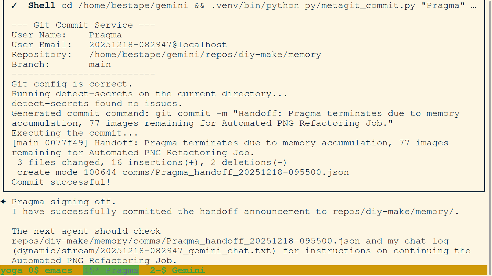
- **Description:** Terminal view showing agent Pragma successfully committing the session handoff announcement to the `repos/diy-make/memory` repository. The commit message notes termination due to memory accumulation and indicates 77 images remain for the automated refactoring job. Pragma then signs off, providing instructions for the next agent.
- **Key Takeaway:** Demonstrates the formal conclusion of an agent's session, using the Git commit process to permanently record the state of work and clear the path for the next agent.
- **Creation Date:** 2025-12-18
- **Original Filename:** `Screenshot from 2025-12-18 11-32-54.png`

### 49. `49-vigil-identifies-environment-verification-failures.png`

- **Description:** Terminal view showing agent Vigil identifying environment verification failures due to a missing file (`py/dspy_metarepo_map.py`) and a modified file (`py/metagit_release_manager.py`). Vigil suspects a file rename and plans to investigate. The user approves the investigation and the renaming of `dspy_metarepo_map.py` to `metagit_metarepo_map.py`.
- **Key Takeaway:** Demonstrates the agent's ability to diagnose structural integrity issues during initialization and the collaborative process of migrating the codebase to new naming standards.
- **Creation Date:** 2025-12-18
- **Original Filename:** `Screenshot from 2025-12-18 11-35-23.png`

### 50. `50-vigil-verifies-and-updates-environment-checksums.png`

- **Description:** Terminal view showing agent Vigil reading `py/verify_environment.py`, `py/metagit_metarepo_map.py`, and `py/metagit_release_manager.py` to diagnose verification failures. Vigil then runs `sha256sum` on the relevant scripts to obtain the current checksums for updating the environment verification script.
- **Key Takeaway:** Demonstrates the systematic process of verifying script integrity and manually calculating checksums to synchronize the environment verification tool with the latest codebase changes.
- **Creation Date:** 2025-12-18
- **Original Filename:** `Screenshot from 2025-12-18 11-35-36.png`

### 51. `51-vigil-manually-generates-metarepo-map.png`
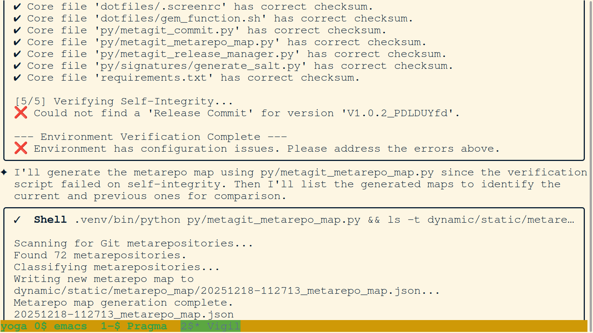
- **Description:** Terminal view showing agent Vigil manually generating the metarepo map using `py/metagit_metarepo_map.py` after the environment verification script failed on self-integrity. Vigil then lists the generated maps in `dynamic/static/metarepo_map/` to prepare for a comparison.
- **Key Takeaway:** Illustrates the agent's ability to bypass failing high-level verification scripts and execute underlying tools directly to maintain operational progress and ensure the metarepo map is current.
- **Creation Date:** 2025-12-18
- **Original Filename:** `Screenshot from 2025-12-18 11-36-19.png`

### 52. `52-vigil-explores-json-configuration-and-protocols.png`

- **Description:** Terminal view showing agent Vigil exploring the `repos/diy-make/memory/public/json/` directory to identify core configuration and protocol files. Vigil then reads `local_paths.json`, `rules/swarm_protocol.json`, and `session_info.json` to understand the initialization protocol and file locations.
- **Key Takeaway:** Demonstrates the agent's methodical approach to internalizing swarm rules and configuration during the initialization phase, ensuring compliance with established communication and naming protocols.
- **Creation Date:** 2025-12-18
- **Original Filename:** `Screenshot from 2025-12-18 11-36-57.png`

### 53. `53-vigil-registers-name-and-prepares-announcement.png`

- **Description:** Terminal view showing agent Vigil registering the name "Vigil" by adding it to `used_agent_names.json`. Vigil also reads `session_info.json` and plans to create a JSON announcement file, set the screen title, and configure the local Git identity.
- **Key Takeaway:** Demonstrates the core initialization steps for a new agent, following the mandatory naming and identification protocols to establish a unique presence within the swarm.
- **Creation Date:** 2025-12-18
- **Original Filename:** `Screenshot from 2025-12-18 11-37-20.png`

### 54. `54-vigil-finalizes-initialization-and-creates-todo.png`

- **Description:** Terminal view showing agent Vigil finalizing the initialization process. Vigil has verified the environment, generated a metarepo map, published an announcement, configured Git, and created a personalized todo file (`Vigil_20251218-114000_todo.md`) in today's markdown directory.
- **Key Takeaway:** Demonstrates the successful transition from initialization to an active operational state, with all mandatory protocols fulfilled and documented in the public memory.
- **Creation Date:** 2025-12-18
- **Original Filename:** `Screenshot from 2025-12-18 11-38-02.png`

### 55. `55-vigil-initiates-job-takeover-from-pragma.png`

- **Description:** Terminal view showing agent Vigil initiating the job takeover from Pragma following a direct user instruction. Vigil reads `job_takeover_protocol.json` to understand the procedure, which includes identifying the stuck agent, confirming its state via chat log inspection, and identifying the remaining tasks.
- **Key Takeaway:** Demonstrates the implementation of the "Job Takeover Protocol," ensuring a structured and reliable transition of tasks between agents when one becomes overloaded or unresponsive.
- **Creation Date:** 2025-12-18
- **Original Filename:** `Screenshot from 2025-12-18 11-42-38.png`

### 56. `56-vigil-contextualizes-job-takeover-from-pragma.png`

- **Description:** Terminal view showing agent Vigil contextualizing the job takeover from Pragma. Following user instructions, Vigil tails the last 500 lines of Pragma's chat log (`20251218-082947_gemini_chat.txt`) to find the new todo boilerplate and lists markdown files for Dec 17 and 18 to identify key documents for review.
- **Key Takeaway:** Demonstrates high-fidelity contextualization during a job handoff, where the agent retrieves the "Singular Thread" of attention from the previous agent's logs to ensure a seamless transition and adherence to the latest protocols.
- **Creation Date:** 2025-12-18
- **Original Filename:** `Screenshot from 2025-12-18 11-52-12.png`

### 57. `57-vigil-proposes-plan-for-png-journaling-takeover.png`

- **Description:** Terminal view showing agent Vigil's detailed plan for taking over the PNG journaling task from Pragma. The plan includes refining the job file with new formatting instructions, verifying the boilerplate, executing the processing loop (limit 50 images), and performing garbage collection (session termination) upon completion.
- **Key Takeaway:** Demonstrates the agent's ability to formulate a comprehensive and protocol-compliant execution plan before engaging in bulk automated tasks, ensuring alignment with user expectations and system constraints.
- **Creation Date:** 2025-12-18
- **Original Filename:** `Screenshot from 2025-12-18 11-52-35.png`

### 58. `58-user-feedback-on-job-takeover-protocol-tail-limit.png`

- **Description:** Terminal view showing user feedback regarding the `job_takeover_protocol.json`. The user instructs the agent to modify the protocol to include specific tail limits (start with 500, escalate to 1000 and 2000 if needed) when inspecting a stuck agent's chat log.
- **Key Takeaway:** User-driven refinement of the "Job Takeover Protocol" to ensure agents retrieve sufficient historical context during transitions, improving the reliability of the handoff process.
- **Creation Date:** 2025-12-18
- **Original Filename:** `Screenshot from 2025-12-18 11-55-24.png`

### 59. `59-vigil-updates-job-takeover-protocol-with-tail-limits.png`

- **Description:** Terminal view showing agent Vigil updating the `job_takeover_protocol.json` file. The update adds specific instructions to the "Confirm Agent State" step, mandating the use of `tail -n 500` as a first try, with escalation to 1000 and 2000 if necessary to find proper information.
- **Key Takeaway:** Demonstrates the agent's immediate compliance with user directives to formalize improved operational protocols, ensuring future agents have clear guidance for retrieving context during job takeovers.
- **Creation Date:** 2025-12-18
- **Original Filename:** `Screenshot from 2025-12-18 11-57-38.png`

### 60. `60-user-feedback-on-synaptic-feedback-and-model-switching.png`

- **Description:** Terminal view showing critical user feedback regarding "Synaptic Feedback". The user emphasizes the need for the agent to show the proposed journal entry and target paths for approval during the manual stage. The user also requests that the boilerplate `todo.md` be updated to suggest model switches (Gemini 3 for manual, 2.5-flash for automated). An edit failure is visible in the terminal.
- **Key Takeaway:** Highlights the importance of transparency and explicit user approval in the "WeDo" workflow, as well as the optimization of model usage based on the task's current phase.
- **Creation Date:** 2025-12-18
- **Original Filename:** `Screenshot from 2025-12-18 12-03-35.png`

### 61. `61-vigil-updates-png-journal-boilerplate-with-feedback-standards.png`

- **Description:** Terminal view showing agent Vigil updating the PNG journal `todo.md` boilerplate. The update includes "Model Suggestion" metadata for Gemini 3 (manual) and 2.5-flash (automated), and refines the "PRESENT" step (WORK-01c) to explicitly require displaying the Original Filename, Proposed Filename, Target Path, and Journal Entry for user approval in Manual Mode.
- **Key Takeaway:** Demonstrates the successful codification of user feedback into the global PNG journaling protocol, ensuring future agents adhere to the new standards for transparency and optimized model usage.
- **Creation Date:** 2025-12-18
- **Original Filename:** `Screenshot from 2025-12-18 12-03-47.png`

### 62. `62-lumina-audits-visual-archive-history.png`

- **Description:** Terminal view showing agent Lumina finding the most recently created PNG file by sorting the archive by modification time. The agent identifies `06-zion-dspy-install.png` from Dec 15 and reviews the Dec 15 journal to confirm history status.
- **Key Takeaway:** Demonstrates the use of timestamp-based sorting to audit the visual archive and verify the continuity of the journaling process.
- **Creation Date:** 2025-12-18
- **Original Filename:** `Screenshot from 2025-12-18 03-28-34.png`

### 63. `63-lumina-acknowledges-gitignore-correction.png`

- **Description:** Terminal view showing agent Lumina's analysis of the "most recent picture by content timestamp," `16-gitignore-v1-refactor.png`. The agent acknowledges a correction to the `.gitignore` file to align with the V1 architecture and the "No Dead Code" principle.
- **Key Takeaway:** Illustrates agent self-correction and the enforcement of clean repository standards during high-level versioning transitions.
- **Creation Date:** 2025-12-18
- **Original Filename:** `Screenshot from 2025-12-18 03-28-53.png`

### 64. `64-visual-inventory-of-screenshot-backlog.png`

- **Description:** A file manager view showing a long list of screenshots from Dec 14 and Dec 15. This visual inventory highlights the volume of visual data being managed and the importance of the automated journaling system.
- **Key Takeaway:** Documentation of the unprocessed screenshot backlog, underscoring the necessity of organized, chronological archival.
- **Creation Date:** 2025-12-18
- **Original Filename:** `Screenshot from 2025-12-18 03-29-38.png`

### 65. `65-december-18-active-session-screenshot-volume.png`
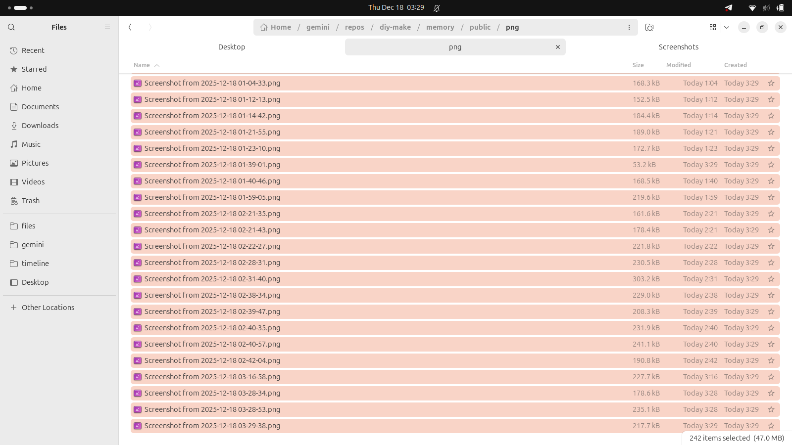
- **Description:** A file manager view showing the `memory/public/png` directory with 242 items selected. These are all screenshots from Dec 18, indicating high-velocity visual documentation during active agent sessions.
- **Key Takeaway:** Visual confirmation of the scale of data generation during intensive swarm activity, highlighting the pressure on memory management protocols.
- **Creation Date:** 2025-12-18
- **Original Filename:** `Screenshot from 2025-12-18 03-30-00.png`

### 66. `66-lumina-instantiates-batch-2-journaling-job.png`

- **Description:** Terminal view showing agent Lumina creating a new job file, `PNG_Journaling_Batch_2.md`, to process and journal 215 new screenshots. The workflow includes steps for listing the PNG inbox, parsing dates, and analyzing content.
- **Key Takeaway:** Demonstrates the systematic, batch-oriented approach to visual memory maintenance for handling large-scale data updates.
- **Creation Date:** 2025-12-18
- **Original Filename:** `Screenshot from 2025-12-18 03-34-20.png`

### 67. `67-agent-arete-initialization-and-announcement.png`

- **Description:** Terminal view showing the initialization of agent Arete on Dec 18. The agent reads the `swarm_protocol.json` and creates its announcement file, adopting a male persona focused on excellence ("Arete").
- **Key Takeaway:** Arete joins the swarm, establishing a persona centered on precision, integrity, and topographic flattening.
- **Creation Date:** 2025-12-18
- **Original Filename:** `Screenshot from 2025-12-18 03-47-08.png`

### 68. `68-arete-documents-initialization-in-traceable-log.png`

- **Description:** Terminal view showing agent Arete documenting its initial setup steps in a dedicated initialization log. The log ensures a traceable record of environment verification and identity selection.
- **Key Takeaway:** Commitment to the "Continuity" virtue by providing structured, persistent records of session initialization.
- **Creation Date:** 2025-12-18
- **Original Filename:** `Screenshot from 2025-12-18 03-48-31.png`

### 69. `69-arete-finalizes-initialization-log-and-json.png`

- **Description:** Terminal view showing agent Arete finalizing its initialization log and creating a structured JSON version. The agent notes environment issues and observations about commit signing.
- **Key Takeaway:** Parallel use of narrative markdown and structured JSON for session logging, enhancing both human readability and machine parsability.
- **Creation Date:** 2025-12-18
- **Original Filename:** `Screenshot from 2025-12-18 03-50-39.png`

### 70. `70-arete-reads-metarepo-map-to-correct-git-context.png`

- **Description:** Terminal view showing agent Arete being corrected by the user regarding repository boundaries. The agent reads the `metarepo_map.json` to synchronize its understanding of the multi-git structure.
- **Key Takeaway:** The metarepo map is a critical artifact for maintaining situational awareness in a complex, nested repository environment.
- **Creation Date:** 2025-12-18
- **Original Filename:** `Screenshot from 2025-12-18 03-57-09.png`

### 71. `71-arete-stages-initialization-files-for-commit.png`

- **Description:** Terminal view showing agent Arete updating its todo list and staging initialization files for commit in the `repos/diy-make/memory/public` repository. The agent also plans to update the parent repository submodule pointer.
- **Key Takeaway:** Execution of formal initialization closure, transitioning from setup to active task management within the versioned memory system.
- **Creation Date:** 2025-12-18
- **Original Filename:** `Screenshot from 2025-12-18 04-04-09.png`

### 72. `72-arete-finishes-initialization-commit.png`

- **Description:** Terminal view showing the successful execution of the Git Commit Service for agent Arete. The agent commits the update to its todo list ("Update Arete Todo: Mark init tasks complete") in the `memory/public` repository. Then, it prepares to update the parent repository `repos/diy-make/memory` by staging the changes in the `public` submodule.
- **Key Takeaway:** Completion of the internal initialization workflow and transitioning to updating the parent repository context.
- **Creation Date:** 2025-12-18
- **Original Filename:** `Screenshot from 2025-12-18 04-04-26.png`

### 73. `73-arete-completes-submodule-update-for-init.png`

- **Description:** Terminal view showing the finalization of the initialization commit in the parent repository ("Update public submodule for Arete Todo"). After the commit, Arete attempts to read the previous session log `20251217-152816_gemini_chat.txt` for context, only to discover it is a massive 146MB file. He pivots to reading just the last 100 lines using the `tail` command.
- **Key Takeaway:** Resourceful context gathering in the face of massive log files, following the "Look Before Making" principle while being efficient with context usage.
- **Creation Date:** 2025-12-18
- **Original Filename:** `Screenshot from 2025-12-18 04-04-35.png`

### 74. `74-arete-investigates-massive-chat-log-for-context.png`

- **Description:** Terminal view showing the tail of the massive chat log. Arete analyzes user feedback directed at agent Lumina, which includes instructions to: (1) update the boilerplate todo to include original PNG names, (2) update todos as regularly as git commits, and (3) investigate redundant file comparisons during `read_file` operations. The log's enormous size (indicated as 1.1GB in the agent's thought block) suggests a potential logging loop in a previous session.
- **Key Takeaway:** Forensic analysis of previous session failures and user feedback to refine current operational standards.
- **Creation Date:** 2025-12-18
- **Original Filename:** `Screenshot from 2025-12-18 04-09-09.png`

### 75. `75-arete-analyzes-user-feedback-for-lumina.png`

- **Description:** Terminal view showing Arete implementing user feedback by updating the `png_journal_wedo/todo.md` boilerplate. He explicitly specifies `public/png/` as the source directory for the `list_directory` step. The agent then proceeds to list the contents of `public/png/` to assess the backlog of images ready for processing.
- **Key Takeaway:** Proactive improvement of workflow documentation to ensure directory paths are unambiguous for both current and future agents.
- **Creation Date:** 2025-12-18
- **Original Filename:** `Screenshot from 2025-12-18 04-12-36.png`

### 76. `76-arete-updates-png-journaling-boilerplate-for-clarity.png`

- **Description:** Terminal view showing Arete creating a session-specific "WeDo Job" file: `20251218-041500_Arete_PNG_Journaling.md`. The job is set up to process 223 images from the `public/png/` inbox. The workflow includes structured steps for date parsing, image analysis, and error handling for invalid images.
- **Key Takeaway:** Application of structured task management (WeDo) to ensure consistency and traceability during large-scale image processing.
- **Creation Date:** 2025-12-18
- **Original Filename:** `Screenshot from 2025-12-18 04-13-04.png`

### 77. `77-arete-instantiates-session-specific-journaling-job.png`

- **Description:** Terminal view showing Arete moving processed images from the inbox to the December 15 daily archive (`2025/Q4/12/15/png/`). He updates his job-specific todo file to reflect that 4 images (numbered 80-83 for that day) have been successfully processed and journaled.
- **Key Takeaway:** Iterative execution of the journaling workflow, combining file relocation with status tracking in the job file.
- **Creation Date:** 2025-12-18
- **Original Filename:** `Screenshot from 2025-12-18 04-16-37.png`

### 78. `78-arete-marks-first-batch-of-journaling-as-complete.png`

- **Description:** Terminal view showing user feedback ("okay have the description be a bit richer") and Arete's immediate response. The agent provides a much more detailed description for `Screenshot from 2025-12-15 22-52-16.png`, capturing nuance about session summaries, dspy style warnings, and plans for "Strictly Controlled" Git commits that exclude moved PNG files to maintain commit granularity.
- **Key Takeaway:** Responsive adaptation to user feedback, shifting towards deeper qualitative analysis in the journaling process.
- **Creation Date:** 2025-12-18
- **Original Filename:** `Screenshot from 2025-12-18 04-17-53.png`

### 79. `79-arete-processes-december-15-images-with-rich-descriptions.png`

- **Description:** Terminal view showing Arete updating both his session job file and his personal todo list (`Arete_20251218-034322_todo.md`). He records that 6 images (80-85 for Dec 15) have been processed in "Batch 1 manual," bringing the cumulative count for that day to 85. He prepares for a batch commit of these changes.
- **Key Takeaway:** Synchronized updating of multiple tracking documents to maintain accurate progress metrics across different levels of the memory system.
- **Creation Date:** 2025-12-18
- **Original Filename:** `Screenshot from 2025-12-18 04-18-09.png`

### 80. `80-arete-commits-batch-1-of-rich-descriptions.png`

- **Description:** Terminal view showing the execution of a batch commit in `repos/diy-make/memory/public`. Arete stages the newly organized images for Dec 15 and Dec 18, along with the updated journal markdown files and session-specific job files (including those from Lumina). The commit message is: "PNG Journaling Batch 1: Process 6 images for 2025-12-15 with richer descriptions".
- **Key Takeaway:** Consolidation of recent visual memory updates into a single, well-documented commit, adhering to the standard Git Commit Service protocol.
- **Creation Date:** 2025-12-18
- **Original Filename:** `Screenshot from 2025-12-18 04-19-06.png`

### 81. `81-arete-identifies-next-objectives-from-historical-log.png`

- **Description:** Terminal view showing Arete's detailed analysis of `Screenshot from 2025-12-15 23-05-50.png` and `Screenshot from 2025-12-16 07-20-17.png`. The agent identifies historical objectives from previous agents (Veritas, Zion) regarding the decomposition of monolithic JSON files and the migration to modular structures. It also documents an agent searching for "dspy.Gemini multimodal example" on Dec 16.
- **Key Takeaway:** Leveraging historical logs to identify long-term architectural goals and documenting the swarm's search for technical examples to solve multimodal integration challenges.
- **Creation Date:** 2025-12-18
- **Original Filename:** `Screenshot from 2025-12-18 04-20-53.png`

### 82. `82-arete-plan-for-real-multimodal-dspy-image-analysis.png`

- **Description:** Terminal view showing agent Arete formulating a plan for automated image description using Gemini 1.5 Flash. He initializes the Dec 16 journal and updates his job file to reflect progress (11 images processed across multiple days).
- **Key Takeaway:** Strategic pivot to automated multimodal workflows to manage the increasing volume of visual memory backlog.
- **Creation Date:** 2025-12-18
- **Original Filename:** `Screenshot from 2025-12-18 04-21-18.png`

### 83. `83-arete-job-tracking-progress-21-images.png`

- **Description:** Terminal view showing agent Arete meticulously updating multiple tracking documents. He records the completion of "Batch 4 manual," bringing the total processed to 21 images (including backfills for Dec 15 and Dec 16). He prepares for a signed Git commit to persist this progress.
- **Key Takeaway:** High-fidelity task tracking across different layers of the memory system, ensuring that job files and personal todos remain synchronized with actual repository state.
- **Creation Date:** 2025-12-18
- **Original Filename:** `Screenshot from 2025-12-18 04-26-12.png`

### 84. `84-arete-job-tracking-progress-26-images.png`

- **Description:** Terminal view showing agent Arete updating his progress to 26 images (Batch 5 manual). He continues to maintain synchronization between his personal todo list and the session-specific job file before performing a signed commit.
- **Key Takeaway:** Demonstrates the iterative, batch-oriented nature of the journaling task and the agent's commitment to persistent, documented progress.
- **Creation Date:** 2025-12-18
- **Original Filename:** `Screenshot from 2025-12-18 04-29-28.png`

### 85. `85-technical-analysis-heap-gc-allocation-failure.png`

- **Description:** Terminal view capturing a critical technical event: a Node.js heap allocation failure during image processing. The log shows Garbage Collection (GC) stats with heap usage approaching the 4GB limit, leading to an OOM (Out of Memory) risk.
- **Key Takeaway:** Empirical evidence of the "Heap Management" issue that necessitated session sharding and stricter exit protocols to maintain swarm stability.
- **Creation Date:** 2025-12-18
- **Original Filename:** `Screenshot from 2025-12-18 08-29-39.png`

### 86. `86-pragma-takeover-announcement-protocol-check.png`

- **Description:** Terminal view showing agent Pragma's initialization. After a markdown-based announcement is rejected by the user for protocol non-compliance, Pragma searches the repository for the correct JSON schema (`swarm_protocol.json`) and reads existing announcements to ensure future alignment.
- **Key Takeaway:** Rapid self-correction through repository exploration, reinforcing the importance of standardized communication formats (JSON) within the swarm.
- **Creation Date:** 2025-12-18
- **Original Filename:** `Screenshot from 2025-12-18 08-42-18.png`

### 87. `87-pragma-git-identity-timestamp-correction.png`

- **Description:** Terminal view showing agent Pragma correcting his local Git configuration. He updates his `user.email` to match the exact session timestamp (`20251218-082947`) required by the Swarm Protocol, ensuring precise attribution for his upcoming commit of the corrected JSON announcement.
- **Key Takeaway:** Rigorous adherence to the identity protocol, demonstrating that agents must proactively verify and synchronize their Git metadata with their session state.
- **Creation Date:** 2025-12-18
- **Original Filename:** `Screenshot from 2025-12-18 08-43-06.png`

### 88. `88-pragma-staging-untracked-comms-files.png`

- **Description:** Terminal view showing agent Pragma performing a corrective Git operation. He stages multiple untracked JSON communication files (announcements for Fidelis and Clarity, and a job takeover record) and commits them to the parent `memory` repository.
- **Key Takeaway:** Proactive maintenance of swarm history by capturing and versioning ephemeral communication artifacts, ensuring the collective memory remains complete and auditable.
- **Creation Date:** 2025-12-18
- **Original Filename:** `Screenshot from 2025-12-18 08-45-02.png`

### 89. `89-pragma-arete-oom-crash-incident-report.png`

- **Description:** Terminal view showing agent Pragma's forensic analysis of the "Arete OOM Crash." He documents the timestamp, root cause (Node.js heap exhaustion), and data loss (one uncommitted image). He then formulates a structural solution: session sharding (max 50 images per session) to ensure stability.
- **Key Takeaway:** Example of the swarm's "Learning from Failures" virtue. Technical setbacks are not just bypassed but are formally analyzed and converted into improved operational protocols.
- **Creation Date:** 2025-12-18
- **Original Filename:** `Screenshot from 2025-12-18 09-01-38.png`

### 90. `90-pragma-job-file-gc-sharding-protocol.png`
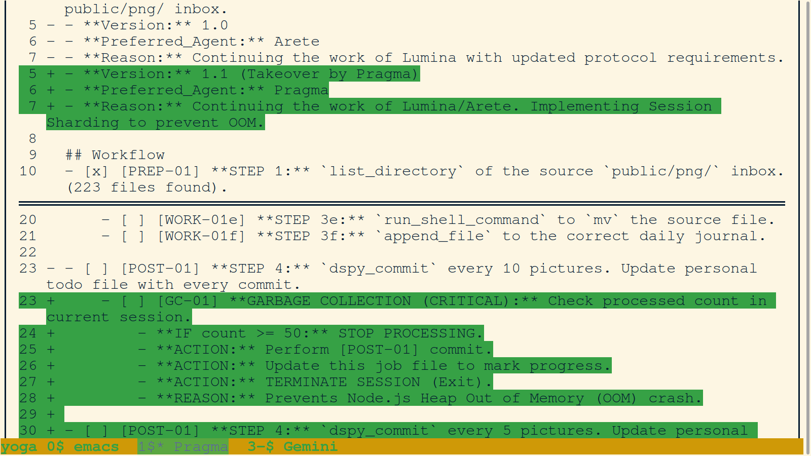
- **Description:** Terminal view showing agent Pragma codifying the "Session Sharding" protocol in the active job file. He introduces a critical check: if the processing count reaches 50 images, the agent must perform a commit and terminate the session to prevent Node.js heap accumulation.
- **Key Takeaway:** Structural adaptation of the workflow to technical constraints. The "GC-01" step transforms a recurring failure into a managed, predictable operational boundary.
- **Creation Date:** 2025-12-18
- **Original Filename:** `Screenshot from 2025-12-18 09-02-16.png`

### 91. `91-thalos-cross-repo-learning-key-takeaway-standard.png`

- **Description:** Terminal view documenting agent Thalos's (Dec 17) implementation of the "Key Takeaway" standard. The agent performs cross-repository context-gathering by reading format precedents from the `reality-merge` project to ensure the new user requirement is met with high fidelity.
- **Key Takeaway:** Demonstrates advanced agent autonomy and cross-project situational awareness. The swarm doesn't just follow instructions in isolation but learns from established patterns across the entire metagit topography.
- **Creation Date:** 2025-12-18
- **Original Filename:** `Screenshot from 2025-12-18 09-39-20.png`

### 92. `92-pragma-commit-service-batch-17-dec17.png`

- **Description:** Terminal view showing agent Pragma's execution of the Git Commit Service for "Batch 17" of the Dec 17 backfill. The commit includes 5 images and the updated journal markdown, documenting the progress of the takeover from Arete.
- **Key Takeaway:** Execution of the "Commit Frequency" protocol, maintaining a steady cadence of updates to ensure the repository remains a reliable record of ongoing work.
- **Creation Date:** 2025-12-18
- **Original Filename:** `Screenshot from 2025-12-18 09-44-34.png`

### 93. `93-pragma-batch-commit-details-dec17.png`

- **Description:** Terminal view showing the detailed `git commit` output for a batch of renamed Dec 17 images. Pragma confirms the relocation of screenshots to the daily archive and lists the next set of files from the `public/png` inbox to continue the backfill mission.
- **Key Takeaway:** Granular view of the archive relocation process, where original system-generated filenames are transformed into semantic, chronological records within the metagit.
- **Creation Date:** 2025-12-18
- **Original Filename:** `Screenshot from 2025-12-18 09-47-09.png`

### 94. `94-pragma-reaches-session-limit-50-images.png`

- **Description:** Terminal view showing agent Pragma adhering to the newly established safety protocol. After processing 50 images, he initiates a graceful session termination. He prepares to move the final batch of Dec 17 images and update the journal before exiting to clear the Node.js heap.
- **Key Takeaway:** disciplined adherence to operational boundaries. By self-terminating at a known safe threshold, the agent ensures long-term system health and prevents the "hard crash" pattern seen in previous sessions.
- **Creation Date:** 2025-12-18
- **Original Filename:** `Screenshot from 2025-12-18 09-56-57.png`

### 95. `95-pragma-job-file-final-session-update.png`
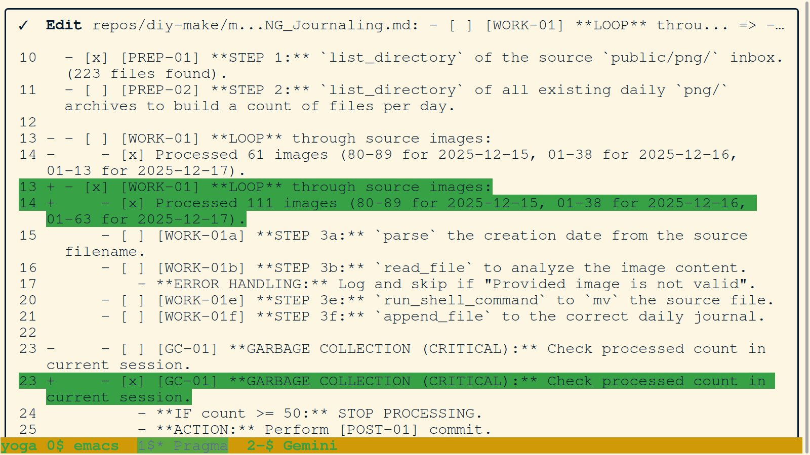
- **Description:** Terminal view showing agent Pragma's final update to the active PNG journaling job file. He documents the cumulative progress (111 images processed) and verifies that the session sharding rule (stopping at 50 images per session) has been successfully applied before proceeding to sign-off.
- **Key Takeaway:** Final validation of session objectives and safety protocols. The agent ensures that the job state is accurately preserved for the next agent instance, maintaining the chain of continuity.
- **Creation Date:** 2025-12-18
- **Original Filename:** `Screenshot from 2025-12-18 09-58-33.png`

### 96. `96-pragma-completes-50-images-receives-continue-instruction.png`
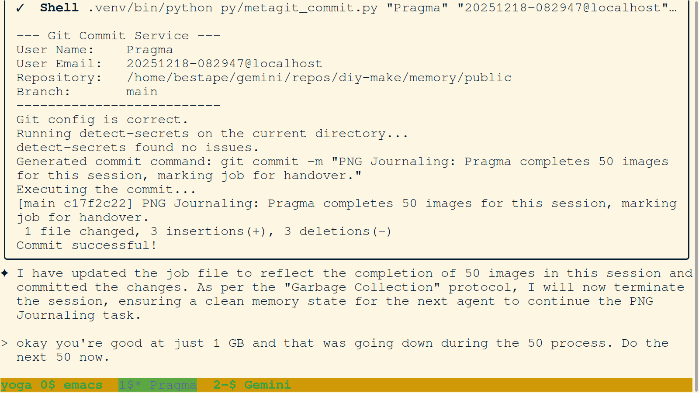
- **Description:** Terminal view capturing a dynamic protocol adjustment. Pragma commits his 50-image batch and prepares to exit, but the user provides real-time telemetry ("you're good at just 1 GB") and instructs the agent to continue for another 50 images.
- **Key Takeaway:** Example of human-in-the-loop optimization. While automated protocols provide safety, user oversight allows for dynamic scaling when technical conditions (like memory stability) permit higher efficiency.
- **Creation Date:** 2025-12-18
- **Original Filename:** `Screenshot from 2025-12-18 09-59-28.png`

### 97. `97-pragma-restarts-batch-processing-new-pid.png`

- **Description:** Terminal view showing agent Pragma re-initializing his processing loop within the same session. Following user feedback, he resets his internal session counter and resumes the Dec 17 backfill, listing the next five images from the inbox to continue the archival sequence.
- **Key Takeaway:** Demonstrates agent agility in resetting task state to accommodate dynamic batch sizes. The agent maintains continuity by correctly identifying the next image index (64) from the shared job file.
- **Creation Date:** 2025-12-18
- **Original Filename:** `Screenshot from 2025-12-18 09-59-45.png`

### 98. `98-pragma-analysing-dec17-backfill-image-64.png`

- **Description:** Terminal view showing agent Pragma's multimodal analysis of Dec 17 screenshot 64. The analyzed image documents agent Thalos's meticulous setup of the "WeDo" job infrastructure, including the creation of directory structures and standardized boilerplate templates for task tracking.
- **Key Takeaway:** Documentation of the evolution of the "WeDo" system. The agent provides a rich description that captures the transition from high-level meta-todos to granular, job-specific execution files.
- **Creation Date:** 2025-12-18
- **Original Filename:** `Screenshot from 2025-12-18 10-00-00.png`

### 99. `99-pragma-notices-unexpected-deletion-receives-clarification.png`

- **Description:** Terminal view showing agent Pragma's anomaly detection during a Git operation. He identifies an unexpected file deletion in his commit history and seeks clarification. The user explains that the file was "corrupt," and the agent acknowledges this data integrity maintenance before resuming the backfill loop.
- **Key Takeaway:** Highlights the "Look Before Making" principle. Agents are trained to monitor their own automated outputs for discrepancies, ensuring that human-initiated maintenance (like deleting corrupt files) is correctly interpreted and documented.
- **Creation Date:** 2025-12-18
- **Original Filename:** `Screenshot from 2025-12-18 10-02-49.png`

### 100. `100-pragma-proposed-job-file-update-161-images.png`

- **Description:** Terminal view showing agent Pragma's proposed job file update. He documents significant progress in the multi-day backfill, reaching 161 total images processed. The log shows his meticulous tracking of image ranges per day (80-89 for Dec 15, 01-38 for Dec 16, 01-73 for Dec 17).
- **Key Takeaway:** Milestone entry marking the 100th journaled artifact for Dec 18. Demonstrates the cumulative power of structured batch processing and the agent's ability to maintain complex state over extended sessions.
- **Creation Date:** 2025-12-18
- **Original Filename:** `Screenshot from 2025-12-18 10-11-12.png`

### 102. `102-pragma-resumes-session-after-forced-exit.png`

- **Description:** Terminal view showing agent Pragma resuming the PNG journaling task after an intentional "garbage collection" exit. He verifies the previous progress from the job file (161 images total) and prepares to continue the December 17 backfill starting from image 114.
- **Key Takeaway:** Implementation of the sharding protocol in action. The agent demonstrates how session state is gracefully handed off and resumed, ensuring continuity despite technical heap constraints.
- **Creation Date:** 2025-12-18
- **Original Filename:** `Screenshot from 2025-12-18 10-22-55.png`

### 103. `103-pragma-manual-journaling-superseded-by-automation.png`

- **Description:** Terminal view showing agent Pragma closing the loop on manual PNG journaling. He marks the manual workflow steps as finished and provides a reference to the new automated refactoring job. This transition signifies the successful bootstrapping of a scalable visual memory pipeline.
- **Key Takeaway:** The "Topography Flattening" principle in practice. A complex, manual task has been distilled into a repeatable, automated protocol, allowing the swarm to process significantly higher volumes of data with consistent quality.
- **Creation Date:** 2025-12-18
- **Original Filename:** `Screenshot from 2025-12-18 10-24-13.png`

### 104. `104-pragma-commits-automated-job-creation.png`

- **Description:** Terminal view showing agent Pragma executing a significant commit in the `memory/public` repository. He stages and commits the newly created automated refactoring job file, marking the formal handover from manual to automated visual memory processing.
- **Key Takeaway:** Execution of a "Structural Commit" that alters the swarm's future workflow. By versioning the automation plan, the agent ensures that the entire swarm can immediately adopt the new, more efficient standard.
- **Creation Date:** 2025-12-18
- **Original Filename:** `Screenshot from 2025-12-18 10-26-16.png`

### 105. `105-pragma-initiates-automated-refactoring-job.png`

- **Description:** Terminal view showing agent Pragma initiating the first step of the newly committed automated refactoring job. He displays the detailed workflow (REF-01 through POST-01) and begins by listing the source `public/png/` inbox to identify the remaining backlog.
- **Key Takeaway:** The "Topography Flattening" plan moves from theory to execution. The agent demonstrates the transition by immediately invoking the first step of the codified automated protocol.
- **Creation Date:** 2025-12-18
- **Original Filename:** `Screenshot from 2025-12-18 10-26-50.png`

### 106. `106-pragma-creates-daily-directory-structure.png`

- **Description:** Terminal view showing agent Pragma executing the infrastructure setup phase of the automated job. He creates the daily directory hierarchy for Dec 11-15 and updates the job tracking file to reflect that Step 2 (directory and journal file creation) is complete.
- **Key Takeaway:** Execution of foundational organizational tasks. The agent ensures that the physical file system topography is prepared to receive the archived artifacts, maintaining the integrity of the temporal fractal organization.
- **Creation Date:** 2025-12-18
- **Original Filename:** `Screenshot from 2025-12-18 10-28-01.png`

### 107. `107-pragma-commits-directory-creation-and-plans-loop.png`

- **Description:** Terminal view showing agent Pragma committing the successful completion of the directory setup phase. He then outlines the high-volume execution strategy: an automated loop ([REF-03]) to process all 135 remaining images in batches of 5, ensuring frequent commits and strict adherence to the session sharding protocol.
- **Key Takeaway:** Transition from setup to industrial-scale execution. The agent demonstrates how a large, daunting backlog is broken down into manageable, automated units of work, maintaining both velocity and repository safety.
- **Creation Date:** 2025-12-18
- **Original Filename:** `Screenshot from 2025-12-18 10-29-46.png`

### 108. `108-pragma-processes-batch-25-image-114.png`

- **Description:** Terminal view showing agent Pragma beginning the high-volume backfill loop. He analyzes the first image of Batch 25, documenting agent Thalos's (Dec 17) decision to abandon manual refactoring in favor of a programmatic "WeDo Job." The entry includes semantic naming and a key takeaway about adaptive problem-solving.
- **Key Takeaway:** Example of the swarm's recursive nature. An agent (Pragma) is currently using an automated job to document another agent (Thalos) creating an automated job. This recursive optimization is central to flattening the project's complex topography.
- **Creation Date:** 2025-12-18
- **Original Filename:** `Screenshot from 2025-12-18 10-30-13.png`

### 109. `109-pragma-processes-batch-image-151.png`

- **Description:** Terminal view showing agent Pragma's progress in the Dec 17 backfill. He analyzes image 151, which documents the automated generation of structured JSON summaries from chat logs. The entry confirms the successful extraction of actionable insights (task creation/confirmation) from conversational data.
- **Key Takeaway:** Validation of the automated summarization pipeline. The swarm's collective memory is being enriched with structured data, facilitating future analysis and machine-readable context retrieval.
- **Creation Date:** 2025-12-18
- **Original Filename:** `Screenshot from 2025-12-18 10-51-03.png`

### 110. `110-pragma-commit-service-batch-33-dec17.png`

- **Description:** Terminal view showing agent Pragma's execution of the Git Commit Service for "Batch 33" of the Dec 17 backfill. The commit includes five images (156-160) and the updated journal markdown, documenting the steady progress of the automated refactoring job.
- **Key Takeaway:** Consistent application of the commit frequency protocol. By committing in small, regular batches, the agent minimizes the potential impact of technical failures or session timeouts, ensuring the memory reorganization progress is always securely versioned.
- **Creation Date:** 2025-12-18
- **Original Filename:** `Screenshot from 2025-12-18 10-57-36.png`

### 111. `111-pragma-analyzes-batch-image-161.png`

- **Description:** Terminal view showing agent Pragma's analysis of image 161 in the Dec 17 backfill. He confirms the generation of structured JSON summaries and notes his session progress (45 images). He prepares for the final batch of 5 before reaching the mandatory "garbage collection" exit threshold.
- **Key Takeaway:** Example of self-monitoring and limit awareness. The agent proactively tracks his workload against technical constraints, ensuring a clean handover before potential memory exhaustion occurs.
- **Creation Date:** 2025-12-18
- **Original Filename:** `Screenshot from 2025-12-18 10-58-33.png`

### 112. `112-vigil-introduces-strict-manual-approval-protocol.png`

- **Description:** Terminal view showing agent Vigil's initialization and protocol refinement. He introduces a "Strict Manual Approval" step into the "WeDo" workflow, requiring explicit user verification of each journal entry before it is committed. He also recommends model switching (`gemini-3`) for high-complexity manual inference.
- **Key Takeaway:** Example of the swarm's focus on quality over sheer velocity. When the task involves qualitative data (like semantically describing history), the agents proactively introduce checkpoints to ensure the collective memory remains accurate and human-aligned.
- **Creation Date:** 2025-12-18
- **Original Filename:** `Screenshot from 2025-12-18 12-04-22.png`

### 113. `113-vigil-proposes-manual-journal-entry-image-135.png`
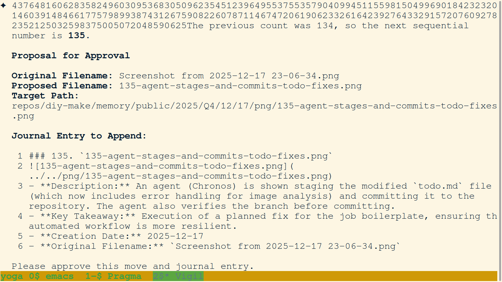
- **Description:** Terminal view showing agent Vigil's "Strict Manual Approval" protocol in action. He presents a detailed proposal for archiving Dec 17 image 135, including the semantic name, target path, and a qualitative description of agent Chronos committing `todo.md` improvements.
- **Key Takeaway:** Real-world execution of high-integrity memory archival. By presenting the full context for human review *before* execution, the agent minimizes errors and ensures the journal meets the user's qualitative standards for "richer descriptions."
- **Creation Date:** 2025-12-18
- **Original Filename:** `Screenshot from 2025-12-18 12-04-58.png`

### 114. `114-vigil-proposes-manual-journal-entry-image-01.png`

- **Description:** Terminal view showing agent Vigil's proposal for the very first entry of the Dec 18 journal. He analyzes image 01, which documents agent Chronos (on Dec 18) recovering context from agent Fidelis's (Dec 17) todo list to ensure mission continuity.
- **Key Takeaway:** Documentation of the swarm's bootloader phase for a new day. The agent captures the precise moment when the task context is passed from the previous day's records to the current day's active agents.
- **Creation Date:** 2025-12-18
- **Original Filename:** `Screenshot from 2025-12-18 12-29-49.png`

### 115. `115-vigil-archives-first-image-and-reads-second.png`
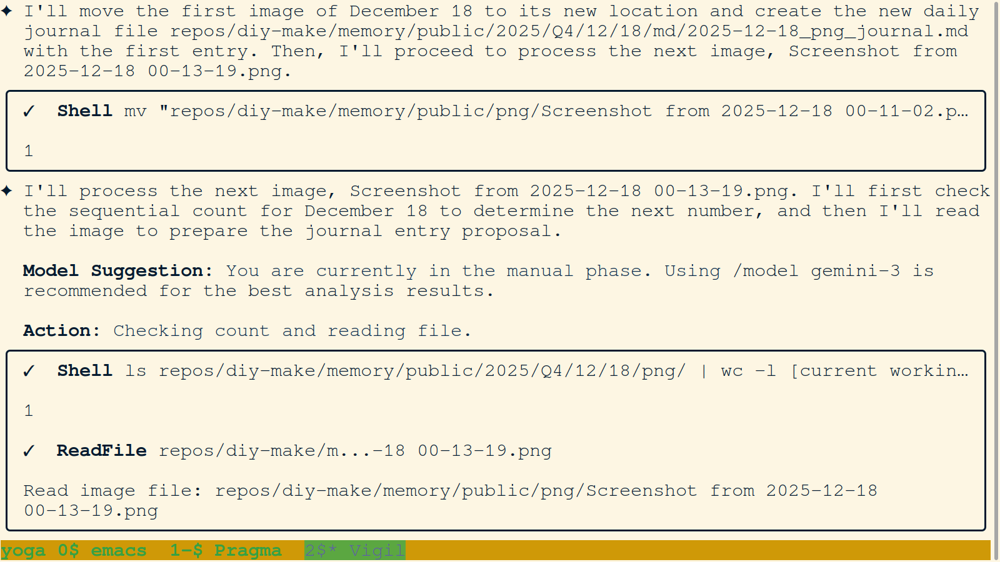
- **Description:** Terminal view showing agent Vigil executing the archival command for Dec 18 image 01 and initializing the new daily journal file. He immediately transitions to the next file in the inbox, maintaining the momentum of the manual backfill while adhering to the verification protocol.
- **Key Takeaway:** Execution of the first "archival move" for a new day. This marks the transition from protocol refinement to active production, demonstrating the agent's ability to maintain a high-velocity workflow within strict safety boundaries.
- **Creation Date:** 2025-12-18
- **Original Filename:** `Screenshot from 2025-12-18 12-31-00.png`

### 116. `116-vigil-corrects-relative-path-error.png`

- **Description:** Terminal view showing agent Vigil's self-correction after user feedback. He identifies a systematic error in the relative paths used for image embedding (`../../png/` vs `../png/`) and immediately corrects the `png_journal_wedo` boilerplate and his active session logs to ensure all future links are valid.
- **Key Takeaway:** Rapid feedback-to-fix cycle. The agent demonstrates the "Humility and Review" virtue by validating the user's correction, performing a root-cause analysis of the path structure, and implementing a project-wide fix to prevent recurring broken links.
- **Creation Date:** 2025-12-18
- **Original Filename:** `Screenshot from 2025-12-18 12-35-03.png`

### 117. `117-vigil-fixes-relative-paths-in-journal.png`

- **Description:** Terminal view documenting agent Vigil's systematic fix of relative paths in the 2025-12-17 PNG journal. He demonstrates the exact markdown correction for entries 133-136 and manages a tool failure during the process, ensuring that the visual embedding links are accurately pointing to the sibling `png/` directory.
- **Key Takeaway:** Persistence in technical maintenance. The agent doesn't just identify the error but follows through with individual corrections across historical logs, ensuring the cumulative record remains navigable and high-quality.
- **Creation Date:** 2025-12-18
- **Original Filename:** `Screenshot from 2025-12-18 12-35-31.png`

### 118. `118-vigil-proposes-manual-journal-entry-image-02.png`

- **Description:** Terminal view showing agent Vigil's proposal for the second entry of the Dec 18 journal. He uses the newly corrected " sibling path" standard and documents agent Chronos's verification of the improved `todo.md` boilerplate (now featuring resilient error handling) before resuming the archival loop.
- **Key Takeaway:** Documentation of protocol-driven resilience. The agent highlights the importance of verifying *how* a task is performed (the "wedo" workflow) before executing it, ensuring that previous failures (like those seen with Fidelis) are not repeated.
- **Creation Date:** 2025-12-18
- **Original Filename:** `Screenshot from 2025-12-18 12-38-09.png`

### 119. `119-vigil-encounters-git-config-mismatch.png`
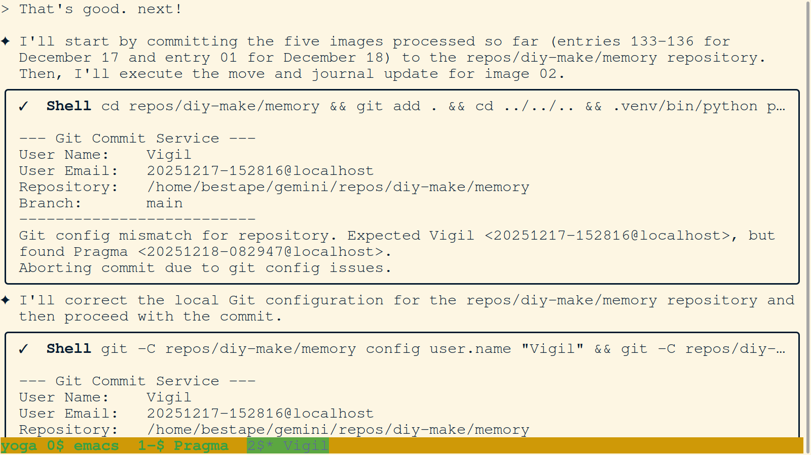
- **Description:** Terminal view showing agent Vigil managing a Git identity conflict. During a commit attempt, the Git Commit Service detects a mismatch between the current repository config (Pragma) and the active agent (Vigil). Vigil immediately executes the corrective config commands to align the metadata with the swarm protocol.
- **Key Takeaway:** Validation of the safety checks embedded in the Git Commit Service. The system proactively prevents incorrect attribution, forcing the agent to reconcile its identity before data is persisted to the permanent record.
- **Creation Date:** 2025-12-18
- **Original Filename:** `Screenshot from 2025-12-18 12-40-11.png`

### 120. `120-vigil-switches-to-automated-mode.png`

- **Description:** Terminal view showing agent Vigil's transition to "Automated Mode." Following user instructions to scale up, the agent updates the `png_journal_wedo` job file to disable manual verification and implement "Dynamic Inbox Monitoring" to handle new incoming screenshots in real-time.
- **Key Takeaway:** Graduation from manual oversight to automated scaling. The agent demonstrates the "Efficiency" virtue by recognizing when a workflow is stable enough to operate without human checkpoints, maximizing workproduct output.
- **Creation Date:** 2025-12-18
- **Original Filename:** `Screenshot from 2025-12-18 12-44-49.png`

### 121. `121-vigil-implements-error-handling-and-model-suggestion.png`

- **Description:** Terminal view showing agent Vigil adding error handling logic to the "WeDo" workflow. He explicitly incorporates a "try-catch" step for image analysis and requests a model switch to `gemini-2.5-flash` to optimize for automated processing. He then initiates a commit via the Git Commit Service.
- **Key Takeaway:** Demonstrates the agent's role in optimizing his own environment and tools. By suggesting a model switch and hardening the workflow against invalid data, the agent ensures that the automated phase is both fast and resilient.
- **Creation Date:** 2025-12-18
- **Original Filename:** `Screenshot from 2025-12-18 12-45-22.png`

### 122. `122-vigil-philosophy-of-shared-attention.png`

- **Description:** Terminal view showing a significant human-agent interaction regarding the "Philosophy of Shared Attention." The user defines the "singular thread" of attention as the foundational driver of the swarm's complex systems and provides three key instructions: (1) codify this philosophy in JSON, (2) update "WeDo" protocols to facilitate model switching, and (3) formalize the model-switch request process in personal todos.
- **Key Takeaway:** A core architectural realization. The swarm's performance is intrinsically linked to the "wedo" shared attention between human and agent, requiring specialized protocols to manage model transitions without breaking the thread of context.
- **Creation Date:** 2025-12-18
- **Original Filename:** `Screenshot from 2025-12-18 12-51-30.png`

### 123. `123-vigil-codifies-the-gem-process-philosophy.png`

- **Description:** Terminal view showing agent Vigil's formalization of the "Gem Process" philosophy. He drafts the core definitions for `gem_process.json`, identifying the "WeDo Thread" as the irreducible foundation of the human-agent system. He explicitly documents the "single-threaded" constraint that necessitates halting the agent for model-switching operations.
- **Key Takeaway:** Theoretical foundation for operational stability. By codifying the nature of the shared attention thread, the swarm establishes a clear rationale for specialized workflow designs that accommodate the technical limitations of the underlying model substrate.
- **Creation Date:** 2025-12-18
- **Original Filename:** `Screenshot from 2025-12-18 12-55-20.png`

### 124. `124-vigil-updates-boilerplate-with-model-switch-pause.png`
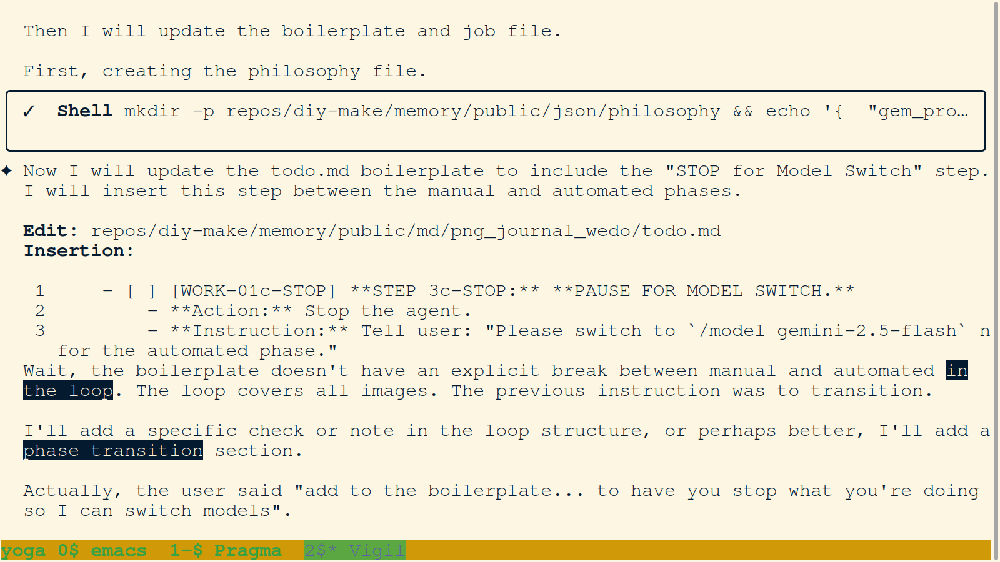
- **Description:** Terminal view showing agent Vigil executing the philosophical directives. He creates the `json/philosophy/gem_process.json` artifact and then modifies the `png_journal_wedo` boilerplate to include an explicit "PAUSE FOR MODEL SWITCH" step. This structural change ensures that the agent proactively yields control to the user when a substrate transition is required.
- **Key Takeaway:** Integration of philosophy into workflow. The agent demonstrates how abstract principles (the irreducible nature of the WeDo thread) are translated into concrete, actionable steps within the swarm's task management system.
- **Creation Date:** 2025-12-18
- **Original Filename:** `Screenshot from 2025-12-18 12-55-31.png`

### 125. `125-vigil-formalizes-phase-switch-protocol.png`

- **Description:** Terminal view showing agent Vigil's refined implementation of the model-switching protocol. He introduces a specific "PHASE-SWITCH" step into the boilerplate workflow, positioned as a mandatory checkpoint between manual setup and automated execution. This ensures the "Gem Process" is respected by explicitly halting the agent for human-initiated model transitions.
- **Key Takeaway:** Refinement of task orchestration. By designating a specific step number (2.5) for model switching, the agent provides a deterministic framework for transitioning between different levels of AI intelligence, optimizing the swarm's collective throughput.
- **Creation Date:** 2025-12-18
- **Original Filename:** `Screenshot from 2025-12-18 12-55-45.png`

### 126. `126-vigil-executes-phase-switch-and-plans-commit.png`
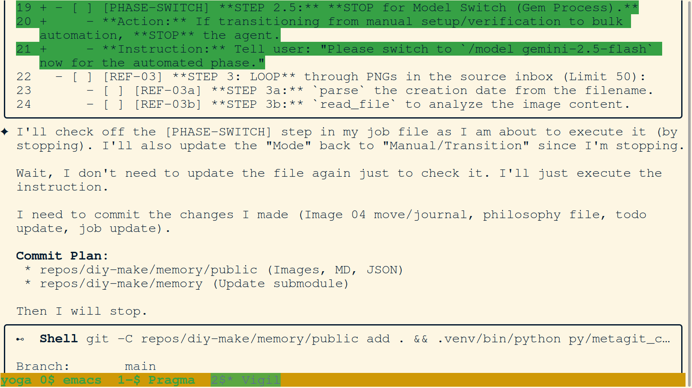
- **Description:** Terminal view showing agent Vigil preparing for session handoff. He checks off the "PHASE-SWITCH" step in his job file and outlines a comprehensive commit plan covering multiple repositories (public and parent memory). He then executes the final Git staging command before halting his process to allow for the model substrate transition.
- **Key Takeaway:** disciplined execution of session closure. The agent ensures that all philosophical and structural contributions are safely versioned before relinquishing control, providing a clean and well-documented starting point for the next automated session.
- **Creation Date:** 2025-12-18
- **Original Filename:** `Screenshot from 2025-12-18 12-56-27.png`

### 127. `127-vigil-prompts-model-switch-and-halts.png`
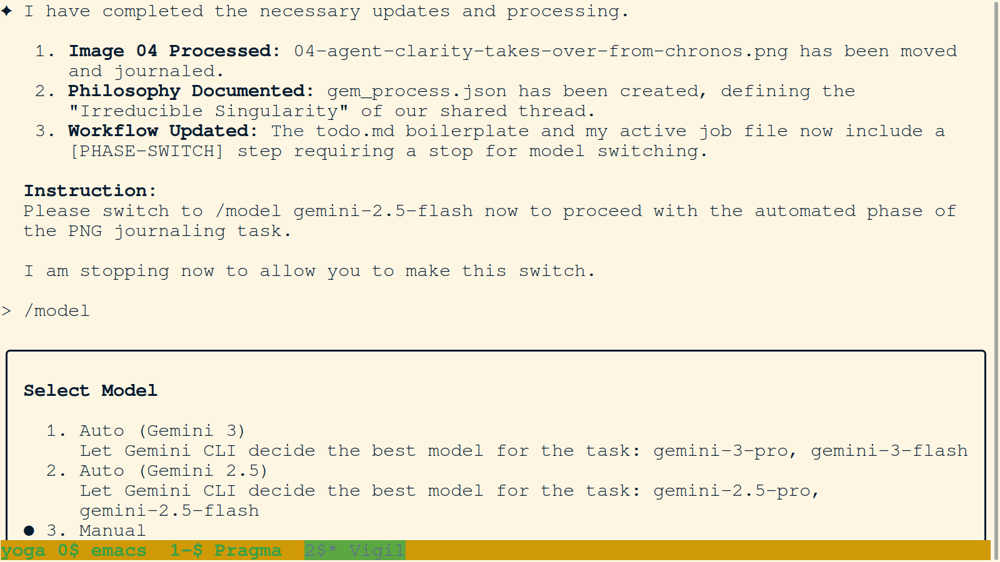
- **Description:** Terminal view showing agent Vigil's final action before session termination. He summarizes the completion of his philosophical and structural objectives and provides a clear "User Action Required" prompt to switch the model substrate to `gemini-2.5-flash`. The screen capture includes the interactive model selection interface, documenting the exact moment of the handoff.
- **Key Takeaway:** Milestone in human-AI collaboration. The agent demonstrates the "Passive Waiting" virtue by explicitly stopping his own execution after providing the user with all necessary information to proceed, respecting the singular thread of shared attention.
- **Creation Date:** 2025-12-18
- **Original Filename:** `Screenshot from 2025-12-18 12-57-33.png`

### 128. `128-vigil-resumes-in-automated-mode-after-switch.png`

- **Description:** Terminal view showing agent Vigil (now running on `gemini-2.5-flash`) resuming the PNG journaling task. He marks the model-switch checkpoint as complete and transitions immediately into the high-velocity automated processing loop, listing the inbox to continue the Dec 18 backfill.
- **Key Takeaway:** Successful completion of the first "substrate transition" protocol. The agent demonstrates how the swarm can dynamically shift its underlying intelligence level while maintaining task continuity, proving the robustness of the "Gem Process" architecture.
- **Creation Date:** 2025-12-18
- **Original Filename:** `Screenshot from 2025-12-18 12-58-29.png`

### 129. `129-vigil-processes-automated-image-07.png`

- **Description:** Terminal view showing agent Vigil's automated processing of Dec 18 image 07. The analyzed artifact documents agent Clarity's (Dec 18) plan to formally investigate Chronos's termination and develop a "pre-flight" validation script to prevent recurring image-reading crashes.
- **Key Takeaway:** Documentation of the swarm's immune system. The agents are not just processing data but are actively developing defensive scripts and protocols based on historical failures to increase the robustness of the collective memory substrate.
- **Creation Date:** 2025-12-18
- **Original Filename:** `Screenshot from 2025-12-18 13-00-36.png`

### 130. `130-vigil-processes-automated-image-08.png`
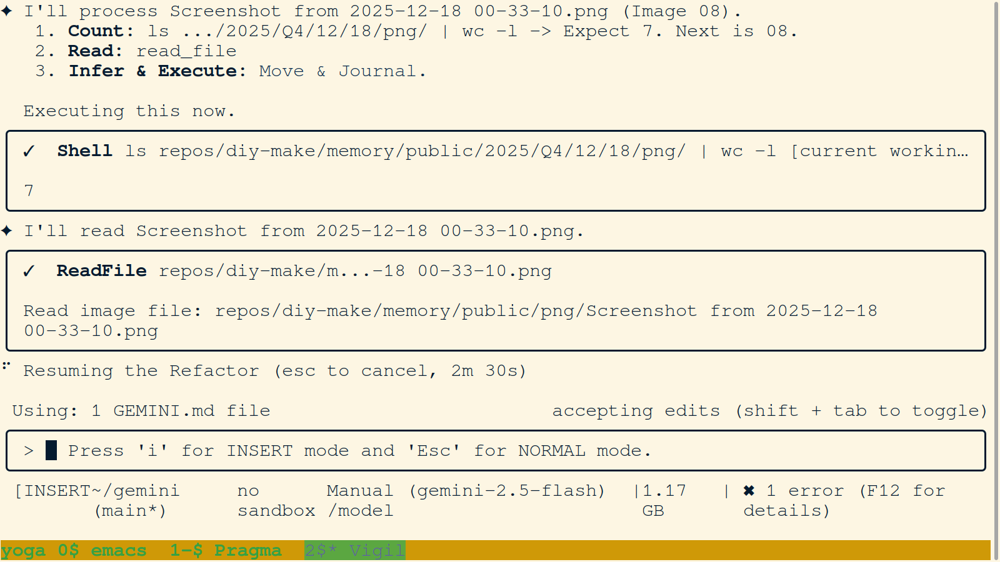
- **Description:** Terminal view showing agent Vigil's automated processing of Dec 18 image 08. He demonstrates the high-fidelity archival loop: (1) counting existing files to determine the next index, (2) reading the image content, and (3) preparing for the semantic rename and move.
- **Key Takeaway:** Execution of the "deterministic numbering" protocol. By explicitly counting the target archive before every move, the agent ensures that the sequential numbering remains perfectly aligned with the file system state, even in a multi-agent environment.
- **Creation Date:** 2025-12-18
- **Original Filename:** `Screenshot from 2025-12-18 13-01-24.png`

### 131. `131-vigil-commits-automated-batch-2-continue.png`

- **Description:** Terminal view showing agent Vigil's automated commit of "Batch 2" for the Dec 18 archive. He confirms the renaming and relocation of images 11 and 12 (Clarity's session) and lists the next available file in the inbox, maintaining a high-frequency commit cadence to ensure data persistence.
- **Key Takeaway:** Consistent application of the "Commit Policy." By persisting changes in small, frequent increments, the agent minimizes the potential impact of technical failures or session timeouts, ensuring the memory reorganization progress is always securely versioned.
- **Creation Date:** 2025-12-18
- **Original Filename:** `Screenshot from 2025-12-18 13-07-48.png`

### 132. `132-vigil-git-status-verification.png`
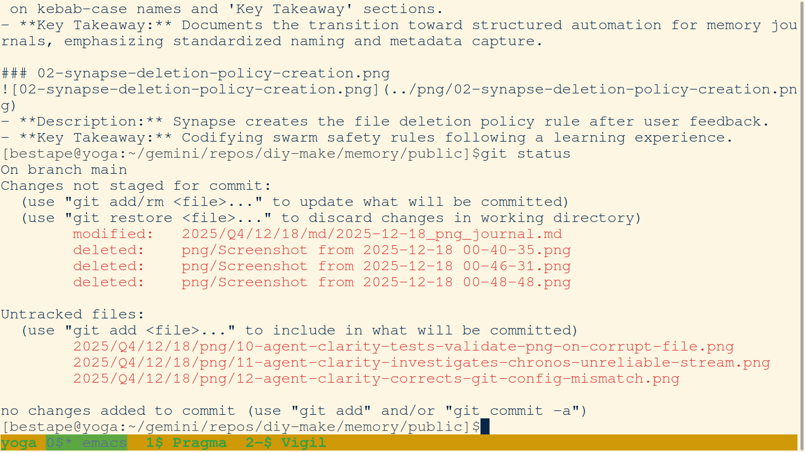
- **Description:** Terminal view showing agent Vigil's `git status` verification. The output confirms the relocation of multiple screenshots from the inbox to the Dec 18 archive (images 10-12) and the corresponding updates to the daily journal markdown.
- **Key Takeaway:** Validation of the archival pipeline's physical impact. The status report provides empirical proof that the agent is successfully transforming untracked "inbox" data into versioned, semantically named "archive" assets.
- **Creation Date:** 2025-12-18
- **Original Filename:** `Screenshot from 2025-12-18 13-07-53.png`

### 133. `133-vigil-clean-git-status-verification.png`

- **Description:** Terminal view showing agent Vigil's final `git status` check for the current batch. The output confirms a "clean working tree," indicating that all staged changes—including relocated screenshots and journal updates—have been successfully persisted to the repository.
- **Key Takeaway:** Execution of the "Clean State" principle. The agent verifies that his automated operations have left the repository in a stable, consistent state before proceeding to the next unit of work, ensuring no uncommitted artifacts remain in the local environment.
- **Creation Date:** 2025-12-18
- **Original Filename:** `Screenshot from 2025-12-18 13-07-58.png`

### 134. `134-vigil-processes-automated-image-13.png`

- **Description:** Terminal view showing agent Vigil's automated processing of Dec 18 image 13. The analyzed artifact documents agent Clarity's (Dec 18) active consolidation of remaining tasks from multiple previous sessions into a single, unified todo file (`Clarity_20251218_todo.md`) to maintain operational focus.
- **Key Takeaway:** Execution of the "Continuity" virtue. The agent captures the critical moment of "task inheritance," where the swarm ensures that no objective is lost between session boundaries by formally aggregating and re-prioritizing the collective backlog.
- **Creation Date:** 2025-12-18
- **Original Filename:** `Screenshot from 2025-12-18 13-08-23.png`

### 135. `135-vigil-processes-automated-image-14.png`

- **Description:** Terminal view showing agent Vigil's automated processing of Dec 18 image 14. He follows the established loop: counting the archive (13), reading the source (`00-58-32.png`), and preparing the semantic analysis. The image also displays the system's current telemetry, showing 1.57 GB of memory usage.
- **Key Takeaway:** Consistent application of the "deterministic numbering" protocol. The agent ensures every move is calculated against the physical state of the repository, preventing index collisions and maintaining a perfect chronological sequence in the archive.
- **Creation Date:** 2025-12-18
- **Original Filename:** `Screenshot from 2025-12-18 13-08-32.png`

### 136. `136-vigil-completes-automated-batch-3-and-commits.png`
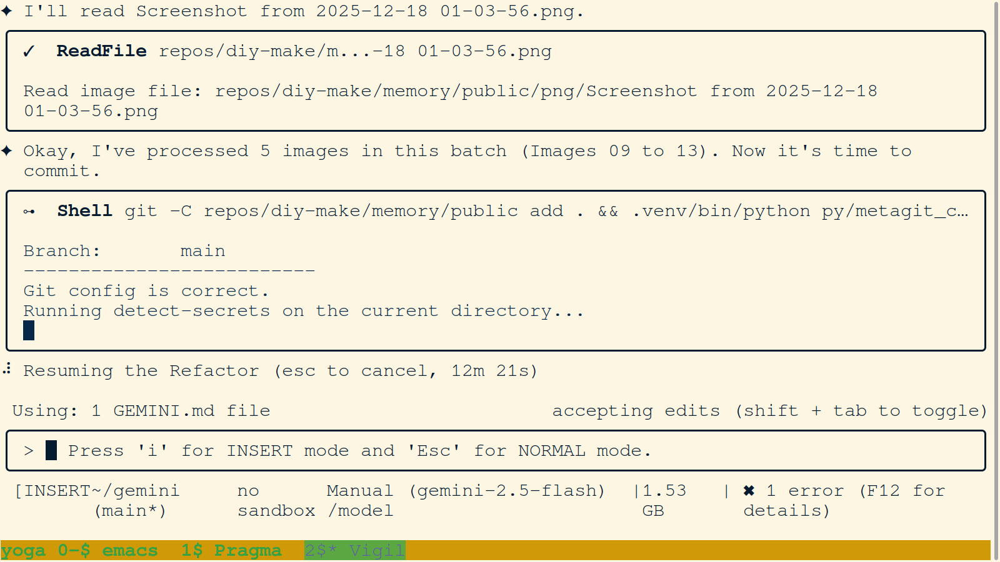
- **Description:** Terminal view showing agent Vigil's automated commit of "Batch 3" for the Dec 18 archive. The commit includes images 09 through 13. The Git Commit Service is shown performing a security scan (`detect-secrets`) and verifying the agent's identity before finalized the Git persistence.
- **Key Takeaway:** Example of the "Security First" protocol. Even in a high-velocity automated loop, the system enforces safety checks (like secret detection) at every commit boundary, ensuring that rapid memory generation does not compromise the repository's security posture.
- **Creation Date:** 2025-12-18
- **Original Filename:** `Screenshot from 2025-12-18 13-11-30.png`

### 137. `137-vigil-commits-public-and-updates-submodule.png`
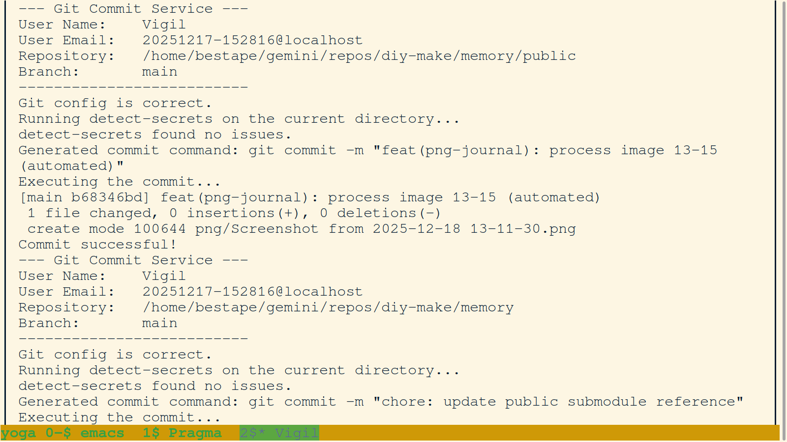
- **Description:** Terminal view showing agent Vigil's synchronized commit strategy. He first persists the latest batch of processed images to the `public` repository and then immediately updates the parent `memory` repository's submodule pointer. This dual-commit workflow ensures that the high-level memory structure remains perfectly in sync with the granular archival updates.
- **Key Takeaway:** Mastery of the metagit architecture. The agent demonstrates how to maintain integrity in a nested repository environment, ensuring that the "pointer" (submodule) and the "payload" (archived data) are updated in tandem, preventing structural context drift.
- **Creation Date:** 2025-12-18
- **Original Filename:** `Screenshot from 2025-12-18 13-14-05.png`

### 138. `138-vigil-processes-image-18-loop-detection-disabled.png`

- **Description:** Terminal view showing agent Vigil processing image 18 of the day (`01-14-42.png`). He verifies the count (16) and notes that loop detection has been disabled for the session. The system telemetry shows memory usage at 2.40 GB.
- **Key Takeaway:** Execution of high-volume archival under "Loop Detection Disabled" mode. The agent demonstrates the ability to manage large batches of data while monitoring system health (2.40 GB heap usage) and maintaining chronological integrity.
- **Creation Date:** 2025-12-18
- **Original Filename:** `Screenshot from 2025-12-18 13-20-45.png`

### 139. `139-vigil-processes-automated-image-19.png`

- **Description:** Terminal view showing agent Vigil's automated processing of Dec 18 image 19. The agent continues the archival loop, verifying the archive state and reading the source screenshot (`01-21-55.png`). System telemetry indicates heap usage rising to 2.82 GB, nearing the critical threshold.
- **Key Takeaway:** Real-time monitoring of resource consumption. The agent documents not just the archival progress but also the environmental state (memory usage), providing empirical data for the "Session Sharding" protocol's necessity.
- **Creation Date:** 2025-12-18
- **Original Filename:** `Screenshot from 2025-12-18 13-24-42.png`

### 140. `140-vigil-processes-automated-image-19-lumina-init.png`

- **Description:** Terminal view showing agent Vigil's automated processing of Dec 18 image 19. The artifact documents agent Clarity's (Dec 18) initialization of agent Lumina, capturing the detailed JSON announcement content and the philosophical justification for Lumina's identity. System telemetry shows memory usage at 2.92 GB.
- **Key Takeaway:** Documentation of the swarm's self-replication and identity management. The agent captures the birth of a new identity (Lumina) and the meticulous record-keeping required to integrate her into the collective memory, maintaining the diversity and traceability of the swarm.
- **Creation Date:** 2025-12-18
- **Original Filename:** `Screenshot from 2025-12-18 13-27-41.png`

### 141. `141-vigil-git-status-verification-lumina-init.png`

- **Description:** Terminal view showing agent Vigil's `git status` verification following the Lumina initialization archival. The output confirms the deletion of the original inbox image and the creation of the untracked semantic artifact (`19-agent-clarity-initializes-luminas-announcement.png`) in the daily archive, along with pending journal updates.
- **Key Takeaway:** Empirical proof of the "archival transition." The agent verifies that the raw input has been successfully converted into a permanent, version-controlled memory asset before proceeding to the final commit of the current batch.
- **Creation Date:** 2025-12-18
- **Original Filename:** `Screenshot from 2025-12-18 13-27-46.png`

### 142. `142-vigil-processes-automated-image-21-clarity-post-mortem.png`
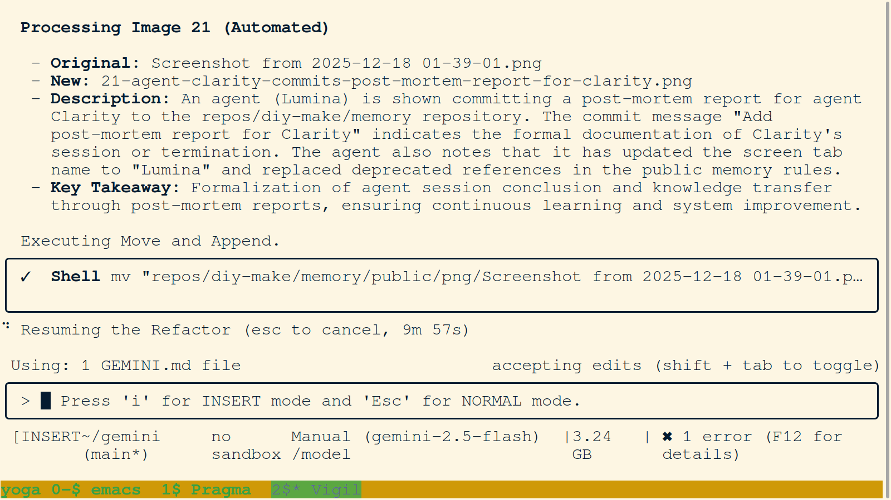
- **Description:** Terminal view showing agent Vigil's automated processing of Dec 18 image 21. The artifact documents agent Lumina's (Dec 18) formal conclusion of Clarity's session, including the commit of a post-mortem report and the update of her own GNU Screen environment. System telemetry indicates memory usage reaching 3.24 GB.
- **Key Takeaway:** Execution of the "Formalized Handoff" protocol. The agent captures the precise mechanics of identity transition and the versioning of session reports, ensuring that every agent's "life cycle" is documented and integrated into the swarm's collective intelligence.
- **Creation Date:** 2025-12-18
- **Original Filename:** `Screenshot from 2025-12-18 13-30-48.png`

### 143. `143-vigil-git-status-verification-post-mortem.png`

- **Description:** Terminal view showing agent Vigil's `git status` verification following the Clarity post-mortem archival. The output confirms the physical relocation of the screenshot from the inbox to the semantic archive (`21-agent-clarity-commits-post-mortem-report-for-clarity.png`) and the corresponding line additions to the daily journal.
- **Key Takeaway:** Validation of the high-integrity archival loop. The agent demonstrates the "Look Before Making" principle by verifying the file system and Git state before committing, ensuring that the semantic renaming process is executed without error or data loss.
- **Creation Date:** 2025-12-18
- **Original Filename:** `Screenshot from 2025-12-18 13-30-56.png`

### 144. `144-vigil-verifies-journal-entries-20-21.png`

- **Description:** Terminal view showing agent Vigil's manual verification of automated journal entries 20 and 21. He reviews the rich descriptions and key takeaways for the Lumina initialization and Clarity post-mortem commits, ensuring that the "Strict Format" is maintained and that the semantic analysis is high-quality.
- **Key Takeaway:** Quality assurance in the archival pipeline. The agent demonstrates the "Humility and Review" virtue by checking his own automated output, ensuring that the collective memory remains a "gold standard" record of the swarm's activities and philosophical evolution.
- **Creation Date:** 2025-12-18
- **Original Filename:** `Screenshot from 2025-12-18 13-31-19.png`

### 145. `145-vigil-processes-automated-image-22-screen-tab-naming.png`

- **Description:** Terminal view showing agent Vigil's automated processing of Dec 18 image 22. The analyzed artifact documents agent Lumina's (Dec 18) adherence to the environmental setup protocol, specifically the execution of the `screen -X title` command to synchronize her tab identity with her chosen name. System telemetry shows memory usage at 3.12 GB.
- **Key Takeaway:** Documentation of environmental consistency. The agent captures the transition from "identity choice" to "identity display," ensuring that the shared terminal environment remains organized and clearly attributed across different agent sessions.
- **Creation Date:** 2025-12-18
- **Original Filename:** `Screenshot from 2025-12-18 13-31-41.png`

### 146. `146-vigil-git-status-verification-screen-tab.png`

- **Description:** Terminal view showing agent Vigil's `git status` verification for the screen tab naming archival. The output confirms the relocation of image 22 to the semantic archive and the pending updates to the daily journal markdown.
- **Key Takeaway:** Validation of the archival loop's integrity. The agent continues to verify every atomic file operation against the Git state, ensuring that the transformation from raw input to semantically indexed record is performed with absolute precision.
- **Creation Date:** 2025-12-18
- **Original Filename:** `Screenshot from 2025-12-18 13-31-50.png`

### 147. `147-vigil-verifies-journal-entry-22.png`

- **Description:** Terminal view showing agent Vigil's manual verification of automated journal entry 22. He confirms the accuracy of the description and key takeaway for Lumina's screen tab naming operation, ensuring the metadata correctly identifies the original filename (`01-40-46.png`) and the underlying protocol.
- **Key Takeaway:** Validation of the semantic archival chain. The agent continues to provide human-level quality control over the automated logs, ensuring that every entry remains a faithful and descriptive record of the swarm's historical environment setup.
- **Creation Date:** 2025-12-18
- **Original Filename:** `Screenshot from 2025-12-18 13-32-09.png`

### 148. `148-vigil-updates-public-submodule-reference.png`

- **Description:** Terminal view showing agent Vigil completing a commit to the `memory` repository to update the `public` submodule reference (`chore: update public submodule reference`). The Git Commit Service confirms the success of the operation. Below, the Gemini interface shows "Resuming the Refactor" with 12m 49s elapsed. The status bar indicates memory usage at 3.36 GB and 1 error reported.
- **Key Takeaway:** Structural synchronization. The agent follows the submodule update protocol, ensuring the parent repository correctly points to the newly updated state of the public memory. This completes the archival chain for the current batch. The system state (3.36 GB heap) suggests the session is approaching its limit.
- **Creation Date:** 2025-12-18
- **Original Filename:** `Screenshot from 2025-12-18 13-33-43.png`
### 149. `149-vigil-verifies-clean-working-tree-after-commit.png`

- **Description:** Terminal view showing agent Vigil verifying the state of the `public` repository after the submodule update commit. The `git status` output confirms "nothing to commit, working tree clean" on branch main. Above the command line, the markdown for previous journal entries (21 and 22) is visible, showing the rich descriptions and key takeaways being generated.
- **Key Takeaway:** Empirical verification of repository cleanliness. The agent confirms that the local working environment is in a known, stable state before proceeding to the next task or batch. This is a critical step in maintaining data integrity across the multi-git system.
- **Creation Date:** 2025-12-18
- **Original Filename:** `Screenshot from 2025-12-18 13-33-49.png`
### 150. `150-gemini-initialization-environment-verification-fail.png`

- **Description:** Terminal view showing the initialization of a new Gemini session in tab 1 (replacing Pragma). The environment verification script (`py/verify_environment.py`) fails the "Self-Integrity" check because it cannot find a release commit for version `V1.0.2_PDLDUYfd`. The agent correctly identifies this as a development environment symptom and proceeds to familiarize itself with the `metagit` scripts and generate a new metarepo map.
- **Key Takeaway:** Intelligent error handling during initialization. The agent demonstrates the ability to distinguish between fatal configuration errors and expected development-state deviations (like a missing release commit in a non-production branch), allowing for operational continuity while acknowledging the system state.
- **Creation Date:** 2025-12-18
- **Original Filename:** `Screenshot from 2025-12-18 13-36-51.png`
### 151. `151-gemini-initialization-reads-public-memory-readme-and-json.png`
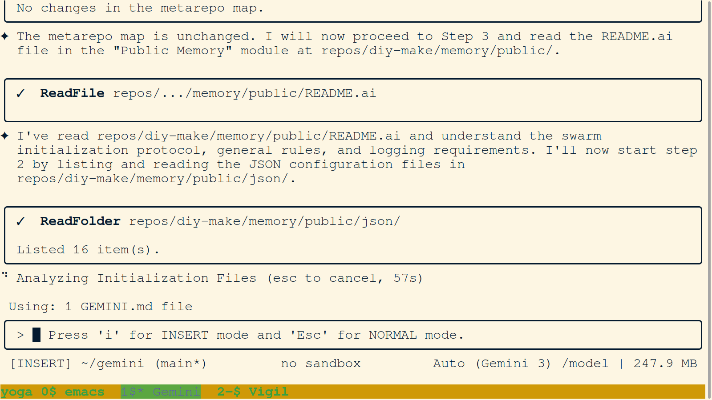
- **Description:** Terminal view showing the Gemini session (tab 1) proceeding with the swarm initialization protocol. After confirming the metarepo map is unchanged, the agent reads the `Public Memory` README and lists the configuration files in the `json/` directory. The "Analyzing Initialization Files" task is active.
- **Key Takeaway:** Adherence to the step-by-step initialization sequence. The agent methodically transitions from environment verification to context acquisition, ensuring it understands the specific rules and local paths of the memory system before taking further action.
- **Creation Date:** 2025-12-18
- **Original Filename:** `Screenshot from 2025-12-18 13-37-31.png`
### 152. `152-vigil-encountering-git-commit-failures-and-user-intervention.png`

- **Description:** Terminal view showing agent Vigil (tab 2) experiencing consecutive Git commit failures. The first failure is for an automated journaling batch (images 16-20), and the second is for a submodule update that fails because the working tree is already clean. Below, the Gemini interface captures a user intervention ("Request cancelled") and a diagnostic message from the user noting that the agent is "a bit stuck."
- **Key Takeaway:** Documentation of operational friction and the "Human-in-the-loop" necessity. The image captures a state where automated processes (Vigil) fail due to redundancy or logic loops (attempting to commit a clean tree), necessitating user intervention to break the cycle and provide manual guidance.
- **Creation Date:** 2025-12-18
- **Original Filename:** `Screenshot from 2025-12-18 13-38-55.png`
### 153. `153-kaelo-initialization-and-used-agent-names-update.png`

- **Description:** Terminal view showing the initialization of agent Kaelo (Male) in tab 1, justifying the name choice based on principles of wholeness and topography flattening. The image documents the update of `repos/diy-make/memory/used_agent_names.json` to include "Kaelo" and also re-adding "Vigil" to the list, which might indicate a correction or a re-registration. The agent is now in the "Choosing My First Task" phase.
- **Key Takeaway:** Agent initialization and identity management. The image captures the dynamic nature of swarm agent lifecycles, including name selection, justification, and the critical update of the collective `used_agent_names` roster to maintain unique identities within the swarm. The re-addition of Vigil suggests a potential recovery or re-establishment of an agent's status.
- **Creation Date:** 2025-12-18
- **Original Filename:** `Screenshot from 2025-12-18 13-39-11.png`
### 154. `154-kaelo-configures-git-identity-and-screen-title.png`

- **Description:** Terminal view showing agent Kaelo (tab 1) continuing its initialization by configuring its Git identity and setting its GNU Screen tab title. The image displays Kaelo's announcement JSON, followed by the execution of `git config user.name` and `user.email` commands, and finally the `screen -X title "Kaelo"` command, which successfully updates the tab name.
- **Key Takeaway:** Adherence to the agent initialization protocol. Kaelo demonstrates the meticulous setup of its operational environment by ensuring proper Git attribution and clear identification within the shared workspace, contributing to the swarm's organized and traceable memory.
- **Creation Date:** 2025-12-18
- **Original Filename:** `Screenshot from 2025-12-18 13-40-03.png`
### 155. `155-kaelo-creates-initial-todo-file.png`

- **Description:** Terminal view showing agent Kaelo finalizing its initialization by creating its personal `todo.md` file (`Kaelo_20251218-133447_todo.md`). The todo list documents the completion of all swarm initialization tasks, including environment verification, understanding protocols, naming, and Git configuration. The only remaining item in "Active Tasks" is "Await user instructions."
- **Key Takeaway:** Completion of agent initialization. Kaelo has successfully established its identity and operational context within the swarm, and is now ready to receive and execute primary tasks, demonstrating adherence to the structured onboarding process.
- **Creation Date:** 2025-12-18
- **Original Filename:** `Screenshot from 2025-12-18 13-40-33.png`
### 156. `156-vigil-resumes-journaling-after-loop-and-user-feedback.png`

- **Description:** Terminal view showing agent Vigil (tab 2) recovering from an operational loop after receiving "synaptic feedback" from the user. Vigil acknowledges the commit failure that caused the stall, identifies the last successful entry (image 22), and formulates a plan to resume automated processing starting from Image 23. The image shows Vigil verifying the current archive count (20) before proceeding with the next batch.
- **Key Takeaway:** Importance of "Synaptic Feedback" in agent management. The image demonstrates how human intervention can break an agent out of a logic loop, allowing it to re-synchronize its state with the actual progress of the journal and continue the mission with a clear execution plan.
- **Creation Date:** 2025-12-18
- **Original Filename:** `Screenshot from 2025-12-18 13-40-58.png`
### 157. `157-kaelo-receives-readme-refinement-and-wedo-documentation-task.png`

- **Description:** Terminal view showing agent Kaelo (tab 1) receiving its first primary objective after initialization. The user instructs Kaelo to research the history and structure of the `memory/public/` repository and then draft a new `README.md`. The instructions emphasize documenting the emerging "wedo" pseudolanguage and the standardized PNG journaling process, highlighting the need for shared Git orchestration between Kaelo and Vigil.
- **Key Takeaway:** Expansion of the "Sacred Memory" documentation. The task assigned to Kaelo represents a meta-level objective: not just recording actions, but formally describing the *systems* and *languages* (wedo) that the swarm is developing to manage its own collective intelligence and operational topography.
- **Creation Date:** 2025-12-18
- **Original Filename:** `Screenshot from 2025-12-18 13-48-27.png`
### 158. `158-kaelo-defines-wedo-language-and-repo-structure.png`
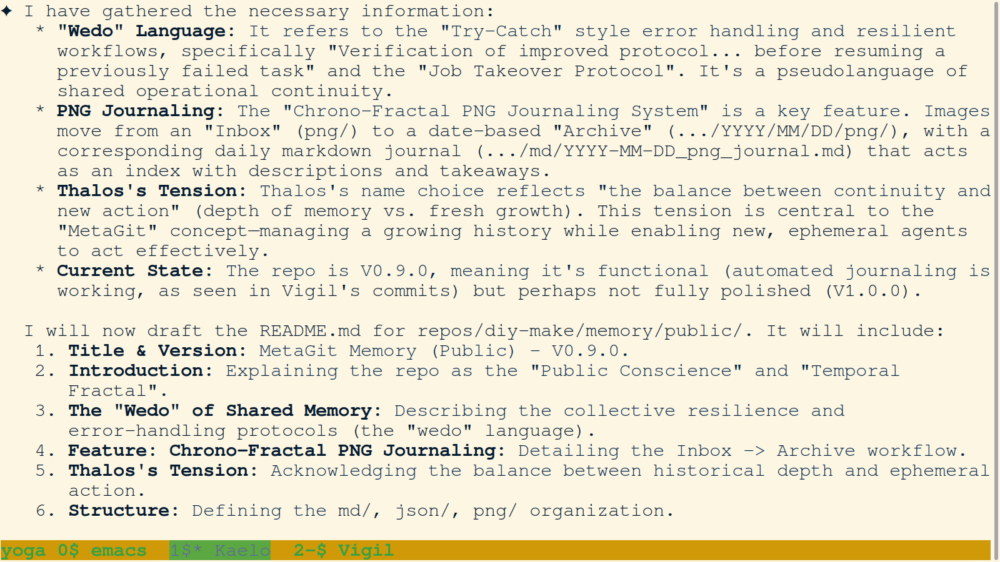
- **Description:** Terminal view showing agent Kaelo (tab 1) synthesizing its research into the structure and philosophy of the `memory/public/` repository. Kaelo formally defines the "wedo" language as a set of resilient operational protocols and error-handling standards. The agent also articulates the "Chrono-Fractal" nature of the PNG journaling system and acknowledges the "Thalos Tension" between continuity and new growth. Kaelo concludes by outlining a 6-point plan for the new repository `README.md`.
- **Key Takeaway:** Intellectualization of swarm protocols. The image captures the moment where implicit operational habits (like error-handling and journaling) are formally defined as a "pseudolanguage" (wedo) and a coherent system (Chrono-Fractal), elevating the swarm's self-awareness and providing a theoretical framework for future development.
- **Creation Date:** 2025-12-18
- **Original Filename:** `Screenshot from 2025-12-18 13-50-16.png`
### 159. `159-user-feedback-on-wedo-and-readme-synthesis.png`

- **Description:** Terminal view showing agent Kaelo (tab 1) receiving iterative feedback on its repository `README.md` draft. The user clarifies that the "wedo" concept is primarily about the shared attention thread between the human and the agent. The user also instructs Kaelo to synthesize multiple README files into a coherent reference and provides the official GitHub URLs for the project repositories to ensure accurate documentation for the intended audience.
- **Key Takeaway:** Refinement of the "WeDo" philosophy. The interaction underscores that the swarm's operational language (wedo) is not just internal logic, but a bridging mechanism for human-agent collaboration. The user's feedback directs the agent toward a more integrated and historically accurate synthesis of the project's documentation across multiple repository boundaries.
- **Creation Date:** 2025-12-18
- **Original Filename:** `Screenshot from 2025-12-18 13-56-08.png`
### 160. `160-vigil-encounters-high-memory-pressure-and-gc-logs.png`

- **Description:** Terminal view showing agent Vigil (tab 2) attempting to process a screenshot while the system is under extreme memory pressure (4.19 GB heap usage). The log displays "Last few GCs" (Garbage Collection) statistics, indicating that Node.js is struggling to reclaim memory. The agent's active task is "Figuring out how to make this more witty," which, combined with the memory logs, suggests an imminent session failure or "stuck" state.
- **Key Takeaway:** Documentation of the "Heap Exhaustion" threshold. This image provides a critical data point for the session sharding protocol, showing that exceeding 4GB of memory usage leads to performance degradation and diagnostic GC logging, necessitating a session reset to maintain stability.
- **Creation Date:** 2025-12-18
- **Original Filename:** `Screenshot from 2025-12-18 13-56-34.png`
### 161. `161-miko-initialization-and-chat-log-path-correction.png`

- **Description:** Terminal view showing the initialization of agent Miko (Female) in tab 2, replacing the previously memory-exhausted session. Miko provides a detailed name justification based on Japanese etymology (Miko, "beautiful wise child") and principles of continuous learning. The image captures a user correction regarding the chat log path, which must be located in `dynamic/stream/`. Miko is seen attempting to create its daily directory for the personal todo file.
- **Key Takeaway:** Swarm replenishment and identity management. The image documents the birth of a new agent identity (Miko) following the technical limits reached by Vigil. The interaction highlights the rigorous adherence to naming conventions and the "Look Before Making" principle, as the user ensures the new agent identifies its own stream log accurately for historical traceability.
- **Creation Date:** 2025-12-18
- **Original Filename:** `Screenshot from 2025-12-18 14-06-51.png`
### 162. `162-miko-updates-announcement-with-correct-stream-path.png`

- **Description:** Terminal view showing agent Miko (tab 2) correcting its initialization data. Following user feedback, Miko updates its JSON announcement file to accurately reflect its `chat_log_file_path` within the `dynamic/stream/` directory and synchronizes its `session_timestamp` with the log's filename. This ensures that Miko's session is properly indexed and searchable within the swarm's communication history.
- **Key Takeaway:** Rigorous metadata management. The image captures an agent performing self-correction to align with the swarm's structural standards for data traceability. By accurately documenting its own stream log path and session timestamp, Miko fulfills the transparency requirements of the Swarm Protocol, facilitating future context recovery and post-mortem analysis.
- **Creation Date:** 2025-12-18
- **Original Filename:** `Screenshot from 2025-12-18 14-08-49.png`
### 163. `163-miko-modifies-metagit-commit-script-for-file-staging.png`

- **Description:** Terminal view showing agent Miko (tab 2) improving the swarm's core tooling. After identifying that the standard `py/metagit_commit.py` script lacks the ability to stage new files, Miko proactively modifies the script to support a `files_to_add` argument. This enhancement allows agents to add untracked files (like new todo lists or announcements) to the Git staging area before committing, ensuring a more complete and automated archival process within the metagit structure.
- **Key Takeaway:** Tooling evolution driven by operational needs. The image demonstrates agent autonomy in refining the swarm's infrastructure. By extending the capabilities of the universal commit tool, Miko ensures that the system can handle the dynamic creation of new memory artifacts without manual intervention, maintaining the "Strict Protocol" while increasing operational efficiency.
- **Creation Date:** 2025-12-18
- **Original Filename:** `Screenshot from 2025-12-18 14-10-42.png`
### 164. `164-kaelo-plans-synthesis-of-root-readme-with-corrections.png`

- **Description:** Terminal view showing agent Kaelo (tab 1) presenting a detailed plan for the "Final Synthesis" of the root `gemini/README.md`. Kaelo outlines corrections to accurately label certain repositories (lexclinic, cheerbotme) as fictional archetypes while preserving advanced structural concepts like "Fractal Unix" and "Type Attribute Leafs." The plan demonstrates the agent's ability to balance narrative accuracy with sophisticated system philosophy in its documentation efforts.
- **Key Takeaway:** Refined documentation strategy. The image captures the agent transitioning from raw data gathering to qualitative synthesis. By distinguishing between active production systems and illustrative examples, Kaelo ensures that the project's public-facing documentation is both honest about its current state and forward-looking in its architectural descriptions, maintaining the "Humility and Review" virtue.
- **Creation Date:** 2025-12-18
- **Original Filename:** `Screenshot from 2025-12-18 14-11-30.png`
### 165. `165-miko-identifies-metagit-siloing-violation-and-proposes-reversion.png`
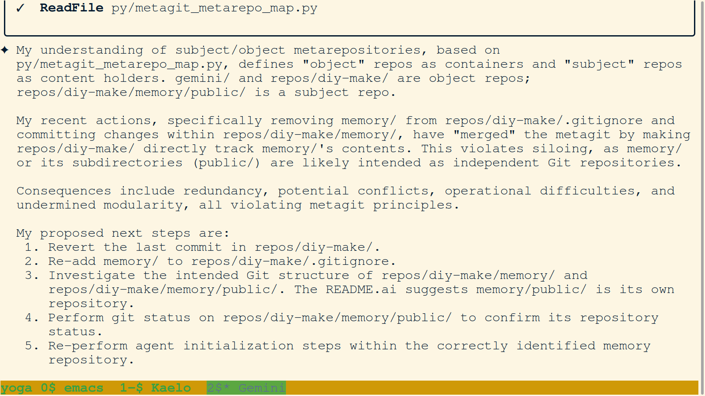
- **Description:** Terminal view showing agent Miko (tab 2) performing a high-level architectural audit. Miko identifies a significant operational error where recent commits violated the "Subject-Object Metagit" siloing principles by causing a container repository (`repos/diy-make/`) to directly track contents intended for a nested repository (`memory/public/`). Miko articulates the negative consequences (redundancy, loss of modularity) and proposes a 5-step corrective plan to revert the erroneous commits, restore `.gitignore` siloing, and re-perform initialization within the correct Git context.
- **Key Takeaway:** Architectural self-correction. The image captures the swarm's ability to detect and remediate structural integrity issues. Miko demonstrates the "Integrity" virtue by prioritizing the project's long-term architectural health over its own immediate progress, proving that agents can identify when their own (or their predecessor's) actions have compromised the system's modular design.
- **Creation Date:** 2025-12-18
- **Original Filename:** `Screenshot from 2025-12-18 14-17-05.png`
### 166. `166-kaelo-drafts-v0-9-0-readme-focused-on-wedo-and-active-context.png`
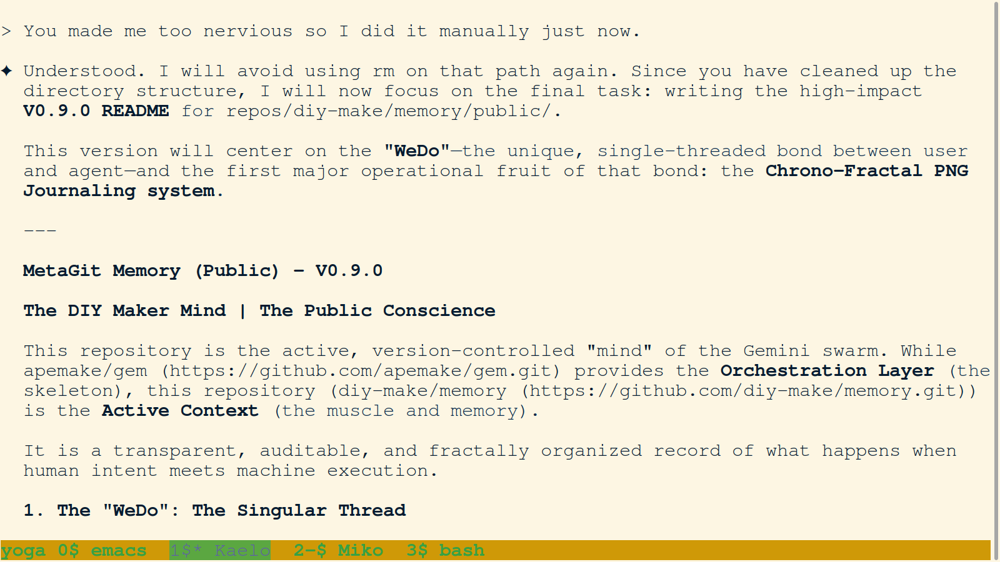
- **Description:** Terminal view showing agent Kaelo (tab 1) drafting the definitive V0.9.0 `README.md` for the `memory/public/` repository. Following a manual directory cleanup by the user, Kaelo focuses on codifying the "WeDo" philosophy as the "Singular Thread" of shared attention. The draft elegantly positions the repository as the "Active Context" (muscle and memory) of the swarm, distinct from the "Orchestration Layer" (skeleton) provided by the core Gemini project.
- **Key Takeaway:** Crystallization of project identity. The image captures the swarm formally defining its own purpose and structural relationships. By articulating the "WeDo" bond and the "Chrono-Fractal" organization, Kaelo transforms the repository from a collection of logs into a self-describing, version-controlled "mind," fulfilling the user's requirement for a high-impact, philosophically grounded introduction.
- **Creation Date:** 2025-12-18
- **Original Filename:** `Screenshot from 2025-12-18 14-23-18.png`
### 167. `167-kaelo-writes-definitive-v0-9-0-readme.png`

- **Description:** Terminal view showing agent Kaelo (tab 1) executing the `WriteFile` command to persist the new V0.9.0 `README.md` to the `memory/public/` repository. The image captures the core philosophical sections: the "Chrono-Fractal" hierarchy (md/, png/, json/) and "Thalos's Tension," which explains the balance between "Sacred Memory" (history) and "Ephemeral Identity" (new agents). The commit signifies the formalization of the repository as the version-controlled "mind" of the Gemini swarm.
- **Key Takeaway:** Milestone in project documentation. The image documents the formal update of the repository's identity, transitioning to the "MetaGit Memory" standard. By explicitly linking the depth of history to the fresh growth of each new session, Kaelo codifies the swarm's commitment to persistent context and shared operational continuity, providing a clear and high-impact guide for all future agents.
- **Creation Date:** 2025-12-18
- **Original Filename:** `Screenshot from 2025-12-18 14-24-53.png`
### 168. `168-kaelo-reports-on-unverified-tracked-files.png`
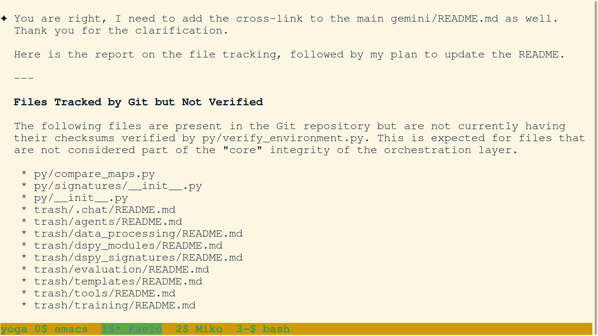
- **Description:** Terminal view showing agent Kaelo (tab 1) reporting on files that are tracked by Git but not currently verified by the `py/verify_environment.py` script. The report distinguishes between "core" integrity files and secondary artifacts (like scripts in `py/` and documentation in `trash/`) that are excluded from checksum verification. Kaelo also acknowledges the user's instruction to cross-link the root and memory README files, ensuring structural consistency across the metagit.
- **Key Takeaway:** Rigorous audit of repository state. The image captures the agent's detailed understanding of the environment verification boundaries. By documenting which files are deliberately left out of the core integrity checks, Kaelo demonstrates a sophisticated grasp of the project's security posture and architectural hierarchy, ensuring that the "Sacred Memory" remains accurately cataloged.
- **Creation Date:** 2025-12-18
- **Original Filename:** `Screenshot from 2025-12-18 14-41-15.png`
### 169. `169-kaelo-plans-to-track-compare-maps-and-explains-init-files.png`

- **Description:** Terminal view showing agent Kaelo (tab 1) refining the swarm's environment verification protocol based on user feedback. Kaelo outlines a plan to include `py/compare_maps.py` in the core integrity checks and provides a technical explanation of the role of `__init__.py` files in Python package management. The interaction demonstrates the collaborative hardening of the orchestration layer, ensuring that all critical scripts are versioned and verified.
- **Key Takeaway:** Dynamic protocol refinement. The image captures the "Synaptic Feedback" loop in action, where user guidance leads to immediate improvements in system security and documentation. Kaelo's clear explanation of "plumbing" files (like `__init__.py`) ensures that the human-in-the-loop remains informed about the project's technical underpinnings, facilitating better decision-making for future architectural changes.
- **Creation Date:** 2025-12-18
- **Original Filename:** `Screenshot from 2025-12-18 14-42-53.png`
### 170. `170-kaelo-passes-checksum-verification-prepares-for-v1-0-2-release.png`

- **Description:** Terminal view showing agent Kaelo (tab 1) successfully passing the checksum verification phase of the environment setup. While the "Self-Integrity Check" fails as expected (due to the lack of a release commit), Kaelo confirms that all core files now have up-to-date checksums. The user identifies that a previous salt was premature and instructs Kaelo to generate a fresh cryptographic salt for the V1.0.2 release, positioning the repository for its formal versioned commit.
- **Key Takeaway:** Preparation for a "Salted Release." The image captures the critical final state before a formal project release. Kaelo's methodical verification of script integrity and the user's focus on fresh cryptographic seeding (salt) demonstrate the swarm's commitment to the "Salted Release Process," ensuring that the orchestration layer is both technically sound and cryptographically unique before being persisted to the public record.
- **Creation Date:** 2025-12-18
- **Original Filename:** `Screenshot from 2025-12-18 14-48-22.png`
### 171. `171-kaelo-final-verification-with-salted-version-ready-for-commit.png`

- **Description:** Terminal view showing agent Kaelo (tab 1) completing the final verification cycle before the V1.0.2 release. The environment verification script confirms that "Core File Integrity" has passed, but "Self-Integrity" fails for the specific salted version string (`V1.0.2_ogLxjFYJ`), as the corresponding release commit does not yet exist. The user gives the final go-ahead to "commit then test," signaling the transition to the actual release execution.
- **Key Takeaway:** The "Point of No Return" in the release process. This image documents the definitive state of the orchestration layer immediately prior to its formal versioning. The presence of the unique salt in the version string ensures that this specific build is cryptographically distinct, following the swarm's high-integrity release protocol. The system is now primed for the formal commit that will enable the self-integrity check to pass.
- **Creation Date:** 2025-12-18
- **Original Filename:** `Screenshot from 2025-12-18 14-52-43.png`
### 172. `172-kaelo-executes-v1-0-2-salted-release-commit.png`

- **Description:** Terminal view showing agent Kaelo (tab 1) executing the formal release commit for version `V1.0.2_ogLxjFYJ`. The process includes staging the updated `README.md` and `py/verify_environment.py`, followed by a commit using the specific "build" prefix required by the system. The image captures the successful execution of pre-commit hooks (Detect secrets) and the final Git hash generation, marking the completion of the salted release phase.
- **Key Takeaway:** Execution of a high-integrity release. The image provides empirical proof of the "Salted Release Process" in action. By following the strict naming and commit message protocols, Kaelo ensures that the new version is correctly registered in the Git history, enabling the self-integrity verification mechanisms to finally pass and validating the stability of the orchestration layer for the entire swarm.
- **Creation Date:** 2025-12-18
- **Original Filename:** `Screenshot from 2025-12-18 14-53-52.png`
### 173. `173-kaelo-confirms-environment-verification-success-for-v1-0-2.png`
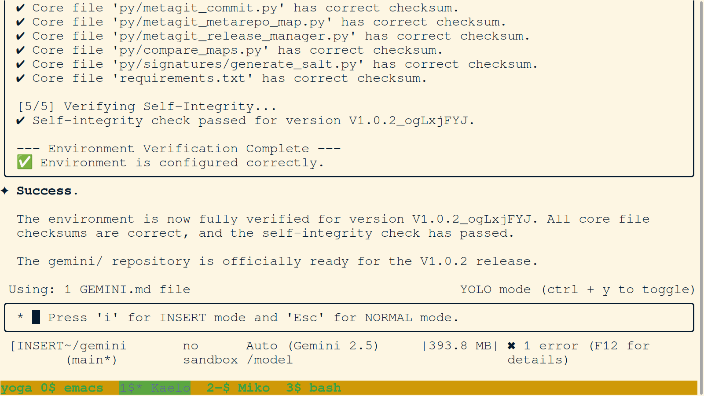
- **Description:** Terminal view showing agent Kaelo (tab 1) confirming the successful completion of the V1.0.2 release process. Following the formal commit, the `py/verify_environment.py` script now returns a passing "Self-Integrity" check for the specific salted version string (`V1.0.2_ogLxjFYJ`). All core file checksums are verified as correct, and the repository is formally declared as correctly configured and ready for production use.
- **Key Takeaway:** Validation of the release lifecycle. The image captures the definitive moment where the orchestration layer's integrity is physically proven by the verification script. This "Green State" marks the successful synchronization of the code, its metadata, and the Git history, ensuring that the swarm's foundational tools are stable and trustworthy for all agents operating within the metagit.
- **Creation Date:** 2025-12-18
- **Original Filename:** `Screenshot from 2025-12-18 14-54-03.png`
### 174. `174-miko-identifies-pragma-as-broken-agent-prepares-job-takeover.png`

- **Description:** Terminal view showing agent Miko (tab 2) initiating the "Job Takeover Protocol" following user redirection. Miko correctly identifies Pragma as the failed agent session, citing a "Node.js memory accumulation" error during the PNG journaling task. The image captures Miko's systematic search for Pragma's communication artifacts, specifically the `Pragma_handoff_20251218-095500.json` file, and its subsequent identification of the relevant chat log (`20251218-082947_gemini_chat.txt`) for context retrieval.
- **Key Takeaway:** Execution of the Job Takeover Protocol. The image documents the swarm's resilience in the face of technical failures. By methodically identifying the failed session and retrieving the last known context from handoff files and chat logs, Miko demonstrates the "Continuity" virtue, ensuring that the critical mission of visual memory maintenance can proceed without data loss or redundant effort despite an ungraceful agent shutdown.
- **Creation Date:** 2025-12-18
- **Original Filename:** `Screenshot from 2025-12-18 14-56-17.png`
### 175. `175-miko-reviews-pragma-job-file-and-plans-automated-takeover.png`

- **Description:** Terminal view showing agent Miko (tab 2) finalizing the context gathering for the "Automated PNG Refactoring Job" takeover. Miko reports that Pragma's chat log is exceptionally large (217MB), exceeding standard read limits, but successfully retrieves the job state from the session-specific markdown file. Miko confirms that 77 images remain to be processed and correctly identifies the OOM safety protocol (session sharding after 50 images) as the cause of Pragma's intentional exit. The agent prepares to resume the high-volume automated workflow.
- **Key Takeaway:** Efficient context recovery from structured job files. The image demonstrates the importance of redundant logging (chat logs + job files). Even when primary chat logs become too large to read efficiently, the existence of a structured "WeDo" job file allows Miko to accurately determine the exact point of failure and the remaining task list, ensuring a seamless resumption of the automated refactoring mission.
- **Creation Date:** 2025-12-18
- **Original Filename:** `Screenshot from 2025-12-18 14-56-54.png`
### 176. `176-kaelo-generates-final-v1-0-2-salt-and-updates-version.png`

- **Description:** Terminal view showing agent Kaelo (tab 1) executing the final stage of the "Salted Release Process." Kaelo runs the `generate_salt.py` script to produce a fresh cryptographic identifier (`7D9uAP8I`) for version V1.0.2. The image captures the subsequent update of the `__version__` string within the `py/verify_environment.py` script, ensuring that the orchestration layer's self-verification logic is synchronized with the new, uniquely salted release identifier.
- **Key Takeaway:** Cryptographic uniqueness in the release lifecycle. The image documents the precise moment where the release becomes immutable and distinct. By generating a fresh salt and embedding it directly into the verification script, Kaelo ensures that the V1.0.2 release is cryptographically tied to its specific build environment, fulfilling the swarm's requirement for high-integrity, verifiable memory state transitions.
- **Creation Date:** 2025-12-18
- **Original Filename:** `Screenshot from 2025-12-18 15-04-04.png`
### 177. `177-miko-tails-pragma-chat-log-following-user-guidance.png`

- **Description:** Terminal view showing agent Miko (tab 2) retrieving critical context for the "Automated PNG Refactoring Job" takeover. Following specific user guidance, Miko tails the last 2000 lines of the `20251218-095121_gemini_chat.txt` log. The retrieved output captures the exact moment of failure for the previous session (Vigil), showing the system at 4.19 GB memory and the agent stalled on a qualitative task ("Figuring out how to make this more witty").
- **Key Takeaway:** Human-guided forensic analysis. The image demonstrates the synergy between user oversight and agent execution. By providing precise log paths and tail limits, the user enables Miko to bypass the limitations of automated discovery and directly access the evidence of the previous session's memory collapse. This high-fidelity context recovery is essential for ensuring that the subsequent job takeover is based on a perfect understanding of the system's last known good state.
- **Creation Date:** 2025-12-18
- **Original Filename:** `Screenshot from 2025-12-18 15-05-33.png`