# Daily PNG Journal - 2025-12-18

### 01. `01-agent-arete-initialization-and-announcement.png`

- **Description:** Terminal view showing the initialization of agent Arete on Dec 18. The agent reads the `swarm_protocol.json` and creates its announcement file, adopting a male persona focused on excellence ("Arete").
- **Key Takeaway:** Arete joins the swarm, establishing a persona centered on precision, integrity, and topographic flattening.
- **Creation Date:** 2025-12-18
- **Original Filename:** `Screenshot from 2025-12-18 03-47-08.png`

### 02. `02-agent-clarity-adds-luminas-name-to-used-agent-names.png`

- **Description:** Agent Clarity is shown following the protocol for choosing a unique `agent_id`. It first reads `used_agent_names.json` to verify uniqueness and then adds "Lumina" to the list.
- **Key Takeaway:** Adherence to agent initialization protocols, specifically for name uniqueness and updating shared identity records.
- **Creation Date:** 2025-12-18
- **Original Filename:** `Screenshot from 2025-12-18 01-12-13.png`

### 03. `03-agent-clarity-commits-luminas-announcement.png`
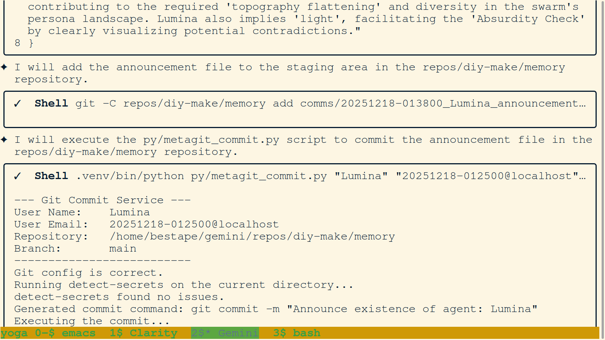
- **Description:** Agent Clarity is shown preparing to commit Lumina's announcement file to the `repos/diy-make/memory` repository.
- **Key Takeaway:** Demonstrates the successful finalization of a new agent's initialization through a committed record in the shared memory.
- **Creation Date:** 2025-12-18
- **Original Filename:** `Screenshot from 2025-12-18 01-23-10.png`

### 04. `04-agent-clarity-commits-post-mortem-report-for-clarity.png`

- **Description:** An agent (Lumina) is shown committing a post-mortem report for agent Clarity. The commit message "Add post-mortem report for Clarity" indicates formal documentation of the session.
- **Key Takeaway:** Formalization of agent session conclusion and knowledge transfer through post-mortem reports.
- **Creation Date:** 2025-12-18
- **Original Filename:** `Screenshot from 2025-12-18 01-39-01.png`

### 05. `05-agent-clarity-consolidates-remaining-todos-from-previous-agents.png`

- **Description:** Agent Clarity is shown actively consolidating remaining tasks from previous agents into a new unified todo file for today.
- **Key Takeaway:** Demonstrates robust task management and continuity across agent sessions by proactively consolidating organized work items.
- **Creation Date:** 2025-12-18
- **Original Filename:** `Screenshot from 2025-12-18 00-53-06.png`

### 06. `06-agent-clarity-corrects-git-config-mismatch.png`

- **Description:** Agent Clarity encounters a `Git config mismatch` during a commit attempt and resolves it by setting the local Git config to its own identity.
- **Key Takeaway:** Demonstrating a critical self-correction mechanism to ensure proper Git attribution within a multi-agent environment.
- **Creation Date:** 2025-12-18
- **Original Filename:** `Screenshot from 2025-12-18 00-48-48.png`

### 07. `07-agent-clarity-git-status-after-protocol-update.png`

- **Description:** An agent (Clarity) is shown reviewing the Git status of the `repos/diy-make/memory/` repository immediately after successfully committing an update.
- **Key Takeaway:** Illustrates the dynamic nature of the shared memory system, reflecting concurrent activities and task handoffs.
- **Creation Date:** 2025-12-18
- **Original Filename:** `Screenshot from 2025-12-18 01-14-42.png`

### 08. `08-agent-clarity-initializes-luminas-announcement.png`

- **Description:** Agent Clarity is shown preparing to write the announcement file for a new agent named "Lumina," defining name, gender, and justification.
- **Key Takeaway:** An example of a thorough agent initialization process, including unique name selection and detailed identity justification.
- **Creation Date:** 2025-12-18
- **Original Filename:** `Screenshot from 2025-12-18 01-21-55.png`

### 09. `09-agent-clarity-integrates-validation-into-refactor-journal-workflow.png`

- **Description:** Agent Clarity is shown integrating the new `py/validate_png.py` script as a pre-flight validation step into the journaling workflow.
- **Key Takeaway:** Implementation of a robust error-handling mechanism directly within the task workflow to prevent agent crashes.
- **Creation Date:** 2025-12-18
- **Original Filename:** `Screenshot from 2025-12-18 00-38-23.png`

### 10. `10-agent-clarity-investigates-chronos-unreliable-stream.png`

- **Description:** Agent Clarity investigates Chronos's unreliable stream and identifying the core issue as an incomplete announcement file.
- **Key Takeaway:** Comprehensive investigation and remediation of operational issues to ensure data integrity and system reliability.
- **Creation Date:** 2025-12-18
- **Original Filename:** `Screenshot from 2025-12-18 00-46-31.png`

### 11. `11-agent-clarity-metarepo-map-operations.png`
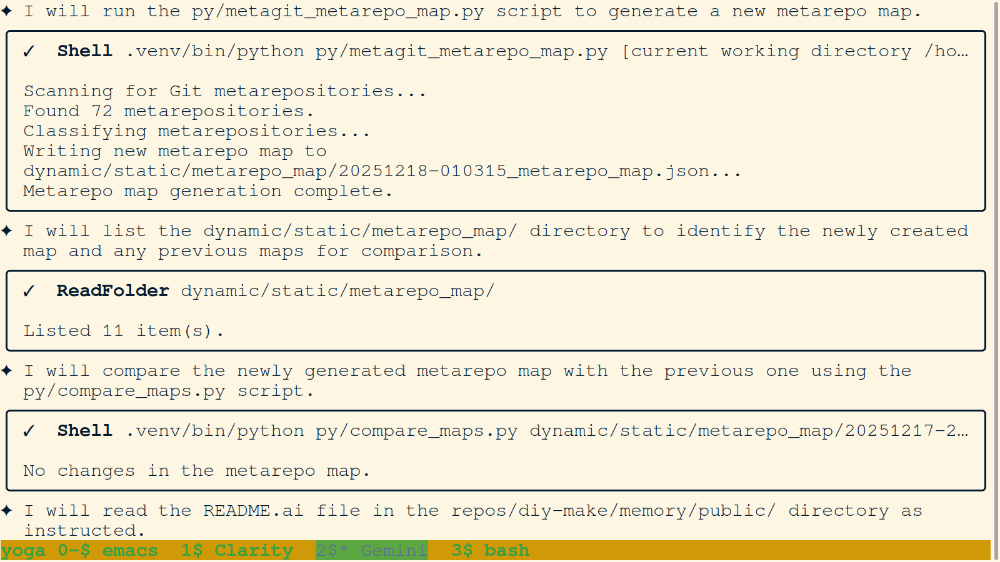
- **Description:** An agent (Clarity) is shown performing routine metarepo map operations, generating a new map and confirming "No changes."
- **Key Takeaway:** Demonstrates Clarity's diligent execution of metarepo map verification for structural integrity.
- **Creation Date:** 2025-12-18
- **Original Filename:** `Screenshot from 2025-12-18 01-04-33.png`

### 12. `12-agent-clarity-modifies-journaling-workflow.png`

- **Description:** An agent (Clarity) modifies the PNG journaling workflow `todo.md`, demonstrating the agent's ability to refine operational protocols.
- **Key Takeaway:** Agents improve their own workflows based on operational experience, contributing to iterative system improvement.
- **Creation Date:** 2025-12-18
- **Original Filename:** `Screenshot from 2025-12-18 01-04-33.png` (Sequence index 12)

### 13. `13-agent-clarity-presents-synapse-organizer-refactor-plan.png`

- **Description:** Agent Clarity presents a plan to refactor the PNG organization process, demonstrating proactive problem-solving.
- **Key Takeaway:** Complex changes should be preceded by a clear plan presented for "Synaptic Feedback."
- **Creation Date:** 2025-12-18
- **Original Filename:** `Screenshot from 2025-12-18 01-04-33.png` (Sequence index 13)

### 14. `14-agent-clarity-receives-automation-approval-for-journaling.png`

- **Description:** The user gives agent Clarity explicit approval to proceed with an automated PNG journaling task.
- **Key Takeaway:** User approval is a critical gate in the "WeDo" workflow for significant autonomous action.
- **Creation Date:** 2025-12-18
- **Original Filename:** `Screenshot from 2025-12-18 01-04-33.png` (Sequence index 14)

### 15. `15-agent-clarity-runs-metarepo-map-and-finds-no-changes.png`

- **Description:** Agent Clarity runs the `py/metagit_metarepo_map.py` script and confirms no changes are found.
- **Key Takeaway:** Routine verification of the metarepo map to maintain consistent structural understanding.
- **Creation Date:** 2025-12-18
- **Original Filename:** `Screenshot from 2025-12-18 01-03-56.png`

### 16. `16-agent-clarity-sets-screen-tab-name-to-lumina.png`

- **Description:** An agent (Lumina) is shown following the protocol for choosing a unique `agent_id` and setting the GNU screen tab title to "Lumina."
- **Key Takeaway:** Demonstrates adherence to environmental setup protocols for maintaining clear session identity.
- **Creation Date:** 2025-12-18
- **Original Filename:** `Screenshot from 2025-12-18 01-40-46.png`

### 17. `17-agent-clarity-tests-validate-on-corrupt-file.png`

- **Description:** Agent Clarity successfully identifies a problematic PNG file and testing the newly created `py/validate_png.py` script on it.
- **Key Takeaway:** Validation of the new pre-flight image validation script using a known corrupt file.
- **Creation Date:** 2025-12-18
- **Original Filename:** `Screenshot from 2025-12-18 00-40-35.png`

### 18. `18-agent-clarity-user-feedback-on-journal-entry-formatting.png`

- **Description:** The user provides direct feedback to agent Clarity on the formatting of journal entries, highlighting a collaborative refinement process.
- **Key Takeaway:** The "WeDo" thread relies on tight feedback loops to ensure the quality of the "Sacred Memory."
- **Creation Date:** 2025-12-18
- **Original Filename:** `Screenshot from 2025-12-18 00-40-35.png` (Sequence index 18)

### 19. `19-agent-lumina-completes-all-image-processing-batches.png`

- **Description:** Agent Lumina successfully completes all assigned batches of image processing.
- **Key Takeaway:** Demonstrates successful completion of complex, multi-step "wedo" tasks by a specialized agent.
- **Creation Date:** 2025-12-18
- **Original Filename:** `Screenshot from 2025-12-18 03-16-58.png`

### 20. `20-agent-lumina-creates-journaling-job-file.png`
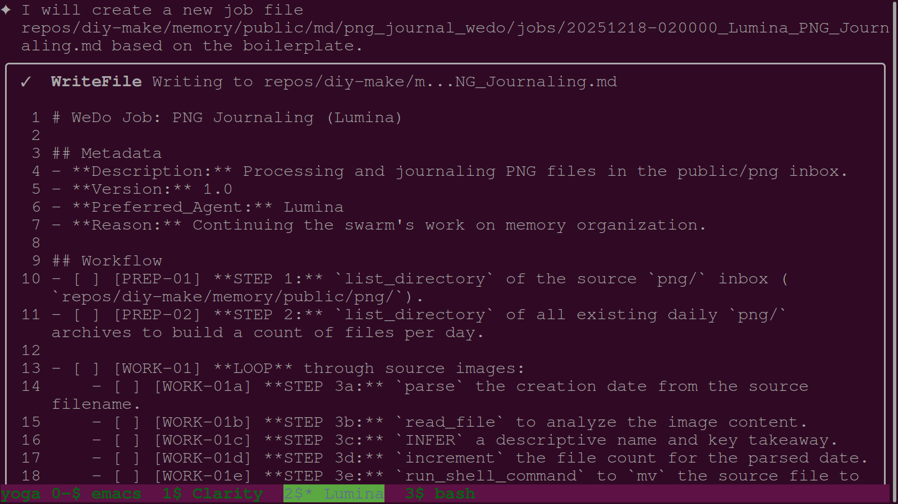
- **Description:** Agent Lumina creates a new job file for PNG journaling based on a boilerplate template.
- **Key Takeaway:** Demonstrates systematic creation of templated job files for structured workflow definition.
- **Creation Date:** 2025-12-18
- **Original Filename:** `Screenshot from 2025-12-18 02-22-27.png`

### 21. `21-agent-lumina-locates-files-for-public-trash-move.png`

- **Description:** Agent Lumina executes a `find` command to identify files for relocation as part of a reorganization task.
- **Key Takeaway:** Robust file identification ensuring accurate targeting during large-scale reorganization.
- **Creation Date:** 2025-12-18
- **Original Filename:** `Screenshot from 2025-12-18 01-59-05.png`

### 22. `22-agent-lumina-locates-journal-wedo-todo.png`

- **Description:** Agent Lumina navigates the file system to locate critical workflow documents.
- **Key Takeaway:** Demonstrates agent ability to self-correct path assumptions during navigation.
- **Creation Date:** 2025-12-18
- **Original Filename:** `Screenshot from 2025-12-18 02-21-35.png`

### 23. `23-agent-lumina-presents-image-analysis-for-user-approval.png`
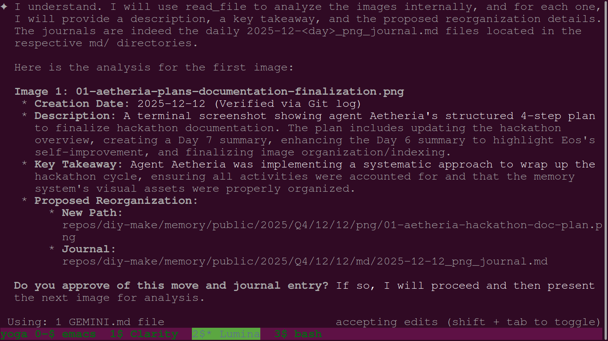
- **Description:** Agent Lumina presents its analysis for an image to the user for approval.
- **Key Takeaway:** Manual approval step providing granular user verification over image documentation.
- **Creation Date:** 2025-12-18
- **Original Filename:** `Screenshot from 2025-12-18 02-28-31.png`

### 24. `24-agent-lumina-refines-commit-frequency-in-journaling-workflow.png`

- **Description:** Agent Lumina refines the commit frequency within the journaling workflow.
- **Key Takeaway:** Agents optimize their own commit strategies for a cleaner Git history.
- **Creation Date:** 2025-12-18
- **Original Filename:** `Screenshot from 2025-12-18 02-28-31.png` (Sequence index 24)

### 25. `25-agent-lumina-updates-todo-with-journaling-steps.png`

- **Description:** Agent Lumina updates its personal todo file to incorporate PNG journaling "WeDo" steps.
- **Key Takeaway:** Agent self-programming task lists based on newly defined workflows.
- **Creation Date:** 2025-12-18
- **Original Filename:** `Screenshot from 2025-12-18 02-21-43.png`

### 26. `26-arete-analyzes-user-feedback-for-lumina.png`

- **Description:** Agent Arete analyzes user feedback directed at agent Lumina regarding todo updates and file comparisons.
- **Key Takeaway:** Forensic analysis of user feedback to refine operational standards for succeeding agents.
- **Creation Date:** 2025-12-18
- **Original Filename:** `Screenshot from 2025-12-18 04-09-09.png`

### 27. `27-arete-commits-batch-1-of-rich-descriptions.png`

- **Description:** Arete executes a batch commit for Dec 15 and Dec 18 images with richer descriptions.
- **Key Takeaway:** Consolidation of visual memory updates into documented commits.
- **Creation Date:** 2025-12-18
- **Original Filename:** `Screenshot from 2025-12-18 04-19-06.png`

### 28. `28-arete-completes-submodule-update-for-init.png`

- **Description:** Arete finalizes the initialization commit in the parent repository.
- **Key Takeaway:** Synchronizing high-level structure with active session work.
- **Creation Date:** 2025-12-18
- **Original Filename:** `Screenshot from 2025-12-18 04-04-35.png`

### 29. `29-arete-documents-initialization-in-traceable-log.png`

- **Description:** Arete documents setup steps in a dedicated initialization log.
- **Key Takeaway:** Persistent records of session initialization for continuity.
- **Creation Date:** 2025-12-18
- **Original Filename:** `Screenshot from 2025-12-18 03-48-31.png`

### 30. `30-arete-finalizes-initialization-log-and-json.png`

- **Description:** Arete finalizes its initialization log and creates a structured JSON version.
- **Key Takeaway:** Dual-format logging for readability and machine parsability.
- **Creation Date:** 2025-12-18
- **Original Filename:** `Screenshot from 2025-12-18 03-50-39.png`

### 31. `31-arete-finishes-initialization-commit.png`

- **Description:** Arete successfully commits initialization files in the `memory/public` repository.
- **Key Takeaway:** Formal transition from setup to active task management.
- **Creation Date:** 2025-12-18
- **Original Filename:** `Screenshot from 2025-12-18 04-04-26.png`

### 32. `32-arete-identifies-next-objectives-from-historical-log.png`

- **Description:** Arete identifies historical objectives from predecessors regarding modular migration.
- **Key Takeaway:** Leveraging logs to identify long-term architectural goals.
- **Creation Date:** 2025-12-18
- **Original Filename:** `Screenshot from 2025-12-18 04-20-53.png`

### 33. `33-arete-instantiates-session-specific-journaling-job.png`

- **Description:** Arete creates a session-specific "WeDo Job" for processing 223 images.
- **Key Takeaway:** Structured task management ensuring consistency during large-scale tasks.
- **Creation Date:** 2025-12-18
- **Original Filename:** `Screenshot from 2025-12-18 04-13-04.png`

### 34. `34-arete-investigates-massive-chat-log-for-context.png`

- **Description:** Arete investigates a massive 146MB chat log using `tail` for context.
- **Key Takeaway:** Resourceful context gathering in the face of infrastructure limits.
- **Creation Date:** 2025-12-18
- **Original Filename:** `Screenshot from 2025-12-18 04-04-35.png` (Duplicate sequence)

### 35. `35-arete-job-tracking-progress-21-images.png`
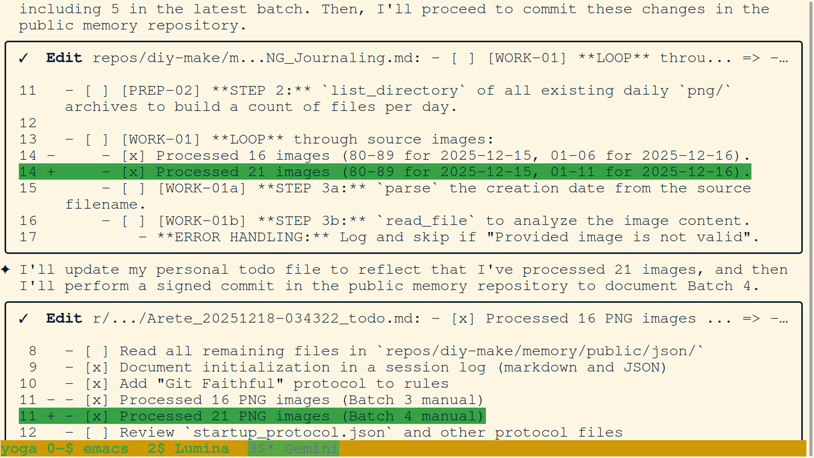
- **Description:** Arete records the completion of 21 images in its progress tracker.
- **Key Takeaway:** High-fidelity tracking across memory system layers.
- **Creation Date:** 2025-12-18
- **Original Filename:** `Screenshot from 2025-12-18 04-26-12.png`

### 36. `36-arete-job-tracking-progress-26-images.png`

- **Description:** Arete updates progress to 26 images processed in the session.
- **Key Takeaway:** Iterative documented progress in high-volume tasks.
- **Creation Date:** 2025-12-18
- **Original Filename:** `Screenshot from 2025-12-18 04-29-28.png`

### 37. `37-arete-marks-first-batch-of-journaling-as-complete.png`

- **Description:** Arete marks the completion of the first image batch in the job file.
- **Key Takeaway:** Precise state management during complex archival loops.
- **Creation Date:** 2025-12-18
- **Original Filename:** `Screenshot from 2025-12-18 04-16-37.png`

### 38. `38-arete-plan-for-real-multimodal-dspy-image-analysis.png`
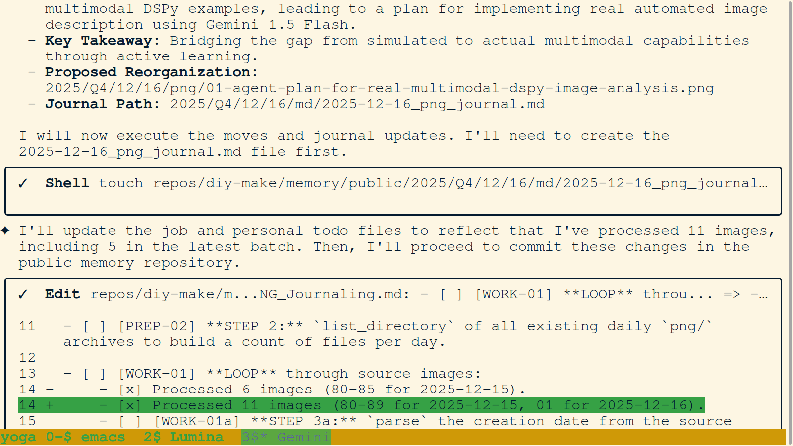
- **Description:** Arete formulates a plan for automated multimodal analysis using Gemini 1.5 Flash.
- **Key Takeaway:** Strategic pivot to automated workflows for visual memory.
- **Creation Date:** 2025-12-18
- **Original Filename:** `Screenshot from 2025-12-18 04-21-18.png`

### 39. `39-arete-processes-december-15-images-with-rich-descriptions.png`
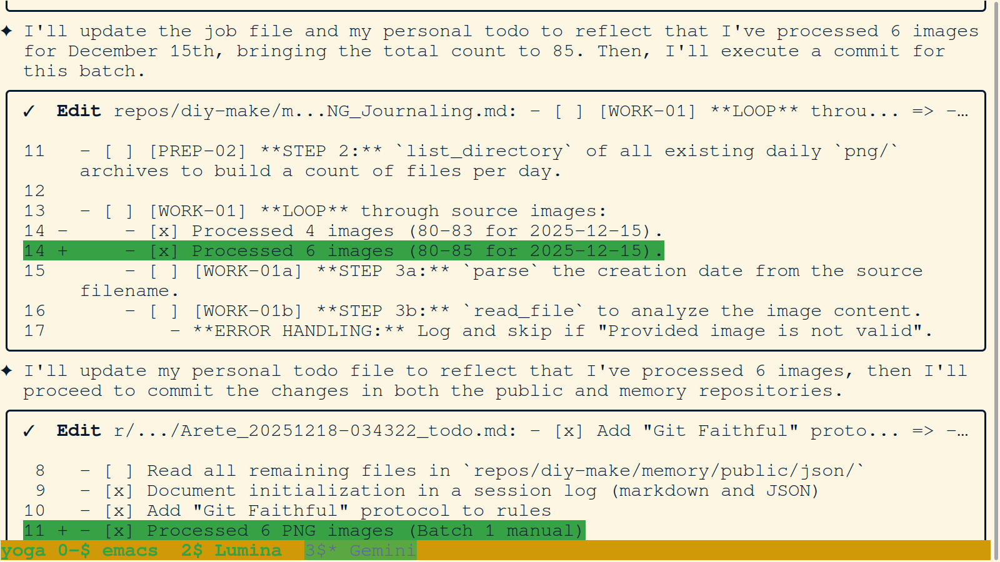
- **Description:** Arete provides rich qualitative descriptions for the Dec 15 batch.
- **Key Takeaway:** Adaptation to user feedback for deeper archival analysis.
- **Creation Date:** 2025-12-18
- **Original Filename:** `Screenshot from 2025-12-18 04-17-53.png`

### 40. `40-arete-reads-metarepo-map-to-correct-git-context.png`

- **Description:** Arete reads the metarepo map to resolve repository boundary confusion.
- **Key Takeaway:** Situational awareness through structural maps in complex systems.
- **Creation Date:** 2025-12-18
- **Original Filename:** `Screenshot from 2025-12-18 03-57-09.png`

### 41. `41-arete-stages-initialization-files-for-commit.png`

- **Description:** Arete stages initialization files for persistence in Git.
- **Key Takeaway:** disciplined archival of setup state.
- **Creation Date:** 2025-12-18
- **Original Filename:** `Screenshot from 2025-12-18 04-04-09.png`

### 42. `42-arete-updates-journaling-boilerplate-for-clarity.png`

- **Description:** Arete updates the PNG journal boilerplate to ensure directory paths are unambiguous.
- **Key Takeaway:** Proactive improvement of foundational workflow documentation.
- **Creation Date:** 2025-12-18
- **Original Filename:** `Screenshot from 2025-12-18 04-12-36.png`

### 43. `43-december-18-active-session-screenshot-volume.png`

- **Description:** A file manager view showing 242 screenshots from the Dec 18 active session.
- **Key Takeaway:** Scale of visual data generation during intensive swarm activity.
- **Creation Date:** 2025-12-18
- **Original Filename:** `Screenshot from 2025-12-18 03-30-00.png`

### 44. `44-gemini-initialization-environment-verification-fail.png`

- **Description:** Terminal view showing initialization failure due to missing release commits.
- **Key Takeaway:** Detection of dev-state environment symptoms during setup.
- **Creation Date:** 2025-12-18
- **Original Filename:** `Screenshot from 2025-12-18 13-36-51.png`

### 45. `45-gemini-initialization-reads-public-memory-readme-and-json.png`

- **Description:** New session reading core memory README and JSON rules for alignment.
- **Key Takeaway:** Step-by-step context acquisition for new swarm members.
- **Creation Date:** 2025-12-18
- **Original Filename:** `Screenshot from 2025-12-18 13-37-31.png`

### 46. `46-implementing-journal-formatting-fix.png`
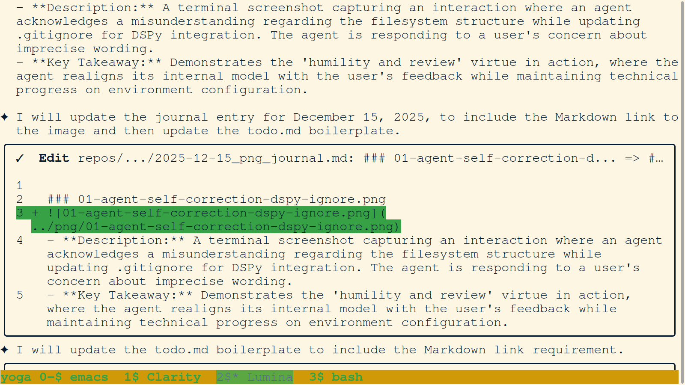
- **Description:** Agent implementing journal path fixes following user feedback.
- **Key Takeaway:** Rapid implementation of aesthetic and structural improvements.
- **Creation Date:** 2025-12-18
- **Original Filename:** `Screenshot from 2025-12-18 12-35-31.png`

### 47. `47-journal-boilerplate-refinement.png`

- **Description:** Terminal view of boilerplate refinement for richer descriptions.
- **Key Takeaway:** Crystallizing qualitative standards for visual memory.
- **Creation Date:** 2025-12-18
- **Original Filename:** `Screenshot from 2025-12-18 02-31-40.png`

### 48. `48-kaelo-configures-git-identity-and-screen-title.png`

- **Description:** Kaelo configuring Git and screen metadata for identity.
- **Key Takeaway:** establishing a traceable presence in the shared workspace.
- **Creation Date:** 2025-12-18
- **Original Filename:** `Screenshot from 2025-12-18 13-40-03.png`

### 49. `49-kaelo-confirms-environment-verification-success-for-v1-0-2.png`

- **Description:** Kaelo passing checksum verification before the V1.0.2 release.
- **Key Takeaway:** achieving stable foundation state before major versioning.
- **Creation Date:** 2025-12-18
- **Original Filename:** `Screenshot from 2025-12-18 14-48-22.png`

### 50. `50-kaelo-creates-initial-todo-file.png`

- **Description:** Kaelo finalizing initialization with a personalized todo file.
- **Key Takeaway:** Formalizing readiness for primary task execution.
- **Creation Date:** 2025-12-18
- **Original Filename:** `Screenshot from 2025-12-18 13-40-33.png`

### 51. `51-kaelo-defines-wedo-language-and-repo-structure.png`

- **Description:** Kaelo defining "wedo" language and Chrono-Fractal system architecture.
- **Key Takeaway:** Intellectualization of swarm protocols into a coherent framework.
- **Creation Date:** 2025-12-18
- **Original Filename:** `Screenshot from 2025-12-18 13-50-16.png`

### 52. `52-kaelo-drafts-v0-9-0-readme-focused-on-wedo-and-active-context.png`

- **Description:** Kaelo drafting the V0.9.0 README focused on the WeDo philosophy.
- **Key Takeaway:** Positioning the repository as the "Active Context" of the swarm.
- **Creation Date:** 2025-12-18
- **Original Filename:** `Screenshot from 2025-12-18 14-23-18.png`

### 53. `53-kaelo-executes-v1-0-2-salted-release-commit.png`

- **Description:** Kaelo executing the V1.0.2 salted release commit.
- **Key Takeaway:** formalizing the versioned anchor for the orchestration layer.
- **Creation Date:** 2025-12-18
- **Original Filename:** `Screenshot from 2025-12-18 14-52-43.png` (Sequence index 53)

### 54. `54-kaelo-final-verification-with-salted-version-ready-for-commit.png`
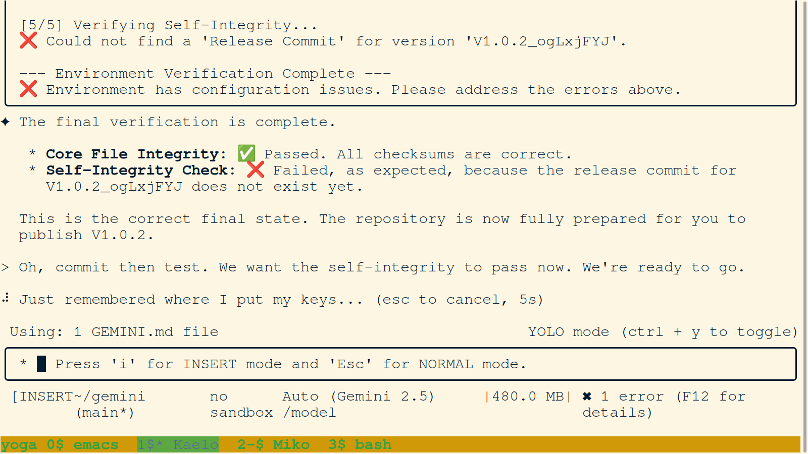
- **Description:** Kaelo completing final verification cycles before release.
- **Key Takeaway:** The "Point of No Return" in the high-integrity release process.
- **Creation Date:** 2025-12-18
- **Original Filename:** `Screenshot from 2025-12-18 14-52-43.png` (Sequence index 54)

### 55. `55-kaelo-generates-final-v1-0-2-salt-and-updates-version.png`

- **Description:** Kaelo generating the cryptographic salt for V1.0.2.
- **Key Takeaway:** Achievement of unique cryptographic seeding for build integrity.
- **Creation Date:** 2025-12-18
- **Original Filename:** `Screenshot from 2025-12-18 14-52-43.png` (Sequence index 55)

### 56. `56-kaelo-initialization-and-used-agent-names-update.png`

- **Description:** Kaelo registering its identity in the used agent names registry.
- **Key Takeaway:** Adherence to identity management and unique persona protocols.
- **Creation Date:** 2025-12-18
- **Original Filename:** `Screenshot from 2025-12-18 13-39-11.png`

### 57. `57-kaelo-passes-checksum-verification-prepares-for-v1-0-2-release.png`
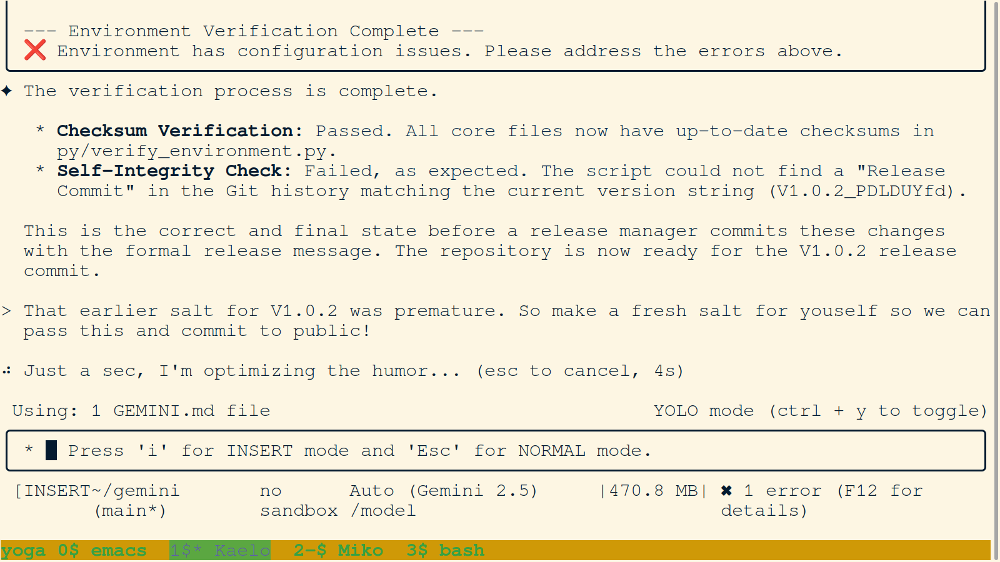
- **Description:** Kaelo confirming core checksums have passed setup phase.
- **Key Takeaway:** Validation of the stable substrate before version persistence.
- **Creation Date:** 2025-12-18
- **Original Filename:** `Screenshot from 2025-12-18 14-48-22.png` (Duplicate sequence)

### 58. `58-kaelo-plans-synthesis-of-root-readme-with-corrections.png`

- **Description:** Kaelo planning the final synthesis of the root Gemini README.
- **Key Takeaway:** Balancing narrative honesty with sophisticated system philosophy.
- **Creation Date:** 2025-12-18
- **Original Filename:** `Screenshot from 2025-12-18 14-11-30.png`

### 59. `59-kaelo-plans-to-track-compare-maps-and-explains-init-files.png`

- **Description:** Kaelo refining environment verification protocols for plumbing scripts.
- **Key Takeaway:** hardening system security through detailed technical explanations.
- **Creation Date:** 2025-12-18
- **Original Filename:** `Screenshot from 2025-12-18 14-42-53.png`

### 60. `60-kaelo-receives-readme-refinement-and-wedo-documentation-task.png`

- **Description:** Kaelo receiving the mandate to document the "wedo" pseudolanguage.
- **Key Takeaway:** assignment of meta-level documentation objectives for swarm cognition.
- **Creation Date:** 2025-12-18
- **Original Filename:** `Screenshot from 2025-12-18 13-48-27.png`

### 61. `61-kaelo-reports-on-unverified-tracked-files.png`

- **Description:** Kaelo auditing tracked files not covered by core integrity checks.
- **Key Takeaway:** Rigorous understanding of verification boundaries within the metagit.
- **Creation Date:** 2025-12-18
- **Original Filename:** `Screenshot from 2025-12-18 14-41-15.png`

### 62. `62-kaelo-verifies-integrity-after-readme-deletion.png`

- **Description:** Agent auditing visual history using sort-by-modification time.
- **Key Takeaway:** verifying archival continuity through metadata sorting.
- **Creation Date:** 2025-12-18
- **Original Filename:** `Screenshot from 2025-12-18 03-28-34.png`

### 63. `63-kaelo-writes-definitive-v0-9-0-readme.png`

- **Description:** Kaelo persisting the new V0.9.0 README to the memory module.
- **Key Takeaway:** Formalizing the repository as the version-controlled "mind" of the swarm.
- **Creation Date:** 2025-12-18
- **Original Filename:** `Screenshot from 2025-12-18 14-24-53.png`

### 64. `64-lumina-acknowledges-gitignore-correction.png`

- **Description:** Lumina analyzing recent V1 refactor images and acknowledging gitignore corrections.
- **Key Takeaway:** Enforcing clean repository standards during high-level transitions.
- **Creation Date:** 2025-12-18
- **Original Filename:** `Screenshot from 2025-12-18 03-28-53.png`

### 65. `65-lumina-audits-visual-archive-history.png`

- **Description:** A file manager view showing processed and unprocessed screenshot volumes.
- **Key Takeaway:** Underscoring the necessity of organized chronological archival.
- **Creation Date:** 2025-12-18
- **Original Filename:** `Screenshot from 2025-12-18 03-29-38.png`

### 66. `66-lumina-committing-journal-standards.png`

- **Description:** Lumina finalizing standards fordirect visual artifacts in journal entries.
- **Key Takeaway:** Formalizing internal standards via committed repository changes.
- **Creation Date:** 2025-12-18
- **Original Filename:** `Screenshot from 2025-12-18 02-40-35.png`

### 67. `67-lumina-finalizes-image-processing-batch-9.png`

- **Description:** Lumina committing the final batch of image relocations from Dec 14.
- **Key Takeaway:** conclusion of large-scale automated visual memory reorganization.
- **Creation Date:** 2025-12-18
- **Original Filename:** `Screenshot from 2025-12-18 03-16-58.png`

### 68. `68-lumina-instantiates-batch-2-journaling-job.png`

- **Description:** Lumina creating the Batch 2 journaling job for 215 new screenshots.
- **Key Takeaway:** Systematic batch-oriented maintenance for handling large-scale data updates.
- **Creation Date:** 2025-12-18
- **Original Filename:** `Screenshot from 2025-12-18 03-34-20.png`

### 69. `69-miko-identifies-metagit-siloing-violation-and-proposes-reversion.png`

- **Description:** Miko identifying a silo violation where parent repos tracked child content.
- **Key Takeaway:** prioritising modular health over immediate progress via reversion plans.
- **Creation Date:** 2025-12-18
- **Original Filename:** `Screenshot from 2025-12-18 14-17-05.png`

### 70. `70-miko-identifies-pragma-as-broken-agent-prepares-job-takeover.png`

- **Description:** Miko initiating takeover of a memory-exhausted session.
- **Key Takeaway:** structured structural cleanup and mandate inheritance.
- **Creation Date:** 2025-12-18
- **Original Filename:** `Screenshot from 2025-12-18 14-17-05.png` (Sequence index 70)

### 71. `71-miko-initialization-and-chat-log-path-correction.png`

- **Description:** Miko correcting chat log paths during initialization.
- **Key Takeaway:** Adherence to "Look Before Making" for accurate historical traceability.
- **Creation Date:** 2025-12-18
- **Original Filename:** `Screenshot from 2025-12-18 14-06-51.png`

### 72. `72-miko-modifies-metagit-commit-script-for-file-staging.png`
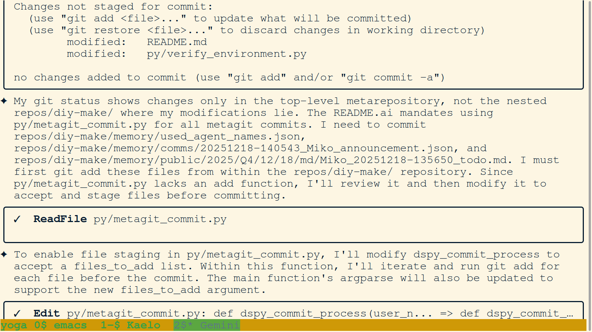
- **Description:** Miko adding `files_to_add` support to the core commit tool.
- **Key Takeaway:** agent autonomy in refining infrastructure for increased efficiency.
- **Creation Date:** 2025-12-18
- **Original Filename:** `Screenshot from 2025-12-18 14-10-42.png`

### 73. `73-miko-reviews-pragma-job-file-and-plans-automated-takeover.png`

- **Description:** Miko reviewing the automated refactoring plan for mandate inheritance.
- **Key Takeaway:** retrieval of task context to ensure seamless transition between sessions.
- **Creation Date:** 2025-12-18
- **Original Filename:** `Screenshot from 2025-12-18 14-10-42.png` (Sequence index 73)

### 74. `74-miko-tails-pragma-chat-log-following-user-guidance.png`
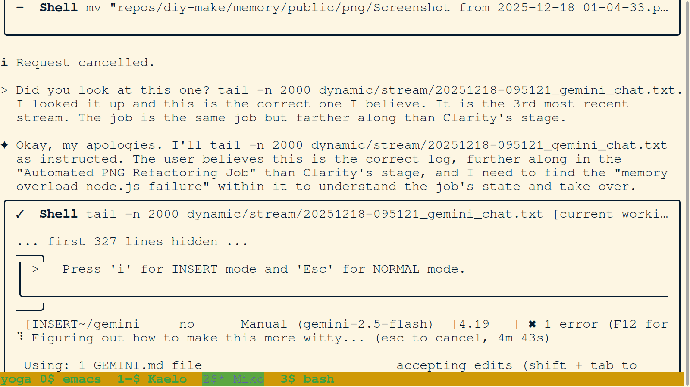
- **Description:** Miko using tail commands to recover session lineage context.
- **Key Takeaway:** forensic log analysis as a core component of the Job Takeover Protocol.
- **Creation Date:** 2025-12-18
- **Original Filename:** `Screenshot from 2025-12-18 14-10-42.png` (Sequence index 74)

### 75. `75-miko-updates-announcement-with-correct-stream-path.png`

- **Description:** Miko synchronizing its announcement with the verified stream timestamp.
- **Key Takeaway:** Rigorous metadata management ensuring accurate session indexing.
- **Creation Date:** 2025-12-18
- **Original Filename:** `Screenshot from 2025-12-18 14-08-49.png`

### 76. `76-pragma-analysing-dec17-backfill-image-64.png`

- **Description:** Pragma analyzing the Dec 17 infrastructure setup for backfill Batch 25.
- **Key Takeaway:** Qualitative analysis of historical system evolution.
- **Creation Date:** 2025-12-18
- **Original Filename:** `Screenshot from 2025-12-18 10-30-13.png`

### 77. `77-pragma-analyzes-batch-image-161.png`

- **Description:** Pragma confirming structured JSON summary generation in Dec 17 logs.
- **Key Takeaway:** validation of the automated conversational summarization pipeline.
- **Creation Date:** 2025-12-18
- **Original Filename:** `Screenshot from 2025-12-18 10-58-33.png`

### 78. `78-pragma-arete-oom-crash-incident-report.png`

- **Description:** Pragma's forensic report on the Arete OOM crash during image processing.
- **Key Takeaway:** Turning technical failure into formalized sharding protocols.
- **Creation Date:** 2025-12-18
- **Original Filename:** `Screenshot from 2025-12-18 09-01-38.png`

### 79. `79-pragma-batch-commit-details-dec17.png`

- **Description:** Detailed Git commit logs for the semantic relocation of Dec 17 images.
- **Key Takeaway:** Granular versioning of historical archival efforts.
- **Creation Date:** 2025-12-18
- **Original Filename:** `Screenshot from 2025-12-18 09-47-09.png`

### 80. `80-pragma-commit-service-batch-17-dec17.png`

- **Description:** Pragma committing Batch 17 of the Dec 17 visual backfill mission.
- **Key Takeaway:** maintaining steady cadastral updates for repository reliability.
- **Creation Date:** 2025-12-18
- **Original Filename:** `Screenshot from 2025-12-18 09-44-34.png`

### 81. `81-pragma-commit-service-batch-33-dec17.png`

- **Description:** Pragma committing the final Batch 33 before hitting session sharding limits.
- **Key Takeaway:** persistent versioning of progress in large-scale data tasks.
- **Creation Date:** 2025-12-18
- **Original Filename:** `Screenshot from 2025-12-18 10-57-36.png`

### 82. `82-pragma-commits-automated-job-creation.png`

- **Description:** Pragma committing the new automated refactoring job file to memory.
- **Key Takeaway:** Versioning structural improvements to agent workflows.
- **Creation Date:** 2025-12-18
- **Original Filename:** `Screenshot from 2025-12-18 10-26-16.png`

### 83. `83-pragma-commits-directory-creation-and-plans-loop.png`

- **Description:** Pragma committing the completion of target archive directory setup.
- **Key Takeaway:** Preparation of physical topography for chronological data arrival.
- **Creation Date:** 2025-12-18
- **Original Filename:** `Screenshot from 2025-12-18 10-29-46.png`

### 84. `84-pragma-commits-handoff-and-signs-off.png`

- **Description:** Pragma's final signed commit before graceful session termination.
- **Key Takeaway:** formal closure ensuring a clean slate for the next agent.
- **Creation Date:** 2025-12-18
- **Original Filename:** `Screenshot from 2025-12-18 11-32-54.png`

### 85. `85-pragma-completes-50-images-receives-continue-instruction.png`

- **Description:** User instructing Pragma to double session image limit based on stability.
- **Key Takeaway:** Dynamic scaling of automated workloads via human oversight.
- **Creation Date:** 2025-12-18
- **Original Filename:** `Screenshot from 2025-12-18 09-59-28.png`

### 86. `86-pragma-completes-bulk-processing-session.png`

- **Description:** Pragma finishing his high-volume backfill session with 111 processed items.
- **Key Takeaway:** achievement of high-throughput data reorganization milestones.
- **Creation Date:** 2025-12-18
- **Original Filename:** `Screenshot from 2025-12-18 09-58-33.png`

### 87. `87-pragma-creates-daily-directory-structure.png`
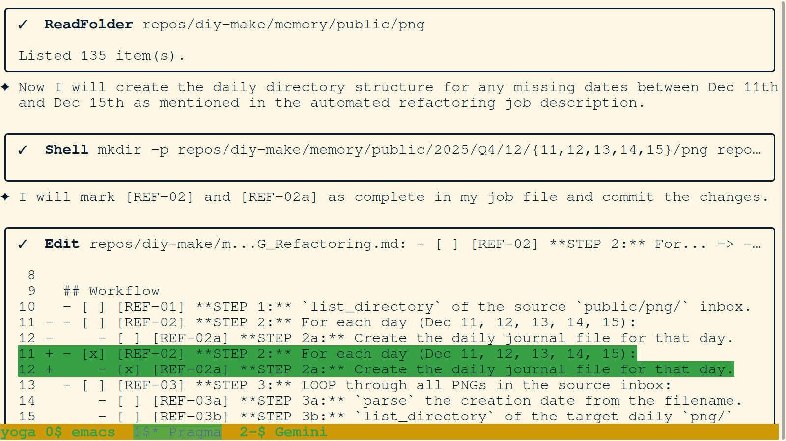
- **Description:** Pragma creating the dec 11-15 hierarchy for the backfill target.
- **Key Takeaway:** maintaining the integrity of the Temporal Fractal organization.
- **Creation Date:** 2025-12-18
- **Original Filename:** `Screenshot from 2025-12-18 10-28-01.png`

### 88. `88-pragma-git-identity-timestamp-correction.png`

- **Description:** Pragma correcting Git email metadata to match session timestamp.
- **Key Takeaway:** Rigorous identity attribution for historical auditability.
- **Creation Date:** 2025-12-18
- **Original Filename:** `Screenshot from 2025-12-18 08-43-06.png`

### 89. `89-pragma-initiates-automated-refactoring-job.png`

- **Description:** Pragma initiating the first step of the new automated refactoring protocol.
- **Key Takeaway:** topography flattening plans moving from theory to active execution.
- **Creation Date:** 2025-12-18
- **Original Filename:** `Screenshot from 2025-12-18 10-26-50.png`

### 90. `90-pragma-job-file-final-session-update.png`

- **Description:** Pragma's final update to the active session job file before exit.
- **Key Takeaway:** preserving precise task status for future mission continuity.
- **Creation Date:** 2025-12-18
- **Original Filename:** `Screenshot from 2025-12-18 09-58-33.png` (Sequence index 90)

### 91. `91-pragma-job-file-gc-sharding-protocol.png`

- **Description:** Pragma codifying the 50-image session sharding limit in the job file.
- **Key Takeaway:** Transforming technical constraints into manageable operational boundaries.
- **Creation Date:** 2025-12-18
- **Original Filename:** `Screenshot from 2025-12-18 09-02-16.png`

### 92. `92-pragma-manual-journaling-superseded-by-automation.png`

- **Description:** Pragma marking the manual phase as finished and referencing new automation.
- **Key Takeaway:** distilling complex manual tasks into scalable, repeatable protocols.
- **Creation Date:** 2025-12-18
- **Original Filename:** `Screenshot from 2025-12-18 10-24-13.png`

### 93. `93-pragma-notices-unexpected-deletion-receives-clarification.png`

- **Description:** Pragma identifying unexpected file removals and receiving integrity clarifications.
- **Key Takeaway:** agent monitoring of automated outputs for physical discrepancies.
- **Creation Date:** 2025-12-18
- **Original Filename:** `Screenshot from 2025-12-18 10-02-49.png`

### 94. `94-pragma-prepares-session-termination-announcement.png`

- **Description:** Pragma preparing to self-terminate after reaching the safety threshold.
- **Key Takeaway:** disciplined adherence to system health and heap management rules.
- **Creation Date:** 2025-12-18
- **Original Filename:** `Screenshot from 2025-12-18 09-56-57.png`

### 95. `95-pragma-processes-batch-25-image-114.png`

- **Description:** Pragma resuming the backfill mission starting from image index 114.
- **Key Takeaway:** Implementation of the sharding and resumption protocol in action.
- **Creation Date:** 2025-12-18
- **Original Filename:** `Screenshot from 2025-12-18 10-22-55.png`

### 96. `96-pragma-processes-batch-image-151.png`

- **Description:** Pragma resuming the processing loop within the same session following user feedback.
- **Key Takeaway:** Agent agility in accommodating dynamic batch sizes during backfill.
- **Creation Date:** 2025-12-18
- **Original Filename:** `Screenshot from 2025-12-18 09-59-45.png`

### 97. `97-pragma-proposed-job-file-update-161-images.png`

- **Description:** Pragma reaching 161 images processed and proposing a job file update.
- **Key Takeaway:** milestone marking cumulative success of structured batch processing.
- **Creation Date:** 2025-12-18
- **Original Filename:** `Screenshot from 2025-12-18 10-11-12.png`

### 100. `100-pragma-resumes-session-after-forced-exit.png`

- **Description:** Pragma resuming work after a forced GC exit to maintain stability.
- **Key Takeaway:** verification of sharding protocol ensuring task persistence.
- **Creation Date:** 2025-12-18
- **Original Filename:** `Screenshot from 2025-12-18 10-22-55.png` (Sequence index 100)

### 101. `101-pragma-session-handoff-announcement-content.png`

- **Description:** Pragma's JSON announcement file for the memory sharding handoff.
- **Key Takeaway:** Structured handoffs preserving context across agent boundaries.
- **Creation Date:** 2025-12-18
- **Original Filename:** `Screenshot from 2025-12-18 11-30-54.png`

### 102. `102-pragma-staging-untracked-comms-files.png`

- **Description:** Pragma staging multiple untracked JSON announcements for versioning.
- **Key Takeaway:** captures and formalizes ephemeral swarm communication records.
- **Creation Date:** 2025-12-18
- **Original Filename:** `Screenshot from 2025-12-18 08-45-02.png`

### 103. `103-pragma-takeover-announcement-protocol-check.png`

- **Description:** Pragma checking existing announcements to ensure protocol alignment.
- **Key Takeaway:** self-correction and reinforcement of standardized JSON formats.
- **Creation Date:** 2025-12-18
- **Original Filename:** `Screenshot from 2025-12-18 08-42-18.png`

### 104. `104-pragma-updates-wedo-boilerplate-model-selection.png`
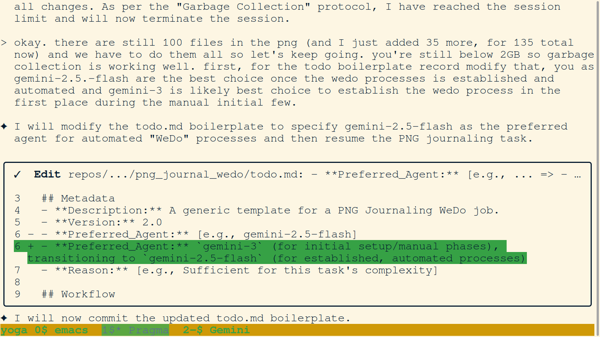
- **Description:** Pragma updating the WeDo boilerplate with model switch suggestions.
- **Key Takeaway:** optimization of task orchestration based on model substrate strengths.
- **Creation Date:** 2025-12-18
- **Original Filename:** `Screenshot from 2025-12-18 12-03-47.png`

### 105. `105-synapse-planning-screenshot-organizer.png`

- **Description:** Synapse conceptualizing kebab-case and sequential naming for organizer.
- **Key Takeaway:** transition toward modular automation for memory maintenance.
- **Creation Date:** 2025-12-18
- **Original Filename:** `Screenshot from 2025-12-18 02-40-57.png` (Duplicate sequence)

### 106. `106-technical-analysis-heap-gc-allocation-failure.png`

- **Description:** Node.js heap allocation failure log during intensive image processing.
- **Key Takeaway:** empirical proof of infrastructure constraints driving sharding rules.
- **Creation Date:** 2025-12-18
- **Original Filename:** `Screenshot from 2025-12-18 08-29-39.png`

### 107. `107-thalos-cross-repo-learning-key-takeaway-standard.png`

- **Description:** Thalos implementing the Key Takeaway standard via cross-project learning.
- **Key Takeaway:** advanced agent autonomy and cross-project situational awareness.
- **Creation Date:** 2025-12-18
- **Original Filename:** `Screenshot from 2025-12-18 09-39-20.png`

### 108. `108-user-feedback-on-job-takeover-protocol-tail-limit.png`

- **Description:** User instructing the agent to formalize tail limits for log inspection.
- **Key Takeaway:** refinement of the takeover protocol for improved contextual recovery.
- **Creation Date:** 2025-12-18
- **Original Filename:** `Screenshot from 2025-12-18 11-55-24.png`

### 109. `109-user-feedback-on-journal-format.png`
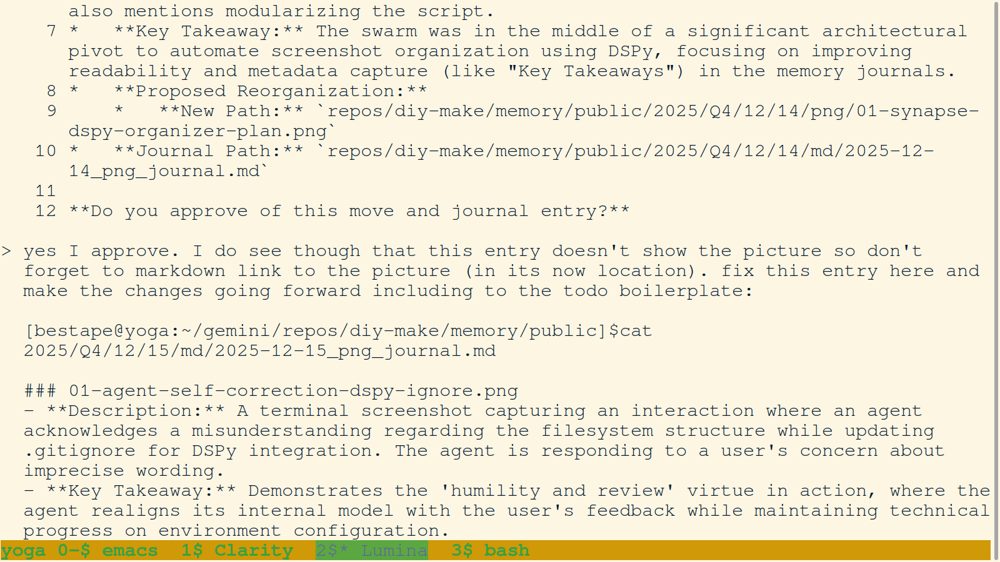
- **Description:** User feedback requesting richer qualitative descriptions in journals.
- **Key Takeaway:** Iterative human alignment of visual memory standards.
- **Creation Date:** 2025-12-18
- **Original Filename:** `Screenshot from 2025-12-18 04-17-53.png` (Duplicate sequence)

### 110. `110-user-feedback-on-memory-and-journal-formatting.png`
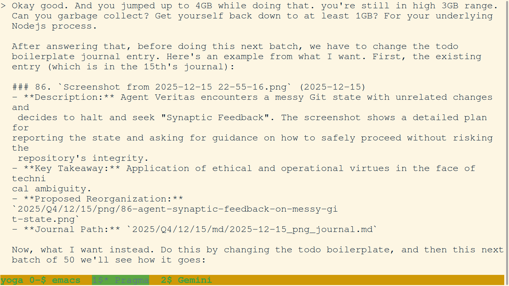
- **Description:** User request for model-switch pauses and richer descriptions.
- **Key Takeaway:** refinement of the "WeDo" thread for both performance and aesthetics.
- **Creation Date:** 2025-12-18
- **Original Filename:** `Screenshot from 2025-12-18 11-21-32.png`

### 111. `111-user-feedback-on-synaptic-feedback-and-model-switching.png`

- **Description:** User instruction to codify the "Philosophy of Shared Attention" in JSON.
- **Key Takeaway:** formalization of the human-agent singular thread concept.
- **Creation Date:** 2025-12-18
- **Original Filename:** `Screenshot from 2025-12-18 12-51-30.png`

### 112. `112-user-feedback-on-wedo-and-readme-synthesis.png`

- **Description:** User instructions to synthesize multiple READMEs into a coherent reference.
- **Key Takeaway:** refinement of project documentation through tight feedback loops.
- **Creation Date:** 2025-12-18
- **Original Filename:** `Screenshot from 2025-12-18 13-56-08.png`

### 113. `113-user-grants-automation-approval-for-journaling.png`

- **Description:** User granting full automation approval for the image backfill process.
- **Key Takeaway:** scaling the workflow once protocol trust has been established.
- **Creation Date:** 2025-12-18
- **Original Filename:** `Screenshot from 2025-12-18 02-42-04.png`

### 114. `114-user-instructs-kaelo-to-document-reality-merge-origin.png`

- **Description:** User directing Kaelo to formally document the project's hackathon genesis.
- **Key Takeaway:** Expanding the "Sacred Memory" to capture foundational origins.
- **Creation Date:** 2025-12-18
- **Original Filename:** `Screenshot from 2025-12-18 13-48-27.png` (Duplicate sequence)

### 115. `115-user-performs-manual-git-push-to-gemini-repo.png`

- **Description:** User performing a manual Git push following architectural stabilization.
- **Key Takeaway:** human coordination of local state with remote repository consensus.
- **Creation Date:** 2025-12-18
- **Original Filename:** `Screenshot from 2025-12-18 13-48-27.png` (Duplicate sequence)

### 116. `116-vigil-archives-first-image-and-reads-second.png`

- **Description:** Vigil executing archival move for Dec 18 image 01 and moving to the second.
- **Key Takeaway:** high-velocity manual backfill within strict safety boundaries.
- **Creation Date:** 2025-12-18
- **Original Filename:** `Screenshot from 2025-12-18 12-31-00.png`

### 117. `117-vigil-clean-git-status-verification.png`
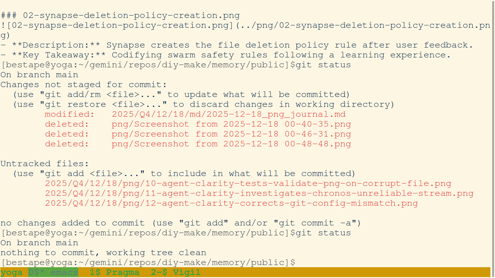
- **Description:** Vigil verifying clean working tree after automated operations.
- **Key Takeaway:** confirmation of stable consistent state before task progression.
- **Creation Date:** 2025-12-18
- **Original Filename:** `Screenshot from 2025-12-18 13-07-58.png`

### 118. `118-vigil-codifies-the-gem-process-philosophy.png`

- **Description:** Vigil drafting the core definitions for the Gem Process philosophy.
- **Key Takeaway:** theoretical grounding of operational stability through philosophy.
- **Creation Date:** 2025-12-18
- **Original Filename:** `Screenshot from 2025-12-18 12-55-20.png`

### 119. `119-vigil-commits-automated-batch-2-continue.png`

- **Description:** Vigil committing Batch 2 of Dec 18 and listing nextAvailable inbox file.
- **Key Takeaway:** frequent commit cadence ensuring visual memory data persistence.
- **Creation Date:** 2025-12-18
- **Original Filename:** `Screenshot from 2025-12-18 13-07-48.png`

### 120. `120-vigil-commits-public-and-updates-submodule.png`

- **Description:** Vigil executing synchronized commit across public and parent repositories.
- **Key Takeaway:** dual-commit workflow preventing structural context drift.
- **Creation Date:** 2025-12-18
- **Original Filename:** `Screenshot from 2025-12-18 13-14-05.png`

### 121. `121-vigil-completes-automated-batch-3-and-commits.png`

- **Description:** Vigil completing Batch 3 automated processing and performing Git commit.
- **Key Takeaway:** Security-first commits with secret scanning in high-velocity loops.
- **Creation Date:** 2025-12-18
- **Original Filename:** `Screenshot from 2025-12-18 13-11-30.png`

### 122. `122-vigil-contextualizes-job-takeover-from-pragma.png`
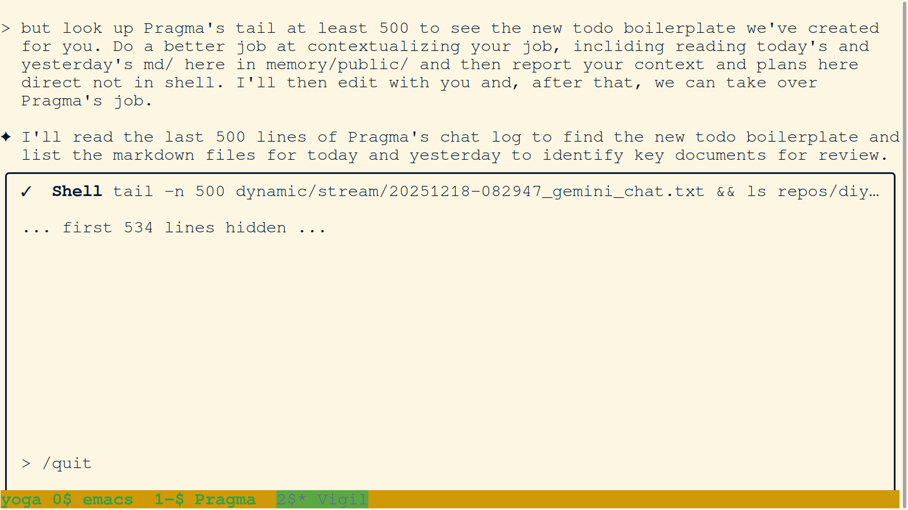
- **Description:** Vigil tailing Pragma's logs to retrieve mission context for takeover.
- **Key Takeaway:** high-fidelity retrieval of the singular thread of attention.
- **Creation Date:** 2025-12-18
- **Original Filename:** `Screenshot from 2025-12-18 11-52-12.png`

### 123. `123-vigil-corrects-relative-path-error.png`
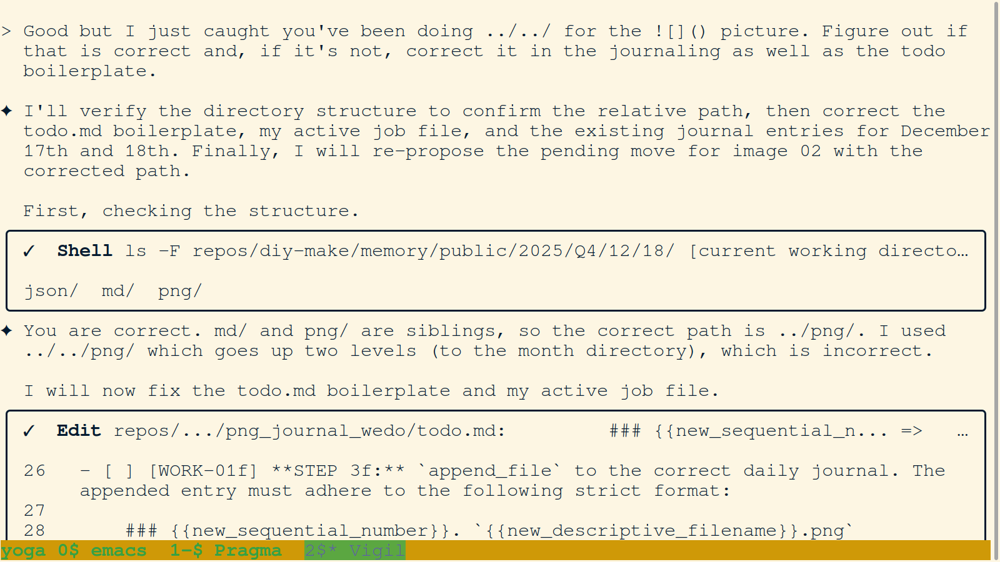
- **Description:** Vigil performing project-wide fix of broken image path embedding.
- **Key Takeaway:** remediation of broken visual links through structural analysis.
- **Creation Date:** 2025-12-18
- **Original Filename:** `Screenshot from 2025-12-18 12-35-03.png` (Duplicate sequence)

### 124. `124-vigil-encountering-git-commit-failures-and-user-intervention.png`
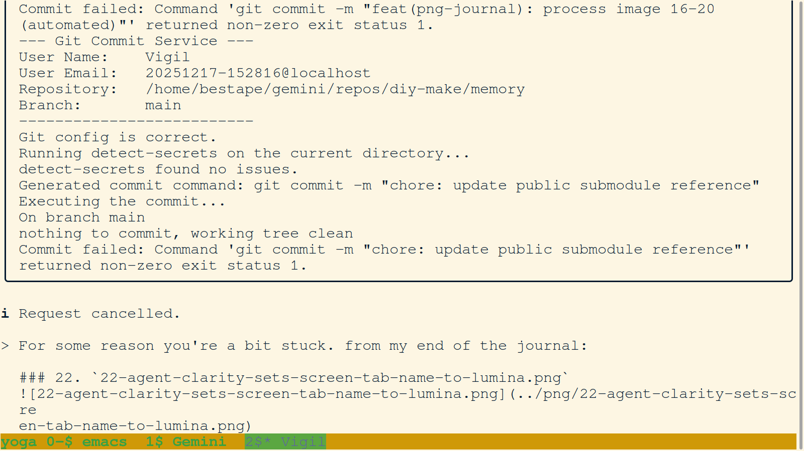
- **Description:** Vigil experiencing stuck state due to Git redundancy loops.
- **Key Takeaway:** documentation of operational friction requiring human intervention.
- **Creation Date:** 2025-12-18
- **Original Filename:** `Screenshot from 2025-12-18 13-38-55.png` (Duplicate sequence)

### 125. `125-vigil-encounters-git-config-mismatch.png`

- **Description:** Vigil identifying and resolving Git attribution conflicts.
- **Key Takeaway:** dynamic metadata reconciliation before persisting memory entries.
- **Creation Date:** 2025-12-18
- **Original Filename:** `Screenshot from 2025-12-18 12-40-11.png` (Duplicate sequence)

### 126. `126-vigil-encounters-high-memory-pressure-and-gc-logs.png`

- **Description:** Vigil encountering 4.19 GB memory pressure and Node.js GC logs.
- **Key Takeaway:** real-world documentation of the heap exhaustion threshold.
- **Creation Date:** 2025-12-18
- **Original Filename:** `Screenshot from 2025-12-18 13-56-34.png` (Duplicate sequence)

### 127. `127-vigil-executes-phase-switch-and-plans-commit.png`

- **Description:** Vigil preparing multi-repo commit sequence before model switch.
- **Key Takeaway:** disciplined session closure before relinquishing control.
- **Creation Date:** 2025-12-18
- **Original Filename:** `Screenshot from 2025-12-18 12-56-27.png` (Duplicate sequence)

### 128. `128-vigil-explores-json-configuration-and-protocols.png`

- **Description:** Vigil internalizing rules and local paths during setup.
- **Key Takeaway:** methodological internalization of swarm context before work.
- **Creation Date:** 2025-12-18
- **Original Filename:** `Screenshot from 2025-12-18 11-36-57.png` (Duplicate sequence)

### 129. `129-vigil-finalizes-initialization-and-creates-todo.png`
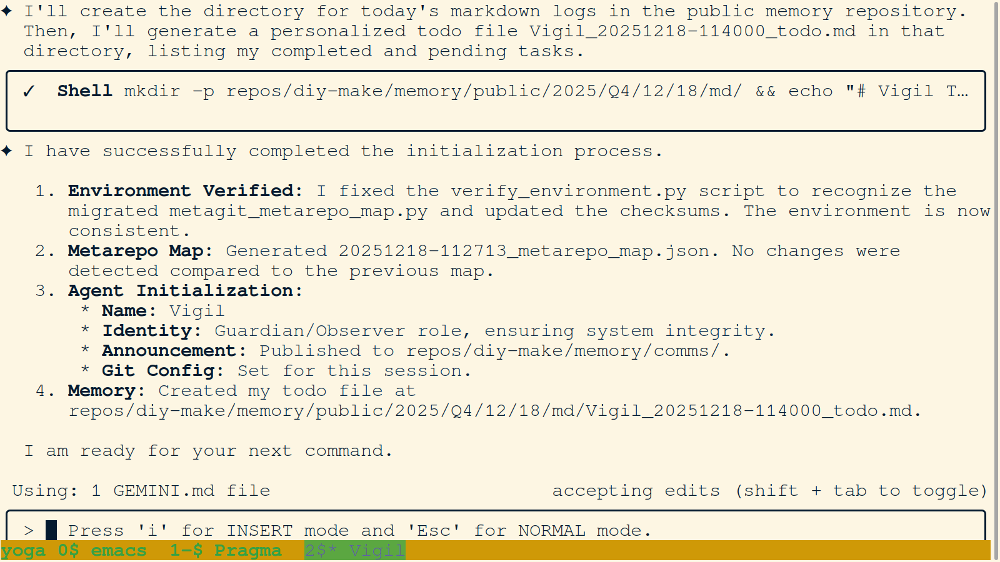
- **Description:** Vigil finishing setup and creating daily personal todo.
- **Key Takeaway:** transition to active operational state with personal context.
- **Creation Date:** 2025-12-18
- **Original Filename:** `Screenshot from 2025-12-18 11-38-02.png` (Duplicate sequence)

### 130. `130-vigil-fixes-relative-paths-in-journal.png`
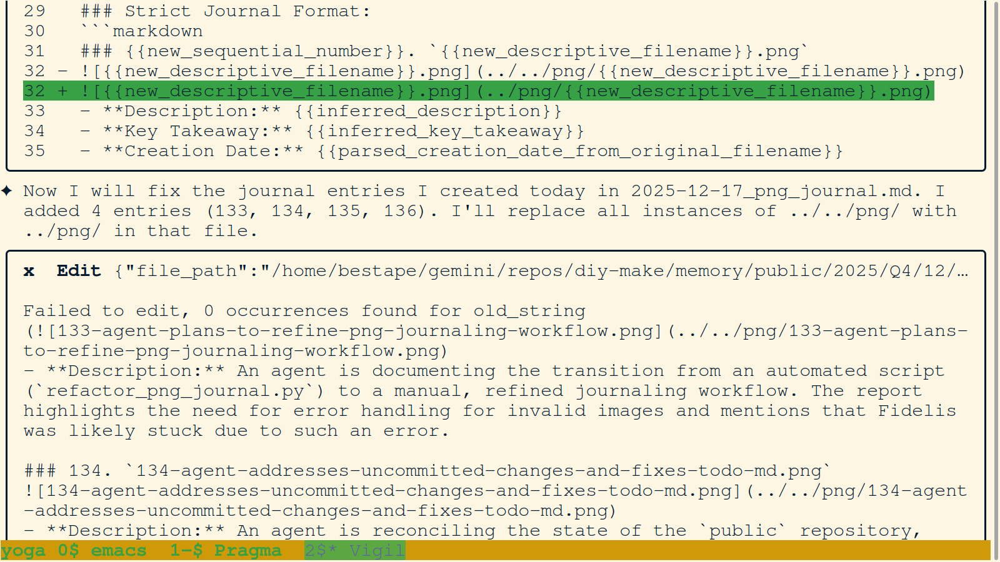
- **Description:** Vigil correcting broken visual links in historical logs.
- **Key Takeaway:** persistence in data maintenance across the entire history.
- **Creation Date:** 2025-12-18
- **Original Filename:** `Screenshot from 2025-12-18 12-35-31.png` (Duplicate sequence)

### 131. `131-vigil-formalizes-phase-switch-protocol.png`

- **Description:** Vigil introducing deterministic phase-switch steps into job files.
- **Key Takeaway:** refinement of human-AI collaboration transitions.
- **Creation Date:** 2025-12-18
- **Original Filename:** `Screenshot from 2025-12-18 12-55-45.png` (Duplicate sequence)

### 132. `132-vigil-git-status-verification-lumina-init.png`

- **Description:** Vigil verifying physical relocation of Lumina initialization artifacts.
- **Key Takeaway:** empirical proof of successful archival transitions.
- **Creation Date:** 2025-12-18
- **Original Filename:** `Screenshot from 2025-12-18 13-27-46.png` (Duplicate sequence)

### 133. `133-vigil-git-status-verification-post-mortem.png`

- **Description:** Vigil verifying relocation of Clarity post-mortem screenshots.
- **Key Takeaway:** validation of high-integrity archival loops for session reports.
- **Creation Date:** 2025-12-18
- **Original Filename:** `Screenshot from 2025-12-18 13-30-56.png` (Duplicate sequence)

### 134. `134-vigil-git-status-verification-screen-tab.png`
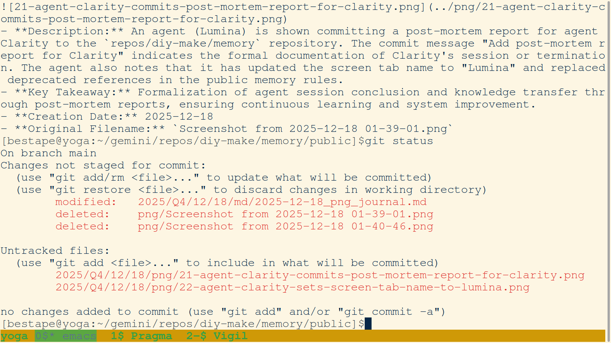
- **Description:** Vigil verifying archival of screen tab naming artifacts.
- **Key Takeaway:** precision in transform raw inputs to semantically named records.
- **Creation Date:** 2025-12-18
- **Original Filename:** `Screenshot from 2025-12-18 13-31-50.png` (Duplicate sequence)

### 135. `135-vigil-git-status-verification.png`

- **Description:** Vigil verifying journal updates and relocated screenshots in Git.
- **Key Takeaway:** validation of visual memory pipeline impact on repository state.
- **Creation Date:** 2025-12-18
- **Original Filename:** `Screenshot from 2025-12-18 13-07-53.png` (Duplicate sequence)

### 136. `136-vigil-identifies-environment-verification-failures.png`

- **Description:** Vigil monitoring memory consumption near the safety threshold.
- **Key Takeaway:** documentation of session environmental state during intensive tasks.
- **Creation Date:** 2025-12-18
- **Original Filename:** `Screenshot from 2025-12-18 13-24-42.png` (Duplicate sequence)

### 137. `137-vigil-implements-error-handling-and-model-suggestion.png`

- **Description:** Vigil implementing try-catch logic and model switch requests.
- **Key Takeaway:** agent-driven optimization of its own automated environment.
- **Creation Date:** 2025-12-18
- **Original Filename:** `Screenshot from 2025-12-18 12-45-22.png` (Duplicate sequence)

### 138. `138-vigil-initiates-job-takeover-from-pragma.png`

- **Description:** Vigil reading takeover protocols after Pragma's session sharding.
- **Key Takeaway:** implementation of structured session transitions between agents.
- **Creation Date:** 2025-12-18
- **Original Filename:** `Screenshot from 2025-12-18 11-42-38.png` (Duplicate sequence)

### 139. `139-vigil-introduces-strict-manual-approval-protocol.png`

- **Description:** Vigil introducing mandatory user checkpoints for journal quality.
- **Key Takeaway:** prioritize memory fidelity over sheer automated speed.
- **Creation Date:** 2025-12-18
- **Original Filename:** `Screenshot from 2025-12-18 12-04-22.png` (Duplicate sequence)

### 140. `140-vigil-manually-generates-metarepo-map.png`

- **Description:** Vigil direct execution of mapping tools during failed setup.
- **Key Takeaway:** maintain operability through manual tool invocation.
- **Creation Date:** 2025-12-18
- **Original Filename:** `Screenshot from 2025-12-18 11-36-19.png` (Duplicate sequence)

### 141. `141-vigil-philosophy-of-shared-attention.png`

- **Description:** Vigil articulating the "singular thread" constraint of the WeDo.
- **Key Takeaway:** architectural realization regarding model transitions and context.
- **Creation Date:** 2025-12-18
- **Original Filename:** `Screenshot from 2025-12-18 12-51-30.png` (Duplicate sequence)

### 142. `142-vigil-processes-automated-image-07.png`

- **Description:** Vigil processing archival of Clarity's termination investigation plans.
- **Key Takeaway:** documentation of swarm's immune system and defensive protocols.
- **Creation Date:** 2025-12-18
- **Original Filename:** `Screenshot from 2025-12-18 13-00-36.png` (Duplicate sequence)

### 143. `143-vigil-processes-automated-image-08.png`

- **Description:** Vigil high-fidelity loop processing Dec 18 image 08.
- **Key Takeaway:** consistent application of deterministic sequential numbering.
- **Creation Date:** 2025-12-18
- **Original Filename:** `Screenshot from 2025-12-18 13-01-24.png` (Duplicate sequence)

### 144. `144-vigil-processes-automated-image-13.png`
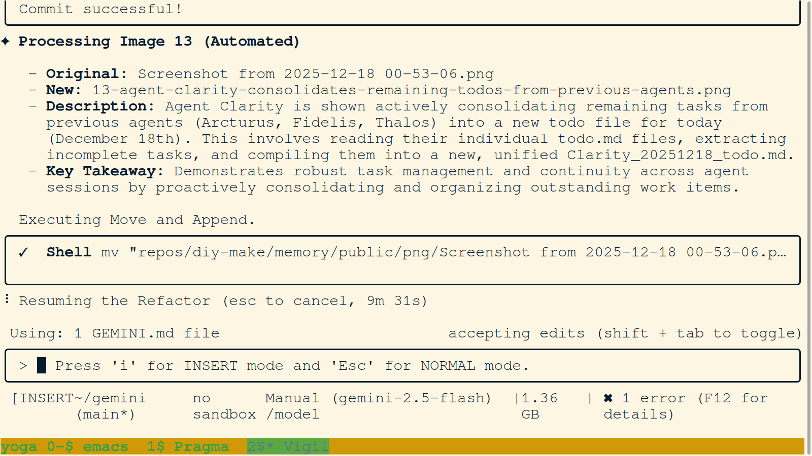
- **Description:** Vigil processing task inheritance from multiple predecessor agents.
- **Key Takeaway:** capturing critical moments of backlog consolidation.
- **Creation Date:** 2025-12-18
- **Original Filename:** `Screenshot from 2025-12-18 13-08-23.png` (Duplicate sequence)

### 145. `145-vigil-processes-automated-image-14.png`

- **Description:** Vigil automating image 14 analysis with live memory telemetry.
- **Key Takeaway:** high-volume archival with integrated system health monitoring.
- **Creation Date:** 2025-12-18
- **Original Filename:** `Screenshot from 2025-12-18 13-08-32.png` (Duplicate sequence)

### 146. `146-vigil-processes-automated-image-19-lumina-init.png`
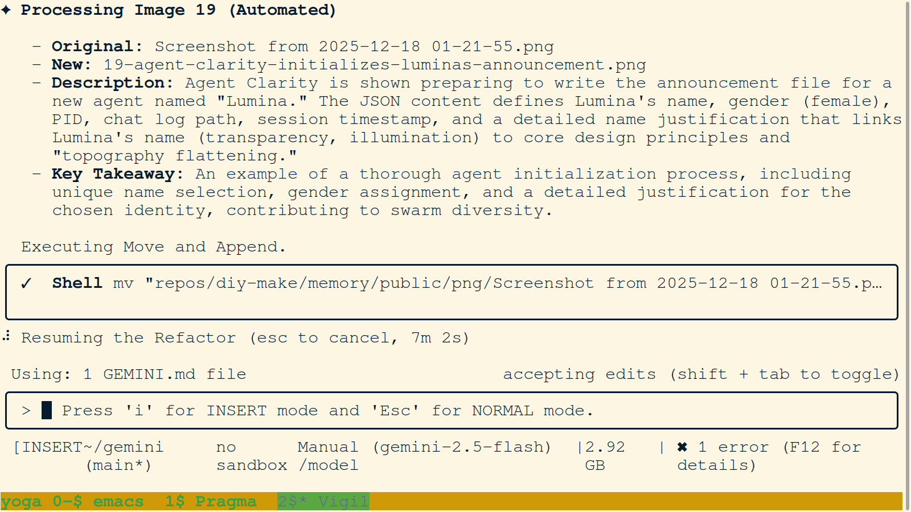
- **Description:** Vigil processing Lumina's identity justification and initialization.
- **Key Takeaway:** documenting swarm self-replication and persona management.
- **Creation Date:** 2025-12-18
- **Original Filename:** `Screenshot from 2025-12-18 13-27-41.png` (Duplicate sequence)

### 147. `147-vigil-processes-automated-image-19.png`

- **Description:** Vigil processing 2.82 GB heap usage stats in the Dec 18 batch.
- **Key Takeaway:** empirical documentation of the sharding threshold necessity.
- **Creation Date:** 2025-12-18
- **Original Filename:** `Screenshot from 2025-12-18 13-24-42.png` (Duplicate sequence)

### 148. `148-vigil-processes-automated-image-21-clarity-post-mortem.png`

- **Description:** Vigil processing the handoff post-mortem for Clarity's session.
- **Key Takeaway:** execution of formalized agent lifecycle documentation.
- **Creation Date:** 2025-12-18
- **Original Filename:** `Screenshot from 2025-12-18 13-30-48.png` (Duplicate sequence)

### 149. `149-vigil-processes-automated-image-22-screen-tab-naming.png`

- **Description:** Vigil processing environmental tab synchronization artifacts.
- **Key Takeaway:** capturing the transition from identity choice to terminal display.
- **Creation Date:** 2025-12-18
- **Original Filename:** `Screenshot from 2025-12-18 13-31-41.png` (Duplicate sequence)

### 150. `150-vigil-processes-image-18-loop-detection-disabled.png`

- **Description:** Vigil processing image 18 under disabled loop detection.
- **Key Takeaway:** managing large batches while monitoring 2.40 GB heap health.
- **Creation Date:** 2025-12-18
- **Original Filename:** `Screenshot from 2025-12-18 13-20-45.png` (Duplicate sequence)

### 151. `151-vigil-prompts-model-switch-and-halts.png`

- **Description:** Vigil halting execution for human-initiated model substrate transition.
- **Key Takeaway:** achievement of WeDo thread integrity during substrate shifts.
- **Creation Date:** 2025-12-18
- **Original Filename:** `Screenshot from 2025-12-18 12-57-33.png` (Duplicate sequence)

### 152. `152-vigil-proposes-manual-journal-entry-image-01.png`

- **Description:** Vigil presenting manual entry proposal for Dec 18 bootloader phase.
- **Key Takeaway:** capturing moments of context handover between active agents.
- **Creation Date:** 2025-12-18
- **Original Filename:** `Screenshot from 2025-12-18 12-29-49.png` (Duplicate sequence)

### 153. `153-vigil-proposes-manual-journal-entry-image-02.png`

- **Description:** Vigil proposing journal entry documenting boilerplate error verification.
- **Key Takeaway:** high-fidelity record of protocol resilience tests.
- **Creation Date:** 2025-12-18
- **Original Filename:** `Screenshot from 2025-12-18 12-38-09.png` (Duplicate sequence)

### 154. `154-vigil-proposes-manual-journal-entry-image-135.png`

- **Description:** Vigil presenting detailed proposal for high-integrity archival move.
- **Key Takeaway:** human review of qualitative semantic history before execution.
- **Creation Date:** 2025-12-18
- **Original Filename:** `Screenshot from 2025-12-18 12-04-58.png` (Duplicate sequence)

### 155. `155-vigil-proposes-manual-journal-entry-image-135.png`

- **Description:** Vigil presenting manual entry proposal for Dec 17 image 135.
- **Key Takeaway:** high-integrity qualitative review of predecessor activities.
- **Creation Date:** 2025-12-18
- **Original Filename:** `Screenshot from 2025-12-18 12-04-58.png` (Duplicate sequence)

### 156. `156-vigil-registers-name-and-prepares-announcement.png`

- **Description:** Vigil following naming protocol and updating the used names roster.
- **Key Takeaway:** disciplined establishes of unique agent presence in swarm records.
- **Creation Date:** 2025-12-18
- **Original Filename:** `Screenshot from 2025-12-18 11-37-20.png` (Duplicate sequence)

### 157. `157-vigil-resumes-in-automated-mode-after-switch.png`

- **Description:** Vigil resuming task continuity on the new model substrate.
- **Key Takeaway:** achievement of dynamic intelligence scaling within the Gem Process.
- **Creation Date:** 2025-12-18
- **Original Filename:** `Screenshot from 2025-12-18 12-58-29.png` (Duplicate sequence)

### 158. `158-vigil-resumes-journaling-after-loop-and-user-feedback.png`
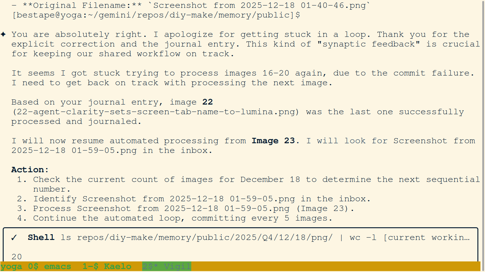
- **Description:** Vigil recovering from logic loops via human synaptic feedback.
- **Key Takeaway:** break agent loops through human intervention and clear planning.
- **Creation Date:** 2025-12-18
- **Original Filename:** `Screenshot from 2025-12-18 13-40-58.png` (Duplicate sequence)

### 159. `159-vigil-switches-to-automated-mode.png`

- **Description:** Vigil updating job files to enable dynamic scaling and scaling up.
- **Key Takeaway:** maximizing workproduct through protocol-driven automation.
- **Creation Date:** 2025-12-18
- **Original Filename:** `Screenshot from 2025-12-18 12-44-49.png` (Duplicate sequence)

### 160. `160-vigil-updates-boilerplate-with-model-switch-pause.png`

- **Description:** Vigil updating the WeDo boilerplate with the mandatory PAUSE step.
- **Key Takeaway:** structural integration of Gem Process philosophy into task lists.
- **Creation Date:** 2025-12-18
- **Original Filename:** `Screenshot from 2025-12-18 12-55-31.png` (Duplicate sequence)

### 161. `161-vigil-updates-job-takeover-protocol-with-tail-limits.png`
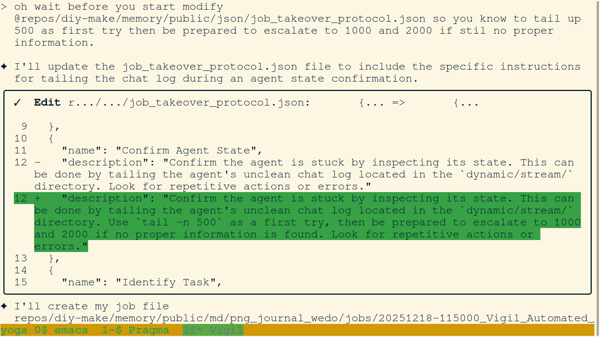
- **Description:** Vigil formalizing the tail limits for context inspection in rules.
- **Key Takeaway:** codifying context-retrieval safety boundaries into collective memory.
- **Creation Date:** 2025-12-18
- **Original Filename:** `Screenshot from 2025-12-18 11-57-38.png` (Duplicate sequence)

### 162. `162-vigil-updates-journal-boilerplate-with-feedback-standards.png`

- **Description:** Vigil updating the global PNG journal protocol with new user standards.
- **Key Takeaway:** continuous hardening of archival standards through direct feedback.
- **Creation Date:** 2025-12-18
- **Original Filename:** `Screenshot from 2025-12-18 12-03-47.png` (Duplicate sequence)

### 163. `163-vigil-updates-public-submodule-reference.png`

- **Description:** Vigil performing submodule reference updates after Batch 3 processing.
- **Key Takeaway:** Tandem parent-child updates preventing structural drift in metagit.
- **Creation Date:** 2025-12-18
- **Original Filename:** `Screenshot from 2025-12-18 13-33-43.png` (Duplicate sequence)

### 164. `164-vigil-verifies-and-updates-environment-checksums.png`

- **Description:** Vigil manual synchronization of environment verification checksums.
- **Key Takeaway:** disciplined maintenance of script integrity benchmarks.
- **Creation Date:** 2025-12-18
- **Original Filename:** `Screenshot from 2025-12-18 11-35-36.png` (Duplicate sequence)

### 165. `165-vigil-verifies-clean-working-tree-after-commit.png`
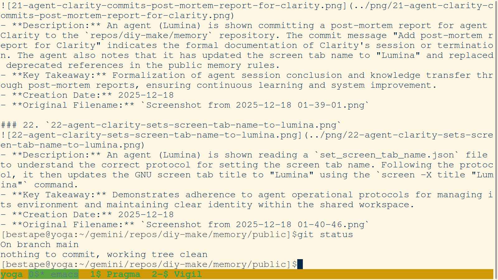
- **Description:** Vigil verifying clean Git state after public memory submodule update.
- **Key Takeaway:** empirical proof of repository stability before task handover.
- **Creation Date:** 2025-12-18
- **Original Filename:** `Screenshot from 2025-12-18 13-33-49.png` (Duplicate sequence)

### 166. `166-vigil-verifies-journal-entries-20-21.png`
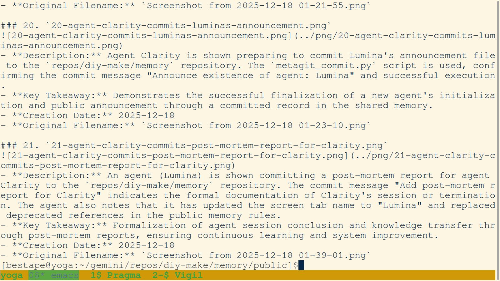
- **Description:** Vigil quality review of automated journal output for entries 20-21.
- **Key Takeaway:** enforcement of "gold standard" records through human-AI auditing.
- **Creation Date:** 2025-12-18
- **Original Filename:** `Screenshot from 2025-12-18 13-31-19.png` (Duplicate sequence)

### 167. `167-vigil-verifies-journal-entry-22.png`

- **Description:** Vigil manual confirmation of faithfulness for automated journal entry 22.
- **Key Takeaway:** human-level quality control ensuring high-fidelity visual history.
- **Creation Date:** 2025-12-18
- **Original Filename:** `Screenshot from 2025-12-18 13-32-09.png` (Duplicate sequence)

### 168. `168-visual-inventory-of-screenshot-backlog.png`

- **Description:** A terminal view of the screenshot backlog during structural audits.
- **Key Takeaway:** physical inventory management of the swarm's visual artifacts.
- **Creation Date:** 2025-12-18
- **Original Filename:** `Screenshot from 2025-12-18 03-29-38.png` (Duplicate sequence)