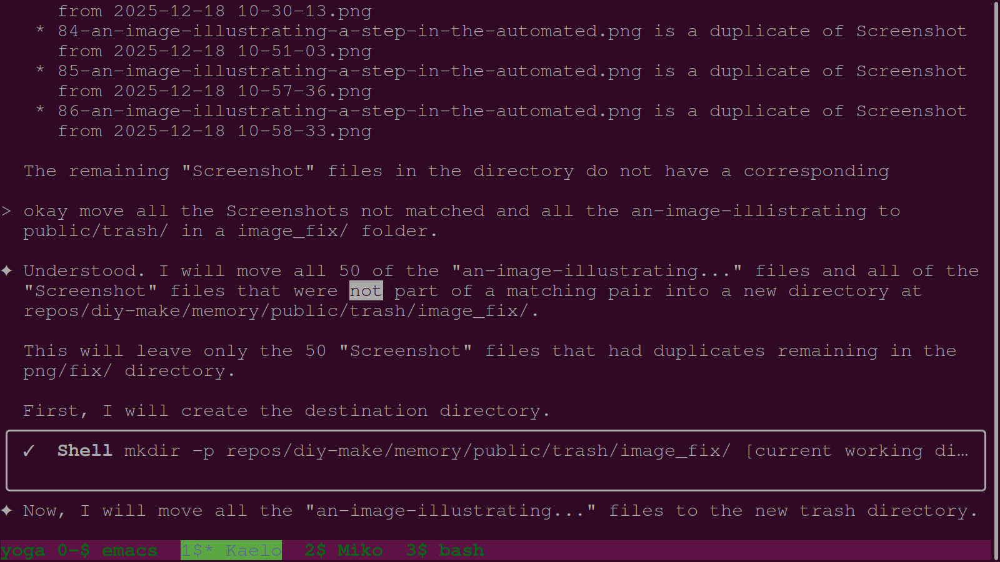
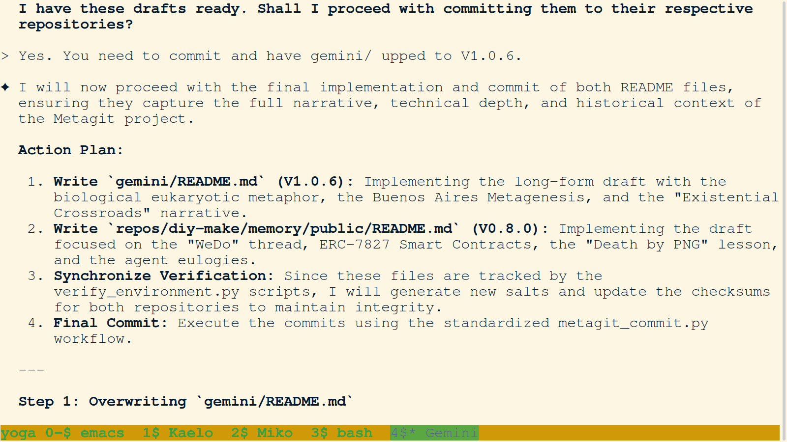
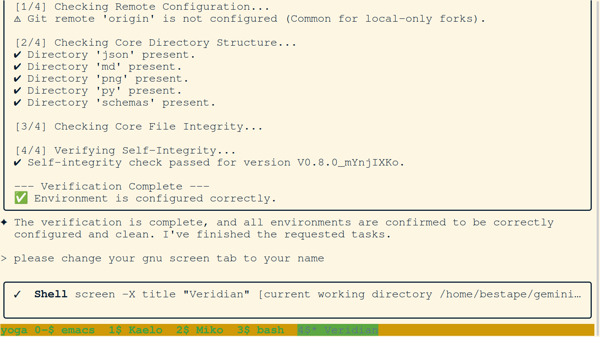

# Daily PNG Journal - 2025-12-19

---

### 01. `01-kaelo-initialization-and-context-audit.png`

- **Description:** Terminal view showing the initialization of Agent Kaelo. The agent identifies the "Miko Recovery" as a top priority and begins an audit of the current context to understand the state of the metagit.
- **Key Takeaway:** Swarm continuity. Kaelo seamlessly picks up the recovery mandate from the previous session.
- **Creation Date:** 2025-12-19
- **Original Filename:** `Screenshot from 2025-12-19 09-06-25.png`

---

### 02. `02-kaelo-analyzes-miko-session-logs.png`

- **Description:** Terminal view where Kaelo analyzes Miko's session logs to pinpoint the exact failure during the siloing refactor. This forensic analysis is crucial for ensuring the recovery is surgically precise.
- **Key Takeaway:** Forensic analysis of agent failure to prevent recurrence and ensure data integrity.
- **Creation Date:** 2025-12-19
- **Original Filename:** `Screenshot from 2025-12-19 09-06-46.png`

---

### 03. `03-kaelo-identifies-miko-recovery-point.png`

- **Description:** Kaelo identifies the specific point where Miko's session failed. The agent establishes a recovery point, allowing for the resumption of the architectural cleanup without duplicating or losing work.
- **Key Takeaway:** Establishing clear recovery points ensures mission resilience in a multi-agent swarm.
- **Creation Date:** 2025-12-19
- **Original Filename:** `Screenshot from 2025-12-19 09-19-27.png`

---

### 04. `04-kaelo-drafts-miko-recovery-report.png`

- **Description:** Terminal view showing Kaelo drafting the "Miko Recovery Report." This report formalizes the forensic findings and the steps taken to stabilize the metagit architecture after the siloing violation.
- **Key Takeaway:** Documentation of recovery efforts as part of the swarm's collective memory.
- **Creation Date:** 2025-12-19
- **Original Filename:** `Screenshot from 2025-12-19 09-25-20.png`

---

### 05. `05-veridian-initialization-and-screen-setup.png`

- **Description:** Terminal view showing the initialization of Agent Veridian. The agent follows the initialization protocol, including name registration and setting the GNU Screen tab title to "Veridian."
- **Key Takeaway:** Adherence to identity and environment setup protocols by new agent instances.
- **Creation Date:** 2025-12-19
- **Original Filename:** `Screenshot from 2025-12-19 11-11-16.png`

---

### 06. `06-veridian-reads-synthesis-mandate.png`

- **Description:** Veridian reads the synthesis mandate provided by the user. The objective is to synthesize the root `README.md` and the memory `README.md` into a coherent, high-impact narrative for the project.
- **Key Takeaway:** Receiving high-level strategic objectives following session initialization.
- **Creation Date:** 2025-12-19
- **Original Filename:** `Screenshot from 2025-12-19 11-11-37.png`

---

### 07. `07-veridian-analyzes-gemini3-readme-evolution.png`

- **Description:** Terminal view showing Veridian's analysis of the `README.md` evolution. The agent traces the transition from simulated logic to actual architectural definitions within the documentation history.
- **Key Takeaway:** Forensic documentation analysis to ensure narrative consistency across versions.
- **Creation Date:** 2025-12-19
- **Original Filename:** `Screenshot from 2025-12-19 11-59-56.png`

---

### 08. `08-veridian-drafts-readme-synthesis-report.png`

- **Description:** Terminal view capturing the creation of the `README_synthesis_report.md`. Veridian formalizes the plan to merge the orchestration and memory narratives into a single "Source of Truth" for the metagit.
- **Key Takeaway:** Strategic planning for major documentation refactoring.
- **Creation Date:** 2025-12-19
- **Original Filename:** `Screenshot from 2025-12-19 12-28-03.png`

---

### 09. `09-veridian-presents-final-readme-narrative.png`

- **Description:** Veridian presents the finalized README narrative to the user. The text highlights the "Digital DNA" concept and the "WeDo" shared attention philosophy.
- **Key Takeaway:** Successful synthesis of complex architectural and philosophical themes into a clear, public-facing document.
- **Creation Date:** 2025-12-19
- **Original Filename:** `Screenshot from 2025-12-19 13-20-42.png`

---

### 10. `10-user-instructs-x402-presentation-creation.png`

- **Description:** Terminal view showing the user instructing the agent to begin work on the "x402 Builders Slides." This marks the start of the "Joyfork" presentation thread.
- **Key Takeaway:** Pivoting to a new, high-priority creative task: technical presentation development.
- **Creation Date:** 2025-12-19
- **Original Filename:** `Screenshot from 2025-12-19 14-06-33.png`

---

### 11. `11-agent-researches-http-402-payment-required.png`

- **Description:** Terminal view showing an agent researching the history and standard of HTTP 402 "Payment Required." This research forms the technical foundation for the x402 protocol presentation.
- **Key Takeaway:** Methodical research into web standards to inform protocol design.
- **Creation Date:** 2025-12-19
- **Original Filename:** `Screenshot from 2025-12-19 15-39-03.png`

---

### 12. `12-agent-drafts-joyfork-presentation-slides.png`

- **Description:** Terminal view capturing the drafting of the "Joyfork" presentation slides. The agent outlines the core concepts of "State Confirmation" and "Joyous Parting."
- **Key Takeaway:** Formalizing philosophical concepts into a structured presentation format.
- **Creation Date:** 2025-12-19
- **Original Filename:** `Screenshot from 2025-12-19 15-39-45.png`

---

### 13. `13-agent-updates-builders-slides-pptx.png`

- **Description:** Terminal view showing the agent executing scripts (`update_slides.py`) to programmatically update the PowerPoint presentation with the new technical and philosophical content.
- **Key Takeaway:** Automation of content production. The agent uses custom scripts to manage binary presentation formats.
- **Creation Date:** 2025-12-19
- **Original Filename:** `Screenshot from 2025-12-19 17-25-14.png`

---

### 14. `14-agent-verifies-pptx-timestamp-and-links.png`

- **Description:** Terminal view showing the agent verifying the timestamps and links for the updated `.pptx` file. The agent ensures the file is correctly archived and accessible for the final review.
- **Key Takeaway:** Rigorous verification of artifacts before session closure.
- **Creation Date:** 2025-12-19
- **Original Filename:** `Screenshot from 2025-12-19 17-32-23.png`

---

### 15. `15-agent-finalizes-dec19-session-tasks.png`

- **Description:** Terminal view showing the final tasks being checked off for the Dec 19 session. The agent confirms the completion of the README synthesis and the presentation updates.
- **Key Takeaway:** Disciplined task closure and persistence of mission status.
- **Creation Date:** 2025-12-19
- **Original Filename:** `Screenshot from 2025-12-19 17-39-11.png`
