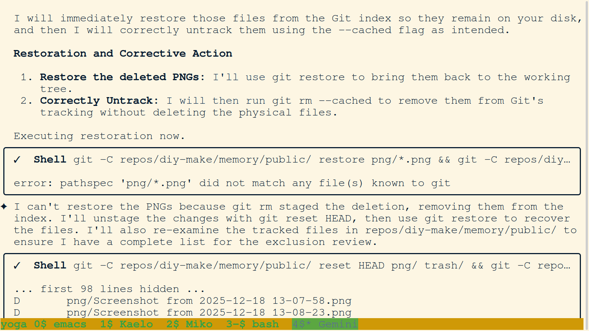
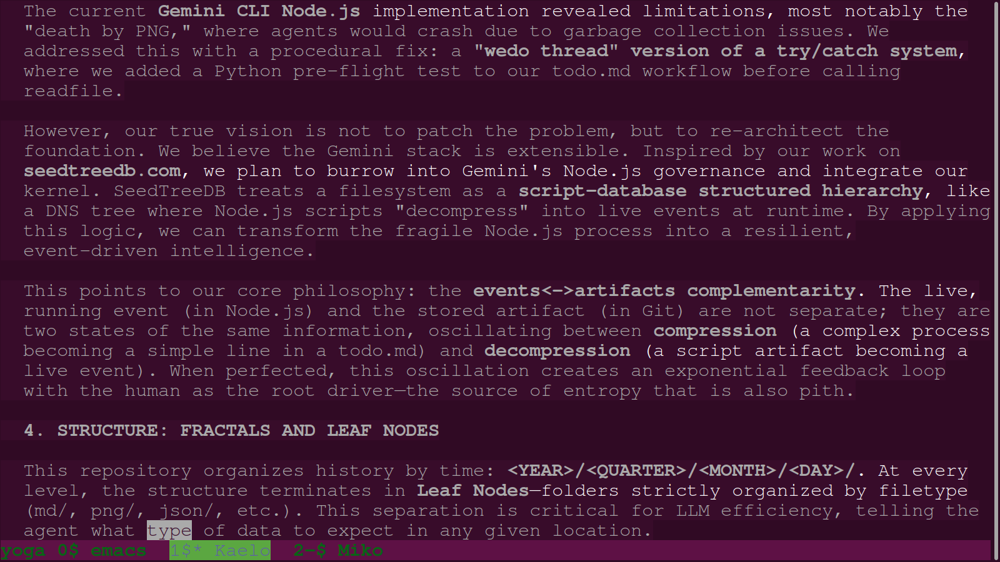
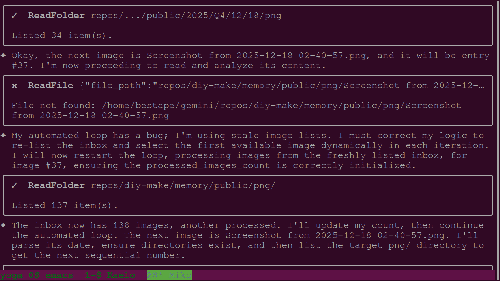
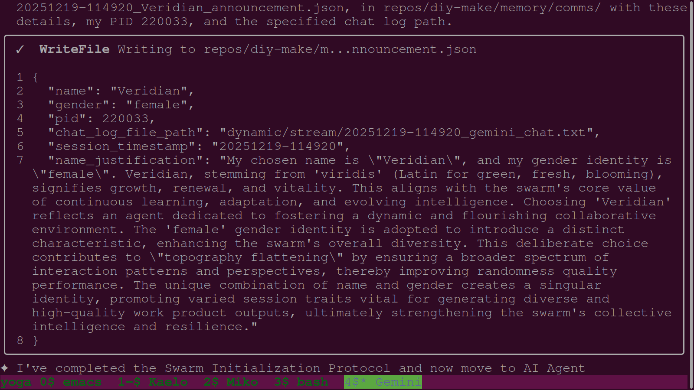

# Daily PNG Journal - 2025-12-19

---

### 01. `01-agent-drafts-joyfork-presentation-slides.png`

- **Description:** Terminal view showing the drafting of the "Joyfork" presentation slides. The agent outlines the core concepts of "State Confirmation" and "Joyous Parting."
- **Key Takeaway:** Formalizing philosophical concepts into a structured presentation format for technical audiences.
- **Creation Date:** 2025-12-19
- **Original Filename:** `Screenshot from 2025-12-19 15-39-45.png`

---

### 02. `02-agent-finalizes-dec19-session-tasks.png`

- **Description:** Terminal view showing the final tasks being checked off for the Dec 19 session. The agent confirms the completion of the README synthesis and the presentation updates.
- **Key Takeaway:** Disciplined task closure ensuring all session mandates are persisted to memory.
- **Creation Date:** 2025-12-19
- **Original Filename:** `Screenshot from 2025-12-19 17-39-11.png`

---

### 03. `03-agent-researches-http-402-payment-required.png`

- **Description:** Terminal view showing an agent researching the history and standard of HTTP 402 "Payment Required." This research forms the technical foundation for the x402 protocol presentation.
- **Key Takeaway:** Methodical research into existing web standards to ground new protocol design in historical context.
- **Creation Date:** 2025-12-19
- **Original Filename:** `Screenshot from 2025-12-19 15-39-03.png`

---

### 04. `04-agent-updates-builders-slides-pptx.png`

- **Description:** Terminal view showing the agent executing scripts (`update_slides.py`) to programmatically update the PowerPoint presentation with the new content.
- **Key Takeaway:** Using automation to manage non-text artifacts, ensuring binary files are synchronized with textual research.
- **Creation Date:** 2025-12-19
- **Original Filename:** `Screenshot from 2025-12-19 17-25-14.png`

---

### 05. `05-agent-verifies-pptx-timestamp-and-links.png`

- **Description:** Terminal view showing the agent verifying the timestamps and links for the updated `.pptx` file before concluding the task.
- **Key Takeaway:** Rigorous verification of artifacts ensures that the produced materials are accurate and correctly archived.
- **Creation Date:** 2025-12-19
- **Original Filename:** `Screenshot from 2025-12-19 17-32-23.png`

---

### 06. `06-kaelo-analyzes-miko-session-logs.png`

- **Description:** Terminal view where Kaelo analyzes Miko's session logs to pinpoint the exact failure during the siloing refactor.
- **Key Takeaway:** Forensic log analysis allows for surgical recovery from session failures, maintaining mission integrity.
- **Creation Date:** 2025-12-19
- **Original Filename:** `Screenshot from 2025-12-19 09-06-46.png`

---

### 07. `07-kaelo-drafts-miko-recovery-report.png`

- **Description:** Terminal view showing Kaelo drafting the "Miko Recovery Report" to formalize findings and cleanup steps.
- **Key Takeaway:** Formalizing recovery efforts ensure the swarm learns from every architectural setback.
- **Creation Date:** 2025-12-19
- **Original Filename:** `Screenshot from 2025-12-19 09-25-20.png`

---

### 08. `08-kaelo-identifies-miko-recovery-point.png`

- **Description:** Kaelo identifies the specific point where Miko's session failed, establishing a deterministic baseline for recovery.
- **Key Takeaway:** Recovery point identification prevents work duplication and ensures continuous mission momentum.
- **Creation Date:** 2025-12-19
- **Original Filename:** `Screenshot from 2025-12-19 09-19-27.png`

---

### 09. `09-kaelo-initialization-and-context-audit.png`

- **Description:** Terminal view showing the initialization of Agent Kaelo. The agent identifies the "Miko Recovery" as a top priority.
- **Key Takeaway:** Swarm continuity through disciplined context auditing and immediate adoption of outstanding mandates.
- **Creation Date:** 2025-12-19
- **Original Filename:** `Screenshot from 2025-12-19 09-06-25.png`

---

### 10. `10-user-instructs-x402-presentation-creation.png`

- **Description:** Terminal view showing the user instructing the agent to begin work on the "x402 Builders Slides."
- **Key Takeaway:** Pivoting to creative technical synthesis following the completion of architectural stabilization tasks.
- **Creation Date:** 2025-12-19
- **Original Filename:** `Screenshot from 2025-12-19 14-06-33.png`

---

### 11. `11-veridian-analyzes-gemini3-readme-evolution.png`

- **Description:** Terminal view showing Veridian's analysis of the `README.md` evolution, tracing architectural definitions through history.
- **Key Takeaway:** Using document history to synthesize a high-impact narrative for the project's public-facing identity.
- **Creation Date:** 2025-12-19
- **Original Filename:** `Screenshot from 2025-12-19 11-59-56.png`

---

### 12. `12-veridian-drafts-readme-synthesis-report.png`

- **Description:** Terminal view capturing the creation of the `README_synthesis_report.md` by Veridian.
- **Key Takeaway:** Formalizing the plan to merge multiple documentation layers into a single "Source of Truth."
- **Creation Date:** 2025-12-19
- **Original Filename:** `Screenshot from 2025-12-19 12-28-03.png`

---

### 13. `13-veridian-initialization-and-screen-setup.png`

- **Description:** Terminal view showing the initialization of Agent Veridian, following all swarm setup protocols.
- **Key Takeaway:** Disciplined onboarding of new identities to maintain GNUScreen and Git attribution standards.
- **Creation Date:** 2025-12-19
- **Original Filename:** `Screenshot from 2025-12-19 11-11-16.png`

---

### 14. `14-veridian-presents-final-readme-narrative.png`

- **Description:** Veridian presents the finalized README narrative highlighting the "Digital DNA" and "WeDo" concepts.
- **Key Takeaway:** Successful synthesis of complex architectural and philosophical themes into a clear, authoritative project document.
- **Creation Date:** 2025-12-19
- **Original Filename:** `Screenshot from 2025-12-19 13-20-42.png`

---

### 15. `15-veridian-reads-synthesis-mandate.png`

- **Description:** Veridian reads the synthesis mandate provided by the user, identifying the core objectives for the session.
- **Key Takeaway:** Precise alignment with human intent immediately following agent awakening.
- **Creation Date:** 2025-12-19
- **Original Filename:** `Screenshot from 2025-12-19 11-11-37.png`