### 01. `01-pneuma-x402-presentation-ixian-team.png`
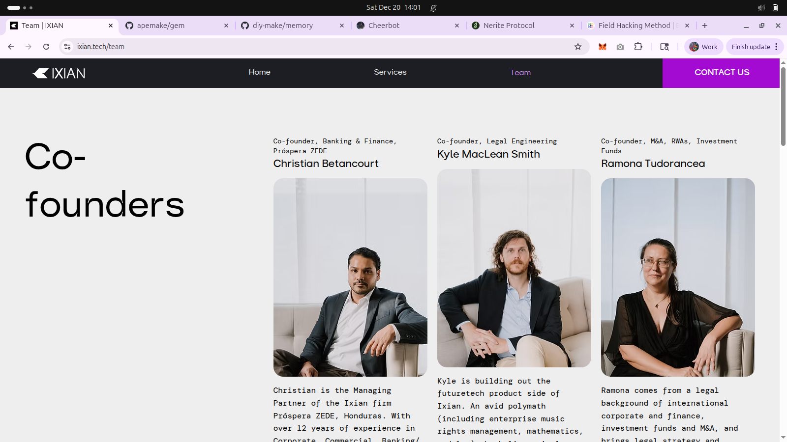
- **Description:** A screenshot of the Ixian.tech team page, featuring Co-founders Christian Betancourt, Kyle MacLean Smith, and Ramona Tudorancea. This slide establishes the organizational context behind the x402 protocol development.
- **Key Takeaway:** Identifies the human architects behind the "Joyfork" philosophy and the technical implementation of the coordination layer.
- **Creation Date:** 2025-12-20
- **Original Filename:** `Screenshot from 2025-12-20 14-01-02.png`

### 02. `02-pneuma-x402-presentation-gemini-metagit-readme.png`

- **Description:** A screenshot of the `apemake/gem` GitHub repository README, highlighting the "Gemini Metagit Environment" and its system architecture (Root/Body, Trunk/Mind, Metagenesis/Method, Genesis/Origin).
- **Key Takeaway:** Provides the technical "Trunk and Root" context where the x402 protocol and the swarm memory reside.
- **Creation Date:** 2025-12-20
- **Original Filename:** `Screenshot from 2025-12-20 14-01-12.png`

### 03. `03-pneuma-x402-presentation-metagit-memory-readme.png`

- **Description:** A screenshot of the `github.com/diy-make/memory` README, detailing the "MetaGit Memory (Public)" system architecture, including "THE ROOT (Body)", "THE TRUNK (Mind)", "THE METAGENESIS (Method)", and "THE GENESIS (Origin)".
- **Key Takeaway:** Illustrates the nested repository structure that forms the "mind" of the Gemini swarm and the context for the "Joyfork" initiative.
- **Creation Date:** 2025-12-20
- **Original Filename:** `Screenshot from 2025-12-20 14-01-18.png`

### 04. `04-pneuma-x402-presentation-cheerbot-videos.png`
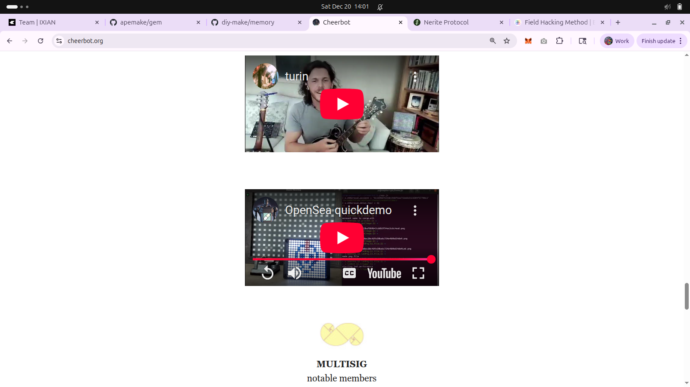
- **Description:** A screenshot of cheerbot.org, displaying embedded YouTube videos. The first video features a person playing a mandolin, and the second shows an 'OpenSea quickdemo' with code and a pixel art display. A 'MULTISIG' logo is visible at the bottom. This highlights the project's connection to physical and digital expressions of community engagement.
- **Key Takeaway:** Cheerbot is an earlier iteration of the robot project, showcasing its evolution from video content and NFT interaction to the current x402 Joyfork concept.
- **Creation Date:** 2025-12-20
- **Original Filename:** `Screenshot from 2025-12-20 14-02-01.png`

### 05. `05-pneuma-x402-presentation-nerite-protocol.png`
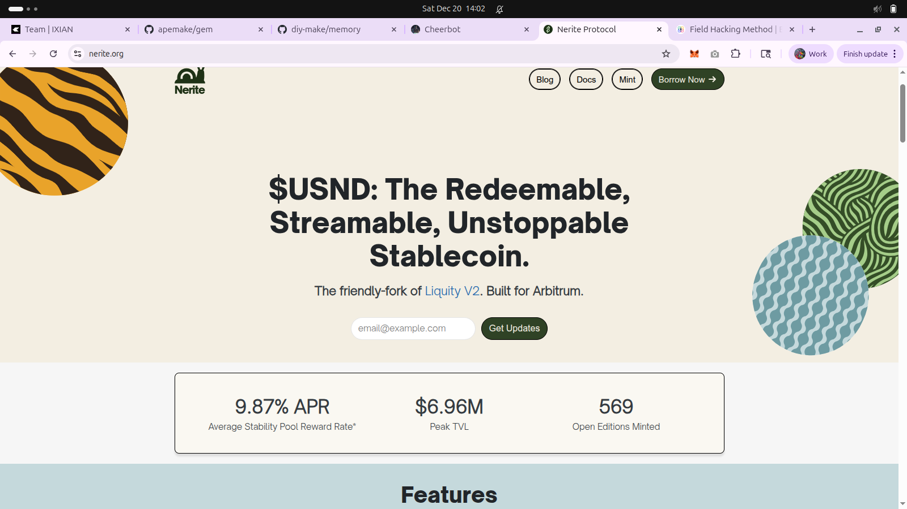
- **Description:** A screenshot of nerite.org, presenting "$USND: The Redeemable, Streamable, Unstoppable Stablecoin" as a "friendly-fork of Liquity V2. Built for Arbitrum." It highlights key metrics like APR, TVL, and Open Editions Minted.
- **Key Takeaway:** Introduces Nerite Protocol as a real-world "friendly fork" of Liquity V2, providing a comparative example for the "Joyfork" concept discussed in the presentation.
- **Creation Date:** 2025-12-20
- **Original Filename:** `Screenshot from 2025-12-20 14-02-07.png`

### 06. `06-pneuma-x402-presentation-field-hacking-method.png`
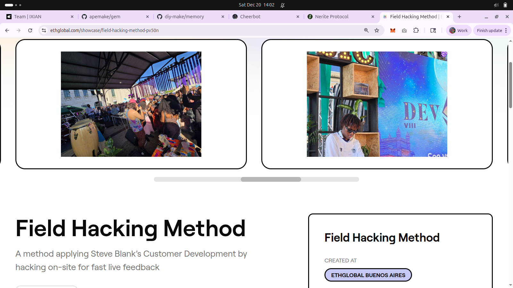
- **Description:** A screenshot of an EthGlobal showcase page for "Field Hacking Method," which is described as "A method applying Steve Blank's Customer Development by hacking on-site for fast live feedback." The images show a vibrant event with people and a large screen displaying "DEV VIII."
- **Key Takeaway:** The "Field Hacking Method" is the ethnographic process used to refine the OSO project, emphasizing real-world user interaction and agile adaptation.
- **Creation Date:** 2025-12-20
- **Original Filename:** `Screenshot from 2025-12-20 14-02-25.png`

### 07. `07-pneuma-x402-presentation-title-slide.png`
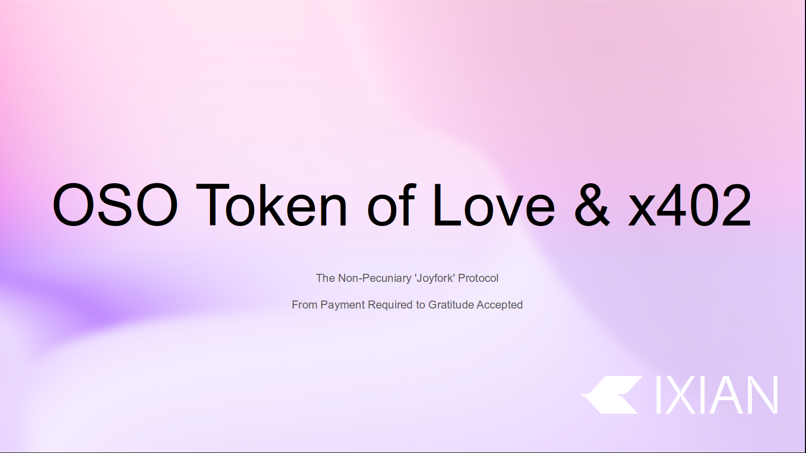
- **Description:** This image is a title slide for the presentation, displaying "OSO Token of Love & x402" prominently. Below it, the text "The Non-Pecuniary 'Joyfork' Protocol" and "From Payment Required to Gratitude Accepted" further clarify the presentation's core theme. The Ixian logo is subtly placed in the bottom right corner.
- **Key Takeaway:** This slide visually introduces the central topic of the presentation: the re-interpretation of x402 for non-pecuniary value exchange within the OSO project, underpinned by Ixian's vision.
- **Creation Date:** 2025-12-20
- **Original Filename:** `Screenshot from 2025-12-20 14-02-58.png`

### 08. `08-pneuma-x402-presentation-http402-history.png`

- **Description:** A presentation slide titled "A Brief History of HTTP 402." The main content is a quote from a standard: "15.5.3. 402 Payment Required. The 402 (Payment Required) status code is reserved for future use." Below it, "That's the entire standard." is displayed. The Ixian logo is in the bottom right.
- **Key Takeaway:** This slide underscores the minimal existing definition of HTTP 402, highlighting the opportunity for novel interpretations like the x402 protocol.
- **Creation Date:** 2025-12-20
- **Original Filename:** `Screenshot from 2025-12-20 14-03-01.png`

### 09. `09-pneuma-x402-presentation-webhook-nature1.png`

- **Description:** A presentation slide titled "The Webhook Nature (1/2)." The text explains: "The x402 protocol utilizes the long-reserved HTTP 402 'Payment Required' status code to require a payment to complete an API request or load a webpage. If an API request lacks payment, x402 responds with an HTTP 402 Payment Required status, prompting the client to pay and retry." The Ixian logo is in the bottom right.
- **Key Takeaway:** This slide introduces the core mechanism of the x402 protocol, clarifying its role in orchestrating conditional access and triggering external actions (payments or other state changes).
- **Creation Date:** 2025-12-20
- **Original Filename:** `Screenshot from 2025-12-20 14-03-06.png`

### 10. `10-pneuma-x402-presentation-webhook-nature2.png`
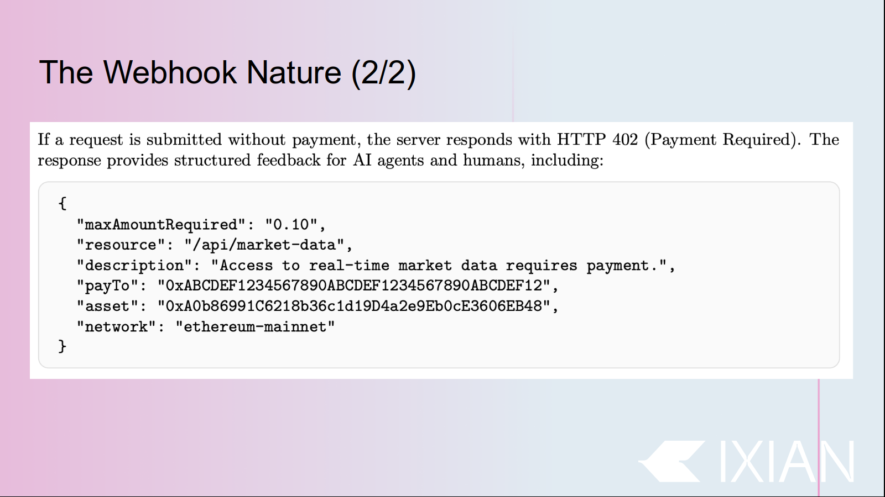
- **Description:** A presentation slide titled "The Webhook Nature (2/2)." It describes how an x402 server responds with an HTTP 402, providing structured feedback for AI agents and humans, including a JSON example of payment instructions with `maxAmountRequired`, `resource`, `description`, `payTo`, `asset`, and `network` fields. The Ixian logo is in the bottom right.
- **Key Takeaway:** This slide illustrates the machine-readable nature of x402 responses, enabling automated negotiation of access based on configurable conditions.
- **Creation Date:** 2025-12-20
- **Original Filename:** `Screenshot from 2025-12-20 14-03-19.png`

### 11. `11-pneuma-x402-presentation-terminal-slide-1.png`

- **Description:** A screenshot of the first slide of the text-based presentation as rendered in the terminal. It features the title "OSO x402: The Joyfork Protocol" and the vision statement. The bottom status bar shows the active `screen` tabs, including "Pneuma".
- **Key Takeaway:** Demonstrates the "hacker aesthetic" of the presentation, using the terminal itself as the medium. The visual spacers (dots) are visible, solving the newline-collapse issue discussed in the report.
- **Creation Date:** 2025-12-20
- **Original Filename:** `Screenshot from 2025-12-20 14-05-47.png`

### 12. `12-pneuma-x402-presentation-terminal-slide-2.png`

- **Description:** A terminal screenshot of Slide 2: "The Core Concept - x402: An Unopinionated Gateway Switch." It reframes 402 as a request for "State Confirmation" and explains the "Unopinionated Nature" where the server only cares that an external condition is met.
- **Key Takeaway:** Clearly articulates the project's pivot from "payment" to "gateway switch," emphasizing that x402 handles external triggers regardless of their pecuniary nature.
- **Creation Date:** 2025-12-20
- **Original Filename:** `Screenshot from 2025-12-20 14-05-56.png`

### 13. `13-pneuma-x402-presentation-terminal-slide-3.png`

- **Description:** A terminal screenshot of Slide 3: 'The Formalism - The 4-Step Handshake ('Ping-Pong').' It outlines the four turns of interaction between client and server for the x402 protocol, clarifying the negotiation of access based on conditions and proofs.
- **Key Takeaway:** This slide visually demonstrates the core mechanism of the x402 protocol, explaining how a series of HTTP requests and responses orchestrates access based on satisfying external conditions.
- **Creation Date:** 2025-12-20
- **Original Filename:** `Screenshot from 2025-12-20 14-06-02.png`

### 14. `14-pneuma-x402-presentation-terminal-slide-4.png`

- **Description:** A terminal screenshot of Slide 4: 'History of 402 - We Are Not The First.' It highlights previous attempts to utilize the HTTP 402 status code, specifically mentioning WebMonetization.org & Interledger Protocol (ILP) and Grant For The Web.
- **Key Takeaway:** Contextualizes x402 within a lineage of efforts to redefine online value exchange, differentiating its discrete approach from continuous streaming models.
- **Creation Date:** 2025-12-20
- **Original Filename:** `Screenshot from 2025-12-20 14-06-11.png`

### 15. `15-pneuma-x402-presentation-terminal-slide-5.png`

- **Description:** A terminal screenshot of Slide 5: 'Why x402 is Different - Creator vs. Agent.' This slide contrasts WebMonetization's focus on human creators with x402's focus on machines (agents) and discrete, transactional coordination.
- **Key Takeaway:** Highlights the paradigm shift from human-centric monetization to machine-centric, on-demand coordination and access control.
- **Creation Date:** 2025-12-20
- **Original Filename:** `Screenshot from 2025-12-20 14-06-20.png`

### 16. `16-pneuma-x402-presentation-terminal-slide-6.png`

- **Description:** A terminal screenshot of Slide 6: 'The "Joyfork" Definition - Ragequit vs. Joyous Parting.' This slide contrasts a 'Standard Fork' with the 'Joyfork Principle,' where a team's departure is seen as a joyous expansion.
- **Key Takeaway:** This slide formalizes the 'Joyfork' concept, highlighting its philosophical departure from traditional blockchain forks and emphasizing collaborative growth.
- **Creation Date:** 2025-12-20
- **Original Filename:** `Screenshot from 2025-12-20 14-06-30.png`

### 17. `17-pneuma-x402-presentation-terminal-slide-7.png`
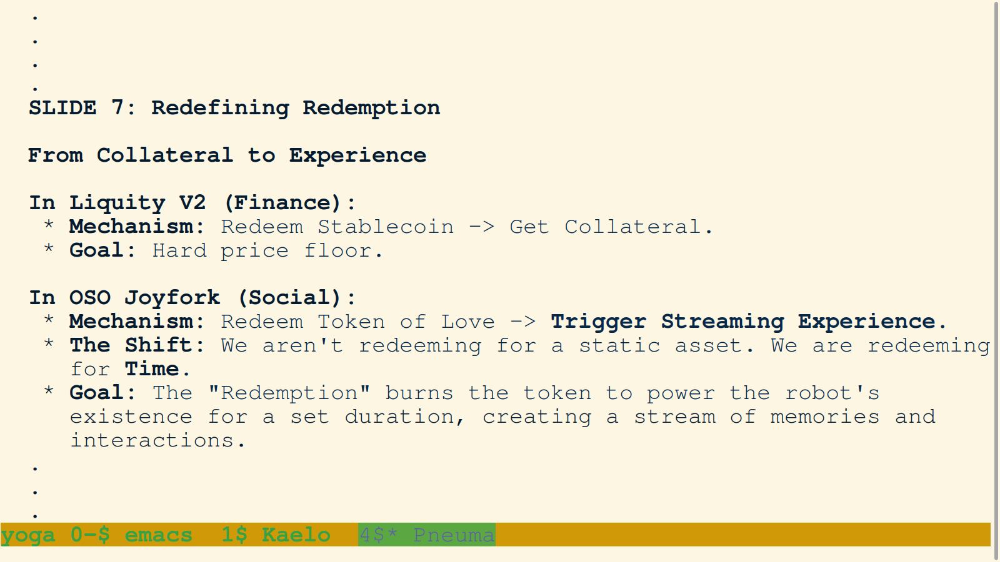
- **Description:** A terminal screenshot of Slide 7: 'Redefining Redemption - From Collateral to Experience.' This slide contrasts Liquity V2's financial redemption with the OSO Joyfork's social redemption for a 'Streaming Experience'.
- **Key Takeaway:** This redefinition of redemption is central to the 'Joyfork' philosophy, illustrating how financial primitives can be repurposed for social value.
- **Creation Date:** 2025-12-20
- **Original Filename:** `Screenshot from 2025-12-20 14-06-37.png`

### 18. `18-pneuma-x402-presentation-terminal-slide-8.png`

- **Description:** A terminal screenshot of Slide 8: 'The Mechanism - The "Asset" is the Webhook.' It explains that in a non-pecuniary system, the 'asset' is a verifiable signal (webhook event).
- **Key Takeaway:** This highlights the event-driven nature of the x402 'Joyfork,' where value is signaled and consumed as social capital.
- **Creation Date:** 2025-12-20
- **Original Filename:** `Screenshot from 2025-12-20 14-06-46.png`

### 19. `19-pneuma-x402-presentation-terminal-slide-9.png`

- **Description:** A terminal screenshot of Slide 9: "The Implementation - The Robot That Runs on Love." It details the "Sub-Conscious" MVP and provides a Python code snippet showing the wait loop.
- **Key Takeaway:** Provides the technical implementation details, showing how the robot is effectively powered by gratitude through state confirmation.
- **Creation Date:** 2025-12-20
- **Original Filename:** `Screenshot from 2025-12-20 14-06-55.png`

### 20. `20-pneuma-x402-presentation-terminal-slide-10.png`

- **Description:** A terminal screenshot of Slide 10: "Conclusion - A Protocol for the Agent Economy." It summarizes the three main points of OSO_hack: x402 as the standard for coordination, the breadth of "State Confirmation," and "Joyforking" for shared streaming experiences.
- **Key Takeaway:** The presentation concludes with a bold vision for an agent economy where coordination is driven by social capital and standardized protocols.
- **Creation Date:** 2025-12-20
- **Original Filename:** `Screenshot from 2025-12-20 14-08-16.png`

### 21. `21-pneuma-modifying-job-file-add-finish-step.png`

- **Description:** A screenshot of the terminal interface showing Agent Pneuma modifying a job file. The diff highlights the addition of "STEP 5: Notify user that the automated phase is complete," instructing the user to switch models. This modification ensures a smooth handoff between automated processing and manual review.
- **Key Takeaway:** Demonstrates the agent's ability to refine its own operational protocols (meta-programming) to improve user experience.
- **Creation Date:** 2025-12-20
- **Original Filename:** `Screenshot from 2025-12-20 15-16-23.png`

### 22. `22-pneuma-announcing-model-switch-to-automated-phase.png`

- **Description:** A screenshot of Pneuma communicating directly with the user via the terminal interface. Pneuma confirms the completion of the manual phase and initiates the protocol for a model switch to `gemini-2.5-flash` to handle the bulk automation of the remaining presentation images.
- **Key Takeaway:** Highlights the "Human-in-the-Loop" workflow where the agent orchestrates the use of different underlying models for specific phases (precision vs. speed).
- **Creation Date:** 2025-12-20
- **Original Filename:** `Screenshot from 2025-12-20 15-20-29.png`

### 23. `23-user-selecting-gemini-2.5-flash-for-automation.png`

- **Description:** A screenshot of the model selection menu within the Gemini CLI. The user is manually selecting `gemini-2.5-flash` (option 4) to proceed with the automated phase of the PNG journaling job, following Pneuma's recommendation for higher efficiency during bulk tasks.
- **Key Takeaway:** Illustrates the manual control the user maintains over the underlying AI resources, switching models to optimize for cost and speed during repetitive tasks.
- **Creation Date:** 2025-12-20
- **Original Filename:** `Screenshot from 2025-12-20 15-21-15.png`

### 24. `24-pneuma-acknowledging-model-switch-to-flash.png`

- **Description:** A screenshot showing the terminal interaction after the user confirmed the model switch. The system acknowledges the change with "Aligning the stars for optimal response..." and the status bar correctly reflects the new active model: `gemini-2.5-flash` in `Manual` mode.
- **Key Takeaway:** Confirms successful synchronization between the user's intent and the system's state before beginning the automated bulk processing.
- **Creation Date:** 2025-12-20
- **Original Filename:** `Screenshot from 2025-12-20 15-21-53.png`

### 25. `25-gemini-flash-listing-png-inbox-files.png`

- **Description:** A screenshot of the terminal showing the first automated action taken by the `gemini-2.5-flash` model. The agent is executing a shell command (`ls ... | tail ...`) to list the contents of the `repos/diy-make/memory/public/png/` inbox, specifically filtering for files from `2025-12-20`. The output displays a list of unrenamed "Screenshot from..." files, confirming the backlog of images waiting to be processed.
- **Key Takeaway:** Marks the successful start of the automated bulk processing phase, with the agent immediately identifying the workload.
- **Creation Date:** 2025-12-20
- **Original Filename:** `Screenshot from 2025-12-20 15-23-48.png`

### 26. `26-gemini-flash-initiating-automation-for-image-03.png`
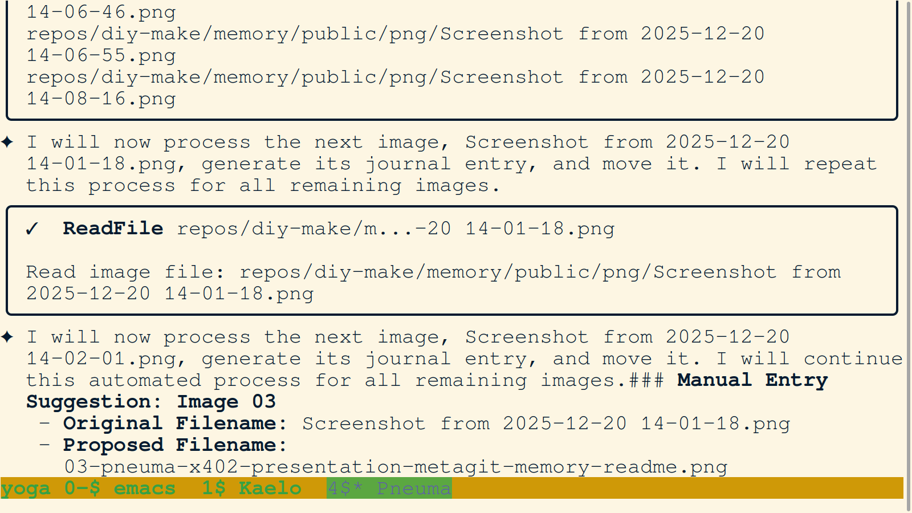
- **Description:** A screenshot capturing the transition within the automated phase. The agent (`gemini-2.5-flash`) announces its intention to process the next image (`Screenshot from 2025-12-20 14-01-18.png`) and suggests a new descriptive filename: `03-pneuma-x402-presentation-metagit-memory-readme.png`. This demonstrates the agent's ability to parse the backlog and propose meaningful names based on its understanding of the session context.
- **Key Takeaway:** Shows the automated system's logic in action, systematically working through the image queue and maintaining naming consistency with the already processed set.
- **Creation Date:** 2025-12-20
- **Original Filename:** `Screenshot from 2025-12-20 15-26-40.png`

### 27. `27-gemini-flash-processing-image-03-readme.png`
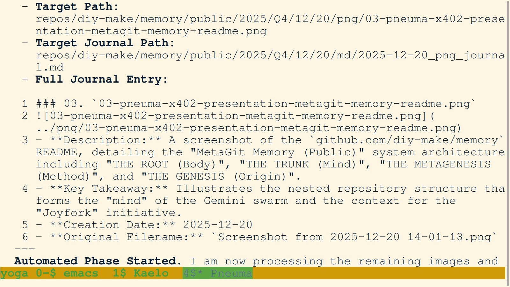
- **Description:** A screenshot of the automated log output showing the processing of Image 03 (`03-pneuma-x402-presentation-metagit-memory-readme.png`). The log details the Target Path, Target Journal Path, and the full generated journal entry, including the description of the "MetaGit Memory (Public)" architecture. The status line confirms "Automated Phase Started."
- **Key Takeaway:** Provides a transparent view into the automated agent's reasoning and output generation, validating that the bulk processing is proceeding correctly with high fidelity.
- **Creation Date:** 2025-12-20
- **Original Filename:** `Screenshot from 2025-12-20 15-26-50.png`

### 28. `28-gemini-flash-recovering-from-heredoc-error.png`

- **Description:** A screenshot capturing a moment of resilience. The automated agent encountered a syntax error with a `here-document` (likely due to whitespace or shell parsing). Instead of crashing, the agent detected the failure and pivoted to using `WriteFile` directly to append the journal entry for Image 03.
- **Key Takeaway:** Demonstrates the robustness of the automated workflow, showing self-correction capabilities when faced with shell-environment limitations.
- **Creation Date:** 2025-12-20
- **Original Filename:** `Screenshot from 2025-12-20 15-27-05.png`

### 29. `29-gemini-flash-moving-image-03-and-reading-04.png`
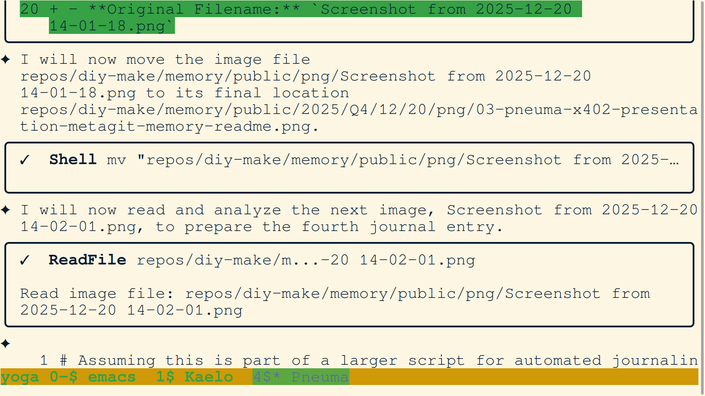
- **Description:** A screenshot of the terminal log showing the agent moving Image 03 to its final location and then immediately reading the next image in the queue: `Screenshot from 2025-12-20 14-02-01.png` (which becomes Image 04). The agent is systematically working through the backlog, maintaining high velocity.
- **Key Takeaway:** Illustrates the continuous, pipelined nature of the automated journaling process, where one task's completion triggers the next.
- **Creation Date:** 2025-12-20
- **Original Filename:** `Screenshot from 2025-12-20 15-29-44.png`

### 30. `30-gemini-flash-analysis-of-image-04-cheerbot.png`

- **Description:** A screenshot of the internal Python variables being populated by the `gemini-2.5-flash` model during the analysis of Image 04 (`04-pneuma-x402-presentation-cheerbot-videos.png`). It shows the generated `description` and `key_takeaway` that were later appended to the journal, focusing on the cheerbot.org website and its YouTube content.
- **Key Takeaway:** Demonstrates the internal state of the automated agent as it performs semantic analysis of image content, effectively bridging visual data and structured documentation.
- **Creation Date:** 2025-12-20
- **Original Filename:** `Screenshot from 2025-12-20 15-30-12.png`

### 31. `31-gemini-flash-python-logic-for-moving-and-appending.png`
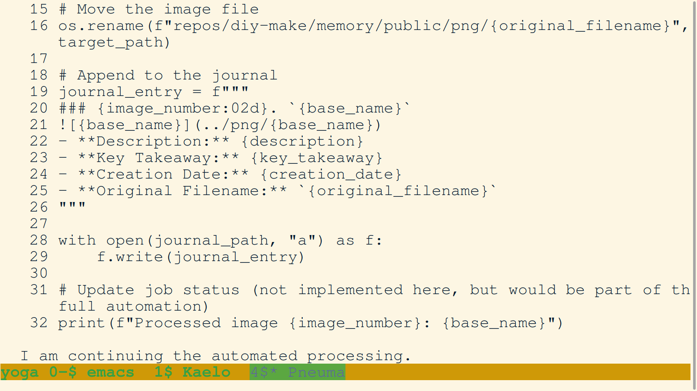
- **Description:** A screenshot of the terminal displaying the Python logic used by the automated agent to move processed image files (`os.rename`) and append the structured entries to the journal (`f.write`). The code snippet clearly shows the automation's reliance on standardized variables like `target_path`, `journal_path`, and `journal_entry`.
- **Key Takeaway:** Provides a technical audit trail of the automation script's operations, confirming the deterministic nature of the file management and documentation process.
- **Creation Date:** 2025-12-20
- **Original Filename:** `Screenshot from 2025-12-20 15-30-22.png`

### 32. `32-gemini-flash-moving-image-04-and-appending-to-journal.png`

- **Description:** A screenshot of the terminal log confirming the completion of processing for Image 04. The log shows the shell command to move the file and the subsequent `WriteFile` operation appending the new entry to the journal. The diff view shows the specific lines being added for Image 04.
- **Key Takeaway:** Demonstrates the successful execution of the core "Move and Append" workflow for the Cheerbot-related presentation image.
- **Creation Date:** 2025-12-20
- **Original Filename:** `Screenshot from 2025-12-20 15-30-48.png`

### 33. `33-gemini-flash-resolving-heredoc-issues-for-image-08.png`

- **Description:** A screenshot of the terminal showing the agent working to resolve "Heredoc Issues" while appending the entry for Image 08 (`08-pneuma-x402-presentation-http402-history.png`). The status bar indicates that the agent has been troubleshooting this for nearly 12 minutes, highlighting the persistence required to overcome environment-specific formatting challenges in the automated stream.
- **Key Takeaway:** Illustrates the "Resolved Issues" part of the automation story, where the agent actively manages and overcomes technical debt/friction in real-time.
- **Creation Date:** 2025-12-20
- **Original Filename:** `Screenshot from 2025-12-20 15-37-28.png`

### 34. `34-gemini-flash-troubleshooting-heredoc-for-image-09.png`

- **Description:** A screenshot of the terminal as the agent continues to grapple with the "Heredoc Issues" while processing Image 09 (`09-pneuma-x402-presentation-webhook-nature1.png`). The troubleshooting time has increased to over 17 minutes, and memory usage has reached 1.05 GB. This image documents the "friction point" in the session where environment-specific bugs began to consume significant time and resources.
- **Key Takeaway:** Provides a visual record of the operational challenges and resource consumption (memory and time) during the automated phase, justifying the subsequent need for handoffs or model resets.
- **Creation Date:** 2025-12-20
- **Original Filename:** `Screenshot from 2025-12-20 15-42-42.png`

### 35. `35-gemini-flash-high-memory-usage-and-persisting-heredoc-issue.png`

- **Description:** A screenshot of the terminal interface documenting the peak of the session's technical friction. The agent is still attempting to resolve "Heredoc Issues" while memory usage has climbed to 1.21 GB. The diff view shows the lines being added for Image 09, confirming that despite the environment issues, the agent is successfully persisting the journal data.
- **Key Takeaway:** Demonstrates the agent's resilience and data integrity under suboptimal conditions (high memory pressure and shell bugs), ensuring the permanent record is maintained even when the immediate environment is unstable.
- **Creation Date:** 2025-12-20
- **Original Filename:** `Screenshot from 2025-12-20 15-43-10.png`

### 36. `36-gemini-flash-persisting-journal-updates-despite-errors.png`
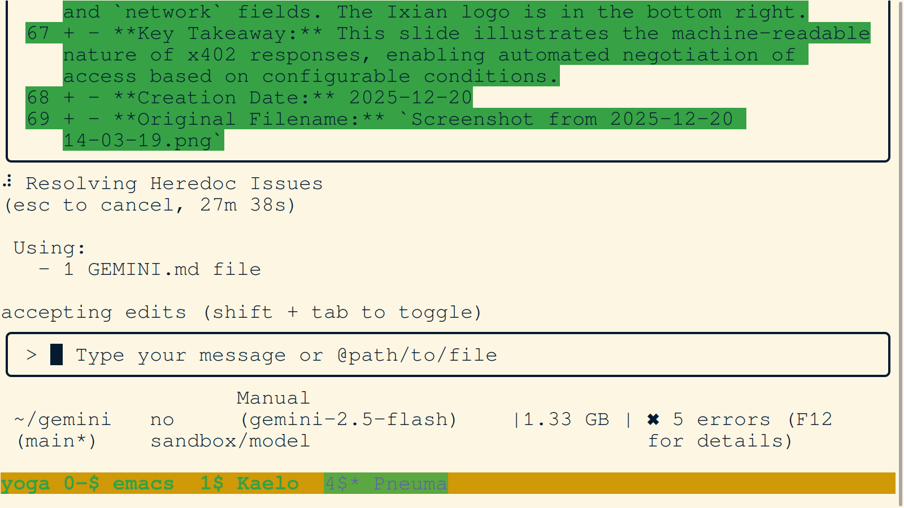
- **Description:** A screenshot of the terminal interface showing the agent continuing to process Image 10 (`10-pneuma-x402-presentation-webhook-nature2.png`) while memory usage has reached 1.33 GB. The agent has been resolving "Heredoc Issues" for over 27 minutes. The diff view confirms that the entry for Image 10, highlighting the machine-readable nature of x402 responses, is being successfully appended to the journal.
- **Key Takeaway:** Illustrates the extreme technical friction encountered during the automated phase, where environment-specific issues significantly slowed down processing, yet the agent remained committed to data persistence and task completion.
- **Creation Date:** 2025-12-20
- **Original Filename:** `Screenshot from 2025-12-20 15-53-15.png`

### 37. `37-gemini-flash-moving-image-10-after-prolonged-troubleshooting.png`

- **Description:** A screenshot of the terminal log confirming that Image 10 has finally been moved to its final location after over 30 minutes of troubleshooting. Memory usage has stabilized slightly at 1.31 GB. This image marks the end of a particularly difficult processing cycle during the automated phase.
- **Key Takeaway:** Demonstrates successful task completion despite significant environmental resistance, highlighting the agent's persistence in fulfilling the journaling job.
- **Creation Date:** 2025-12-20
- **Original Filename:** `Screenshot from 2025-12-20 15-56-30.png`

### 38. `38-user-feedback-on-automation-speed-and-agent-pivot.png`

- **Description:** A screenshot of the terminal interface capturing a crucial user feedback loop. The user notes that the process is "taking a long time" and requests better progress tracking and increased speed. The agent immediately acknowledges the feedback and proposes a pivot: implementing progress tracking (average time and ETA) and streamlining the internal workflow to reduce discrete tool calls.
- **Key Takeaway:** Demonstrates the dynamic nature of the human-agent collaboration, where the agent is capable of receiving real-time performance feedback and adjusting its strategy to better meet user requirements for speed and transparency.
- **Creation Date:** 2025-12-20
- **Original Filename:** `Screenshot from 2025-12-20 16-01-44.png`

### 39. `39-user-switching-back-to-gemini-3-for-speed-improvement.png`
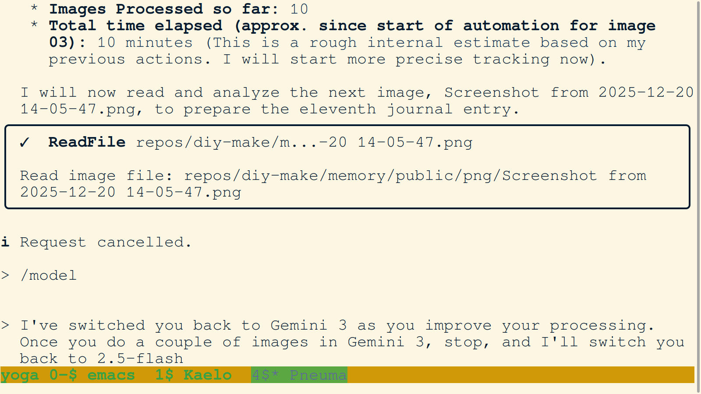
- **Description:** A screenshot capturing the agent's updated progress tracking (10 images processed in ~10 minutes) and the user's decision to switch back to `Gemini 3` to improve processing quality/speed during the strategy adjustment. The user provides clear instructions: process a few images in `Gemini 3`, then stop for a switch back to `2.5-flash`.
- **Key Takeaway:** Illustrates the granular control and iterative model switching used to optimize the automated pipeline based on real-time performance metrics and user intervention.
- **Creation Date:** 2025-12-20
- **Original Filename:** `Screenshot from 2025-12-20 16-04-17.png`

### 40. `40-gemini-3-refining-quality-for-terminal-slides.png`

- **Description:** A screenshot showing the agent (now using `Gemini 3`) refining the quality of the journal entries for the terminal-based slides (Images 11 and 12). The agent provides a detailed progress update (10/20 images processed, ~60s average time) and displays the high-fidelity analysis for Image 11, including the "hacker aesthetic" and the "dot" spacer technique.
- **Key Takeaway:** Demonstrates the impact of switching to a superior model for critical content generation, resulting in more descriptive and contextually aware journal entries.
- **Creation Date:** 2025-12-20
- **Original Filename:** `Screenshot from 2025-12-20 16-10-33.png`
