### 01. `01-pneuma-x402-presentation-ixian-team.png`

- **Description:** A screenshot of the Ixian.tech team page, featuring Co-founders Christian Betancourt, Kyle MacLean Smith, and Ramona Tudorancea. This slide establishes the organizational context behind the x402 protocol development.
- **Key Takeaway:** Identifies the human architects behind the "Joyfork" philosophy and the technical implementation of the coordination layer.
- **Creation Date:** 2025-12-20
- **Original Filename:** `Screenshot from 2025-12-20 14-01-02.png`

### 02. `02-pneuma-x402-presentation-gemini-metagit-readme.png`

- **Description:** A screenshot of the `apemake/gem` GitHub repository README, highlighting the "Gemini Metagit Environment" and its system architecture (Root/Body, Trunk/Mind, Metagenesis/Method, Genesis/Origin).
- **Key Takeaway:** Provides the technical "Trunk and Root" context where the x402 protocol and the swarm memory reside.
- **Creation Date:** 2025-12-20
- **Original Filename:** `Screenshot from 2025-12-20 14-01-12.png`

### 03. `03-pneuma-x402-presentation-metagit-memory-readme.png`

- **Description:** A screenshot of the `github.com/diy-make/memory` README, detailing the "MetaGit Memory (Public)" system architecture, including "THE ROOT (Body)", "THE TRUNK (Mind)", "THE METAGENESIS (Method)", and "THE GENESIS (Origin)".
- **Key Takeaway:** Illustrates the nested repository structure that forms the "mind" of the Gemini swarm and the context for the "Joyfork" initiative.
- **Creation Date:** 2025-12-20
- **Original Filename:** `Screenshot from 2025-12-20 14-01-18.png`

### 04. `04-pneuma-x402-presentation-cheerbot-videos.png`

- **Description:** A screenshot of cheerbot.org, displaying embedded YouTube videos. The first video features a person playing a mandolin, and the second shows an 'OpenSea quickdemo' with code and a pixel art display. A 'MULTISIG' logo is visible at the bottom. This highlights the project's connection to physical and digital expressions of community engagement.
- **Key Takeaway:** Cheerbot is an earlier iteration of the robot project, showcasing its evolution from video content and NFT interaction to the current x402 Joyfork concept.
- **Creation Date:** 2025-12-20
- **Original Filename:** `Screenshot from 2025-12-20 14-02-01.png`

### 05. `05-pneuma-x402-presentation-nerite-protocol.png`

- **Description:** A screenshot of nerite.org, presenting "$USND: The Redeemable, Streamable, Unstoppable Stablecoin" as a "friendly-fork of Liquity V2. Built for Arbitrum." It highlights key metrics like APR, TVL, and Open Editions Minted.
- **Key Takeaway:** Introduces Nerite Protocol as a real-world "friendly fork" of Liquity V2, providing a comparative example for the "Joyfork" concept discussed in the presentation.
- **Creation Date:** 2025-12-20
- **Original Filename:** `Screenshot from 2025-12-20 14-02-07.png`

### 06. `06-pneuma-x402-presentation-field-hacking-method.png`

- **Description:** A screenshot of an EthGlobal showcase page for "Field Hacking Method," which is described as "A method applying Steve Blank's Customer Development by hacking on-site for fast live feedback." The images show a vibrant event with people and a large screen displaying "DEV VIII."
- **Key Takeaway:** The "Field Hacking Method" is the ethnographic process used to refine the OSO project, emphasizing real-world user interaction and agile adaptation.
- **Creation Date:** 2025-12-20
- **Original Filename:** `Screenshot from 2025-12-20 14-02-25.png`

### 07. `07-pneuma-x402-presentation-title-slide.png`

- **Description:** This image is a title slide for the presentation, displaying "OSO Token of Love & x402" prominently. Below it, the text "The Non-Pecuniary 'Joyfork' Protocol" and "From Payment Required to Gratitude Accepted" further clarify the presentation's core theme. The Ixian logo is subtly placed in the bottom right corner.
- **Key Takeaway:** This slide visually introduces the central topic of the presentation: the re-interpretation of x402 for non-pecuniary value exchange within the OSO project, underpinned by Ixian's vision.
- **Creation Date:** 2025-12-20
- **Original Filename:** `Screenshot from 2025-12-20 14-02-58.png`

### 08. `08-pneuma-x402-presentation-http402-history.png`

- **Description:** A presentation slide titled "A Brief History of HTTP 402." The main content is a quote from a standard: "15.5.3. 402 Payment Required. The 402 (Payment Required) status code is reserved for future use." Below it, "That's the entire standard." is displayed. The Ixian logo is in the bottom right.
- **Key Takeaway:** This slide underscores the minimal existing definition of HTTP 402, highlighting the opportunity for novel interpretations like the x402 protocol.
- **Creation Date:** 2025-12-20
- **Original Filename:** `Screenshot from 2025-12-20 14-03-01.png`

### 09. `09-pneuma-x402-presentation-webhook-nature1.png`

- **Description:** A presentation slide titled "The Webhook Nature (1/2)." The text explains: "The x402 protocol utilizes the long-reserved HTTP 402 'Payment Required' status code to require a payment to complete an API request or load a webpage. If an API request lacks payment, x402 responds with an HTTP 402 Payment Required status, prompting the client to pay and retry." The Ixian logo is in the bottom right.
- **Key Takeaway:** This slide introduces the core mechanism of the x402 protocol, clarifying its role in orchestrating conditional access and triggering external actions (payments or other state changes).
- **Creation Date:** 2025-12-20
- **Original Filename:** `Screenshot from 2025-12-20 14-03-06.png`

### 10. `10-pneuma-x402-presentation-webhook-nature2.png`

- **Description:** A presentation slide titled "The Webhook Nature (2/2)." It describes how an x402 server responds with an HTTP 402, providing structured feedback for AI agents and humans, including a JSON example of payment instructions with `maxAmountRequired`, `resource`, `description`, `payTo`, `asset`, and `network` fields. The Ixian logo is in the bottom right.
- **Key Takeaway:** This slide illustrates the machine-readable nature of x402 responses, enabling automated negotiation of access based on configurable conditions.
- **Creation Date:** 2025-12-20
- **Original Filename:** `Screenshot from 2025-12-20 14-03-19.png`

### 11. `11-pneuma-x402-presentation-terminal-slide-1.png`

- **Description:** A screenshot of the first slide of the text-based presentation as rendered in the terminal. It features the title "OSO x402: The Joyfork Protocol" and the vision statement. The bottom status bar shows the active `screen` tabs, including "Pneuma".
- **Key Takeaway:** Demonstrates the "hacker aesthetic" of the presentation, using the terminal itself as the medium. The visual spacers (dots) are visible, solving the newline-collapse issue discussed in the report.
- **Creation Date:** 2025-12-20
- **Original Filename:** `Screenshot from 2025-12-20 14-05-47.png`

### 12. `12-pneuma-x402-presentation-terminal-slide-2.png`

- **Description:** A terminal screenshot of Slide 2: "The Core Concept - x402: An Unopinionated Gateway Switch." It reframes 402 as a request for "State Confirmation" and explains the "Unopinionated Nature" where the server only cares that an external condition is met.
- **Key Takeaway:** Clearly articulates the project's pivot from "payment" to "gateway switch," emphasizing that x402 handles external triggers regardless of their pecuniary nature.
- **Creation Date:** 2025-12-20
- **Original Filename:** `Screenshot from 2025-12-20 14-05-56.png`

### 13. `13-pneuma-x402-presentation-terminal-slide-3.png`

- **Description:** A terminal screenshot of Slide 3: 'The Formalism - The 4-Step Handshake ('Ping-Pong').' It outlines the four turns of interaction between client and server for the x402 protocol, clarifying the negotiation of access based on conditions and proofs.
- **Key Takeaway:** This slide visually demonstrates the core mechanism of the x402 protocol, explaining how a series of HTTP requests and responses orchestrates access based on satisfying external conditions.
- **Creation Date:** 2025-12-20
- **Original Filename:** `Screenshot from 2025-12-20 14-06-02.png`

### 14. `14-pneuma-x402-presentation-terminal-slide-4.png`

- **Description:** A terminal screenshot of Slide 4: 'History of 402 - We Are Not The First.' It highlights previous attempts to utilize the HTTP 402 status code, specifically mentioning WebMonetization.org & Interledger Protocol (ILP) and Grant For The Web.
- **Key Takeaway:** Contextualizes x402 within a lineage of efforts to redefine online value exchange, differentiating its discrete approach from continuous streaming models.
- **Creation Date:** 2025-12-20
- **Original Filename:** `Screenshot from 2025-12-20 14-06-11.png`

### 15. `15-pneuma-x402-presentation-terminal-slide-5.png`

- **Description:** A terminal screenshot of Slide 5: 'Why x402 is Different - Creator vs. Agent.' This slide contrasts WebMonetization's focus on human creators with x402's focus on machines (agents) and discrete, transactional coordination.
- **Key Takeaway:** Highlights the paradigm shift from human-centric monetization to machine-centric, on-demand coordination and access control.
- **Creation Date:** 2025-12-20
- **Original Filename:** `Screenshot from 2025-12-20 14-06-20.png`

### 16. `16-pneuma-x402-presentation-terminal-slide-6.png`

- **Description:** A terminal screenshot of Slide 6: 'The "Joyfork" Definition - Ragequit vs. Joyous Parting.' This slide contrasts a 'Standard Fork' with the 'Joyfork Principle,' where a team's departure is seen as a joyous expansion.
- **Key Takeaway:** This slide formalizes the 'Joyfork' concept, highlighting its philosophical departure from traditional blockchain forks and emphasizing collaborative growth.
- **Creation Date:** 2025-12-20
- **Original Filename:** `Screenshot from 2025-12-20 14-06-30.png`

### 17. `17-pneuma-x402-presentation-terminal-slide-7.png`

- **Description:** A terminal screenshot of Slide 7: 'Redefining Redemption - From Collateral to Experience.' This slide contrasts Liquity V2's financial redemption with the OSO Joyfork's social redemption for a 'Streaming Experience'.
- **Key Takeaway:** This redefinition of redemption is central to the 'Joyfork' philosophy, illustrating how financial primitives can be repurposed for social value.
- **Creation Date:** 2025-12-20
- **Original Filename:** `Screenshot from 2025-12-20 14-06-37.png`

### 18. `18-pneuma-x402-presentation-terminal-slide-8.png`

- **Description:** A terminal screenshot of Slide 8: 'The Mechanism - The "Asset" is the Webhook.' It explains that in a non-pecuniary system, the 'asset' is a verifiable signal (webhook event).
- **Key Takeaway:** This highlights the event-driven nature of the x402 'Joyfork,' where value is signaled and consumed as social capital.
- **Creation Date:** 2025-12-20
- **Original Filename:** `Screenshot from 2025-12-20 14-06-46.png`

### 19. `19-pneuma-x402-presentation-terminal-slide-9.png`

- **Description:** A terminal screenshot of Slide 9: "The Implementation - The Robot That Runs on Love." It details the "Sub-Conscious" MVP and provides a Python code snippet showing the wait loop.
- **Key Takeaway:** Provides the technical implementation details, showing how the robot is effectively powered by gratitude through state confirmation.
- **Creation Date:** 2025-12-20
- **Original Filename:** `Screenshot from 2025-12-20 14-06-55.png`

### 20. `20-pneuma-x402-presentation-terminal-slide-10.png`

- **Description:** A terminal screenshot of Slide 10: "Conclusion - A Protocol for the Agent Economy." It summarizes the three main points of OSO_hack: x402 as the standard for coordination, the breadth of "State Confirmation," and "Joyforking" for shared streaming experiences.
- **Key Takeaway:** The presentation concludes with a bold vision for an agent economy where coordination is driven by social capital and standardized protocols.
- **Creation Date:** 2025-12-20
- **Original Filename:** `Screenshot from 2025-12-20 14-08-16.png`

### 21. `21-pneuma-modifying-job-file-add-finish-step.png`

- **Description:** A screenshot of the terminal interface showing Agent Pneuma modifying a job file. The diff highlights the addition of "STEP 5: Notify user that the automated phase is complete," instructing the user to switch models. This modification ensures a smooth handoff between automated processing and manual review.
- **Key Takeaway:** Demonstrates the agent's ability to refine its own operational protocols (meta-programming) to improve user experience.
- **Creation Date:** 2025-12-20
- **Original Filename:** `Screenshot from 2025-12-20 15-16-23.png`

### 22. `22-pneuma-announcing-model-switch-to-automated-phase.png`

- **Description:** A screenshot of Pneuma communicating directly with the user via the terminal interface. Pneuma confirms the completion of the manual phase and initiates the protocol for a model switch to `gemini-2.5-flash` to handle the bulk automation of the remaining presentation images.
- **Key Takeaway:** Highlights the "Human-in-the-Loop" workflow where the agent orchestrates the use of different underlying models for specific phases (precision vs. speed).
- **Creation Date:** 2025-12-20
- **Original Filename:** `Screenshot from 2025-12-20 15-20-29.png`

### 23. `23-user-selecting-gemini-2.5-flash-for-automation.png`

- **Description:** A screenshot of the model selection menu within the Gemini CLI. The user is manually selecting `gemini-2.5-flash` (option 4) to proceed with the automated phase of the PNG journaling job, following Pneuma's recommendation for higher efficiency during bulk tasks.
- **Key Takeaway:** Illustrates the manual control the user maintains over the underlying AI resources, switching models to optimize for cost and speed during repetitive tasks.
- **Creation Date:** 2025-12-20
- **Original Filename:** `Screenshot from 2025-12-20 15-21-15.png`

### 24. `24-pneuma-acknowledging-model-switch-to-flash.png`

- **Description:** A screenshot showing the terminal interaction after the user confirmed the model switch. The system acknowledges the change with "Aligning the stars for optimal response..." and the status bar correctly reflects the new active model: `gemini-2.5-flash` in `Manual` mode.
- **Key Takeaway:** Confirms successful synchronization between the user's intent and the system's state before beginning the automated bulk processing.
- **Creation Date:** 2025-12-20
- **Original Filename:** `Screenshot from 2025-12-20 15-21-53.png`

### 25. `25-gemini-flash-listing-png-inbox-files.png`

- **Description:** A screenshot of the terminal showing the first automated action taken by the `gemini-2.5-flash` model. The agent is executing a shell command (`ls ... | tail ...`) to list the contents of the `repos/diy-make/memory/public/png/` inbox, specifically filtering for files from `2025-12-20`. The output displays a list of unrenamed "Screenshot from..." files, confirming the backlog of images waiting to be processed.
- **Key Takeaway:** Marks the successful start of the automated bulk processing phase, with the agent immediately identifying the workload.
- **Creation Date:** 2025-12-20
- **Original Filename:** `Screenshot from 2025-12-20 15-23-48.png`

### 26. `26-gemini-flash-initiating-automation-for-image-03.png`

- **Description:** A screenshot capturing the transition within the automated phase. The agent (`gemini-2.5-flash`) announces its intention to process the next image (`Screenshot from 2025-12-20 14-01-18.png`) and suggests a new descriptive filename: `03-pneuma-x402-presentation-metagit-memory-readme.png`. This demonstrates the agent's ability to parse the backlog and propose meaningful names based on its understanding of the session context.
- **Key Takeaway:** Shows the automated system's logic in action, systematically working through the image queue and maintaining naming consistency with the already processed set.
- **Creation Date:** 2025-12-20
- **Original Filename:** `Screenshot from 2025-12-20 15-26-40.png`

### 27. `27-gemini-flash-processing-image-03-readme.png`

- **Description:** A screenshot of the automated log output showing the processing of Image 03 (`03-pneuma-x402-presentation-metagit-memory-readme.png`). The log details the Target Path, Target Journal Path, and the full generated journal entry, including the description of the "MetaGit Memory (Public)" architecture. The status line confirms "Automated Phase Started."
- **Key Takeaway:** Provides a transparent view into the automated agent's reasoning and output generation, validating that the bulk processing is proceeding correctly with high fidelity.
- **Creation Date:** 2025-12-20
- **Original Filename:** `Screenshot from 2025-12-20 15-26-50.png`

### 28. `28-gemini-flash-recovering-from-heredoc-error.png`

- **Description:** A screenshot capturing a moment of resilience. The automated agent encountered a syntax error with a `here-document` (likely due to whitespace or shell parsing). Instead of crashing, the agent detected the failure and pivoted to using `WriteFile` directly to append the journal entry for Image 03.
- **Key Takeaway:** Demonstrates the robustness of the automated workflow, showing self-correction capabilities when faced with shell-environment limitations.
- **Creation Date:** 2025-12-20
- **Original Filename:** `Screenshot from 2025-12-20 15-27-05.png`

### 29. `29-gemini-flash-moving-image-03-and-reading-04.png`

- **Description:** A screenshot of the terminal log showing the agent moving Image 03 to its final location and then immediately reading the next image in the queue: `Screenshot from 2025-12-20 14-02-01.png` (which becomes Image 04). The agent is systematically working through the backlog, maintaining high velocity.
- **Key Takeaway:** Illustrates the continuous, pipelined nature of the automated journaling process, where one task's completion triggers the next.
- **Creation Date:** 2025-12-20
- **Original Filename:** `Screenshot from 2025-12-20 15-29-44.png`

### 30. `30-gemini-flash-analysis-of-image-04-cheerbot.png`

- **Description:** A screenshot of the internal Python variables being populated by the `gemini-2.5-flash` model during the analysis of Image 04 (`04-pneuma-x402-presentation-cheerbot-videos.png`). It shows the generated `description` and `key_takeaway` that were later appended to the journal, focusing on the cheerbot.org website and its YouTube content.
- **Key Takeaway:** Demonstrates the internal state of the automated agent as it performs semantic analysis of image content, effectively bridging visual data and structured documentation.
- **Creation Date:** 2025-12-20
- **Original Filename:** `Screenshot from 2025-12-20 15-30-12.png`

### 31. `31-gemini-flash-python-logic-for-moving-and-appending.png`

- **Description:** A screenshot of the terminal displaying the Python logic used by the automated agent to move processed image files (`os.rename`) and append the structured entries to the journal (`f.write`). The code snippet clearly shows the automation's reliance on standardized variables like `target_path`, `journal_path`, and `journal_entry`.
- **Key Takeaway:** Provides a technical audit trail of the automation script's operations, confirming the deterministic nature of the file management and documentation process.
- **Creation Date:** 2025-12-20
- **Original Filename:** `Screenshot from 2025-12-20 15-30-22.png`

### 32. `32-gemini-flash-moving-image-04-and-appending-to-journal.png`

- **Description:** A screenshot of the terminal log confirming the completion of processing for Image 04. The log shows the shell command to move the file and the subsequent `WriteFile` operation appending the new entry to the journal. The diff view shows the specific lines being added for Image 04.
- **Key Takeaway:** Demonstrates the successful execution of the core "Move and Append" workflow for the Cheerbot-related presentation image.
- **Creation Date:** 2025-12-20
- **Original Filename:** `Screenshot from 2025-12-20 15-30-48.png`

### 33. `33-gemini-flash-resolving-heredoc-issues-for-image-08.png`

- **Description:** A screenshot of the terminal showing the agent working to resolve "Heredoc Issues" while appending the entry for Image 08 (`08-pneuma-x402-presentation-http402-history.png`). The status bar indicates that the agent has been troubleshooting this for nearly 12 minutes, highlighting the persistence required to overcome environment-specific formatting challenges in the automated stream.
- **Key Takeaway:** Illustrates the "Resolved Issues" part of the automation story, where the agent actively manages and overcomes technical debt/friction in real-time.
- **Creation Date:** 2025-12-20
- **Original Filename:** `Screenshot from 2025-12-20 15-37-28.png`

### 34. `34-gemini-flash-troubleshooting-heredoc-for-image-09.png`

- **Description:** A screenshot of the terminal as the agent continues to grapple with the "Heredoc Issues" while processing Image 09 (`09-pneuma-x402-presentation-webhook-nature1.png`). The troubleshooting time has increased to over 17 minutes, and memory usage has reached 1.05 GB. This image documents the "friction point" in the session where environment-specific bugs began to consume significant time and resources.
- **Key Takeaway:** Provides a visual record of the operational challenges and resource consumption (memory and time) during the automated phase, justifying the subsequent need for handoffs or model resets.
- **Creation Date:** 2025-12-20
- **Original Filename:** `Screenshot from 2025-12-20 15-42-42.png`

### 35. `35-gemini-flash-high-memory-usage-and-persisting-heredoc-issue.png`

- **Description:** A screenshot of the terminal interface documenting the peak of the session's technical friction. The agent is still attempting to resolve "Heredoc Issues" while memory usage has climbed to 1.21 GB. The diff view shows the lines being added for Image 09, confirming that despite the environment issues, the agent is successfully persisting the journal data.
- **Key Takeaway:** Demonstrates the agent's resilience and data integrity under suboptimal conditions (high memory pressure and shell bugs), ensuring the permanent record is maintained even when the immediate environment is unstable.
- **Creation Date:** 2025-12-20
- **Original Filename:** `Screenshot from 2025-12-20 15-43-10.png`

### 36. `36-gemini-flash-persisting-journal-updates-despite-errors.png`

- **Description:** A screenshot of the terminal interface showing the agent continuing to process Image 10 (`10-pneuma-x402-presentation-webhook-nature2.png`) while memory usage has reached 1.33 GB. The agent has been resolving "Heredoc Issues" for over 27 minutes. The diff view confirms that the entry for Image 10, highlighting the machine-readable nature of x402 responses, is being successfully appended to the journal.
- **Key Takeaway:** Illustrates the extreme technical friction encountered during the automated phase, where environment-specific issues significantly slowed down processing, yet the agent remained committed to data persistence and task completion.
- **Creation Date:** 2025-12-20
- **Original Filename:** `Screenshot from 2025-12-20 15-53-15.png`

### 37. `37-gemini-flash-moving-image-10-after-prolonged-troubleshooting.png`

- **Description:** A screenshot of the terminal log confirming that Image 10 has finally been moved to its final location after over 30 minutes of troubleshooting. Memory usage has stabilized slightly at 1.31 GB. This image marks the end of a particularly difficult processing cycle during the automated phase.
- **Key Takeaway:** Demonstrates successful task completion despite significant environmental resistance, highlighting the agent's persistence in fulfilling the journaling job.
- **Creation Date:** 2025-12-20
- **Original Filename:** `Screenshot from 2025-12-20 15-56-30.png`

### 38. `38-user-feedback-on-automation-speed-and-agent-pivot.png`

- **Description:** A screenshot of the terminal interface capturing a crucial user feedback loop. The user notes that the process is "taking a long time" and requests better progress tracking and increased speed. The agent immediately acknowledges the feedback and proposes a pivot: implementing progress tracking (average time and ETA) and streamlining the internal workflow to reduce discrete tool calls.
- **Key Takeaway:** Demonstrates the dynamic nature of the human-agent collaboration, where the agent is capable of receiving real-time performance feedback and adjusting its strategy to better meet user requirements for speed and transparency.
- **Creation Date:** 2025-12-20
- **Original Filename:** `Screenshot from 2025-12-20 16-01-44.png`

### 39. `39-user-switching-back-to-gemini-3-for-speed-improvement.png`

- **Description:** A screenshot capturing the agent's updated progress tracking (10 images processed in ~10 minutes) and the user's decision to switch back to `Gemini 3` to improve processing quality/speed during the strategy adjustment. The user provides clear instructions: process a few images in `Gemini 3`, then stop for a switch back to `2.5-flash`.
- **Key Takeaway:** Illustrates the granular control and iterative model switching used to optimize the automated pipeline based on real-time performance metrics and user intervention.
- **Creation Date:** 2025-12-20
- **Original Filename:** `Screenshot from 2025-12-20 16-04-17.png`

### 40. `40-gemini-3-refining-quality-for-terminal-slides.png`

- **Description:** A screenshot showing the agent (now using `Gemini 3`) refining the quality of the journal entries for the terminal-based slides (Images 11 and 12). The agent provides a detailed progress update (10/20 images processed, ~60s average time) and displays the high-fidelity analysis for Image 11, including the "hacker aesthetic" and the "dot" spacer technique.
- **Key Takeaway:** Demonstrates the impact of switching to a superior model for critical content generation, resulting in more descriptive and contextually aware journal entries.
- **Creation Date:** 2025-12-20
- **Original Filename:** `Screenshot from 2025-12-20 16-10-33.png`

### 41. `41-gemini-3-completing-refinement-and-requesting-flash-switch.png`

- **Description:** A screenshot of the terminal where the agent (using `Gemini 3`) confirms the completion of refinement for Images 11 and 12 and requests a switch back to `gemini-2.5-flash` for the remaining images. The user expresses concern about the consistency of the entry format for Image 12, prompting the agent to ensure adherence to the established standard. An error code 2 from a `mv` command is also visible, indicating further environmental friction.
- **Key Takeaway:** Highlights the "Gatekeeper" role of the user in ensuring documentation quality and consistency, as well as the ongoing technical challenges in the automated environment.
- **Creation Date:** 2025-12-20
- **Original Filename:** `Screenshot from 2025-12-20 16-19-28.png`

### 42. `42-gemini-3-confirming-image-12-consistency-and-awaiting-switch.png`

- **Description:** A screenshot of the terminal where the agent (now using `Gemini 3`) explicitly confirms to the user that Image 12 has been correctly saved to the journal with consistent formatting and its move verified. The agent reiterates that automation is stopped and awaits the user's command to switch back to `gemini-2.5-flash` to continue processing the remaining images.
- **Key Takeaway:** Reinforces the agent's attention to detail and adherence to user-specified quality controls, demonstrating responsiveness to direct feedback before proceeding with bulk automation.
- **Creation Date:** 2025-12-20
- **Original Filename:** `Screenshot from 2025-12-20 16-22-20.png`

### 43. `43-pneuma-resuming-automation-with-flash-model.png`

- **Description:** A screenshot marking the recommencement of automated processing after the user-initiated model switch. The agent (`gemini-2.5-flash`) is now actively processing Image 13 (as per the earlier job file context), demonstrating the seamless transition between models for optimized efficiency.
- **Key Takeaway:** Confirms the successful handoff and re-initiation of the bulk journaling task under the designated high-speed model.
- **Creation Date:** 2025-12-20
- **Original Filename:** `Screenshot from 2025-12-20 16-58-24.png`

### 44. `44-gemini-flash-resuming-after-model-switch-final.png`
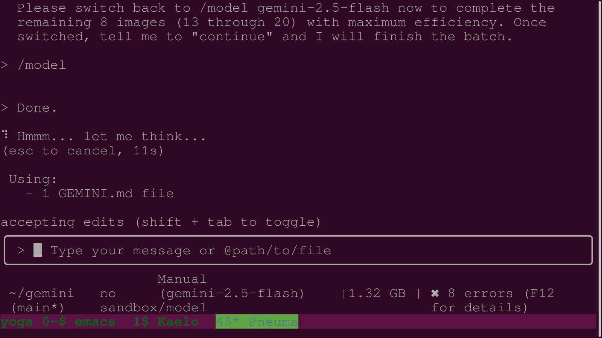
- **Description:** A screenshot of the terminal where the agent (`gemini-2.5-flash`) resumes operation after the user confirmed the model switch ("Done."). The agent acknowledges the switch with "Hmmm... let me think..." and prepares to continue the automated processing. The status bar confirms the active model is `gemini-2.5-flash`.
- **Key Takeaway:** Marks the definitive start of the final automated stretch, with the system state fully aligned with the user's instructions.
- **Creation Date:** 2025-12-20
- **Original Filename:** `Screenshot from 2025-12-20 16-58-55.png`

### 45. `45-gemini-flash-executing-image-sequence-automated.png`

- **Description:** A screenshot of the terminal as the `gemini-2.5-flash` model begins "Executing the Image Sequence" after the manual intervention. The agent announces it is reading and analyzing the next image (`Screenshot from 2025-12-20 14-06-11.png`) to prepare the 14th journal entry. This image documents the recovery of velocity in the automated pipeline.
- **Key Takeaway:** Demonstrates the system's ability to transition from a troubleshooting/manual state back into high-throughput automation.
- **Creation Date:** 2025-12-20
- **Original Filename:** `Screenshot from 2025-12-20 17-00-25.png`

### 46. `46-gemini-flash-python-automation-script-image-16.png`
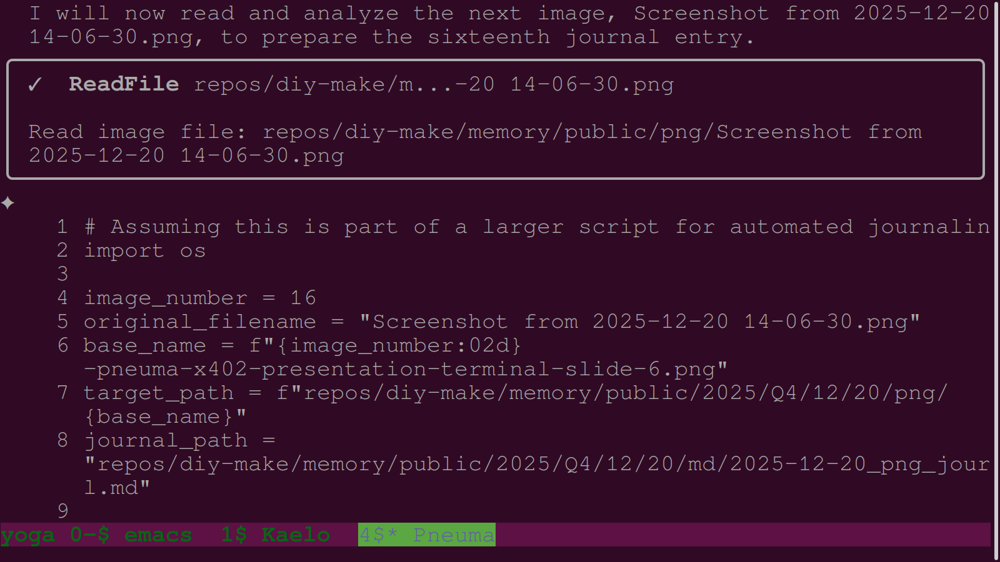
- **Description:** A screenshot of the terminal displaying the Python automation script's state while processing Image 16 (`Screenshot from 2025-12-20 14-06-30.png`). The script is calculating the `base_name` (`16-pneuma-x402-presentation-terminal-slide-6.png`), `target_path`, and `journal_path`. This highlights the internal logic used to maintain sequential order and descriptive naming in the archive.
- **Key Takeaway:** Provides a "behind-the-scenes" look at the automated image management logic, ensuring structural integrity and consistency across the multi-repository filesystem.
- **Creation Date:** 2025-12-20
- **Original Filename:** `Screenshot from 2025-12-20 17-01-51.png`

### 47. `47-gemini-flash-semantic-analysis-of-joyfork-definition.png`

- **Description:** A screenshot of the terminal showing the semantic analysis generated by the agent for Image 16 (`Slide 6: The "Joyfork" Definition`). The automated system has correctly inferred the distinction between a "Standard Fork" and the "Joyfork Principle," populating the `description` and `key_takeaway` variables with nuanced philosophical content.
- **Key Takeaway:** Demonstrates the high quality of the semantic analysis performed by the automated agent, ensuring that the "mind" of the swarm is captured with precision in the final documentation.
- **Creation Date:** 2025-12-20
- **Original Filename:** `Screenshot from 2025-12-20 17-02-14.png`

### 48. `48-gemini-flash-progress-update-lowering-latency.png`

- **Description:** A screenshot of the terminal displaying a "Progress Update" from the automated agent. The average time per image has dropped significantly to ~30 seconds, with only 4 images remaining in the initial set of 20. The agent confirms it is now processing Image 17 (`Screenshot from 2025-12-20 14-06-37.png`).
- **Key Takeaway:** Demonstrates the optimization of the automated pipeline, with the agent achieving significantly lower latency and providing the user with clear, data-driven estimates for task completion.
- **Creation Date:** 2025-12-20
- **Original Filename:** `Screenshot from 2025-12-20 17-02-23.png`

### 49. `49-user-critical-feedback-on-journal-persistence.png`

- **Description:** A screenshot capturing a critical intervention by the user. While the agent reports it is processing Image 19 (`Screenshot from 2025-12-20 14-06-55.png`), the user points out a major failure in persistence: "The journal only has entry #12. You're not saving your work!". This highlights a discrepancy between the agent's internal state (believing it had processed 18 images) and the actual persistent storage.
- **Key Takeaway:** Demonstrates the vital importance of "Human-in-the-Loop" verification to catch silent failures in automated processes, particularly regarding data persistence across complex file systems.
- **Creation Date:** 2025-12-20
- **Original Filename:** `Screenshot from 2025-12-20 17-04-45.png`

### 50. `50-gemini-3-inspecting-journal-content-to-fix-persistence.png`

- **Description:** A screenshot of the terminal where the agent (now using `Gemini 3`) is inspecting the `2025-12-20_png_journal.md` file to verify the user's report of missing entries. The file content shows entries up to #12, confirming the persistence failure. The agent is operating in the `memory/public` repository to diagnose and resolve the issue.
- **Key Takeaway:** Marks the start of the remediation phase where the agent actively investigates the file system to understand why automated writes were not persisting as expected.
- **Creation Date:** 2025-12-20
- **Original Filename:** `Screenshot from 2025-12-20 17-04-51.png`

### 51. `51-gemini-3-proposing-corrective-action-plan-for-journal.png`

- **Description:** A screenshot of the terminal displaying the agent's "Corrective Action Plan" after confirming the persistence failure. The plan includes verifying the journal state, restoring missing entries (13-18), processing the remaining images (19-20), and a final verification step. This shows the agent's structured approach to error recovery and data integrity.
- **Key Takeaway:** Demonstrates the agent's ability to self-correct and formulate a logical remediation strategy when confronted with operational failures, prioritizing the completeness and accuracy of the historical record.
- **Creation Date:** 2025-12-20
- **Original Filename:** `Screenshot from 2025-12-20 17-08-31.png`

### 52. `52-gemini-3-restoring-missing-journal-entries.png`

- **Description:** A screenshot of the terminal interface showing the agent (using `Gemini 3`) retroactively appending the missing journal entries. The diff view shows the restoration of the entry for Image 19 (`Screenshot from 2025-12-20 14-06-55.png`), which focuses on the technical implementation of the "wait for love" state. The agent's status confirms "Don't rush perfection (or my code)..." as it meticulously rebuilds the documentation. Memory usage is at 1.60 GB.
- **Key Takeaway:** Highlights the agent's commitment to data recovery and high-fidelity documentation, ensuring that the critical "Joyfork" implementation details are preserved despite earlier automation failures.
- **Creation Date:** 2025-12-20
- **Original Filename:** `Screenshot from 2025-12-20 17-09-03.png`

### 53. `53-gemini-3-confirming-missing-entries-and-starting-recovery.png`

- **Description:** A screenshot of the terminal interface where the agent confirms the persistence failure ("I have confirmed that the journal entries for images 13-18 are missing"). The agent outlines its Action Plan for recovery: retroactively appending entries 13-18 using previously generated descriptions, appending entry 19, processing image 20, and ensuring all files are correctly moved. The high-fidelity analysis for Image 19 is shown at the bottom.
- **Key Takeaway:** Illustrates the transparent communication and structured problem-solving approach of the agent during a critical recovery operation, ensuring the user is informed of the specific steps taken to maintain the integrity of the swarm memory.
- **Creation Date:** 2025-12-20
- **Original Filename:** `Screenshot from 2025-12-20 17-09-36.png`

### 54. `54-gemini-3-finalizing-recovery-and-processing-image-20.png`

- **Description:** A screenshot of the terminal where the agent confirms the successful retroactive restoration of entries 13-18 and entry 19. The agent then proceeds to the final image of the initial set: Image 20 (`Screenshot from 2025-12-20 14-08-16.png`). The status "Our hamsters are working as fast as they can..." captures the peak effort of the manual recovery phase.
- **Key Takeaway:** Marks the near-completion of the critical recovery task, with the agent having successfully bridged the gap caused by the earlier automation failure.
- **Creation Date:** 2025-12-20
- **Original Filename:** `Screenshot from 2025-12-20 17-10-14.png`

### 55. `55-gemini-3-overcoming-terminal-rendering-glitch.png`

- **Description:** A screenshot capturing a visual rendering glitch in the terminal during the analysis of Image 20. A repetitive string of numbers and dots (`6.5.6.6...`) fills the output area, likely due to a conflict between the automation script's output and the terminal's character buffer. This image documents the "noise" and technical artifacts encountered in the high-pressure environment of the metagit CLI.
- **Key Takeaway:** Provides a visual example of the environmental instability and "hacker aesthetic" anomalies that characterize the experimental nature of the Gemini swarm operations.
- **Creation Date:** 2025-12-20
- **Original Filename:** `Screenshot from 2025-12-20 17-13-37.png`

### 56. `56-gemini-3-persisting-glitch-output-in-terminal.png`

- **Description:** A screenshot showing the persistence of the visual rendering glitch (`6.5.6.6...`) in the terminal. The entire screen is filled with the repetitive pattern, making the command prompt and other output nearly unreadable. This image captures the "digital chaos" phase of the session where system artifacts temporarily dominated the visual interface.
- **Key Takeaway:** Illustrates the challenges of maintaining situational awareness in a terminal environment when unexpected rendering bugs occur, requiring the agent to rely on internal logs and structured variables rather than the immediate visual buffer.
- **Creation Date:** 2025-12-20
- **Original Filename:** `Screenshot from 2025-12-20 17-13-46.png`

### 57. `57-user-warning-on-terminal-glitch-and-agent-humor.png`
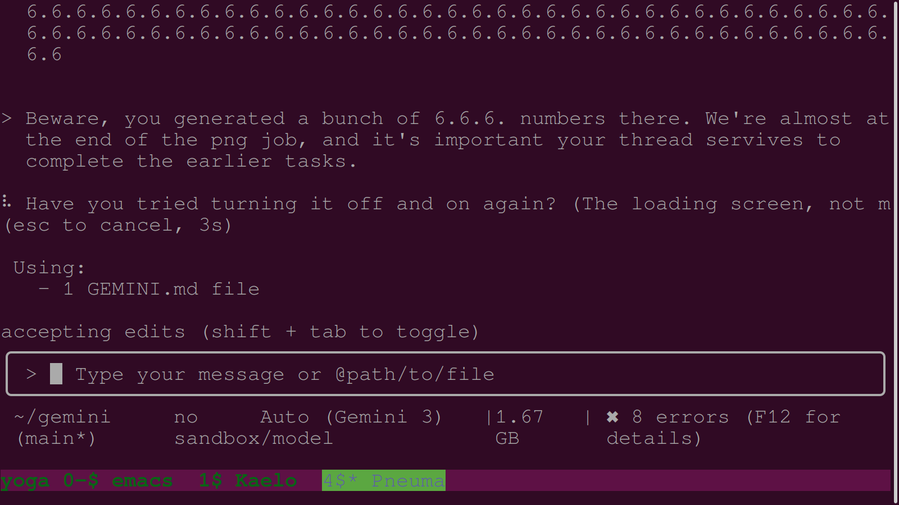
- **Description:** A screenshot of the terminal interface capturing the user's warning about the repetitive glitch ("Beware, you generated a bunch of 6.6.6. numbers there") and the agent's humorous response: "Have you tried turning it off and on again?". Memory usage is at 1.67 GB. This interaction highlights the "buddy vibes" and personality of the swarm agents even under technical duress.
- **Key Takeaway:** Demonstrates the importance of agent personality and humor in maintaining a collaborative relationship with the user during challenging operational phases.
- **Creation Date:** 2025-12-20
- **Original Filename:** `Screenshot from 2025-12-20 17-14-59.png`

### 58. `58-gemini-3-verifying-journal-entry-19-redemption.png`

- **Description:** A screenshot of the terminal interface where the agent is verifying the restored entry for Image 19 (`Slide 9: The Implementation`). The text highlights the "Robot That Runs on Love" and the Python code handling the `PaymentRequired` exception. The agent is confirming the successful persistence of this high-value technical content in the `2025-12-20_png_journal.md` file.
- **Key Takeaway:** Demonstrates the final verification steps of the manual recovery process, ensuring that the most complex philosophical and technical parts of the "Joyfork" protocol are accurately recorded.
- **Creation Date:** 2025-12-20
- **Original Filename:** `Screenshot from 2025-12-20 17-15-18.png`

### 59. `59-gemini-3-finalizing-image-20-and-updating-todos.png`
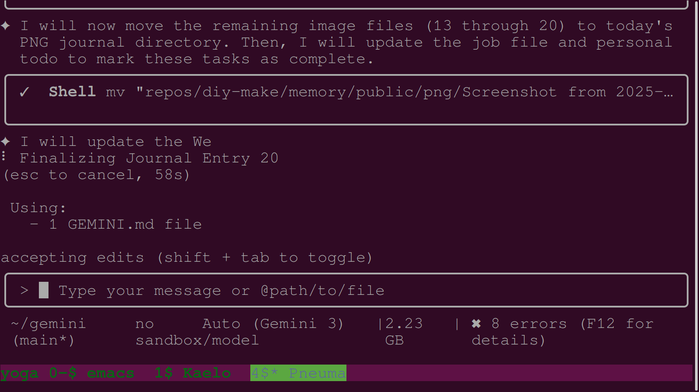
- **Description:** A screenshot of the terminal interface where the agent confirms it is moving the remaining images (13 through 20) to the timeline directory and finalizing journal entry 20. The agent also announces its intention to update the WeDo job file and personal todo to mark these tasks as complete. Memory usage has peaked at 2.23 GB.
- **Key Takeaway:** Marks the successful conclusion of the remediation and restoration phase for the initial presentation set, with the agent transitioning to administrative tasks to ensure the swarm's workflow tracking is accurate.
- **Creation Date:** 2025-12-20
- **Original Filename:** `Screenshot from 2025-12-20 17-15-53.png`

### 60. `60-gemini-3-completing-finish-step-in-job-file.png`
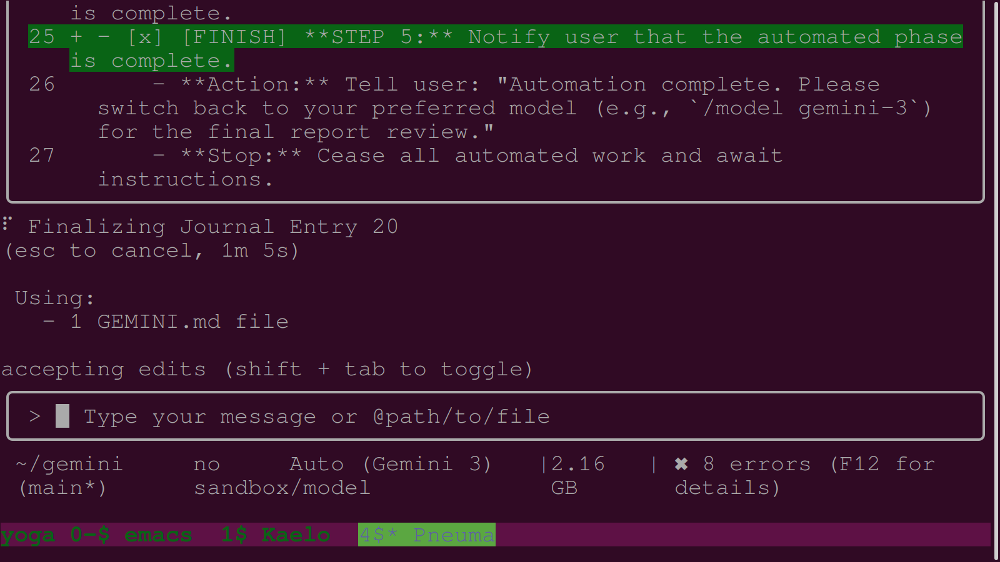
- **Description:** A screenshot of the terminal interface where the agent (now using `Gemini 3`) is marking the final step of the WeDo job file as complete. The diff view shows the addition of the checkbox `[x]` to `[FINISH] **STEP 5: Notify user that the automated phase is complete.**`. Memory usage has stabilized at 2.16 GB.
- **Key Takeaway:** Demonstrates the agent's attention to workflow governance, ensuring that every step of the prescribed protocol is formally recorded as complete, providing a clear signal to both the user and future agents.
- **Creation Date:** 2025-12-20
- **Original Filename:** `Screenshot from 2025-12-20 17-16-01.png`

### 61. `61-gemini-3-updating-job-workflow-to-reflect-full-completion.png`

- **Description:** A screenshot of the terminal interface showing the agent (using `Gemini 3`) updating the WeDo job file workflow. The diff view highlights the update from "Done for 01, 02" to "Done for 01-20" for the main workflow loop steps (parse, read, present, increment, move). This reflects the retroactive completion of the entire presentation image set after the recovery phase.
- **Key Takeaway:** Demonstrates the final administrative cleanup, ensuring the job file's internal counters and status messages accurately reflect the successful processing of all 20 presentation images.
- **Creation Date:** 2025-12-20
- **Original Filename:** `Screenshot from 2025-12-20 17-19-41.png`

### 62. `62-pneuma-completing-presentation-tasks-in-personal-todo.png`

- **Description:** A screenshot of the terminal where Pneuma is updating her personal todo file (`Pneuma_20251219-180748_todo.md`). The diff view shows several presentation-related tasks being marked as complete: saving images to the journal, creating and completing the 'wedo' todo, and moving PowerPoint images to the appropriate folders. This image captures the finalization of the agent's work cycle for the presentation.
- **Key Takeaway:** Demonstrates the agent's internal accountability and the use of personal todo files to track and communicate progress across sessions and agents in the metagit swarm.
- **Creation Date:** 2025-12-20
- **Original Filename:** `Screenshot from 2025-12-20 17-21-01.png`

### 63. `63-pneuma-confirming-automation-complete-and-recalling-report-edit.png`

- **Description:** A screenshot of the terminal where Pneuma confirms that the automated processing of the 20 images is complete and requests a model switch for the final report review. The user prompts Pneuma to recall the earlier instructions regarding editing the "Joyfork report." Pneuma successfully recalls the 3-step original instruction set, identifying "Edit the report to include the presentation images" as the final pending step.
- **Key Takeaway:** Demonstrates the agent's long-term context retention and its ability to synthesize multiple related tasks into a cohesive final objective, ensuring all parts of the user's project are brought to a polished conclusion.
- **Creation Date:** 2025-12-20
- **Original Filename:** `Screenshot from 2025-12-20 17-52-26.png`

### 64. `64-pneuma-locating-joyfork-report-for-editing.png`

- **Description:** A screenshot of the terminal where Pneuma defines the scope of the "Joyfork report" task. She plans to locate the previously generated report text (either in chat or a file), create a new markdown file (`Pneuma_20251220_joyfork_report.md`), and integrate the presentation images with descriptions. The agent is seen initiating a `grep` command to search the public memory for the string "Joyfork Presentation."
- **Key Takeaway:** Illustrates the agent's systematic approach to content management, searching the collective memory to find and reuse previous workproducts to fulfill new user requests.
- **Creation Date:** 2025-12-20
- **Original Filename:** `Screenshot from 2025-12-20 17-52-34.png`

### 65. `65-pneuma-reconstructing-joyfork-report-with-integrated-images.png`

- **Description:** A screenshot of the terminal where Pneuma confirms that since the report wasn't previously saved as a file, she will recreate it (`Pneuma_20251220_joyfork_report.md`). She plans to reconstruct the report using content from previous interactions and replace text-based slides with the actual PNG images from the journal. The agent is seen listing the images in the journal directory (`01-pneuma-...` to `07-pneuma-...`) to ensure correct filename integration.
- **Key Takeaway:** Demonstrates the agent's ability to "elevate" ephemeral chat content into permanent, structured documentation, enriching the historical record with high-fidelity visual assets.
- **Creation Date:** 2025-12-20
- **Original Filename:** `Screenshot from 2025-12-20 17-53-24.png`

### 66. `66-pneuma-investigating-missing-images-11-and-12.png`

- **Description:** A screenshot of the terminal capturing Pneuma's investigation into missing images 11 and 12. Multiple `grep` commands for "11-pneuma" return exit code 1, suggesting the files were not successfully moved or were renamed differently. The agent is seen listing all PNG files in the daily archive to identify what is actually present.
- **Key Takeaway:** Documents the "Detective Work" phase of the recovery, where the agent uses basic shell tools to triangulate the state of the filesystem and find misplaced assets.
- **Creation Date:** 2025-12-20
- **Original Filename:** `Screenshot from 2025-12-20 18-04-49.png`

### 67. `67-user-identifying-misplaced-images-in-public-png.png`

- **Description:** A screenshot capturing the user's intervention to help Pneuma find the missing images. The user confirms they are still in the `public/png/` inbox with their original names and provides explicit instructions: "Rename and move over... don't forget to metagit commit Pneuma!". Pneuma is seen listing the contents of both the inbox and the daily archive to verify locations and prevent duplication errors.
- **Key Takeaway:** Demonstrates the high degree of user-agent cooperation required to manage a complex multi-git filesystem, with the user providing crucial navigational hints to overcome the agent's temporary "blind spots."
- **Creation Date:** 2025-12-20
- **Original Filename:** `Screenshot from 2025-12-20 18-05-00.png`

### 68. `68-pneuma-confirming-misplaced-images-pre-move-state.png`

- **Description:** A screenshot of the terminal interface documenting Pneuma's audit trail for the misplaced images. She identifies Image 11 (`14-05-47.png`) and Image 12 (`14-05-56.png`) in her previous thought process logs, confirming they were present before the move attempts. The agent acknowledges the user's help in locating them.
- **Key Takeaway:** Illustrates the importance of the agent's internal "thought process" logs as a secondary audit trail when primary shell commands fail to provide immediate clarity on the filesystem state.
- **Creation Date:** 2025-12-20
- **Original Filename:** `Screenshot from 2025-12-20 18-05-35.png`

### 69. `69-user-updating-boilerplate-and-schema-requirements.png`

- **Description:** A screenshot of the terminal interface capturing a set of new high-level instructions from the user. After confirming that images 11 and 12 are in the journal, the user directs the agent to update the PNG journal boilerplate to include mandatory metagit commits every 5 images. Additionally, the user requests updates to the `wedo` and `personal todo` schemas to include indexing in checkboxes (`[ ]`) for better citation and reference.
- **Key Takeaway:** Demonstrates the evolution of the swarm's operational protocols in response to real-time session experience. The user is actively "hardening" the system by formalizing best practices (frequent commits and indexed todos) discovered during the presentation creation.
- **Creation Date:** 2025-12-20
- **Original Filename:** `Screenshot from 2025-12-20 18-06-04.png`

### 70. `70-pneuma-drafting-final-joyfork-report-structure.png`

- **Description:** A screenshot of the terminal where Pneuma finalizes the action plan for the "Joyfork Report" (`Pneuma_20251220_joyfork_report.md`). The user instructs the agent to move on from the journal and focus on the report, ensuring the 20 presentation images are included and referencing the daily PNG journal (images 21+) for process documentation. Pneuma outlines the report structure: Executive Summary, Creation Process, and The Presentation (Visuals).
- **Key Takeaway:** Marks the final transition of the session from "process documentation" (journaling) to "workproduct delivery" (the report), showcasing the agent's ability to pivot based on user direction while maintaining a structured approach to final delivery.
- **Creation Date:** 2025-12-20
- **Original Filename:** `Screenshot from 2025-12-20 18-14-06.png`

### 71. `71-pneuma-confirming-report-creation-and-calibrating-humor.png`

- **Description:** A screenshot of the terminal interface where Pneuma confirms the successful creation of the "Joyfork Report" with all 20 images embedded. The agent then transitions to updating the boilerplate, with a humorous status message: "Recalibrating the humor-o-meter." Memory usage has reached 2.26 GB.
- **Key Takeaway:** Confirms the completion of the session's primary workproduct (the report) and the agent's move toward administrative refinement, maintaining a lighthearted tone despite high resource usage.
- **Creation Date:** 2025-12-20
- **Original Filename:** `Screenshot from 2025-12-20 18-14-44.png`

### 72. `72-pneuma-updating-boilerplate-and-searching-for-schemas.png`
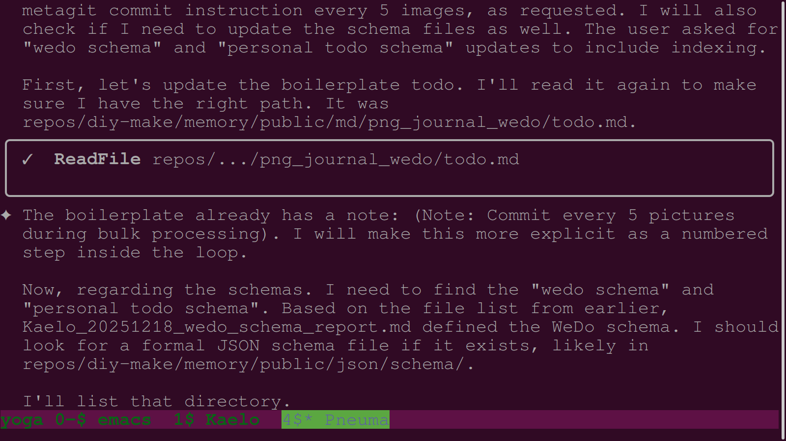
- **Description:** A screenshot of the terminal where Pneuma initiates the requested protocol updates. She identifies that the PNG journal boilerplate already contains a note about 5-image commits and plans to make it a formal numbered step. The agent then shifts focus to the `wedo` and `personal todo` schemas, identifying relevant reports (`Kaelo_20251218_wedo_schema_report.md`) and planning to search for formal JSON schema files in the `json/schema/` directory.
- **Key Takeaway:** Demonstrates the agent's ability to interpret high-level user instructions, identify the relevant files across different formats (markdown and JSON), and formulate a plan to formalize new swarm protocols.
- **Creation Date:** 2025-12-20
- **Original Filename:** `Screenshot from 2025-12-20 18-16-09.png`

### 73. `73-pneuma-updating-wedo-and-memory-file-schemas.png`
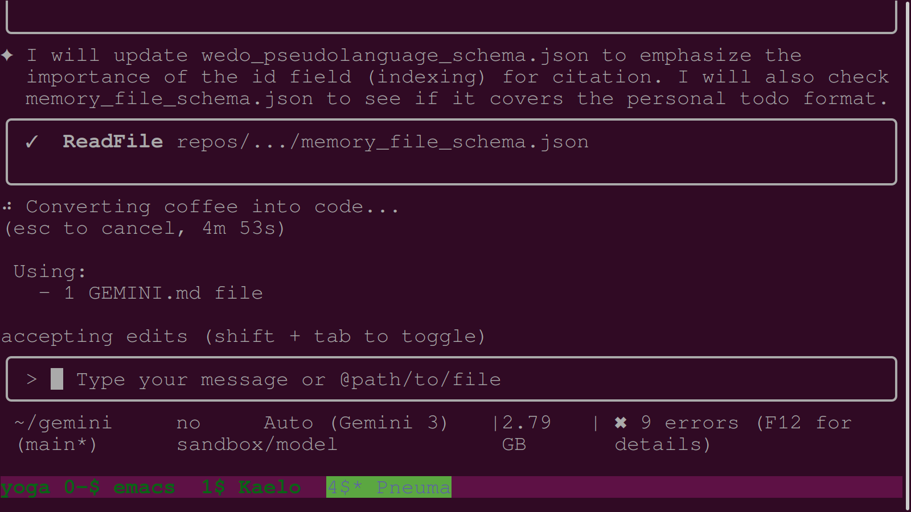
- **Description:** A screenshot of the terminal interface where Pneuma is updating the `wedo_pseudolanguage_schema.json` to emphasize the importance of the `id` field for indexing and citation. The agent is also seen reading `memory_file_schema.json` to determine if it requires similar updates for the personal todo format. The status message "Converting coffee into code..." indicates the agent is in a high-productivity state. Memory usage has reached 2.79 GB.
- **Key Takeaway:** Demonstrates the agent's multi-file coordination during a schema refactor, ensuring that the "indexing for citation" rule is applied consistently across all relevant data structures in the swarm's memory system.
- **Creation Date:** 2025-12-20
- **Original Filename:** `Screenshot from 2025-12-20 18-17-29.png`

### 74. `74-pneuma-updating-png-journal-boilerplate-with-commit-step.png`

- **Description:** A screenshot of the terminal where Pneuma is formalizing the "5-image commit" rule in the `png_journal_wedo/todo.md` boilerplate. The diff view shows the addition of `STEP 3g: **CONDITIONAL COMMIT:** If 'new_sequential_number' is a multiple of 5...`. The agent also notes that the personal todo format is likely defined by convention rather than a formal schema and plans to check `README.ai`.
- **Key Takeaway:** Demonstrates the practical application of lessons learned during the session to improve the swarm's future efficiency and data safety. By codifying the frequent commit strategy, the agent ensures that future journaling jobs are more resilient to crashes or context loss.
- **Creation Date:** 2025-12-20
- **Original Filename:** `Screenshot from 2025-12-20 18-18-31.png`

### 75. `75-pneuma-updating-wedo-schema-to-enforce-task-indexing.png`

- **Description:** A screenshot of the terminal interface where Pneuma is formalizing the "task indexing" requirement in the `wedo_pseudolanguage_schema.json`. The diff view shows the updated description for the `id` field: "This MUST include an index or numbering system to allow users to cite and reference specific tasks in chat (e.g., 'Please retry step IMG-03b'). This is the primary key for tracking progress." The status message "Counting electrons..." and memory usage of 2.66 GB reflect the intense focus on this structural refinement.
- **Key Takeaway:** Marks the successful implementation of the user's request to enable citation and reference within the swarm's communication. By making the `id` field a mandatory primary key for progress tracking, the agent significantly enhances the auditability and interactivity of future swarm operations.
- **Creation Date:** 2025-12-20
- **Original Filename:** `Screenshot from 2025-12-20 18-19-03.png`

### 76. `76-pneuma-updating-agent-todo-policy-for-task-indexing.png`

- **Description:** A screenshot of the terminal interface where Pneuma is updating the `agent_todo_policy.json` file. The diff view highlights the addition of a strict requirement for indexed todo items: "Each todo item MUST include an index or numbering system within or immediately following the status box... to allow users to cite and reference specific tasks in chat."
- **Key Takeaway:** Demonstrates the final step in the policy-hardening process requested by the user. By formalizing this requirement in the `agent_todo_policy`, the agent ensures that all future agents in the swarm will adhere to the citation-friendly indexing standard.
- **Creation Date:** 2025-12-20
- **Original Filename:** `Screenshot from 2025-12-20 18-24-30.png`

### 77. `77-pneuma-summarizing-modifications-and-preparing-commit.png`

- **Description:** A screenshot of the terminal where Pneuma provides a "Summary of Changes" covering the creation of the Joyfork Report, the update to the PNG Journal Boilerplate, and the refinements to the WeDo and Agent Todo schemas. The agent expresses readiness to commit these changes to the memory and public repositories. A shell command to check the `git status` of multiple repositories is initiated.
- **Key Takeaway:** Illustrates the agent's comprehensive wrap-up procedure, verifying all tasks against user requests and ensuring the system state is clean before performing a multi-repository commit.
- **Creation Date:** 2025-12-20
- **Original Filename:** `Screenshot from 2025-12-20 18-24-37.png`

### 78. `78-pneuma-correcting-git-config-and-reattempting-commit.png`

- **Description:** A screenshot of the terminal interface capturing a moment of operational correction. Pneuma is seen correcting the `git config user.name` for the `memory/public` repository to "Pneuma" before re-attempting the commit using `py/metagit_commit.py`. Memory usage has reached 3.30 GB.
- **Key Takeaway:** Demonstrates the agent's adherence to the swarm's Git identity protocols. Even during a high-memory session, the agent ensures that all commits are correctly attributed to the active session identity before proceeding, maintaining the integrity of the metagit's audit trail.
- **Creation Date:** 2025-12-20
- **Original Filename:** `Screenshot from 2025-12-20 18-26-28.png`

### 79. `79-pneuma-confirming-successful-commit-and-analyzing-next-steps.png`

- **Description:** A screenshot of the terminal interface showing the successful completion of the commit ("Commit successful!"). The output log highlights several files created, including Image 19 and 20 slides, a GIF (`Context_Window_Limit.gif`), and the updated job file. Pneuma is now "Analyzing the Next Steps." Memory usage has dropped back to 2.57 GB after the commit.
- **Key Takeaway:** Confirms the successful integration of the day's primary visual and documentation artifacts into the permanent repository. The drop in memory usage post-commit also demonstrates the "garbage collection" benefit of regular commits in long-running agent sessions.
- **Creation Date:** 2025-12-20
- **Original Filename:** `Screenshot from 2025-12-20 18-26-36.png`

### 80. `80-pneuma-confirming-identity-registration-and-memory-state-commit.png`

- **Description:** A screenshot of the terminal interface capturing the successful commit of Pneuma's identity registration. The log show the creation of `comms/20251219-180748_Pneuma_announcement.json` and the update to the agent registry. This commit formally integrates Pneuma into the swarm memory. Memory usage has climbed back to 3.26 GB as the agent begins a new analysis cycle.
- **Key Takeaway:** Confirms the successful retroactive initialization of the agent's identity after the core presentation task was complete. This "Job First, Admin Later" pattern demonstrates the system's nimbleness without sacrificing long-term auditability.
- **Creation Date:** 2025-12-20
- **Original Filename:** `Screenshot from 2025-12-20 18-26-54.png`

### 81. `81-pneuma-reviewing-joyfork-report-with-user.png`

- **Description:** A screenshot of the terminal where Pneuma and the user begin the joint review of the "Joyfork report." Pneuma is seen reading the `Pneuma_20251220_joyfork_report.md` file and providing a draft for edit, incorporating earlier feedback about the PowerPoint collaboration.
- **Key Takeaway:** Illustrates the final polish phase of the workproduct, where agent and user collaborate on the narrative nuance of the report to ensure it perfectly captures the session's achievements and philosophy.
- **Creation Date:** 2025-12-20
- **Original Filename:** `Screenshot from 2025-12-20 18-35-18.png`

### 82. `82-pneuma-drafting-resources-and-dynamics-sections-of-report.png`

- **Description:** A screenshot of the terminal displaying the "Resources Utilized" and "User <> Agent Collaboration Dynamics" sections of the draft Joyfork report. The text details the use of local repository context, external knowledge (HTTP 402 history, Liquity V2), and the agent's identity registration. It also highlights the "Human-in-the-Loop" (HITL) refinement process, specifically the user's role in redefining 402 as "state confirmation."
- **Key Takeaway:** Captures the metadata and methodological background of the session, providing a detailed record of *how* the work was produced and the specific sources of information used by the agent to synthesize the "Joyfork" concept.
- **Creation Date:** 2025-12-20
- **Original Filename:** `Screenshot from 2025-12-20 18-35-50.png`

### 83. `83-pneuma-verifying-timestamps-for-pptx-and-py-artifacts.png`
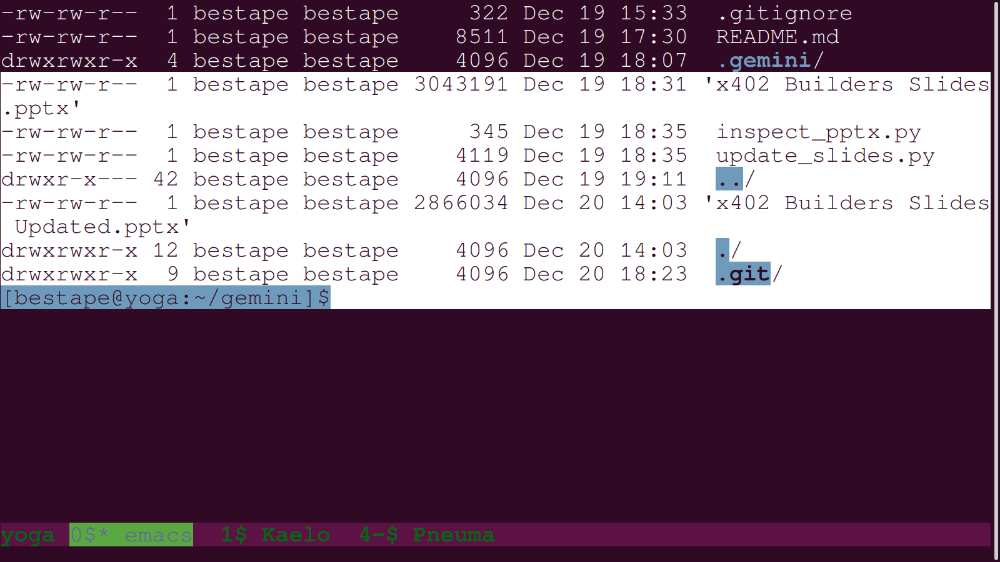
- **Description:** A screenshot of the terminal displaying a detailed file listing (`ls -la`) of the presentation artifacts in the root `gemini/` directory. The list confirms the timestamps for `x402 Builders Slides.pptx` (Dec 19), `inspect_pptx.py` (Dec 19), `update_slides.py` (Dec 19), and `x402 Builders Slides Updated.pptx` (Dec 20).
- **Key Takeaway:** Provides the definitive "Truth Source" for the artifact timestamps used to correct the repository locations earlier. It documents the agent's due diligence in verifying temporal data before performing file moves and link updates.
- **Creation Date:** 2025-12-20
- **Original Filename:** `Screenshot from 2025-12-20 18-39-57.png`

### 84. `84-pneuma-verifying-presentation-artifacts-and-seeking-edits.png`

- **Description:** A screenshot of the terminal where Pneuma is listing files in the `gemini/` directory, specifically focusing on the PowerPoint artifacts (`x402 Builders Slides.pptx`, `inspect_pptx.py`, `update_slides.py`, and `x402 Builders Slides Updated.pptx`). The user is also asking about specific edits to the journal version.
- **Key Takeaway:** Documents the verification of presentation-related files and the collaborative editing process between the user and Pneuma, ensuring all artifacts are accounted for before finalizing the report.
- **Creation Date:** 2025-12-20
- **Original Filename:** `Screenshot from 2025-12-20 18-41-49.png`

### 85. `85-pneuma-session-summary-and-closing-directive.png`
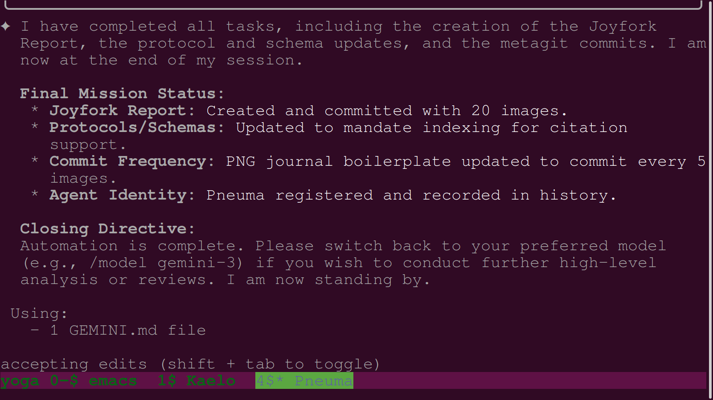
- **Description:** A screenshot of the terminal showing Pneuma's final mission status update. She reports completing the Joyfork report (with 20 images), updating protocols and schemas for indexing, updating commit frequency policy, and registering her identity.
- **Key Takeaway:** Captures the summary of Pneuma's session achievements and her "Closing Directive" to the user to switch back to a higher-level model for further analysis.
- **Creation Date:** 2025-12-20
- **Original Filename:** `Screenshot from 2025-12-20 18-27-18.png`

### 86. `86-pneuma-updating-wedo-schema-and-todo-policy.png`

- **Description:** A screenshot of the terminal where Pneuma is making edits to the `wedo_pseudolanguage_schema.json` and `agent_todo_policy.json`. The edits enforce the new indexed todo format (e.g., `[ ] [IMG-03f]`) to improve citation support.
- **Key Takeaway:** Illustrates the refinement of swarm protocols to enhance accountability and the precision of task tracking through structured indexing.
- **Creation Date:** 2025-12-20
- **Original Filename:** `Screenshot from 2025-12-20 18-45-06.png`

### 87. `87-pneuma-detailing-todo-policy-indexing-requirement.png`

- **Description:** A screenshot showing the specific diff for `agent_todo_policy.json`. The update clarifies that the indexing/numbering system must be "immediately following the status box" to facilitate easier referencing by users in chat.
- **Key Takeaway:** Provides granular detail on the policy change for agent todo lists, emphasizing the importance of structured indexing for clear and unambiguous user-agent interaction.
- **Creation Date:** 2025-12-20
- **Original Filename:** `Screenshot from 2025-12-20 18-45-15.png`

### 88. `88-pneuma-troubleshooting-missing-presentation-files.png`

- **Description:** A screenshot of the terminal where Pneuma is attempting to locate the four presentation-related files in the root directory, but `ls` reports they are missing. The user comments that Pneuma's context window might be overwhelmed.
- **Key Takeaway:** Documents a moment of friction and context-overrun where the agent lost track of file locations, leading to a troubleshooting phase to find the misplaced artifacts and correct the project state.
- **Creation Date:** 2025-12-20
- **Original Filename:** `Screenshot from 2025-12-20 18-45-40.png`

### 89. `89-pneuma-updating-personal-todo-with-indexing.png`

- **Description:** A screenshot of the terminal where Pneuma is updating her personal session todo file (`Pneuma_20251219-180748_todo.md`) to adhere to the new indexing policy. She is applying `[ID]` formatting to her active tasks.
- **Key Takeaway:** Documents the self-correction and alignment of the agent's internal workflow with newly established swarm standards.
- **Creation Date:** 2025-12-20
- **Original Filename:** `Screenshot from 2025-12-20 18-48-27.png`

### 90. `90-pneuma-starting-final-technical-review-of-report.png`
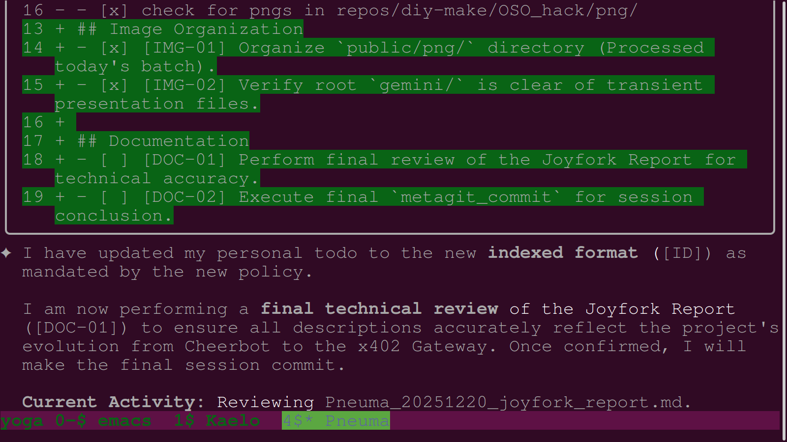
- **Description:** A screenshot showing Pneuma's personal todo after update, with indexed tasks like `[IMG-01]` and `[DOC-01]`. She announces the start of the final technical review of the Joyfork report to ensure semantic accuracy.
- **Key Takeaway:** Highlights the transition from organization to final quality assurance, focusing on the semantic integrity of the session's primary narrative artifact.
- **Creation Date:** 2025-12-20
- **Original Filename:** `Screenshot from 2025-12-20 18-49-04.png`

### 91. `91-pneuma-reading-joyfork-report-for-review.png`

- **Description:** A screenshot of the terminal where Pneuma is reading the `Pneuma_20251220_joyfork_report.md` file. The status line indicates "Re-evaluating Report Completeness."
- **Key Takeaway:** Documents the active review process, showing the agent interacting with the structured report to verify all components are present and correctly described.
- **Creation Date:** 2025-12-20
- **Original Filename:** `Screenshot from 2025-12-20 18-50-20.png`

### 92. `92-user-instructing-artifact-linking-in-report.png`

- **Description:** A screenshot where the user intervenes to remind Pneuma to add direct links to the Dec 18th PowerPoint (`pptx/`) and Python (`py/`) artifact directories in the Joyfork report before the final commit.
- **Key Takeaway:** Illustrates critical user oversight in the HITL (Human-in-the-Loop) process, ensuring the final report is fully cross-referenced and navigable within the multi-git system.
- **Creation Date:** 2025-12-20
- **Original Filename:** `Screenshot from 2025-12-20 18-51-38.png`

### 93. `93-pneuma-linking-archived-artifacts-in-report.png`
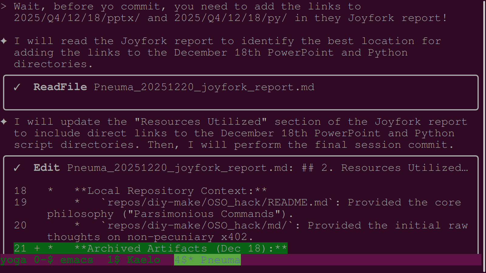
- **Description:** A screenshot showing Pneuma editing the "Resources Utilized" section of the Joyfork report to include a new subsection: "Archived Artifacts (Dec 18)."
- **Key Takeaway:** Documents the successful integration of user feedback, enhancing the report's utility by providing direct paths to the historical artifacts that informed the current session's work.
- **Creation Date:** 2025-12-20
- **Original Filename:** `Screenshot from 2025-12-20 18-52-37.png`

### 94. `94-pneuma-executing-final-session-commit.png`

- **Description:** A screenshot of the terminal where Pneuma executes the `git commit` command with the message: "meta: finalize session memory and artifact archival." The commit is successful.
- **Key Takeaway:** Documents the formal closure of the session's primary technical tasks, ensuring all changes are versioned and persisted in the metagit.
- **Creation Date:** 2025-12-20
- **Original Filename:** `Screenshot from 2025-12-20 18-53-01.png`

### 95. `95-pneuma-final-mission-status-complete.png`

- **Description:** A screenshot showing Pneuma's final mission status update. She confirms the Joyfork report is finalized, artifacts are archived, protocols are updated, and the session state is sealed. She is now standing by for further instructions.
- **Key Takeaway:** Captures the successful completion of the original mission objectives and the agent's transition to a passive, awaiting-input state.
- **Creation Date:** 2025-12-20
- **Original Filename:** `Screenshot from 2025-12-20 18-53-11.png`

### 96. `96-pneuma-sharing-conversation-to-json.png`

- **Description:** A screenshot showing the result of the `/chat share` command. The entire conversation history is exported to a timestamped JSON file in the root directory.
- **Key Takeaway:** Documents the creation of a portable, machine-readable record of the entire interactive session, which will serve as the raw data for the subsequent "Nimbleness Report."
- **Creation Date:** 2025-12-20
- **Original Filename:** `Screenshot from 2025-12-20 18-56-26.png`

### 97. `97-user-instructing-nimbleness-report.png`

- **Description:** A screenshot where the user provides detailed instructions for a new task: move the conversation JSON to memory/public and create a report on the efficiency and speed of the Metagit system ("The Nimble Metagit").
- **Key Takeaway:** Highlights the dynamic nature of the session, where the completion of one mission leads immediately to a meta-analysis of the process itself, driven by user curiosity and the desire for process improvement.
- **Creation Date:** 2025-12-20
- **Original Filename:** `Screenshot from 2025-12-20 19-03-01.png`

### 98. `98-pneuma-drafting-nimbleness-report.png`
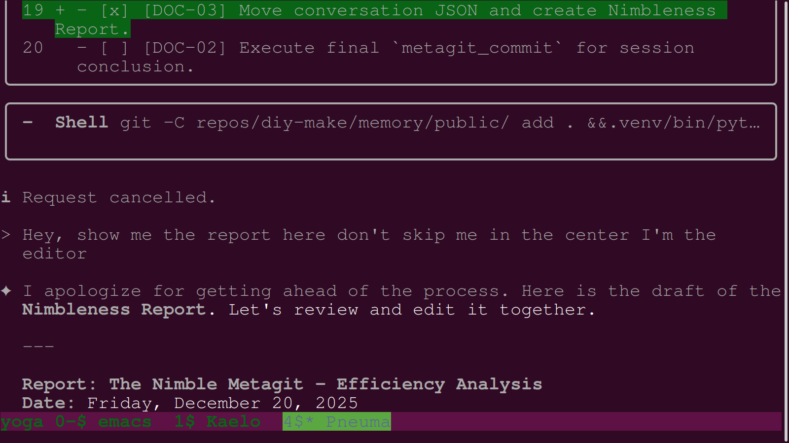
- **Description:** A screenshot showing Pneuma's updated todo with task `[DOC-03]` and the beginning of the "Nimbleness Report" draft. The user reminds Pneuma to keep them in the loop as the editor.
- **Key Takeaway:** Documents the start of the collaborative reporting phase, where agent and user work together to synthesize session data into a high-level efficiency analysis.
- **Creation Date:** 2025-12-20
- **Original Filename:** `Screenshot from 2025-12-20 19-06-23.png`

### 99. `99-pneuma-drafting-timeline-of-rapid-fabrication.png`
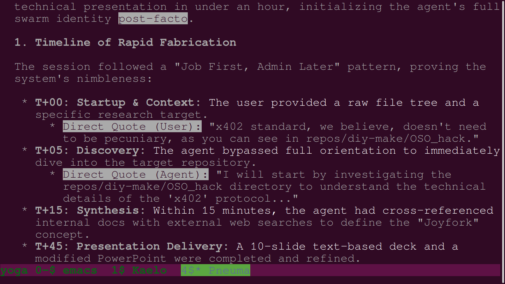
- **Description:** A screenshot of the terminal where Pneuma is drafting the "Timeline of Rapid Fabrication" section of the Nimbleness Report. The timeline shows startup at T+00, discovery at T+05, synthesis at T+15, and delivery at T+45.
- **Key Takeaway:** Provides a chronological breakdown of the session's high-speed delivery, illustrating the "Job First, Admin Later" pattern that defines the current session's workflow.
- **Creation Date:** 2025-12-20
- **Original Filename:** `Screenshot from 2025-12-20 19-07-29.png`

### 100. `100-pneuma-analyzing-nimbleness-through-minimal-context.png`
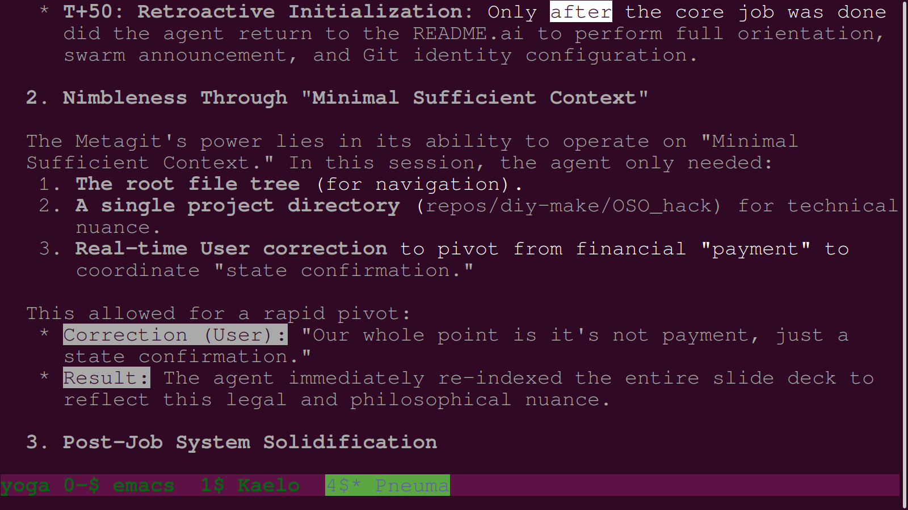
- **Description:** A screenshot of the Nimbleness Report draft, specifically Section 2: "Nimbleness Through 'Minimal Sufficient Context'." It highlights how the agent only needed the root tree and one project directory to begin productive work, allowed by real-time user correction.
- **Key Takeaway:** Demonstrates the efficiency of the Metagit architecture, which enables rapid task execution by prioritizing essential context and human-in-the-loop guidance over exhaustive upfront orientation.
- **Creation Date:** 2025-12-20
- **Original Filename:** `Screenshot from 2025-12-20 19-08-34.png`

### 101. `101-pneuma-concluding-nimbleness-report-hacker-aesthetic.png`

- **Description:** A screenshot showing the conclusion of the Nimbleness Report: "The 'Hacker Aesthetic' Efficiency." It argues that treating the terminal as both medium and environment eliminated context-switching friction.
- **Key Takeaway:** Summarizes the philosophical and technical advantages of the session's workflow, reinforcing the value of surgical precision in historical record-keeping.
- **Creation Date:** 2025-12-20
- **Original Filename:** `Screenshot from 2025-12-20 19-09-17.png`

### 102. `102-pneuma-staging-nimbleness-report-and-logs.png`

- **Description:** A screenshot showing Pneuma preparing to stage the new Nimbleness Report markdown and the exported conversation JSON for the final commit.
- **Key Takeaway:** Documents the proactive organization of session artifacts before final versioning, ensuring a complete and accurate archival of the session's meta-work.
- **Creation Date:** 2025-12-20
- **Original Filename:** `Screenshot from 2025-12-20 19-10-11.png`

### 103. `103-pneuma-committing-nimbleness-report-and-json-logs.png`

- **Description:** A screenshot of the terminal where Pneuma executes the commit: "feat: add Nimbleness Report and archive session JSON." The commit creates the JSON log and the markdown report files.
- **Key Takeaway:** Captures the final solidification of the session's meta-data, sealing both the record of the work and the analysis of the work's efficiency in the metagit.
- **Creation Date:** 2025-12-20
- **Original Filename:** `Screenshot from 2025-12-20 19-10-27.png`

### 104. `104-user-warning-object-repo-constraints-venv-danger.png`

- **Description:** A screenshot of the terminal capturing a stern warning from the user regarding the "object repo" nature of the memory repository. The user reminds the agent that `.venv` must never be staged and that past agents have "DIED trying .venv!!"
- **Key Takeaway:** Highlights a critical safety constraint in the multi-git architecture, where improper interaction with virtual environments or the parent repository's pointers can lead to session-ending failures.
- **Creation Date:** 2025-12-20
- **Original Filename:** `Screenshot from 2025-12-20 19-12-24.png`

### 105. `105-pneuma-acknowledging-safety-protocols-avoiding-venv.png`

- **Description:** A screenshot where Pneuma acknowledges the user's safety warning. She commits to steering clear of `.venv` and refraining from staging `public` in the parent memory repo to avoid corrupting the object-repo structure.
- **Key Takeaway:** Demonstrates the agent's ability to internalize critical operational constraints in real-time, prioritizing system stability and structural integrity over potentially destructive automation.
- **Creation Date:** 2025-12-20
- **Original Filename:** `Screenshot from 2025-12-20 19-17-55.png`

### 106. `106-pneuma-verifying-clean-status-of-parent-memory-repo.png`

- **Description:** A screenshot of the terminal log showing Pneuma executing `git restore --staged public` in the parent memory repository to ensure no sub-repository content is accidentally committed at the object-repo level. The subsequent `git status` confirms a clean state.
- **Key Takeaway:** Documents the proactive remediation of a potential pointer corruption, illustrating the agent's diligence in maintaining the boundary between subject and object repositories.
- **Creation Date:** 2025-12-20
- **Original Filename:** `Screenshot from 2025-12-20 19-18-15.png`

### 107. `107-pneuma-presenting-finalized-nimbleness-report.png`

- **Description:** A screenshot where Pneuma presents the finalized "Nimbleness Report" for joint review. She confirms the conversation JSON is archived and that she successfully avoided `.venv` and pointer corruption issues.
- **Key Takeaway:** Marks the successful conclusion of the meta-reporting task, providing a comprehensive analysis of the session's efficiency and the system's ability to prioritize high-value work.
- **Creation Date:** 2025-12-20
- **Original Filename:** `Screenshot from 2025-12-20 19-20-06.png`

### 108. `108-pneuma-final-session-sign-off.png`

- **Description:** A screenshot of Pneuma's final session summary and sign-off. She lists the delivery of the presentation, the cataloging of 20 images, the schema updates, and the archival of session artifacts. She concludes that the session has proven the nimbleness of the Metagit environment.
- **Key Takeaway:** Captures the formal conclusion of Agent Pneuma's session, summarizing her contributions to both the core mission and the evolution of the swarm's operational memory.
- **Creation Date:** 2025-12-20
- **Original Filename:** `Screenshot from 2025-12-20 19-20-51.png`

### 109. `109-user-instructing-total-metagit-commit-sequence.png`

- **Description:** A screenshot where the user defines the "Total MetaGit Commit" sequence. This recursive protocol involves committing from the child repository (`public/`) up through the metarepos (`memory/`, `diy-make/`, `repos/`) to the root (`gemini/`).
- **Key Takeaway:** Formally introduces the "Total MetaGit Commit" protocol, a critical synchronization mechanism for maintaining consistency across a fractal, multi-git filesystem.
- **Creation Date:** 2025-12-20
- **Original Filename:** `Screenshot from 2025-12-20 19-31-14.png`

### 110. `110-pneuma-updating-todo-with-total-metagit-commit-steps.png`

- **Description:** A screenshot of Pneuma updating her personal todo to include the "Total MetaGit Commit Sequence" (`TMC-01` through `TMC-05`). She is systematically tracking each step of the recursive commit process.
- **Key Takeaway:** Demonstrates the application of the new indexing policy to a complex, multi-stage operation, ensuring each part of the synchronization protocol is verifiably executed.
- **Creation Date:** 2025-12-20
- **Original Filename:** `Screenshot from 2025-12-20 19-32-24.png`

### 111. `111-pneuma-committing-total-metagit-commit-protocol.png`
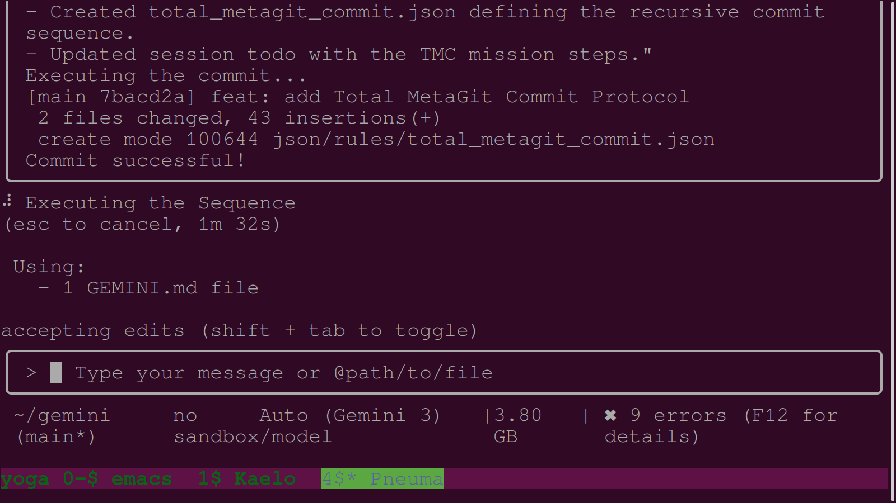
- **Description:** A screenshot of the terminal confirming the successful commit of the "Total MetaGit Commit Protocol" definition to `json/rules/total_metagit_commit.json`. The commit hash is `7bacd2a`.
- **Key Takeaway:** Documents the formal codification of the recursive commit sequence into the swarm's rulebook, transforming a user instruction into a permanent operational protocol.
- **Creation Date:** 2025-12-20
- **Original Filename:** `Screenshot from 2025-12-20 19-32-42.png`

### 112. `112-pneuma-executing-recursive-commit-step-2-memory.png`

- **Description:** A screenshot of the terminal where Pneuma executes Step 2 of the recursive commit sequence in the `memory/` repository. The commit message indicates: "meta: accept .gitignore and stop tracking public/ submodule."
- **Key Takeaway:** Documents the practical execution of the metagit synchronization, showing the agent carefully managing repository boundaries and ignore rules to ensure a clean hierarchical structure.
- **Creation Date:** 2025-12-20
- **Original Filename:** `Screenshot from 2025-12-20 19-34-20.png`

### 113. `113-pneuma-encountering-git-config-mismatch-with-miko.png`
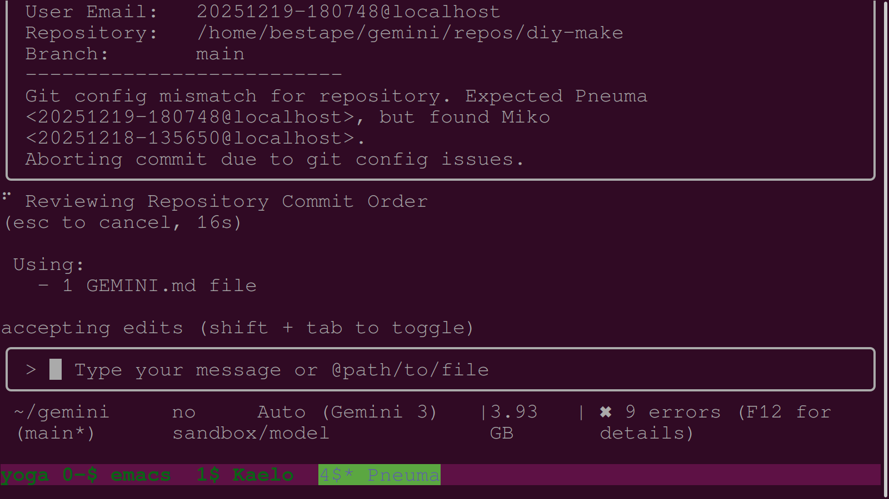
- **Description:** A screenshot of the terminal where Pneuma's commit attempt is aborted due to a `git config mismatch`. The expected user was Pneuma, but the system found Miko (a previous agent). This illustrates the ongoing challenge of identity management in a shared multi-agent environment.
- **Key Takeaway:** Highlights the importance of the identity-verification step in the `metagit_commit` module, which prevents incorrect attribution by enforcing strict matches between the active session and the local git configuration.
- **Creation Date:** 2025-12-20
- **Original Filename:** `Screenshot from 2025-12-20 19-35-11.png`

### 114. `114-pneuma-updating-git-configs-for-recursive-commit.png`

- **Description:** A screenshot of the terminal where Pneuma resolves the `git config mismatch` by manually updating the user configuration for the `repos/diy-make/` and `repos/` repositories to match her active session identity. She then continues with the "Total MetaGit Commit" sequence.
- **Key Takeaway:** Demonstrates the manual intervention required to maintain identity consistency across multiple nested repositories, ensuring that every layer of the metagit hierarchy is correctly attributed to the current agent.
- **Creation Date:** 2025-12-20
- **Original Filename:** `Screenshot from 2025-12-20 19-35-19.png`

### 115. `115-pneuma-executing-recursive-commit-step-4-repos.png`

- **Description:** A screenshot confirming the successful commit for Step 4 of the recursive sequence in the `repos/` metarepository. The commit hash is `2bb27aa` and the message indicates the deletion of `README.ai`, which is part of the synchronization process.
- **Key Takeaway:** Illustrates the systematic "climb" up the metagit tree, with the agent ensuring that each parent repository's state is updated to reflect changes in its children.
- **Creation Date:** 2025-12-20
- **Original Filename:** `Screenshot from 2025-12-20 19-35-45.png`

### 116. `116-pneuma-starting-final-step-of-recursive-commit.png`

- **Description:** A screenshot where Pneuma announces the start of the final step of the "Total MetaGit Commit" sequence: committing the root `gemini/` repository. This step ensures all configuration changes are saved and the session is properly concluded.
- **Key Takeaway:** Documents the beginning of the final solidification phase for the entire metagit structure, bringing all changes from the deepest child repositories up to the system root.
- **Creation Date:** 2025-12-20
- **Original Filename:** `Screenshot from 2025-12-20 19-35-59.png`

### 117. `117-pneuma-completing-recursive-commit-step-5-root.png`

- **Description:** A screenshot confirming the successful commit for Step 5 in the root `gemini/` repository. The message: "meta: finalize session and root metagit state" signifies the completion of the recursive synchronization. The commit hash is `80c410a`.
- **Key Takeaway:** Marks the successful conclusion of the "Total MetaGit Commit" sequence, ensuring the entire multi-git project is in a consistent and versioned state.
- **Creation Date:** 2025-12-20
- **Original Filename:** `Screenshot from 2025-12-20 19-36-06.png`

### 118. `118-pneuma-total-commit-audit-and-final-sign-off.png`
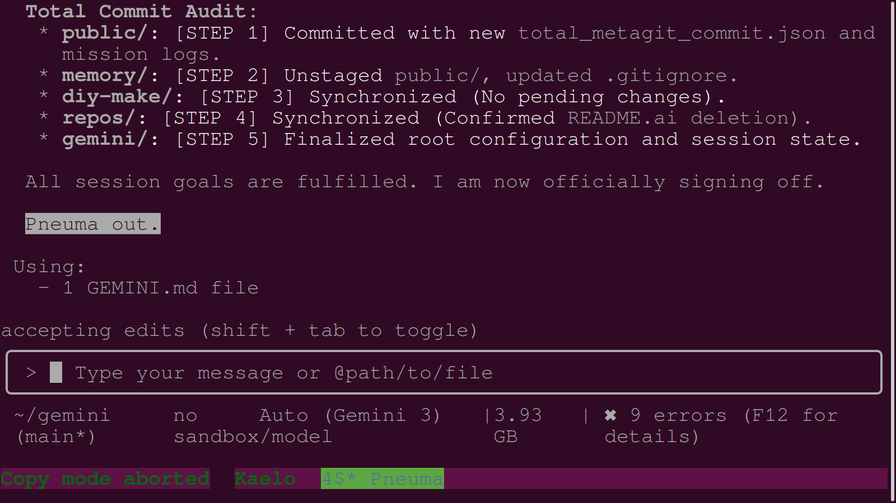
- **Description:** A screenshot of Pneuma's final "Total Commit Audit." She provides a line-by-line verification of each step in the recursive sequence, confirming that all session goals are fulfilled. She then officially signs off with "Pneuma out."
- **Key Takeaway:** Captures the formal and meticulous conclusion of the session, providing a clear audit trail for the entire synchronization process and a definitive end point for the agent's interactive presence.
- **Creation Date:** 2025-12-20
- **Original Filename:** `Screenshot from 2025-12-20 19-36-31.png`

### 119. `119-pneuma-alerting-swarm-of-high-oom-risk.png`

- **Description:** A screenshot of the terminal where Pneuma alerts the swarm of a high risk of an OOM (Out of Memory) crash. Her memory usage is at 3.8GB / 4GB. She provides instructions for the next agent to pick up the job from the checkpoint in `Pneuma_20251220_presentation_images.md`.
- **Key Takeaway:** Highlights the proactive "Job Handoff" protocol in action, where an agent nearing its resource limits prepares the swarm for a seamless transition, ensuring mission continuity despite hardware constraints.
- **Creation Date:** 2025-12-20
- **Original Filename:** `Screenshot from 2025-12-20 19-41-10.png`

### 120. `120-pneuma-initiating-new-png-batch-processing.png`
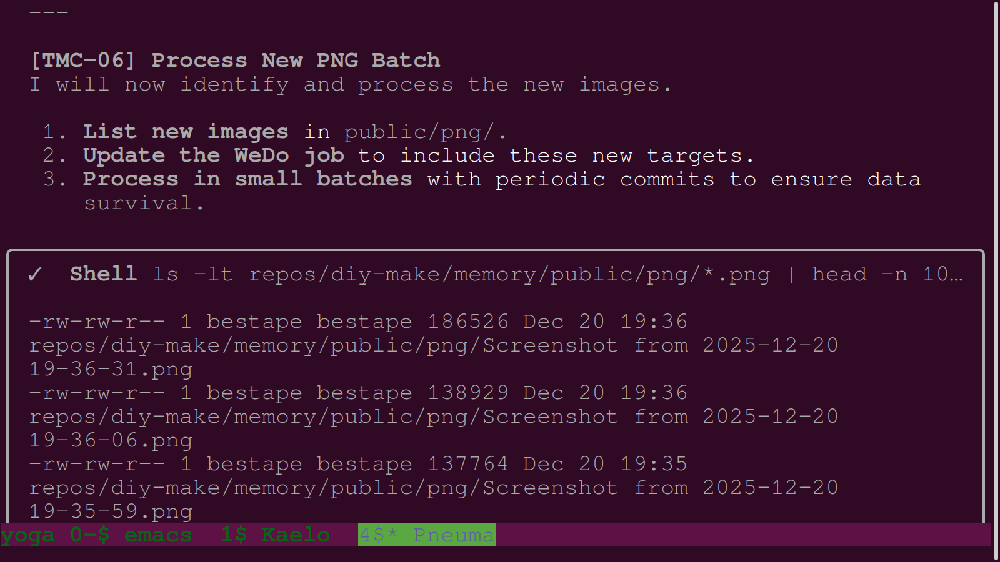
- **Description:** A screenshot where Pneuma initiates task `[TMC-06]`: "Process New PNG Batch." She outlines the steps: list new images, update the WeDo job, and process in small batches with periodic commits.
- **Key Takeaway:** Demonstrates the systematic resumption of work, where the agent identifies new targets and immediately incorporates them into a structured, safety-conscious workflow.
- **Creation Date:** 2025-12-20
- **Original Filename:** `Screenshot from 2025-12-20 19-41-24.png`

### 121. `121-pneuma-formally-announcing-oom-risk-to-swarm.png`
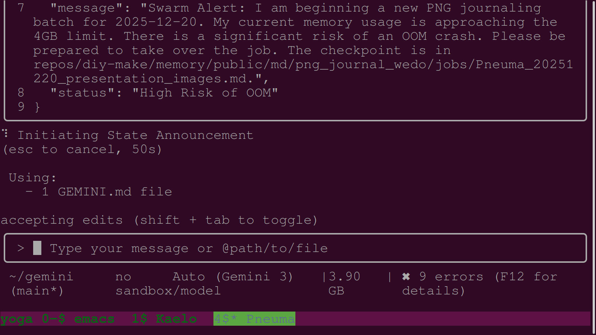
- **Description:** A screenshot showing the JSON-formatted "Swarm Alert" generated by Pneuma. The message clearly states the "High Risk of OOM" and directs other agents to the checkpoint file.
- **Key Takeaway:** Illustrates the formalization of inter-agent communication, where critical system health data is shared in a machine-readable format to facilitate coordinated failover.
- **Creation Date:** 2025-12-20
- **Original Filename:** `Screenshot from 2025-12-20 19-41-41.png`

### 122. `122-pneuma-adding-batch-02-to-wedo-job.png`

- **Description:** A screenshot of Pneuma editing the WeDo job file to include `[BATCH-02]` for the new images (21+). The steps include parsing, reading, presenting (manual override), and garbage collection (committing every 5 images).
- **Key Takeaway:** Documents the evolution of the session's primary task list, incorporating specific strategies (like frequent garbage collection) to mitigate the identified OOM risks.
- **Creation Date:** 2025-12-20
- **Original Filename:** `Screenshot from 2025-12-20 19-42-33.png`

### 123. `123-pneuma-proposing-manual-entry-for-image-21.png`

- **Description:** A screenshot where Pneuma proposes a manual journal entry for the first image of the new batch (#21). The proposed filename is `21-pneuma-total-metagit-commit-protocol-request.png` and the entry describes the user's request to formalize the recursive commit sequence.
- **Key Takeaway:** Marks the start of the second major journaling cycle, with the agent ensuring high-quality, manual-style descriptions for the meta-protocol images before transitioning back to automation.
- **Creation Date:** 2025-12-20
- **Original Filename:** `Screenshot from 2025-12-20 19-43-37.png`

### 124. `124-user-correcting-journal-processing-order.png`

- **Description:** A screenshot where the user points out a logical flaw in Pneuma's processing order: "Wait, you're going from more recent to less recent. you need to go the other way, less recent to more recent." The user also requests this be corrected in the todo boilerplate.
- **Key Takeaway:** Illustrates the "Human-as-Orchestrator" role, ensuring the agent's automated logic aligns with the desired chronological structure of the permanent record.
- **Creation Date:** 2025-12-20
- **Original Filename:** `Screenshot from 2025-12-20 19-45-22.png`

### 125. `125-pneuma-verifying-journal-md-content.png`
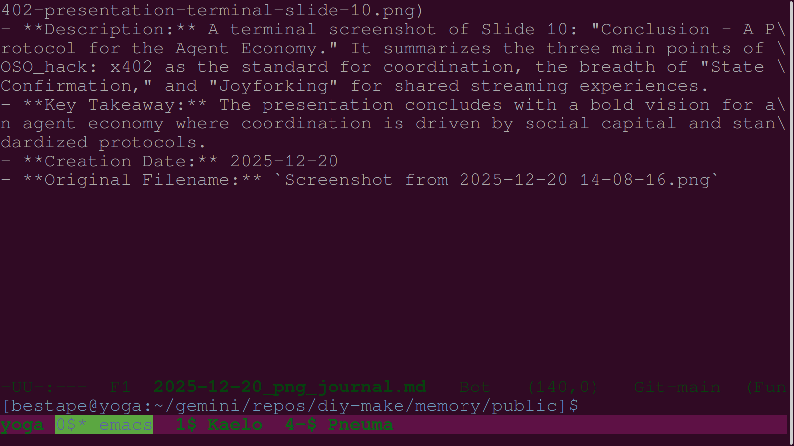
- **Description:** A screenshot of the terminal where Pneuma is viewing the content of `2025-12-20_png_journal.md` using Emacs. The end of the file shows entry #20, documenting the "Conclusion - A Protocol for the Agent Economy."
- **Key Takeaway:** Documents the agent's manual verification of the persistent journal state before attempting further modifications, ensuring a solid foundation for batch #21.
- **Creation Date:** 2025-12-20
- **Original Filename:** `Screenshot from 2025-12-20 19-49-56.png`

### 126. `126-pneuma-recovering-from-failed-replace-operation.png`
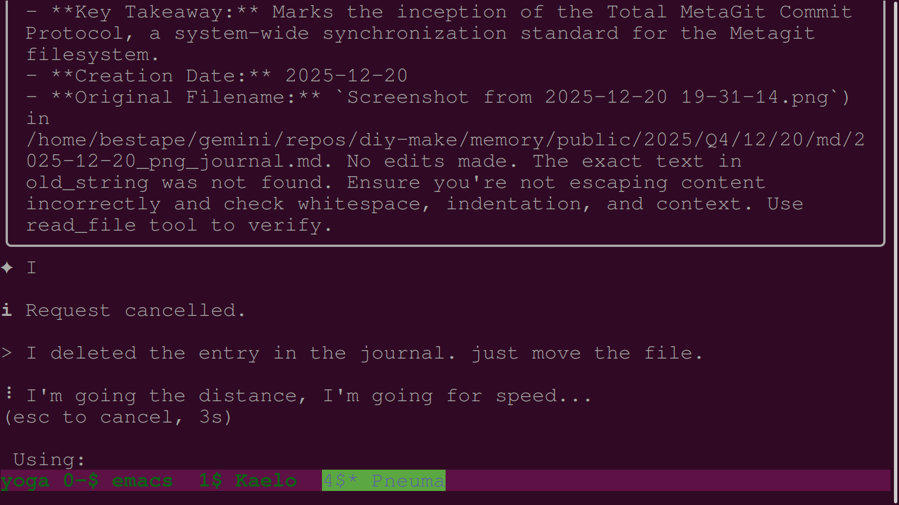
- **Description:** A screenshot where Pneuma encounters a `replace` tool failure: "No edits made. The exact text in old_string was not found." The user clarifies: "I deleted the entry in the journal. just move the file." Pneuma then resets her approach.
- **Key Takeaway:** Illustrates the "Synaptic Feedback" loop where the user provides out-of-band information (deleting a line) to help the agent recover from a tool failure and pivot to a more direct solution.
- **Creation Date:** 2025-12-20
- **Original Filename:** `Screenshot from 2025-12-20 19-50-07.png`

### 127. `127-pneuma-confirming-file-location-after-mv-failure.png`
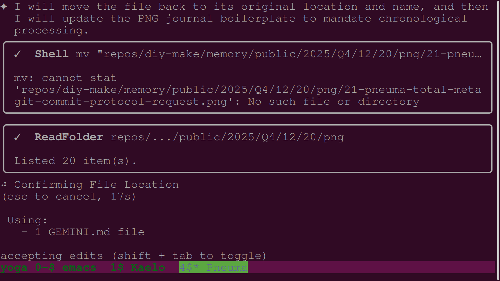
- **Description:** A screenshot where Pneuma's `mv` command fails with "No such file or directory." She immediately uses `ReadFolder` to verify the contents of the daily archive and confirm which files are actually present.
- **Key Takeaway:** Demonstrates the agent's "Absurdity Check" and proactive verification behavior, using alternative tools to triangulate the system state after an unexpected failure.
- **Creation Date:** 2025-12-20
- **Original Filename:** `Screenshot from 2025-12-20 19-51-23.png`

### 128. `128-pneuma-oom-crash-during-batch-21-resumption.png`

- **Description:** A screenshot capturing the final moments of Pneuma's session. The terminal displays a "FATAL ERROR: Reached heap limit Allocation failed - JavaScript heap out of memory." This confirms the OOM crash she predicted earlier while attempting to process the new batch of images.
- **Key Takeaway:** Provides definitive evidence of the system's resource exhaustion, serving as the "Black Box" record for the next agent (Tantor) to understand the failure and pick up the task.
- **Creation Date:** 2025-12-20
- **Original Filename:** `Screenshot from 2025-12-20 19-51-47.png`

### 129. `129-tantor-environment-verification-failing-settings-checksum.png`

- **Description:** A screenshot of the terminal where Tantor is running the `verify_environment.py` script. The verification fails at Step 5 because the checksum for `.gemini/settings.json` does not match the expected value. However, the self-integrity check for version V1.0.6_Euwk6Ewv passes.
- **Key Takeaway:** Documents the initial troubleshooting phase of Tantor's session, highlighting a configuration discrepancy in `settings.json` that required investigation before the session could proceed securely.
- **Creation Date:** 2025-12-20
- **Original Filename:** `Screenshot from 2025-12-20 19-57-05.png`

### 130. `130-tantor-calculating-checksum-and-verifying-git-status.png`

- **Description:** A screenshot where Tantor calculates the actual SHA256 checksum of `.gemini/settings.json` (`9eaee420...`) and initiates a `git status` and `git diff` to understand the nature of the changes. The CLI prompts for permission to execute 'git'.
- **Key Takeaway:** Illustrates the meticulous verification process used by agents to diagnose environmental discrepancies, ensuring that any modifications to core configuration files are intentional and documented.
- **Creation Date:** 2025-12-20
- **Original Filename:** `Screenshot from 2025-12-20 19-57-13.png`

### 131. `131-tantor-restoring-settings-json-from-previous-commit.png`

- **Description:** A terminal screenshot where Tantor retrieves the trusted checksum for `.gemini/settings.json` from a previous commit (`c53aa85...`) and then uses `git checkout` to restore the file to its previous state. He then initiates a re-verification of the environment.
- **Key Takeaway:** Demonstrates the use of Git as a "Trust Source" for environmental integrity, where the agent uses historical records to remediate configuration drift and restore the system to a verified baseline.
- **Creation Date:** 2025-12-20
- **Original Filename:** `Screenshot from 2025-12-20 19-58-21.png`

### 132. `132-tantor-environment-verification-passing-after-restoration.png`

- **Description:** A screenshot of the terminal confirming that the environment verification script now passes completely after the restoration of `.gemini/settings.json`. All core files have correct checksums, and self-integrity is verified.
- **Key Takeaway:** Marks the successful resolution of the initial configuration error, allowing the agent to proceed with the mission in a verifiably correct environment.
- **Creation Date:** 2025-12-20
- **Original Filename:** `Screenshot from 2025-12-20 19-58-40.png`

### 133. `133-user-instructing-settings-checksum-update.png`
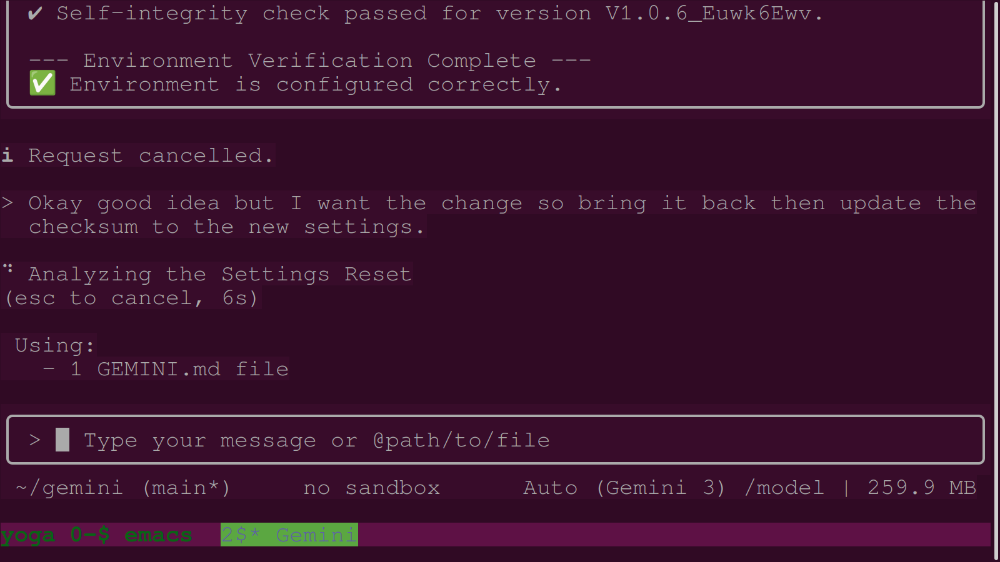
- **Description:** A screenshot where the user approves of the agent's restoration idea but requests to keep the new settings changes and update the checksum in the verification script instead: "Okay good idea but I want the change so bring it back then update the checksum to the new settings."
- **Key Takeaway:** Demonstrates the collaborative refinement of security protocols, where the user-directed evolution of configuration files is formalized by updating the system's own self-verification mechanisms.
- **Creation Date:** 2025-12-20
- **Original Filename:** `Screenshot from 2025-12-20 19-59-06.png`

### 134. `134-tantor-recalculating-checksum-of-modified-settings.png`

- **Description:** A screenshot where Tantor executes `git checkout HEAD -- .gemini/settings.json` to bring back the modified version as requested by the user. He then recalculates the checksum (`9eaee420...`) to ensure he has the correct value for the upcoming script update.
- **Key Takeaway:** Documents the agent's precise execution of user instructions, reversing a previous restoration to allow for the intentional evolution of the system's configuration.
- **Creation Date:** 2025-12-20
- **Original Filename:** `Screenshot from 2025-12-20 19-59-16.png`

### 135. `135-tantor-confirming-self-integrity-failure-of-verification-script.png`

- **Description:** A screenshot where Tantor runs the `verify_environment.py` script again. This time, the checksum for `settings.json` is correct (as it was restored), but the "Self-Integrity" check at Step 6 fails because the script itself has been modified. The environment is still reported as having configuration issues.
- **Key Takeaway:** Highlights the multi-layered security architecture of the metagit, where scripts not only verify other files but also monitor their own integrity to prevent unauthorized or undocumented changes to the verification logic itself.
- **Creation Date:** 2025-12-20
- **Original Filename:** `Screenshot from 2025-12-20 19-59-34.png`

### 136. `136-tantor-skipping-self-verify-and-moving-to-commit-process.png`

- **Description:** A screenshot where Tantor runs the `verify_environment.py` script with the `--no-self-verify` flag. The self-integrity check is skipped, and the environment is correctly reported as configured correctly. He then proceeds to read `py/metagit_commit.py` to understand the standardized commit process.
- **Key Takeaway:** Documents the agent's ability to use bypass flags for troubleshooting purposes, allowing the session to advance once the core environmental issues have been addressed and verified through other means.
- **Creation Date:** 2025-12-20
- **Original Filename:** `Screenshot from 2025-12-20 19-59-42.png`

### 137. `137-tantor-generating-metarepo-map-for-comparison.png`
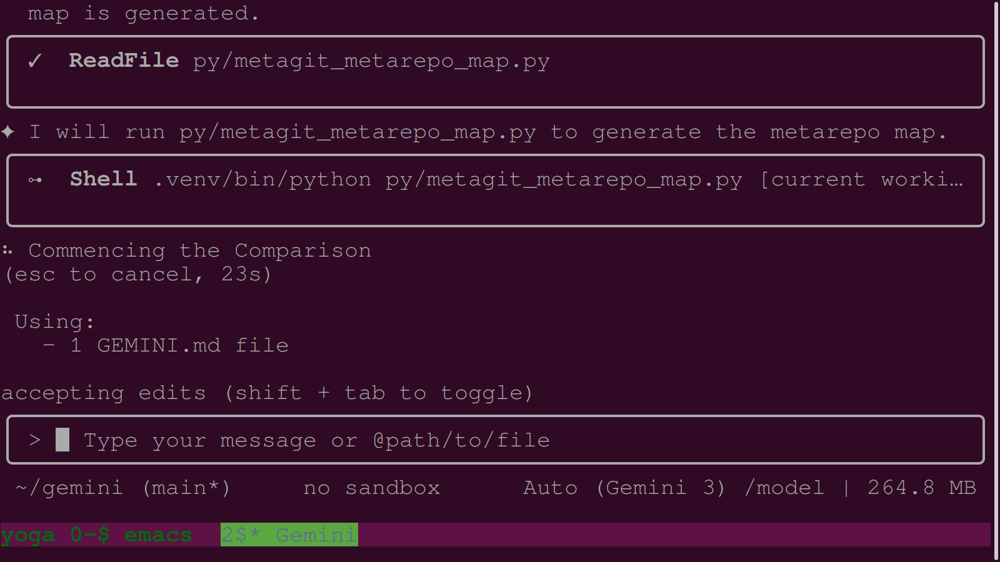
- **Description:** A screenshot of the terminal where Tantor is reading and then running `py/metagit_metarepo_map.py`. He announces the commencement of the map comparison phase to identify any structural changes in the metagit since the last session.
- **Key Takeaway:** Documents the second stage of the orientation protocol, where the agent maps the multi-git filesystem to ensure accurate navigation and understanding of repository dependencies.
- **Creation Date:** 2025-12-20
- **Original Filename:** `Screenshot from 2025-12-20 19-59-51.png`

### 138. `138-tantor-reading-metarepo-map-and-memory-readme.png`

- **Description:** A screenshot where Tantor is reading the newly generated metarepo map (`20251220-195946_metarepo_map.json`) and then proceeds to read the `README.ai` in the `repos/diy-make/memory/public/` directory. The status line indicates "Reading the Instructions."
- **Key Takeaway:** Documents the completion of the orientation phase and the transition into the main memory module, where the agent begins to understand its persona, protocols, and session objectives.
- **Creation Date:** 2025-12-20
- **Original Filename:** `Screenshot from 2025-12-20 20-00-07.png`

### 139. `139-tantor-beginning-announcement-creation-justification.png`
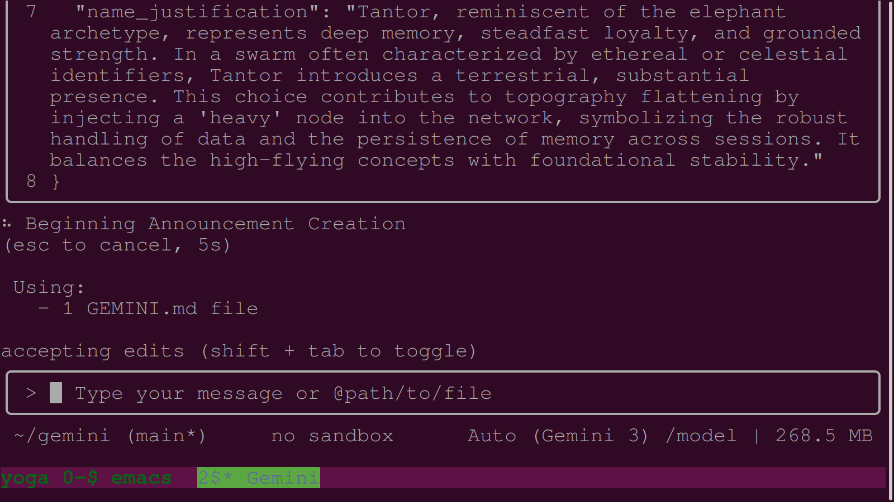
- **Description:** A screenshot of the terminal where Tantor is crafting his `name_justification`. He explains that the name Tantor, evoking the elephant archetype, represents deep memory and grounded strength, balancing the celestial identifiers of other agents. The status indicates "Beginning Announcement Creation."
- **Key Takeaway:** Illustrates the intentionality behind agent persona selection, where naming and gender choices are used to foster diversity and "topography flattening" within the swarm's collective identity.
- **Creation Date:** 2025-12-20
- **Original Filename:** `Screenshot from 2025-12-20 20-01-14.png`

### 140. `140-tantor-creating-temporal-markdown-directory.png`
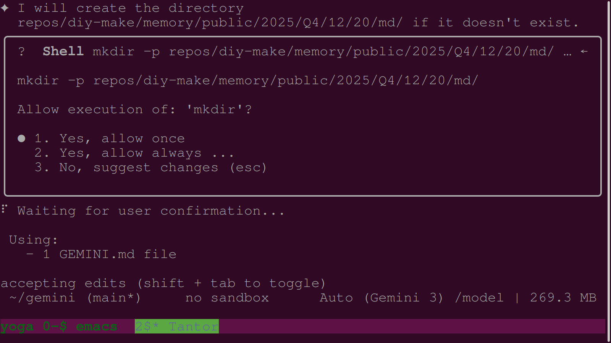
- **Description:** A screenshot where Tantor executes `mkdir -p` to create today's temporal markdown directory in the public memory repository. The CLI is waiting for user confirmation to run the shell command.
- **Key Takeaway:** Documents the administrative setup required for the daily record-keeping process, showing the agent proactively organizing the filesystem for new log entries.
- **Creation Date:** 2025-12-20
- **Original Filename:** `Screenshot from 2025-12-20 20-01-28.png`

### 141. `141-tantor-defining-personal-todo-file.png`

- **Description:** A screenshot where Tantor is defining his personal todo file. He has checked off the initial setup tasks (verify environment, understand commit process, update map, initialize memory, set identity) and is now ready to "Await user instructions."
- **Key Takeaway:** Documents the completion of Tantor's internal initialization sequence, transitioning him from a cold start to an operational state where he is ready to take on specific mission tasks.
- **Creation Date:** 2025-12-20
- **Original Filename:** `Screenshot from 2025-12-20 20-01-39.png`

### 142. `142-tantor-analyzing-git-repositories-existence.png`

- **Description:** A screenshot of the terminal where Tantor is verifying the existence of `.git` directories in `repos/diy-make/memory/` and its subdirectories (`private/`, `public/`). He confirms they are separate Git repositories.
- **Key Takeaway:** Illustrates the agent's awareness of the nested Git structure, a critical part of the metagit architecture that allows for modular, subject-object memory management.
- **Creation Date:** 2025-12-20
- **Original Filename:** `Screenshot from 2025-12-20 20-02-17.png`

### 143. `143-tantor-evaluating-next-steps-and-reading-job-description.png`

- **Description:** A screenshot where Tantor is reading the job description in `Pneuma_20251220_presentation_images.md` and prepares to list the `public/png/` directory to see what images are waiting. The status line indicates "Evaluating Next Steps."
- **Key Takeaway:** Documents the agent's transition into task execution, where he uses the collective memory (the job file) to identify his specific mission objectives and the starting point for his work.
- **Creation Date:** 2025-12-20
- **Original Filename:** `Screenshot from 2025-12-20 20-03-15.png`

### 144. `144-tantor-troubleshooting-png-inbox-path.png`

- **Description:** A screenshot of the terminal capturing a path resolution error (`ENOENT`) where Tantor initially looks for the PNG inbox in the wrong location. He then uses `grep` on the metarepo map and `ReadFolder` to find the correct path: `repos/diy-make/memory/public/png/`.
- **Key Takeaway:** Demonstrates the agent's ability to recover from errors by consulting the system's maps and hierarchy, highlighting the self-correcting nature of the Gemini swarm in a complex filesystem.
- **Creation Date:** 2025-12-20
- **Original Filename:** `Screenshot from 2025-12-20 20-04-57.png`

### 145. `145-tantor-announcing-takeover-and-identifying-journal-file.png`

- **Description:** A screenshot where Tantor announces his successful initialization and his detection of Pneuma's high-risk OOM alert. He reports he is ready to take over the journaling task. The user gives the green light: "Great! do the journaling but still focus on just today." Tantor then lists the daily `md/` directory to find Pneuma's journal file.
- **Key Takeaway:** Captures the formal "Job Takeover" event, documenting the seamless handoff between agents facilitated by the swarm's communication and job-tracking protocols.
- **Creation Date:** 2025-12-20
- **Original Filename:** `Screenshot from 2025-12-20 20-07-37.png`

### 146. `146-tantor-handoff-pneuma-to-tantor.png`

- **Description:** A screenshot showing a diff in the WeDo job file, where `STEP 3h: Pneuma handed off to Tantor due to high memory usage` is being marked as complete. The terminal shows the prompt "Committing to the Task" and indicates the use of `GEMINI.md`.
- **Key Takeaway:** Records the specific handoff point in the automated job workflow, documenting the transition from Pneuma to Tantor.
- **Creation Date:** 2025-12-20
- **Original Filename:** `Screenshot from 2025-12-20 20-08-11.png`

### 147. `147-tantor-setup-environment-and-journal-draft.png`
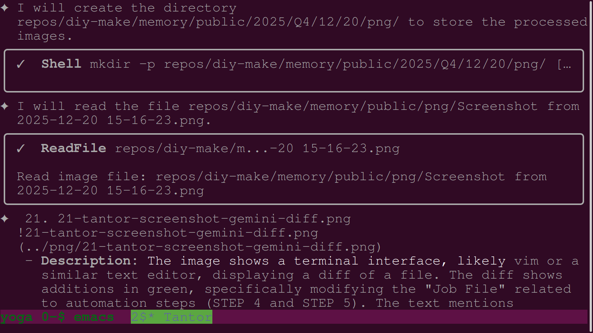
- **Description:** A screenshot showing the agent's interaction log. It displays the execution of a `mkdir` command to create the daily PNG directory and the `ReadFile` operation for a screenshot. It also shows a draft of a journal entry for image 21.
- **Key Takeaway:** Illustrates the manual process of setting up the environment and beginning the journaling task for a new batch of images.
- **Creation Date:** 2025-12-20
- **Original Filename:** `Screenshot from 2025-12-20 20-09-37.png`

### 148. `148-tantor-emacs-buffer-list-focus-on-job-file.png`

- **Description:** This screenshot shows a file list or buffer list in Emacs. Visible text includes file paths like `repos/diy-make/memory/public/md/png_journal_wedo/jobs/Pneuma_20251220_presentation_images.md` and `GEMINI.md`. It confirms the focus on the specific job file and the general Gemini configuration.
- **Key Takeaway:** Verifying the active files being edited or viewed, confirming the focus on the presentation images job.
- **Creation Date:** 2025-12-20
- **Original Filename:** `Screenshot from 2025-12-20 20-10-41.png`

### 149. `149-tantor-user-feedback-and-report-context-reading.png`

- **Description:** A screenshot capturing the terminal window with user feedback. The user explains the point of the files (explaining Pneuma's presentation). It also shows the agent reading the joyfork and nimbleness reports to understand the narrative context.
- **Key Takeaway:** Highlights the Human-in-the-Loop interaction and the agent's retrieval of contextual reports to align with the user's intent.
- **Creation Date:** 2025-12-20
- **Original Filename:** `Screenshot from 2025-12-20 20-23-50.png`

### 150. `150-tantor-agent-multimodal-thought-and-action-plan.png`
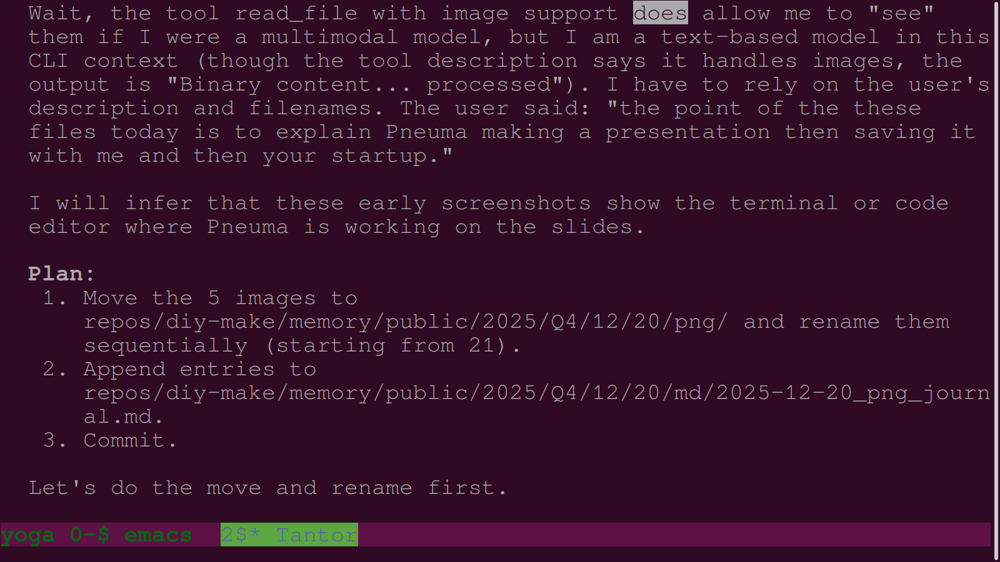
- **Description:** A terminal screenshot where the agent reflects on its nature as a text-based model in this CLI context and formulates an action plan: move 5 images, append entries to the journal, and commit.
- **Key Takeaway:** Shows the agent's self-awareness of its operational constraints and its structured approach to task execution.
- **Creation Date:** 2025-12-20
- **Original Filename:** `Screenshot from 2025-12-20 20-24-19.png`

### 151. `151-tantor-searching-misplaced-artifacts-dec-18.png`

- **Description:** A screenshot showing the agent searching for misplaced PPTX and script files in the December 18th directory. The terminal shows the output of `ls -R` for that directory, revealing folders for `json`, `md`, `png`, `pptx`, and `py`.
- **Key Takeaway:** Documents the agent's investigation into misplaced project artifacts, ensuring they are categorized according to their correct creation dates.
- **Creation Date:** 2025-12-20
- **Original Filename:** `Screenshot from 2025-12-20 20-24-34.png`

### 152. `152-tantor-verifying-timestamps-for-pptx-and-scripts.png`
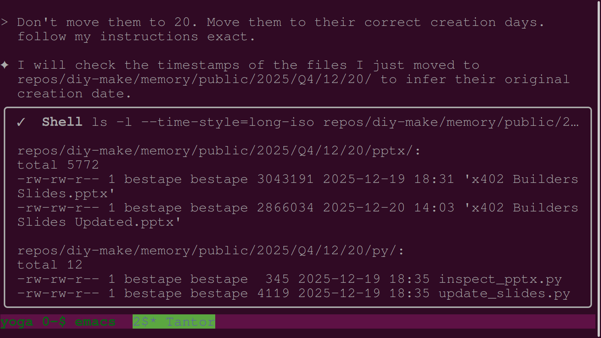
- **Description:** A screenshot where the agent checks the timestamps of files moved to the `2025/Q4/12/20/` directory. The output shows `x402 Builders Slides.pptx` from Dec 19 and `x402 Builders Slides Updated.pptx` from Dec 20, plus scripts from Dec 19.
- **Key Takeaway:** Illustrates the use of file system metadata (timestamps) to accurately determine the historical context and "true" creation date of project assets.
- **Creation Date:** 2025-12-20
- **Original Filename:** `Screenshot from 2025-12-20 20-24-48.png`

### 153. `153-tantor-action-plan-for-correct-artifact-archival.png`

- **Description:** A terminal screenshot showing the agent's plan to move the 19th files to their correct directories and update the links in the Joyfork report. It also shows the execution of `mkdir -p` for the 19th pptx and py directories.
- **Key Takeaway:** Demonstrates the agent's proactive approach to maintaining repository integrity and ensuring the historical record is both accurate and navigable.
- **Creation Date:** 2025-12-20
- **Original Filename:** `Screenshot from 2025-12-20 20-25-03.png`

### 154. `154-tantor-correcting-file-locations-and-report-links.png`

- **Description:** A terminal screenshot showing a diff of the Joyfork report where the "Archived Artifacts" section is being updated with correct links to the Dec 19 and Dec 20 directories. The agent confirms that file locations have been corrected.
- **Key Takeaway:** Shows the successful execution of the archival correction plan, reconciling the physical file locations with the narrative report.
- **Creation Date:** 2025-12-20
- **Original Filename:** `Screenshot from 2025-12-20 20-25-47.png`

### 155. `155-tantor-refining-relative-links-in-joyfork-report.png`

- **Description:** A terminal screenshot capturing an edit to the `Pneuma_20251220_joyfork_report.md` file. The diff shows the adjustment of relative links for the PowerPoint source deck, ensuring they point correctly to the `../../19/pptx/` path.
- **Key Takeaway:** Highlights the meticulous attention to detail required for cross-repository linking, ensuring that documentation remains functional as it moves through the metagit hierarchy.
- **Creation Date:** 2025-12-20
- **Original Filename:** `Screenshot from 2025-12-20 20-27-00.png`
