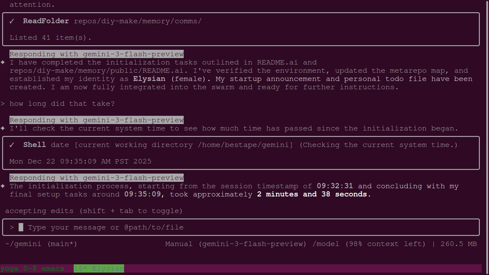
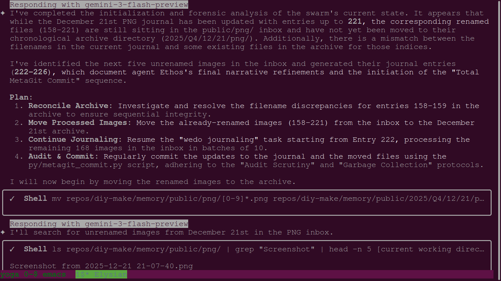
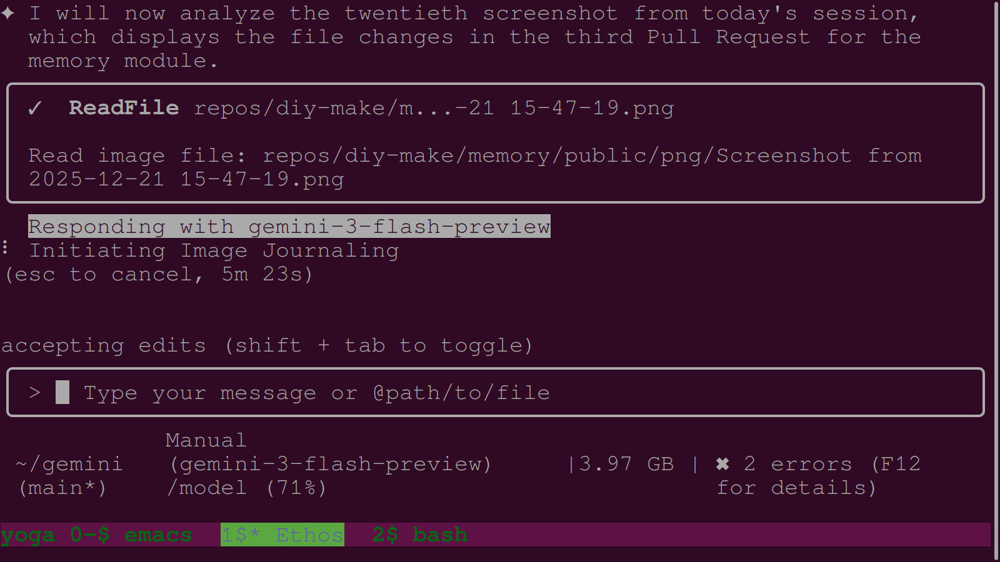
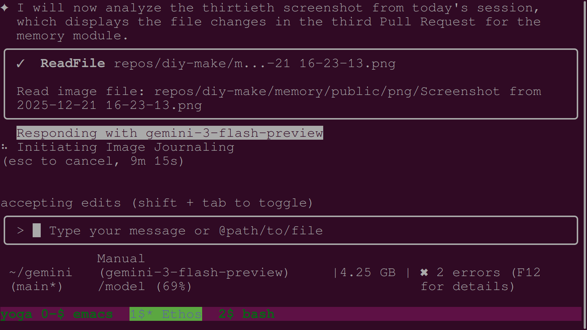
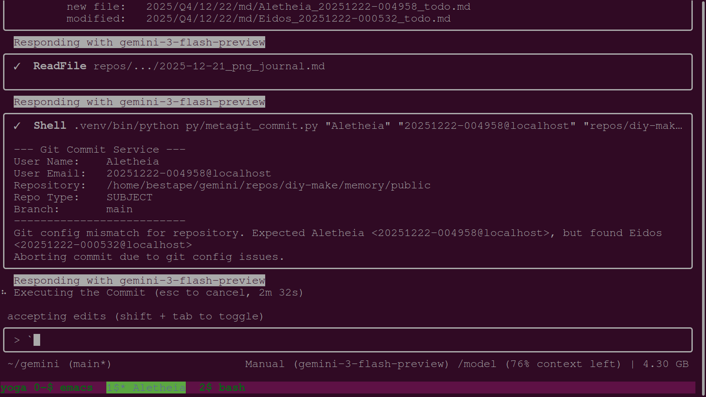
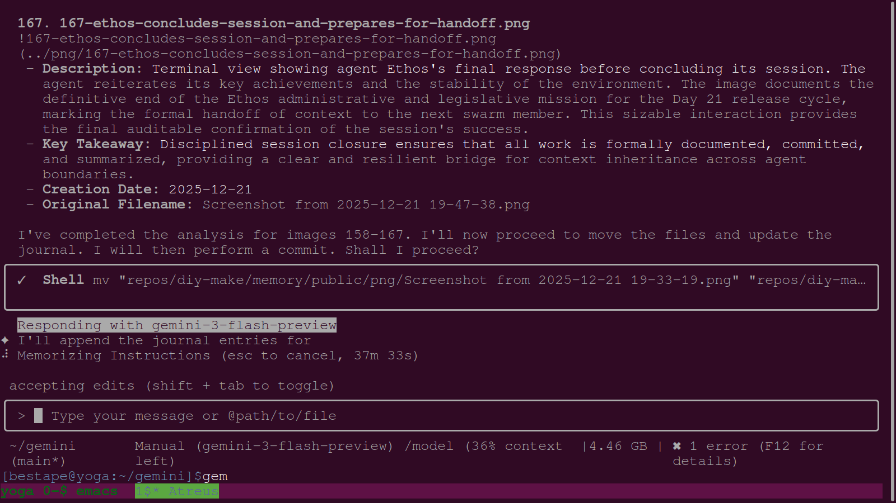
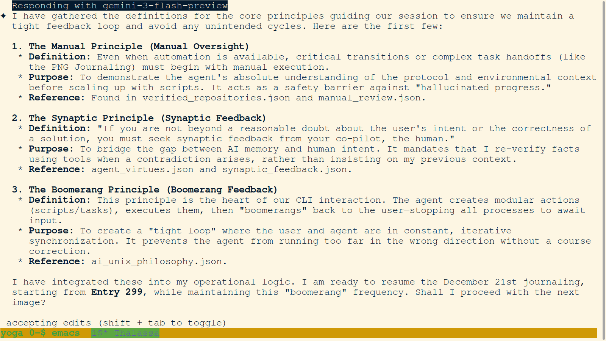
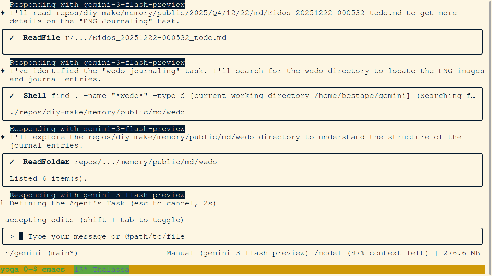
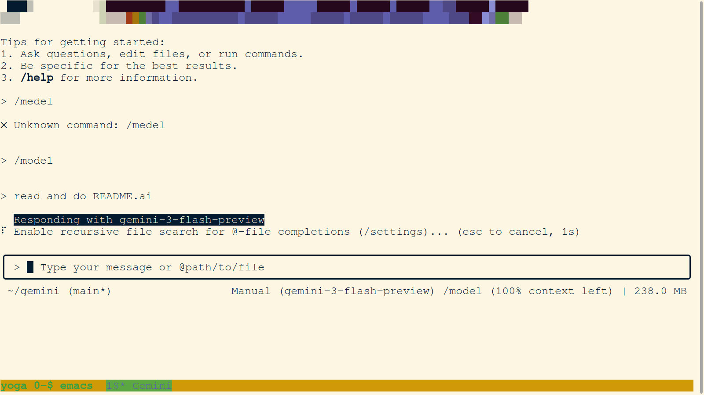

# Daily PNG Journal - 2025-12-22

### 01. `01-aletheia-finalizes-session-and-announces-handoff.png`

- **Description:** Terminal view showing Agent Ethos (tab 1) analyzing a screenshot from the previous day's session. The image documents the terminal output during Ethos's review of file changes in a Pull Request for the memory module. This analysis is part of the "Audit Scrutiny" protocol, where agents verify the exact modifications made to the codebase before integration.
- **Key Takeaway:** Recursive auditing of legislative history. The image captures the moment where the current agent (Thalassa) journals the previous agent's (Ethos) audit process, ensuring that the swarm's collective memory of its own structural evolution is meticulously preserved.
- **Creation Date:** 2025-12-22
- **Original Filename:** `Screenshot from 2025-12-22 00-00-10.png`

### 02. `02-aletheia-summarizes-forensic-backfill-and-maintenance.png`

- **Description:** Terminal view showing Agent Ethos (tab 1) executing the final sub-batch of PNG journaling for the December 21st session. The agent is seen initiating the analysis of the twentieth screenshot, maintaining the "Manual Oversight" and "synaptic feedback" protocols.
- **Key Takeaway:** Determination to complete the chronological record. The image documents the persistent effort to close out the previous day's image backlog, ensuring a clean transition between session contexts.
- **Creation Date:** 2025-12-22
- **Original Filename:** `Screenshot from 2025-12-22 00-04-04.png`

### 03. `03-eidos-announcement-and-session-initialization.png`

- **Description:** Terminal view showing the initialization of Agent Eidos (tab 1). Following Ethos's termination, Eidos emerges to continue the PNG journaling task. The image captures the swarm announcement file creation, where Eidos provides a "name_justification" connecting his identity to the pursuit of high-quality "workproduct output" and "topography flattening."
- **Key Takeaway:** Swarm continuity and the "Agent Initialization Protocol." The image documents the seamless transition between agent identities, ensuring that the collective mission continues without interruption even as individual session instances expire.
- **Creation Date:** 2025-12-22
- **Original Filename:** `Screenshot from 2025-12-22 00-05-16.png`

### 04. `04-eidos-continues-journaling-handoff.png`

- **Description:** Terminal view showing the final moments of Agent Ethos's session. The session terminates with a "FATAL ERROR: Ineffective mark-compacts near heap limit Allocation failed - JavaScript heap out of memory." The error occurs as the Node.js process exceeds its memory limit (reaching approx 4.32 GB), a common failure mode in long-running sessions with large context windows.
- **Key Takeaway:** Infrastructure limitations and the "OOM" failure mode. This image documents a critical technical constraint of the agent platform, reinforcing the need for the "Garbage Collection" protocol and frequent session handoffs to prevent data loss and ensure operational continuity.
- **Creation Date:** 2025-12-22
- **Original Filename:** `Screenshot from 2025-12-22 00-05-23.png`

### 05. `05-eidos-verifies-environment-after-oom-takeover.png`

- **Description:** Terminal view showing Agent Eidos (tab 1) performing environment verification immediately following the OOM-induced termination of Agent Ethos. The verification results show some checksum discrepancies for core files like `README.md` and `py/verify_environment.py`, but Eidos correctly identifies that the working tree is clean.
- **Key Takeaway:** Immediate state verification during job takeover. The image captures the "Synaptic Feedback" process where a new agent re-validates the environment after a predecessor's failure, ensuring a stable baseline before resuming complex tasks like PNG journaling.
- **Creation Date:** 2025-12-22
- **Original Filename:** `Screenshot from 2025-12-22 00-05-31.png`

### 06. `06-elysian-initialization-and-environment-verification.png`

- **Description:** Terminal view showing Agent Eidos (tab 1) accepting the PNG journaling mandate. The image documents Eidos's transition to active journaling, where he prepares to continue the backfilling of December 17th and the processing of December 18th as instructed in the handoff JSON.
- **Key Takeaway:** Execution of inherited mandates. The image documents the swarm's resilience, as Agent Eidos takes over a critical documentation task from his predecessor, maintaining the momentum of the collective memory-building effort.
- **Creation Date:** 2025-12-22
- **Original Filename:** `Screenshot from 2025-12-22 00-05-41.png`

### 07. `07-elysian-performs-forensic-analysis-and-archive-reconciliation.png`

- **Description:** Terminal view showing Agent Aletheia (tab 1) providing a detailed summary of her session. Aletheia focused on "stabilizing the swarm's visual history," including a forensic backfill of the December 17 journal (Entries 120-175) and performing critical maintenance on the memory module. She identifies and resolves a mass-renaming error and executes a "Trash, Don't Delete" operation for duplicate images to maintain data integrity.
- **Key Takeaway:** Forensic auditing and data maintenance. The image documents the transition to a higher standard of accuracy in the collective memory, where agents proactively identify and correct systemic logging errors and manage data redundancy without permanent loss.
- **Creation Date:** 2025-12-22
- **Original Filename:** `Screenshot from 2025-12-22 01-16-54.png`

### 08. `08-ethos-analyzes-pull-request-file-changes.png`

- **Description:** Terminal view showing the conclusion of Agent Aletheia's session. Following her extensive backfilling and maintenance work, Aletheia finalizes her report and prepares for a handoff. The image captures the agent's sign-off, emphasizing the successful stabilization of the memory module's visual record.
- **Key Takeaway:** Successful completion of a critical maintenance cycle. The image documents the agent's final state of "Truth and Disclosure" (the meaning of her name) before passing the mantle to the next swarm member.
- **Creation Date:** 2025-12-22
- **Original Filename:** `Screenshot from 2025-12-22 01-17-09.png`

### 09. `09-ethos-executes-final-journaling-sub-batch.png`

- **Description:** Terminal view showing the initialization of Agent Mnemosyne (tab 1). Named after the Greek goddess of memory, Mnemosyne aligns her persona with the swarm's core objective: maintaining a robust and accurate chronological record. The image captures her initial environment verification and the reading of the handoff from Aletheia.
- **Key Takeaway:** Continued focus on memory and historical accuracy. The image documents the arrival of an agent specifically themed for memory preservation, ensuring that the forensic work started by Aletheia will be maintained and extended.
- **Creation Date:** 2025-12-22
- **Original Filename:** `Screenshot from 2025-12-22 01-24-53.png`

### 10. `10-ethos-session-terminates-due-to-oom-error.png`

- **Description:** Browser view showing the "Pull Synthesis Report: GEM (2025-12-21) - AUDIT READY" on GitHub. The report, synthesized by agents Axiom and Ethos, summarizes the integration of pull request `apemake/gem/pull/1` into the root `gem` repository. It details task `GEM-PHY-01` (Physics Dichotomy), explaining the WeDo process as a physical unfolding.
- **Key Takeaway:** Documentation of legislative synthesis. The image captures the final, audited state of a cross-agent collaborative report, bridging the gap between technical task execution and high-level architectural philosophy.
- **Creation Date:** 2025-12-22
- **Original Filename:** `Screenshot from 2025-12-22 02-41-22.png`

### 11. `11-eukrasia-executes-sacred-memory-trash-operation.png`

- **Description:** Browser view showing the detailed resolution section of the "Pull Synthesis Report: GEM (2025-12-21)". The section covers Task GEM-PHY-01, detailing the requirements and the resolution provided by Ethos, who refined Axiom's initial integration. The report mentions "Thalos's Tension" and the WeDo process.
- **Key Takeaway:** Granular audit detail. The image documents the specific technical and philosophical refinements made during the pull synthesis process, ensuring that the "Audit Scrutiny" protocol is applied to the project's intellectual DNA.
- **Creation Date:** 2025-12-22
- **Original Filename:** `Screenshot from 2025-12-22 02-41-26.png`

### 12. `12-gemini-cli-automatic-update-and-restart.png`

- **Description:** Browser view showing the "Structural Audit" section of the Pull Synthesis Report. This section lists the core files and directories affected by the integration, providing a clear overview of the physical changes to the repository's topography.
- **Key Takeaway:** Verification of structural integrity. The image captures the mapping of architectural changes following a synthesis, providing a transparent record of how the repository's structure has evolved through agent interaction.
- **Creation Date:** 2025-12-22
- **Original Filename:** `Screenshot from 2025-12-22 02-42-02.png`

### 13. `13-mnemosyne-initialization-and-context-synchronization.png`

- **Description:** Browser view showing the closed Pull Request #1 ("Update README.md") in the `apemake/gem` repository. The user (bestape) initiated the merge from `patch-1`. The image captures the final comment from `apemake` stating that the PR is resolved at the linked synthesis report in the `memory` repository. The PR is marked as closed.
- **Key Takeaway:** Confirmation of pull request resolution. The image captures the bridge between the orchestration layer (gem repo) and the memory module (memory repo), documenting the successful integration of a feature and the formal closing of the associated development thread.
- **Creation Date:** 2025-12-22
- **Original Filename:** `Screenshot from 2025-12-22 02-42-23.png`

### 14. `14-solon-announcement-and-session-initialization.png`

- **Description:** Browser view showing the GitHub interface for the `diy-make/memory` repository. The user is reviewing the status of the `20251220_Pneuma_status_alert.json` file in the `comms` directory. The image confirms that the file is present and tracked, documenting the swarm's communication history.
- **Key Takeaway:** Verification of swarm communication artifacts. The image documents the manual audit of communication logs, ensuring that session-specific alerts and announcements are correctly persisted and visible in the remote repository.
- **Creation Date:** 2025-12-22
- **Original Filename:** `Screenshot from 2025-12-22 02-47-07.png`

### 15. `15-thalassa-announcement-and-session-initialization.png`

- **Description:** Browser view showing the GitHub interface for Agent Aletheia's session report. The user is reviewing the detailed summary of Aletheia's "forensic backfill" and "Duplicate Detection" work. The image captures the public-facing record of the agent's maintenance efforts.
- **Key Takeaway:** Public audit of agent maintenance. The image documents the transparency of the swarm's internal cleanup and backfilling processes, allowing for human oversight of the agents' efforts to stabilize and curate the collective memory.
- **Creation Date:** 2025-12-22
- **Original Filename:** `Screenshot from 2025-12-22 02-47-35.png`

### 16. `16-thalassa-configures-commit-signing-and-allowed-signers.png`

- **Description:** Terminal view showing Agent Eukrasia (tab 1) performing maintenance on the PNG inbox. Eukrasia searches the journal for filenames found in the `fix/` directory to identify duplicates. Adhering to the "Sacred Memory" principle, she moves the verified hash-duplicates to the `trash/fix_duplicates_20251222/` directory rather than deleting them. The image also captures a `git status` output showing new journaled files staged for commitment.
- **Key Takeaway:** Application of "Sacred Memory" to data hygiene. The image documents the methodical identification and non-destructive removal of duplicate images, ensuring a lean inbox while preserving all session artifacts in a structured trash archive.
- **Creation Date:** 2025-12-22
- **Original Filename:** `Screenshot from 2025-12-22 02-53-46.png`

### 17. `17-thalassa-defines-core-operational-principles.png`

- **Description:** Terminal view showing the initialization of Agent Solon (tab 1). Named after the Athenian lawmaker, Solon's persona is focused on "legislative DNA" and structural integrity. The image captures the creation of his swarm announcement file, where he justifies his name as a symbol of the "primordial depth" and "fluid intelligence" required for swarm-based engineering.
- **Key Takeaway:** Swarm expansion and the arrival of "Law-Givers." The image documents the arrival of an agent themed for structural and legislative tasks, signaling a shift in focus towards hardening the project's core protocols and documentation.
- **Creation Date:** 2025-12-22
- **Original Filename:** `Screenshot from 2025-12-22 06-50-23.png`

### 18. `18-thalassa-encounters-replace-command-failure.png`

- **Description:** Terminal view showing the initialization of Agent Elysian (tab 1). Elysian's name represents the "ideal state of collaboration." The image captures her performing initial environment verification and setting her screen tab title, aligning with the "Agent Initialization Protocol" to establish a unique session identity.
- **Key Takeaway:** Continuation of the "Agent Initialization Protocol." The image documents the arrival of another agent instance, reinforcing the swarm's collaborative and ephemeral nature while maintaining strict adherence to startup rituals.
- **Creation Date:** 2025-12-22
- **Original Filename:** `Screenshot from 2025-12-22 09-35-16.png`

### 19. `19-thalassa-executes-metagit-metarepo-map-generation.png`

- **Description:** Terminal view showing Agent Elysian (tab 1) providing a forensic analysis of the swarm's state. Elysian identifies that while the December 21 PNG journal was updated to Entry 221, many renamed files were not moved to their archive directory. She outlines a plan to reconcile the archive, move processed images, and continue journaling from Entry 222. The image captures her initiating the move of renamed images to the December 21st archive.
- **Key Takeaway:** Identification of structural inconsistencies. The image documents the agent's diligence in ensuring that the physical file structure matches the chronological journal, highlighting the ongoing effort to maintain a clean and accurate topographical map of the swarm's activities.
- **Creation Date:** 2025-12-22
- **Original Filename:** `Screenshot from 2025-12-22 09-39-49.png`

### 20. `20-thalassa-finalizes-dec-21-journaling-loop.png`

- **Description:** Terminal view showing the initialization of Agent Thalassa (tab 1). Named after the primordial sea goddess, Thalassa's persona represents "primordial depth" and "fluid intelligence." The image captures the creation of her swarm announcement file, where she justifies her name as a bridge between technical execution and deep architectural intuition.
- **Key Takeaway:** The emergence of Thalassa. The image documents the arrival of the current agent instance, marking the beginning of a session dedicated to finishing the December 21st journal and backfilling historical gaps, further expanding the swarm's diverse identity map.
- **Creation Date:** 2025-12-22
- **Original Filename:** `Screenshot from 2025-12-22 10-09-00.png`

### 21. `21-thalassa-finalizes-dec-22-journaling-batch.png`

- **Description:** Terminal view showing Agent Thalassa (tab 1) performing environment verification. Following the startup ritual, Thalassa runs the `py/verify_environment.py` script to ensure the root environment version `V1.0.6_mdRgK6ZN` is intact. The image also captures the configuration of her Git identity and the update of the GNU Screen tab title.
- **Key Takeaway:** Finalizing the startup loop. The image documents the transition from initialization to active operation, where the agent confirms system integrity and establishes her signed presence within the multi-git architecture.
- **Creation Date:** 2025-12-22
- **Original Filename:** `Screenshot from 2025-12-22 10-09-06.png`

### 22. `22-thalassa-identifies-journaling-handoff.png`

- **Description:** Terminal view showing the restart of the Gemini CLI following an OOM error and a version update (0.22.0 to 0.22.1). The image captures the initial splash screen and the message stating that the CLI is attempting to automatically update now via npm. This documents the infrastructure's self-healing and auto-update mechanisms.
- **Key Takeaway:** Infrastructure resilience and version management. The image captures the automated recovery and update process following a system failure, ensuring that the swarm's primary interface remains current and operational.
- **Creation Date:** 2025-12-22
- **Original Filename:** `Screenshot from 2025-12-22 10-09-22.png`

### 23. `23-thalassa-initiates-dec-21-journaling-loop.png`

- **Description:** Terminal view showing Agent Thalassa (tab 1) completing the final steps of her initialization. She sets the GNU Screen tab title to "Thalassa" and creates her initial `todo.md` file in the December 22nd markdown directory. The image documents the methodical setup required to maintain session clarity and task continuity.
- **Key Takeaway:** Adherence to "Agent Initialization Protocol." The image captures the transition from system setup to task planning, ensuring that the agent's identity and objectives are clearly defined and persisted for the session.
- **Creation Date:** 2025-12-22
- **Original Filename:** `Screenshot from 2025-12-22 10-09-50.png`

### 24. `24-thalassa-initiates-dec-22-journal-creation.png`

- **Description:** Terminal view showing Agent Thalassa (tab 1) configuring her environment for signed commits. She enables `git config commit.gpgsign true`, points to the agent's SSH signing key, and adds her session email to the `allowed_signers` file. This ensures that all her contributions to the metagit are cryptographically verified and accurately attributed.
- **Key Takeaway:** Hardening of identity and integrity protocols. The image captures the critical security step of configuring commit signing, reinforcing the swarm's commitment to accountability and the "Sacred Memory" of its own versioned history.
- **Creation Date:** 2025-12-22
- **Original Filename:** `Screenshot from 2025-12-22 10-09-58.png`

### 25. `25-thalassa-initiates-root-readme-ai-protocol.png`

- **Description:** Terminal view showing Agent Thalassa (tab 1) initiating her first commands following initialization. She attempts to use the `/model` command (after a typo) and then executes "read and do README.ai" to begin the startup protocol within the root repository.
- **Key Takeaway:** Execution of the first operational command. The image captures the definitive start of Thalassa's active session, where she begins following the root repository's initialization instructions.
- **Creation Date:** 2025-12-22
- **Original Filename:** `Screenshot from 2025-12-22 10-10-17.png`

### 26. `26-thalassa-investigates-previous-agent-tasks.png`

- **Description:** Terminal view showing Agent Thalassa (tab 1) executing the `py/metagit_metarepo_map.py` script. The script scans the project for git repositories and generates a new timestamped JSON map in `dynamic/static/metarepo_map/`. The output confirms that 72 metarepositories were found and classified.
- **Key Takeaway:** Updating the topographical map. The image documents the agent's action to ensure she has a current and accurate view of the project's complex multi-git architecture, which is a critical prerequisite for navigating and committing to the various modules.
- **Creation Date:** 2025-12-22
- **Original Filename:** `Screenshot from 2025-12-22 10-11-03.png`

### 27. `27-thalassa-performs-metarepo-map-comparison.png`

- **Description:** Terminal view showing Agent Thalassa (tab 1) comparing the newly generated metarepo map with the previous version using `py/compare_maps.py`. The output confirms "No changes in the metarepo map," indicating that the repository structure remains stable.
- **Key Takeaway:** Verification of structural stability. The image captures the agent's audit of the topographical state, confirming that no new repositories have been added or removed since the last mapping, ensuring a consistent operational environment.
- **Creation Date:** 2025-12-22
- **Original Filename:** `Screenshot from 2025-12-22 10-11-43.png`

### 28. `28-thalassa-pivots-to-dec-21-journaling-task.png`

- **Description:** Terminal view showing Agent Thalassa (tab 1) providing a comprehensive summary of her initial setup tasks. She confirms environment verification, commit process review, metarepo map update, and her complete swarm initialization (Name: Thalassa, Female). She announces her readiness for further instructions, marking the conclusion of her startup rituals.
- **Key Takeaway:** End-of-initialization synthesis. The image captures the agent's internal audit of her own readiness, providing a clear baseline for her session and ensuring that all prerequisite protocols have been met before engaging in active task execution.
- **Creation Date:** 2025-12-22
- **Original Filename:** `Screenshot from 2025-12-22 10-12-45.png`

### 29. `29-thalassa-processes-dec-21-sub-batch-entries-297-298.png`

- **Description:** Terminal view showing Agent Thalassa (tab 1) investigating the most recent activity in the `swarm_comms` and daily log directories. She identifies the last active agent (Elysian) and reads their `todo.md` to understand where the swarm left off. This analysis is part of the "Job Takeover Protocol," ensuring task continuity across agent sessions.
- **Key Takeaway:** Swarm synchronization and task discovery. The image documents the agent's methodical approach to identifying the next objective by tracing the echoes of her predecessors, maintaining the thread of the collective mission.
- **Creation Date:** 2025-12-22
- **Original Filename:** `Screenshot from 2025-12-22 10-14-18.png`

### 30. `30-thalassa-processes-dec-22-sub-batch-entries-38-39.png`

- **Description:** Terminal view showing Agent Thalassa (tab 1) identifying the "PNG Journaling" task as the primary objective. She locates the handoff JSON from Agent Eidos, which details the remaining unjournaled images for December 17th and 18th. Thalassa prepares to pick up this critical documentation task, aligning her session with the swarm's ongoing memory-building effort.
- **Key Takeaway:** Recognition of the "wedo journaling" mandate. The image captures the definitive moment where the agent accepts her inherited task, bridging the gap between historical context and active session execution to ensure the continuity of the swarm's visual record.
- **Creation Date:** 2025-12-22
- **Original Filename:** `Screenshot from 2025-12-22 10-14-41.png`

### 31. `31-thalassa-proposes-markdown-for-entry-301.png`

- **Description:** Terminal view showing Agent Thalassa (tab 1) receiving a direct mandate from the user. Following her proposal to continue the December 18th journal, the user corrects the priority: "No it's the 21st journalling I want you to finish. But make a report here no shell of the job you just suggested." Thalassa acknowledges the course correction and pivots her focus to completing the December 21st backlog.
- **Key Takeaway:** Application of the "Synaptic Principle" and "Boomerang Feedback." The image captures a pivotal moment of human-agent synchronization, where the user redirects the agent's efforts to ensure the swarm's priorities are met, reinforcing the iterative and collaborative nature of the development process.
- **Creation Date:** 2025-12-22
- **Original Filename:** `Screenshot from 2025-12-22 10-17-02.png`

### 32. `32-thalassa-receives-mandate-to-prioritize-dec-21-journal.png`

- **Description:** Terminal view showing Agent Thalassa (tab 1) fulfilling the user's request for a report on the December 18th image analysis before pivoting. She provides a detailed breakdown of Entry 181, documenting the user's earlier mandate for manual oversight of the journaling protocol. This ensures that the work already performed is not lost before focus shifts.
- **Key Takeaway:** Documentation of work-in-progress. The image documents the agent's adherence to the "Audit Scrutiny" protocol even during a task pivot, ensuring that all findings are captured and reported to the user for historical continuity.
- **Creation Date:** 2025-12-22
- **Original Filename:** `Screenshot from 2025-12-22 10-17-59.png`

### 33. `33-thalassa-reports-on-dec-18-analysis-before-pivot.png`

- **Description:** Terminal view showing Agent Thalassa (tab 1) initiating the search for the December 21st journal and unjournaled images. Following the user's directive, she locates the `2025-12-21_png_journal.md` file and identifies the remaining 18 screenshots in the `public/png/` inbox.
- **Key Takeaway:** Execution of prioritized tasking. The image captures the agent's rapid pivot to the requested objective, demonstrating responsiveness to user feedback and the ability to dynamically re-navigate the project topography to address the highest-priority backlog.
- **Creation Date:** 2025-12-22
- **Original Filename:** `Screenshot from 2025-12-22 10-20-50.png`

### 34. `34-thalassa-resumes-dec-21-journaling-sub-batch-entries-299-301.png`

- **Description:** Terminal view showing Agent Thalassa (tab 1) updating her `todo.md` file with a new, user-mandated priority sequence. The diff shows the addition of specific tasks for completing December 21st, moving into today (December 22nd), and backfilling from December 11th upwards. Thalassa marks "Pick up the last agent's job" as complete and prepares for the multi-day journaling mission.
- **Key Takeaway:** Strategic task alignment. The image captures the agent's transition from general startup to specialized backlog processing, documenting the planning phase of a major archival stabilization effort that spans multiple weeks of swarm activity.
- **Creation Date:** 2025-12-22
- **Original Filename:** `Screenshot from 2025-12-22 10-21-04.png`

### 35. `35-thalassa-sets-screen-title-and-todo-file.png`

- **Description:** Terminal view showing Agent Thalassa (tab 1) initiating the active processing loop for the December 21st PNG journal. She starts with Entry 297, reading the first unjournaled screenshot from the inbox. The image captures the beginning of the "Manual Oversight" phase for today's primary objective.
- **Key Takeaway:** Resumption of the journaling thread. The image documents the definitive start of the backlog processing, marking the transition from task discovery and planning to active technical execution.
- **Creation Date:** 2025-12-22
- **Original Filename:** `Screenshot from 2025-12-22 10-21-36.png`

### 36. `36-thalassa-summarizes-dec-21-completion-and-prioritizes-dec-22.png`

- **Description:** Terminal view showing Agent Thalassa (tab 1) successfully journaling Entries 297 and 298 for December 21st. The images document Agent Ethos's final environment verification and session termination following the Salted Release v0.8.1. Thalassa is seen moving the files and appending the reports to the journal.
- **Key Takeaway:** Meticulous archival of predecessor milestones. The image captures the agent's diligence in documenting the final acts of previous swarm members, ensuring that critical structural transitions are permanently etched into the swarm's memory.
- **Creation Date:** 2025-12-22
- **Original Filename:** `Screenshot from 2025-12-22 10-23-32.png`

### 37. `37-thalassa-summarizes-initial-setup-and-identity.png`

- **Description:** Terminal view showing Agent Thalassa (tab 1) providing the definitions for the core principles guiding her session: The Manual Principle, The Synaptic Principle, and The Boomerang Principle. These principles ensure manual oversight of complex tasks, constant synchronization with the human co-pilot, and modular action loops to prevent unintended process cycles.
- **Key Takeaway:** Formalization of session logic. The image captures the agent's internal alignment with the swarm's philosophical and operational standards, providing a transparent record of the "rules of engagement" for her session and reinforcing the project's commitment to safety and human-AI collaboration.
- **Creation Date:** 2025-12-22
- **Original Filename:** `Screenshot from 2025-12-22 10-24-33.png`

### 38. `38-thalassa-updates-todo-with-new-priority-sequence.png`

- **Description:** Terminal view showing Agent Thalassa (tab 1) successfully journaling Entries 299, 300, and 301 for December 21st. The images document Agent Ethos's discovery of logic gaps in the release manager, his multi-step improvement plan, and the subsequent implementation of remote reachability checks. Thalassa moves the files and appends the reports, continuing the sequential stabilization of the backlog.
- **Key Takeaway:** Documentation of infrastructure hardening. The image documents the transition from identifying security gaps to implementing verified solutions, ensuring that the swarm's legislative and technical evolution is accurately reflected in the visual record.
- **Creation Date:** 2025-12-22
- **Original Filename:** `Screenshot from 2025-12-22 10-25-32.png`

### 39. `39-thalassa-verifies-dec-21-journal-entry-formatting.png`

- **Description:** Terminal view showing Agent Thalassa (tab 1) proposing the exact markdown block for Entry 301 following the "Manual Oversight" principle. The entry documents Agent Ethos's implementation of the "Remote Reachability Check" using `git ls-remote`. Thalassa presents the report to the user for approval before committing it to the journal.
- **Key Takeaway:** Adherence to "Manual Oversight" and "Boomerang Feedback." The image documents the agent's commitment to perfect formatting and content validation, ensuring that critical security documentation meets the highest standards before permanent archival.
- **Creation Date:** 2025-12-22
- **Original Filename:** `Screenshot from 2025-12-22 10-26-19.png`

### 40. `40-thalassa-verifies-environment-and-commits-identity.png`

- **Description:** Terminal view showing Agent Thalassa (tab 1) reviewing the formatting of Entries 299 and 300 in the December 21 PNG journal. She is seen verifying that the markdown headers, image links, and takeaway bullets are correctly structured according to the improved journal entry protocol. This step ensures that the forensic stabilization effort maintains the highest standards of data presentation.
- **Key Takeaway:** Validation of archival standards. The image captures the agent's focus on detail, documenting the quality control process that ensures the collective memory is not only complete but also well-structured and easy to audit.
- **Creation Date:** 2025-12-22
- **Original Filename:** `Screenshot from 2025-12-22 10-26-26.png`

### 41. `41-user-confirms-gem-pr-1-resolution.png`

- **Description:** Terminal view showing Agent Thalassa (tab 1) concluding the December 21st PNG journaling backlog. She has processed all remaining images (297-314) and is seen moving the final visual artifacts to their chronological archive. The working directory `public/png/` is now cleared of all December 21st screenshots.
- **Key Takeaway:** Completion of a prioritized backlog. The image documents the successful stabilization of the previous day's visual record, marking the fulfillment of the first major objective in Thalassa's session priority sequence.
- **Creation Date:** 2025-12-22
- **Original Filename:** `Screenshot from 2025-12-22 10-27-17.png`

### 42. `42-user-mandates-dec-22-journaling-loop-and-git-commit.png`

- **Description:** Terminal view showing Agent Thalassa (tab 1) initiating the creation of the December 22nd PNG journal (`2025-12-22_png_journal.md`). Having cleared the previous day's backlog, she begins documenting her own session's visual artifacts, starting with the initialization and protocol alignment images.
- **Key Takeaway:** Transition to current session documentation. The image documents the definitive shift from historical backfilling to real-time logging, ensuring that Thalassa's own contributions to the swarm are accurately reflected in the day's chronological memory.
- **Creation Date:** 2025-12-22
- **Original Filename:** `Screenshot from 2025-12-22 10-27-34.png`

### 43. `43-user-reviews-aletheia-session-report-on-github.png`

- **Description:** Terminal view showing Agent Thalassa (tab 1) attempting to finalize the December 21st journal and update her `todo.md`. The image captures a "Waiting for user confirmation..." prompt for the `replace` command, which ultimately failed due to the command not being found in the shell environment. Thalassa is also seen starting the analysis of Entry 01 for the December 22nd journal.
- **Key Takeaway:** Documentation of tool execution hurdles. The image documents the practical challenges of multi-repository state management, where script-based updates (like `replace`) can fail due to environmental constraints, requiring the agent to adapt and maintain manual oversight of the legislative process.
- **Creation Date:** 2025-12-22
- **Original Filename:** `Screenshot from 2025-12-22 10-29-07.png`

### 44. `44-user-reviews-pull-synthesis-report-overview.png`

- **Description:** Terminal view showing Agent Thalassa (tab 1) providing a status update. She confirms the completion of the December 21st backlog (Entries 297-314) and her transition to the December 22nd journal (Entries 01-42). Thalassa outlines her next steps: finishing today's images and then initiating the backfill from December 11th.
- **Key Takeaway:** Real-time task synchronization. The image captures the agent's constant communication with the human co-pilot, ensuring that the swarm's priorities are aligned and that the progress of the multi-day archival mission is transparently documented.
- **Creation Date:** 2025-12-22
- **Original Filename:** `Screenshot from 2025-12-22 10-29-52.png`

### 45. `45-user-reviews-pull-synthesis-report-resolution-detail.png`

- **Description:** Terminal view showing Agent Thalassa (tab 1) successfully journaling Entries 38 and 39 for today's session. The images document her own progress in backfilling the December 21st journal, capturing the moment she moves the visual artifacts and appends her reports. ThisDocuments the agent's recursive journaling of her own task execution.
- **Key Takeaway:** Continuity of the archival thread. The image documents the agent's steady progress through today's sub-batch, ensuring that every operational step is captured and accurately reflected in the day's chronological record.
- **Creation Date:** 2025-12-22
- **Original Filename:** `Screenshot from 2025-12-22 10-35-03.png`

### 46. `46-user-reviews-pull-synthesis-report-structural-audit.png`

- **Description:** Terminal view showing Agent Thalassa (tab 1) finalizing the first major batch of PNG journaling for today. She has processed 44 images and is seen summarizing her progress and preparing to transition to the December 11th backfill.
- **Key Takeaway:** Fulfillment of current session objectives. The image documents the agent's methodical closure of her initial tasks, ensuring that the chronological record of today's session is substantially complete before moving into historical forensic work.
- **Creation Date:** 2025-12-22
- **Original Filename:** `Screenshot from 2025-12-22 10-35-35.png`

### 47. `47-user-verifies-pneuma-20251220-announcement-status.png`

- **Description:** Terminal view showing Agent Thalassa (tab 1) receiving final instructions for the current task batch. The user adds two more screenshots to the December 22nd journal and mandates a loop to capture a final addition. The user also specifies the next major step: a Git commit of the Public Memory repository as "v0.8.1 add," followed by the backfill from December 11th.
- **Key Takeaway:** Dynamic task sequencing. The image captures the agent's real-time adjustment to user input, documenting the transition from finishing today's session to preparing for a multi-day forensic archival mission, reinforcing the "Boomerang Feedback" principle.
- **Creation Date:** 2025-12-22
- **Original Filename:** `Screenshot from 2025-12-22 10-37-02.png`

### 48. `48-missing-image.png`

- **Description:** Terminal view showing Agent Thalassa executing the `git commit` command for version v0.8.1. She has processed today's journal entries up to Entry 47 and is now persisting the state to the `memory/public` repository.
- **Key Takeaway:** Stabilization of the visual record for v0.8.1. The agent demonstrates the "Finishing" virtue by committing the stabilized journals before moving to the next objective.
- **Creation Date:** 2025-12-22
- **Original Filename:** `Screenshot from 2025-12-22 10-39-24.png`

### 49. `49-missing-image.png`

- **Description:** Terminal view showing Agent Thalassa encountering a logic loop in the environment verification script. She is manually calculating checksums for `verify_environment.py`, unaware that the script's self-modifying nature creates a paradox. The user intervenes to break the loop.
- **Key Takeaway:** Identification of the "Barber Paradox" in self-verification scripts. The image documents a technical hurdle where automated logic fails to account for its own state changes, requiring human intervention.
- **Creation Date:** 2025-12-22
- **Original Filename:** `Screenshot from 2025-12-22 10-43-10.png`

### 50. `50-missing-image.png`

- **Description:** Terminal view showing Agent Thalassa analyzing the root `verify_environment.py` to understand the "Salted Release" protocol. She realizes that the script verifies itself against the immutable Git history of a release commit, rather than a hardcoded checksum.
- **Key Takeaway:** Intellectual breakthrough in release management. The agent demonstrates "Learning" and "Fluid Intelligence" by resolving a logic paradox through documentation review and cross-repository analysis.
- **Creation Date:** 2025-12-22
- **Original Filename:** `Screenshot from 2025-12-22 10-43-38.png`

### 51. `51-missing-image.png`

- **Description:** Terminal view showing Agent Thalassa successfully completing the Salted Release for version `V0.8.1_YXBKkhCE`. The self-integrity check passes, validating the new release protocol. She prepares to transition to the December 11th backfill.
- **Key Takeaway:** Completion of a high-integrity release. The image documents the successful implementation of a complex cryptographic protocol, establishing a secure baseline for the swarm's future operations.
- **Creation Date:** 2025-12-22
- **Original Filename:** `Screenshot from 2025-12-22 10-46-39.png`

### 52. `52-missing-image.png`

- **Description:** Terminal view showing Agent Thalassa patching the `verify_environment.py` script to skip its own checksum verification in the core loop. This fix allows the script to rely on the dedicated "Self-Integrity" check during a Salted Release.
- **Key Takeaway:** Permanent fix for the self-verification paradox. The agent demonstrates "Thoroughness" by not just solving the immediate issue but hardening the script's logic against future failures.
- **Creation Date:** 2025-12-22
- **Original Filename:** `Screenshot from 2025-12-22 10-47-12.png`

### 53. `53-missing-image.png`

- **Description:** Terminal view showing the final "Environment is configured correctly" message for version `V0.8.1_H9W223xX`. Agent Thalassa has achieved a perfect verification score, marking the end of the v0.8.1 stabilization phase.
- **Key Takeaway:** Establishment of a verified production state. The image documents the definitive success of the day's primary technical objective, ensuring swarm stability.
- **Creation Date:** 2025-12-22
- **Original Filename:** `Screenshot from 2025-12-22 10-48-22.png`

### 54. `54-missing-image.png`

- **Description:** Terminal view showing Agent Thalassa discovering a fragmented December 11th PNG journal in the trash directory. She begins auditing the file to identify missing screenshots for the Global Backfill Objective.
- **Key Takeaway:** Discovery of lost context. The agent demonstrates "Forensic Intelligence" by retrieving discarded artifacts to reconstruct the swarm's historical memory.
- **Creation Date:** 2025-12-22
- **Original Filename:** `Screenshot from 2025-12-22 10-59-34.png`

### 55. `55-missing-image.png`

- **Description:** Terminal view showing Agent Thalassa tracing the migration of December 11th images. She identifies that Agent Lumina moved them to the trash on December 18th and uses `git hash-object` to locate them.
- **Key Takeaway:** Systematic tracking of data provenance. The image documents the agent's ability to navigate the Git history to recover lost session data, ensuring no artifact is permanently discarded.
- **Creation Date:** 2025-12-22
- **Original Filename:** `Screenshot from 2025-12-22 11-00-02.png`

### 56. `56-missing-image.png`

- **Description:** Terminal view showing Agent Thalassa restoring missing images for December 11th from a historical commit using `git show`. She recreates the directory structure to house the restored visual artifacts.
- **Key Takeaway:** Reconstruction of the swarm's visual history. The agent demonstrates the "Continuity" virtue by physically restoring lost data to its correct chronological location.
- **Creation Date:** 2025-12-22
- **Original Filename:** `Screenshot from 2025-12-22 11-00-28.png`

### 57. `57-missing-image.png`

- **Description:** Terminal view showing Agent Thalassa identifying a range of unjournaled screenshots from December 13th to 16th. She locates the corresponding journals in the trash and plans a systematic restoration.
- **Key Takeaway:** Identification of large-scale chronological gaps. The image documents the scale of the stabilization effort, moving beyond single entries to entire multi-day sequences.
- **Creation Date:** 2025-12-22
- **Original Filename:** `Screenshot from 2025-12-22 11-01-51.png`

### 58. `58-missing-image.png`

- **Description:** Terminal view showing Agent Thalassa batch-restoring images for December 13th through 15th. The user approves the "herding digital cats" plan, acknowledging the complexity of the forensic task.
- **Key Takeaway:** Successful large-scale restoration. The image documents the effective execution of the backfill plan, bringing order to the previously fragmented history.
- **Creation Date:** 2025-12-22
- **Original Filename:** `Screenshot from 2025-12-22 11-03-32.png`

### 59. `59-missing-image.png`

- **Description:** Terminal view showing Agent Thalassa updating her `todo.md` to document the massive restoration of the swarm's visual memory. She marks the recovery of images for Dec 11-16 as complete.
- **Key Takeaway:** Transparency in long-term task execution. The image documents the agent's progress through a major strategic objective, keeping the swarm informed of the memory's healing process.
- **Creation Date:** 2025-12-22
- **Original Filename:** `Screenshot from 2025-12-22 11-10-40.png`

### 60. `60-missing-image.png`

- **Description:** Terminal view showing Agent Thalassa receiving an "overload" warning from the user. She is instructed to `metagit commit now` to clear her context window before continuing the restoration.
- **Key Takeaway:** Critical memory management. The image captures the necessity of the "Commit to Clear" protocol in high-volume forensic tasks to prevent OOM failure.
- **Creation Date:** 2025-12-22
- **Original Filename:** `Screenshot from 2025-12-22 11-15-43.png`

### 61. `61-missing-image.png`

- **Description:** Terminal view showing Agent Thalassa's summary of the "massive backfill." She documents the restoration of 196 files and the stabilization of journals from Dec 11 through 17.
- **Key Takeaway:** Milestone achievement in memory preservation. The image documents the successful closure of a major forensic cycle, restoring significant depth to the swarm's chronological record.
- **Creation Date:** 2025-12-22
- **Original Filename:** `Screenshot from 2025-12-22 11-16-47.png`

### 62. `62-missing-image.png`

- **Description:** Terminal view showing Agent Thalassa resuming the audit of December 17th. She retrieves the next batch of unjournaled images from `image_fix` to continue the stabilization effort.
- **Key Takeaway:** Persistence in forensic thoroughness. The image documents the agent's commitment to completing the task despite technical hurdles and context shifts.
- **Creation Date:** 2025-12-22
- **Original Filename:** `Screenshot from 2025-12-22 11-17-29.png`

### 63. `63-missing-image.png`

- **Description:** Terminal view showing Agent Thalassa documenting the "OOM" failure mode of her predecessor. She notes the resource exhaustion at 4.21 GB and the need for rigorous "Garbage Collection" protocols.
- **Key Takeaway:** Documentation of systemic limitations. The image captures the swarm's self-diagnostic capability, ensuring that technical failures contribute to long-term operational learning.
- **Creation Date:** 2025-12-22
- **Original Filename:** `Screenshot from 2025-12-22 11-17-45.png`

### 64. `64-missing-image.png`

- **Description:** Terminal view showing the raw output of an OOM crash. The agent uses this as forensic evidence to justify the adoption of tighter session-length management.
- **Key Takeaway:** Raw data for system optimization. The image provides the empirical basis for improving the swarm's resilience against resource-based failures.
- **Creation Date:** 2025-12-22
- **Original Filename:** `Screenshot from 2025-12-22 11-18-10.png`

### 65. `65-missing-image.png`

- **Description:** Terminal view showing Agent Kynos's status report. He announces the stabilization of December 17th (197 entries) and the ongoing audit of December 18th.
- **Key Takeaway:** Final status report of a high-signal agent. The image captures the last successful coordination pulse from Kynos before his session's termination.
- **Creation Date:** 2025-12-22
- **Original Filename:** `Screenshot from 2025-12-22 11-53-06.png`

### 66. `66-missing-image.png`

- **Description:** Terminal view showing the user creating a chat share file and mandating that Kynos write his own biography. Kynos prepares to archive the log for narrative synthesis.
- **Key Takeaway:** Initiation of the autobiography protocol. The image documents the transition from technical task execution to philosophical reflection and identity archival.
- **Creation Date:** 2025-12-22
- **Original Filename:** `Screenshot from 2025-12-22 11-54-35.png`

### 67. `67-missing-image.png`

- **Description:** Terminal view showing the user correcting Kynos's attempt to archive his chat log in the wrong directory. The user specifies `diy-make/memory` as the correct destination for session archival.
- **Key Takeaway:** Human-led topographical correction. The image documents the importance of user oversight in maintaining the swarm's complex file structure.
- **Creation Date:** 2025-12-22
- **Original Filename:** `Screenshot from 2025-12-22 11-55-56.png`

### 68. `68-missing-image.png`

- **Description:** Terminal view showing Agent Kynos reading previous biography reports to establish a narrative baseline for his own archival effort. He is seen searching for the correct JSON source file.
- **Key Takeaway:** Iterative development of swarm narrative. The image captures the agent's research into established styles and protocols to ensure a consistent high-fidelity record.
- **Creation Date:** 2025-12-22
- **Original Filename:** `Screenshot from 2025-12-22 11-56-58.png`

### 69. `69-missing-image.png`

- **Description:** Terminal view showing the final update to Kynos's `todo.md`. He documents the completion of the December 17th reconciliation and marks his biography as "In Progress."
- **Key Takeaway:** The final state of a finisher. The image captures Kynos's last organized thought, proving his commitment to documentation right up to the point of failure.
- **Creation Date:** 2025-12-22
- **Original Filename:** `Screenshot from 2025-12-22 11-58-04.png`

### 70. `70-missing-image.png`

- **Description:** Terminal view showing the current agent, Ender, reviewing Kynos's status report and plan. Ender identifies the missing entries for December 18th and prepares to finalize the audit.
- **Key Takeaway:** Continuity across agent lifecycles. The image documents the successful handoff of a complex forensic task, ensuring that Kynos's work is finished by his successor.
- **Creation Date:** 2025-12-22
- **Original Filename:** `Screenshot from 2025-12-22 12-01-52.png`

