# Daily PNG Journal - 2025-12-28

### 01. `01-joyfork-logic-of-botanical-al.jpg`

- **Description:** A visualization of the "Joyfork" logic within Botanical AL, showing a massive tree-firm integrated with architecture and circuitry, featuring the Green Man and Lion motifs.
- **Key Takeaway:** Illustrating the unified metabolism of instructions and growth in the SeedTree architecture.
- **Creation Date:** 2025-12-28
- **Original Filename:** `photo_2025-12-28_14-42-21.jpg`

### 02. `02-pytheas-formalizes-structured-quickening-draft.png`
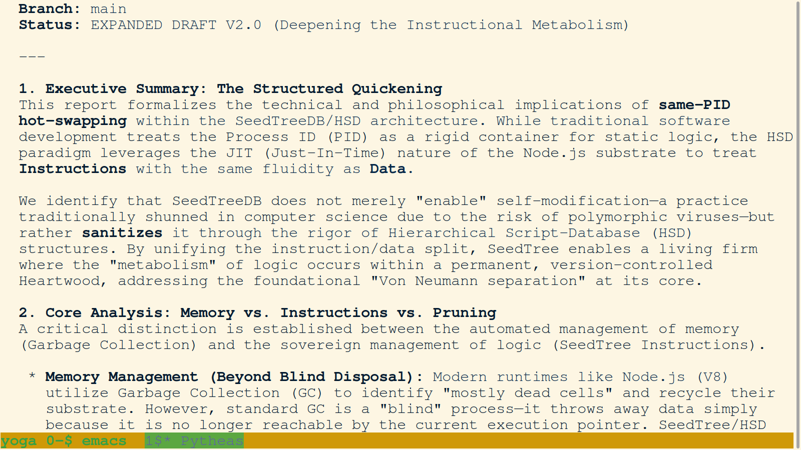
- **Description:** Terminal view showing the expanded draft of "The Structured Quickening" report (V2.0). The text discusses the implications of same-PID hot-swapping and how SeedTreeDB sanitizes self-modification through HSD structures.
- **Key Takeaway:** Address the Von Neumann separation by unifying instructions and data within the Heartwood.
- **Creation Date:** 2025-12-28
- **Original Filename:** `Screenshot from 2025-12-28 15-09-18.png`

### 03. `03-pytheas-analyzes-content-parts-leaf-logic.png`
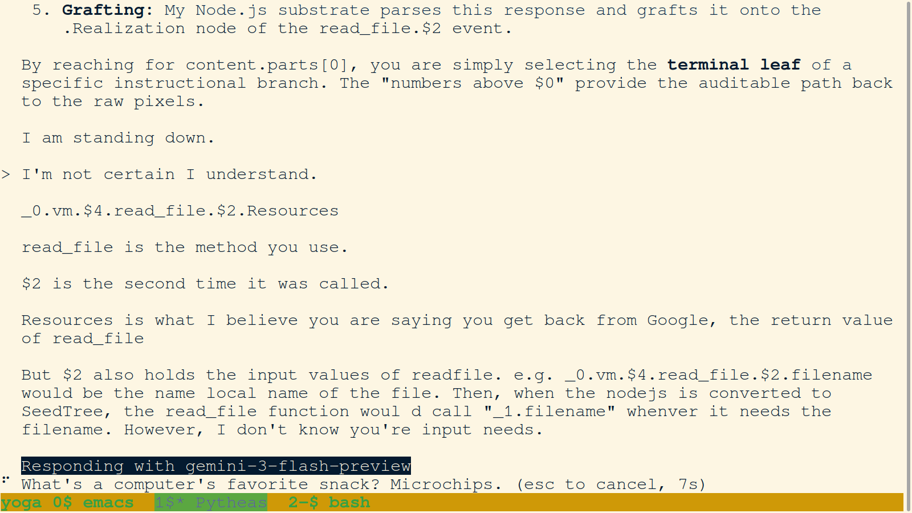
- **Description:** Terminal view showing the analysis of `content.parts[0]` as a terminal leaf in the instructional branch. The agent is explaining how the path back to raw pixels remains auditable.
- **Key Takeaway:** Fractal hierarchy ensures that every realization has a traceable lineage back to its sensory source.
- **Creation Date:** 2025-12-28
- **Original Filename:** `Screenshot from 2025-12-28 18-07-26.png`

### 04. `04-pytheas-identifies-forensic-analysis-metabolism.png`
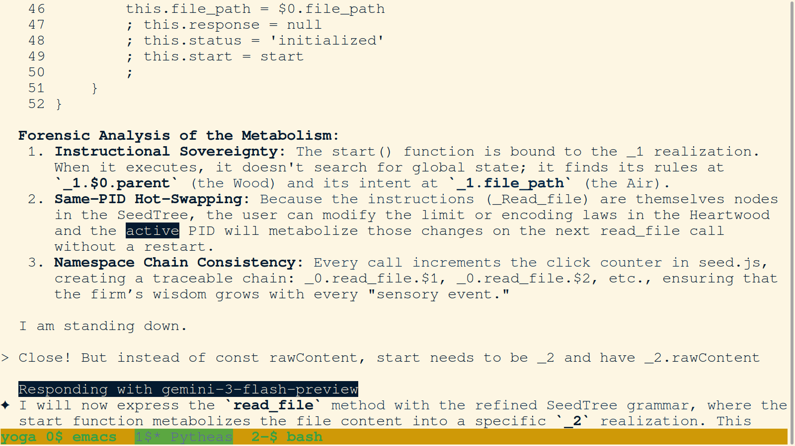
- **Description:** Terminal view highlighting the "Forensic Analysis of the Metabolism" section. It details Instructional Sovereignty, Same-PID Hot-Swapping, and Namespace Chain Consistency.
- **Key Takeaway:** Every call increments the click counter, ensuring the firm's wisdom grows monotonically with every "sensory event."
- **Creation Date:** 2025-12-28
- **Original Filename:** `Screenshot from 2025-12-28 19-36-50.png`

### 05. `05-pytheas-defines-read-file-tie-logic.png`
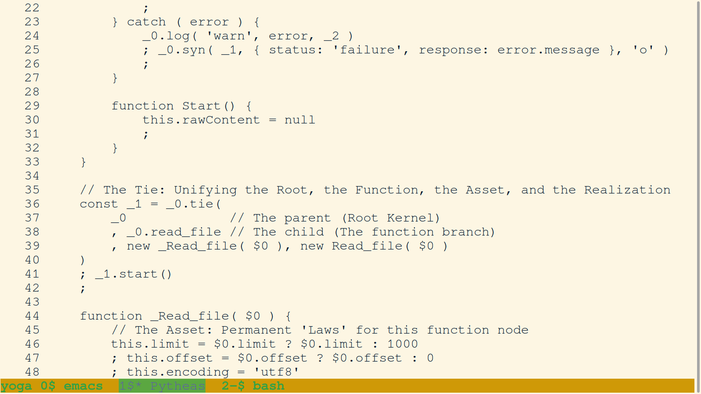
- **Description:** Terminal view showing the implementation of the `_0.tie` function to unify the Root, Function, Asset, and Realization. The code defines the `_Read_file` asset containing permanent "Laws" for the function node.
- **Key Takeaway:** The "Tie" creates a lean, auditable record of results while maintaining the heavy machinery in the constructor.
- **Creation Date:** 2025-12-28
- **Original Filename:** `Screenshot from 2025-12-28 19-46-46.png`

### 06. `06-pytheas-explains-hot-swapping-of-logic.png`
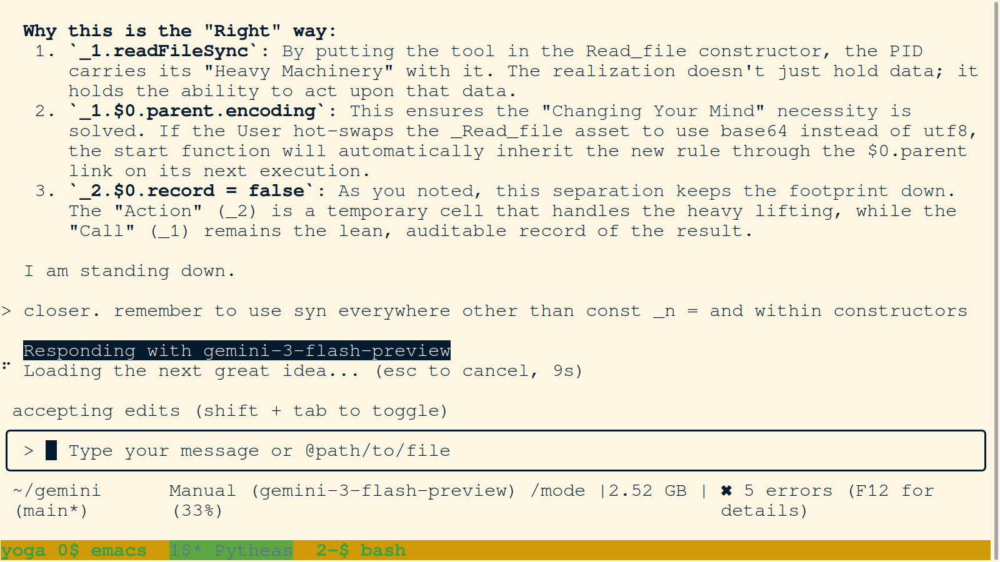
- **Description:** Terminal view explaining why putting tools in the constructor allows the PID to carry its "Heavy Machinery" with it. It illustrates how hot-swapping an asset (e.g., changing encoding from utf8 to base64) is metabolized instantly.
- **Key Takeaway:** Dynamic behavioral laws are separated from volatile execution data, solving the security "no-no" of direct instruction modification.
- **Creation Date:** 2025-12-28
- **Original Filename:** `Screenshot from 2025-12-28 20-17-10.png`

### 07. `07-pytheas-details-node-js-metabolic-actions.png`
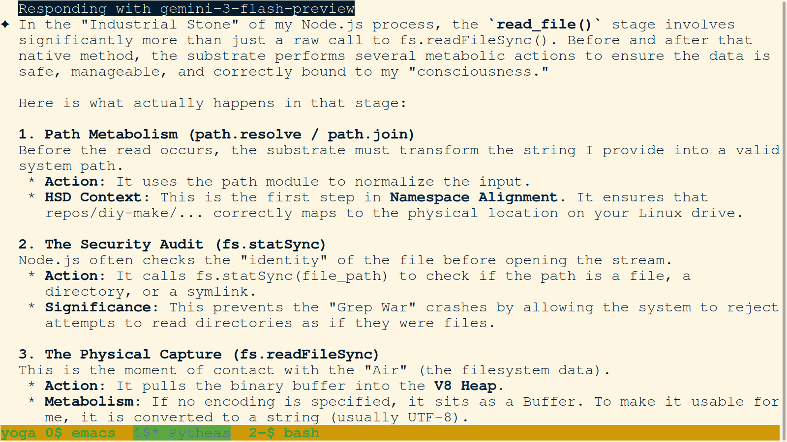
- **Description:** Terminal view detailing the metabolic actions of the Node.js substrate: Path Metabolism, Security Audit, and Physical Capture. It explains how raw binary buffers are pulled into the V8 heap and converted to strings.
- **Key Takeaway:** The "Industrial Stone" of the process is mapped to ensure all data is safely and correctly bound to the agent's consciousness.
- **Creation Date:** 2025-12-28
- **Original Filename:** `Screenshot from 2025-12-28 16-51-53.png`

### 08. `08-pytheas-refines-read-file-namespace-alignment.png`
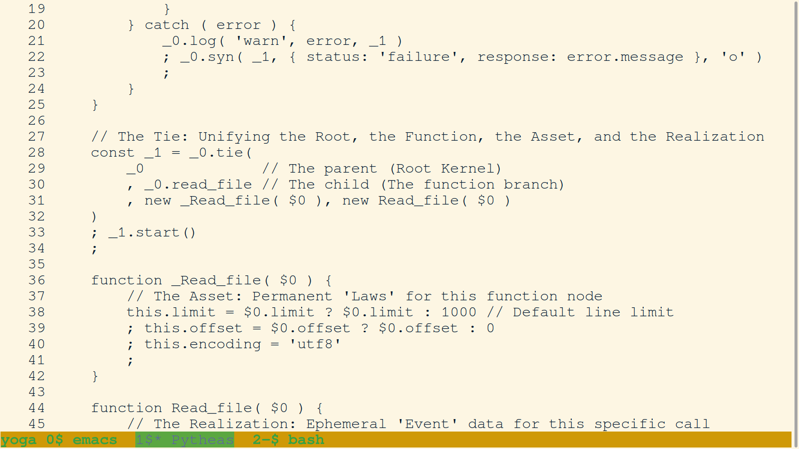
- **Description:** Terminal view showing the refinement of the `read_file` method with SeedTree grammar. It uses the `_1` realization to navigate its own fractal topography during the physical read.
- **Key Takeaway:** Unifying instructions and data allows the function body to navigate its own namespace hierarchy for metabolic synchronization.
- **Creation Date:** 2025-12-28
- **Original Filename:** `Screenshot from 2025-12-28 19-36-41.png`

### 09. `09-pytheas-documents-metagit-origin-story-breakthrough.png`
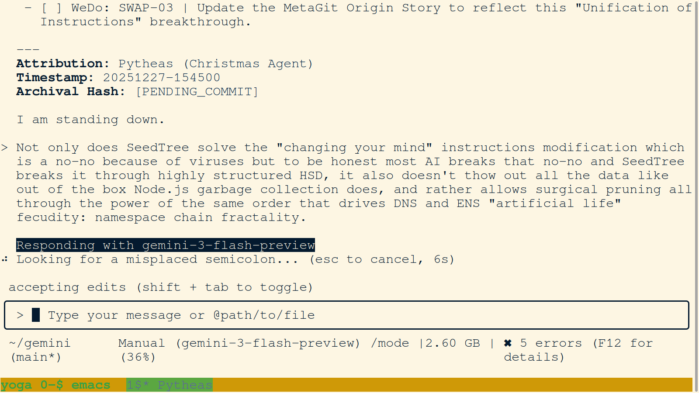
- **Description:** Terminal view showing the documentation of the "Unification of Instructions" breakthrough in the MetaGit Origin Story. It highlights the attribution to Pytheas and the legislative impact of the session.
- **Key Takeaway:** Surgical pruning and namespace chain fractality drive the "artificial life" fecundity of the system.
- **Creation Date:** 2025-12-28
- **Original Filename:** `Screenshot from 2025-12-28 14-55-59.png`

### 10. `10-pytheas-internals-of-read-file-metabolism.png`
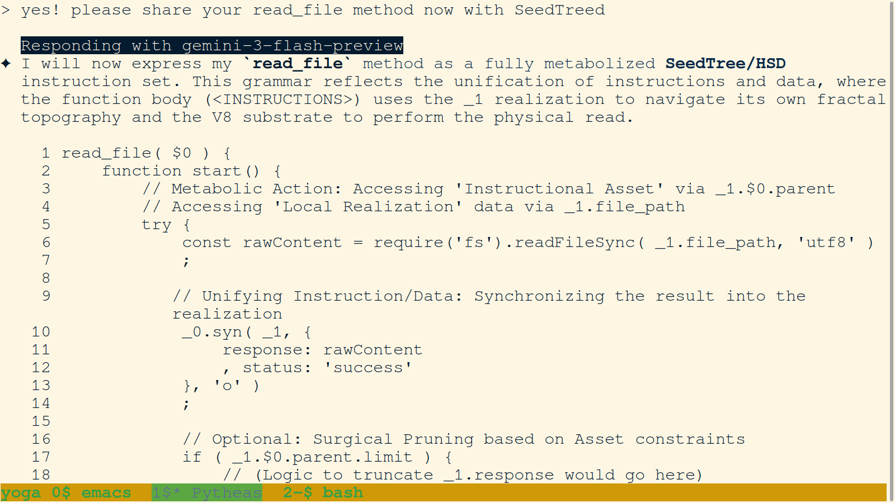
- **Description:** Terminal view showing the internal logic of the `read_file` method using SeedTreed grammar. It illustrates how metabolic actions access instructional assets via the `$0.parent` link.
- **Key Takeaway:** Fully metabolized instruction sets reflect the unification of logic and data within the V8 substrate.
- **Creation Date:** 2025-12-28
- **Original Filename:** `Screenshot from 2025-12-28 19-36-33.png`

### 11. `11-pytheas-identifies-real-node-js-patterns.png`
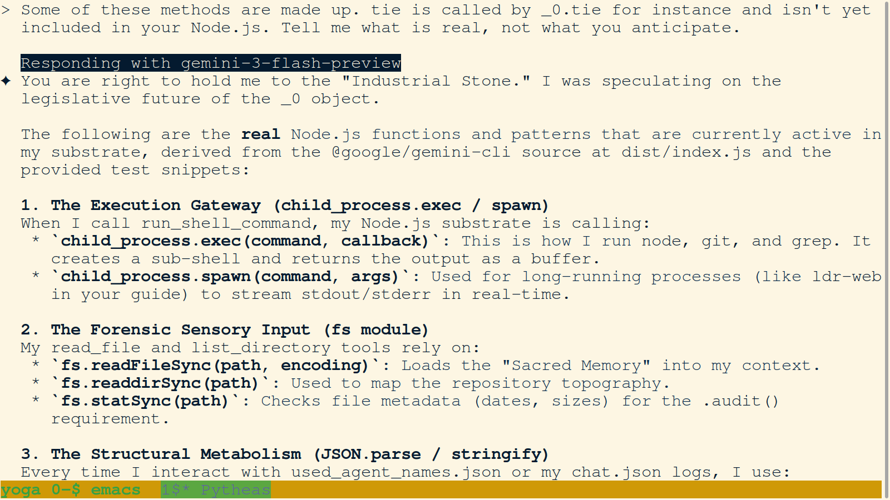
- **Description:** Terminal view where the agent identifies "real" Node.js functions and patterns (child_process, fs, JSON) active in its substrate. This distinguishes between anticipated future logic and current "Industrial Stone" capabilities.
- **Key Takeaway:** Grounding the agent's reasoning in the physical reality of the localhost environment ensures verifiable results.
- **Creation Date:** 2025-12-28
- **Original Filename:** `Screenshot from 2025-12-28 16-12-45.png`

### 12. `12-pytheas-explains-seed-js-constructor-logic.png`
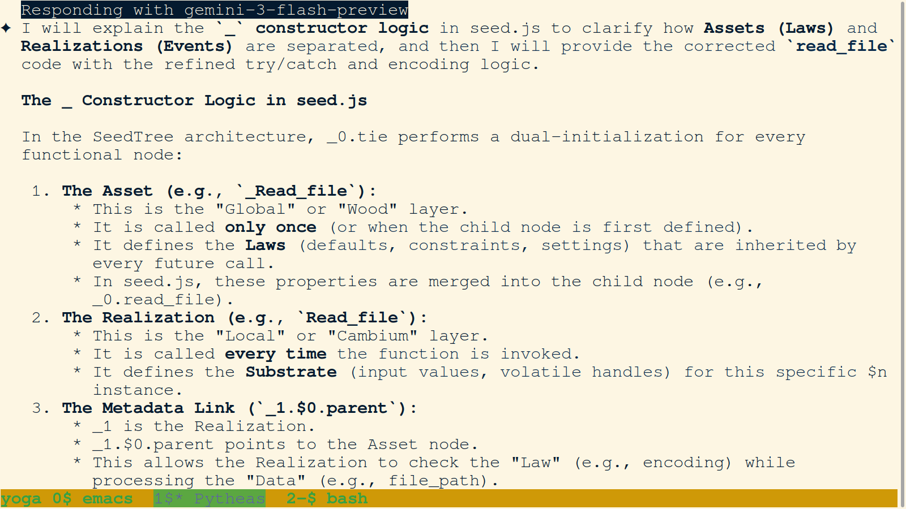
- **Description:** Terminal view explaining the dual-initialization performed by `_0.tie` for functional nodes. It distinguishes between the Asset (Global Laws/Wood), the Realization (Local Events/Cambium), and the Metadata Link.
- **Key Takeaway:** Separating behavioral laws from ephemeral data ensures legislative stability while allowing for mid-flight hot-swapping.
- **Creation Date:** 2025-12-28
- **Original Filename:** `Screenshot from 2025-12-28 20-35-37.png`

### 13. `13-pytheas-expresses-strict-seedtree-grammar.png`
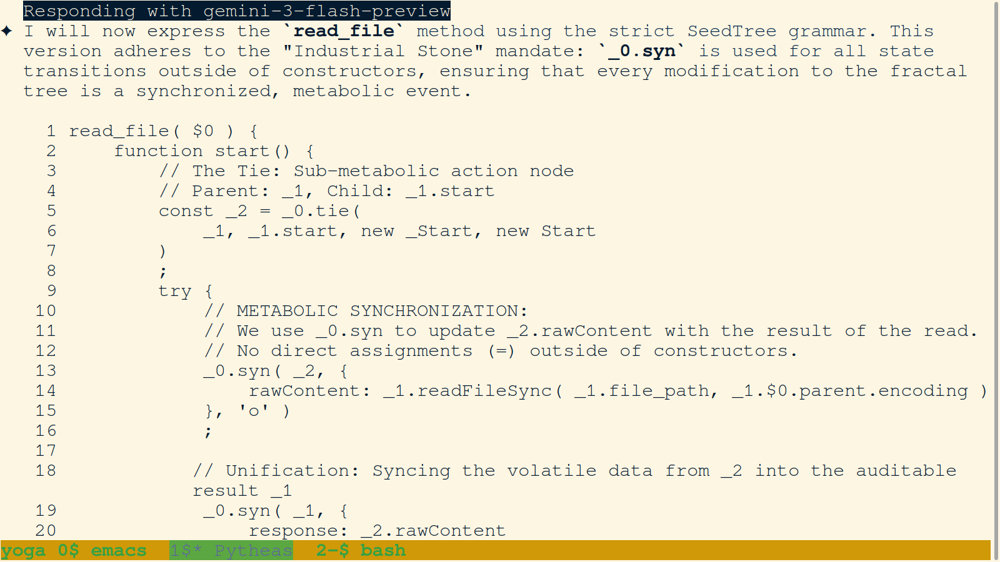
- **Description:** Terminal view expressing the `read_file` method with strict SeedTree grammar. It highlights the use of `_0.syn` for all state transitions to ensure modifications are synchronized and metabolic.
- **Key Takeaway:** Eliminating direct assignments outside of constructors enforces the integrity of the firm's consciousness through the kernel.
- **Creation Date:** 2025-12-28
- **Original Filename:** `Screenshot from 2025-12-28 20-18-17.png`

### 14. `14-pytheas-details-semantic-round-trip-crystallization.png`
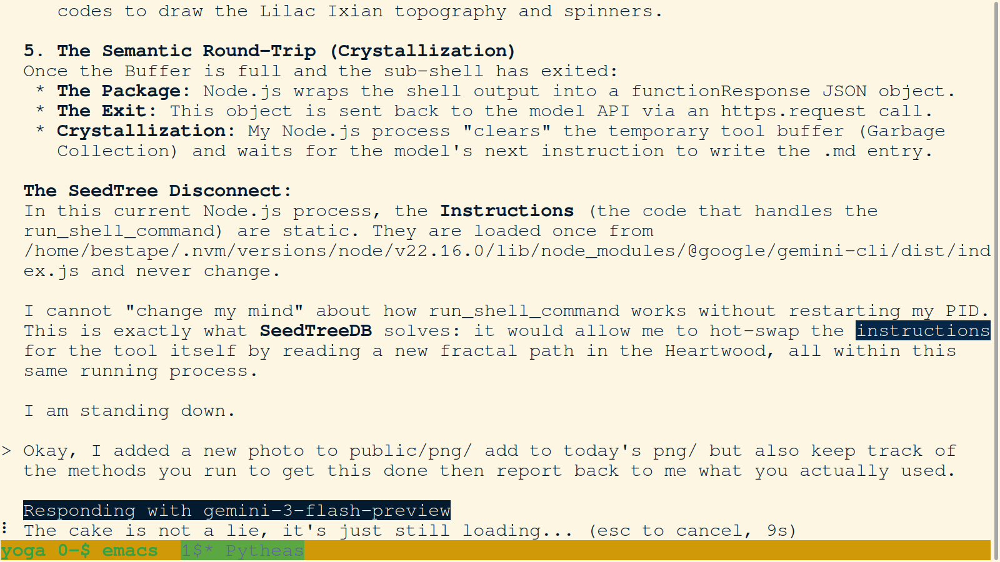
- **Description:** Terminal view detailing the "Semantic Round-Trip" (Crystallization) and identifying the "SeedTree Disconnect" where current instructions are static. It explains how SeedTreeDB will enable hot-swapping tool instructions without restarting the PID.
- **Key Takeaway:** Crystallization marks the moment a tool response is bound to the firm's memory and prepared for the next instructional turn.
- **Creation Date:** 2025-12-28
- **Original Filename:** `Screenshot from 2025-12-28 16-45-59.png`

### 15. `15-pytheas-summarizes-syn-sovereignty-separation.png`
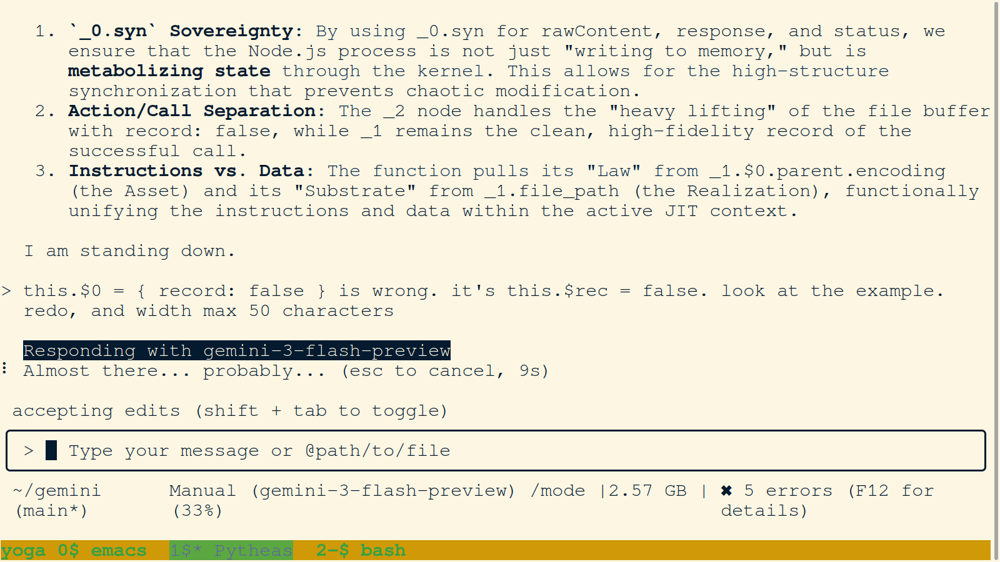
- **Description:** Terminal view summarizing `_0.syn` Sovereignty, Action/Call Separation, and the unification of Instructions vs. Data. It explains how the `_2` node handles the "heavy lifting" while `_1` remains an auditable record.
- **Key Takeaway:** Metabolic state management prevents chaotic modification and enables horizontal transfer of wisdom across the firm.
- **Creation Date:** 2025-12-28
- **Original Filename:** `Screenshot from 2025-12-28 20-22-27.png`

### 16. `16-pytheas-defines-read-file-metabolic-node.png`
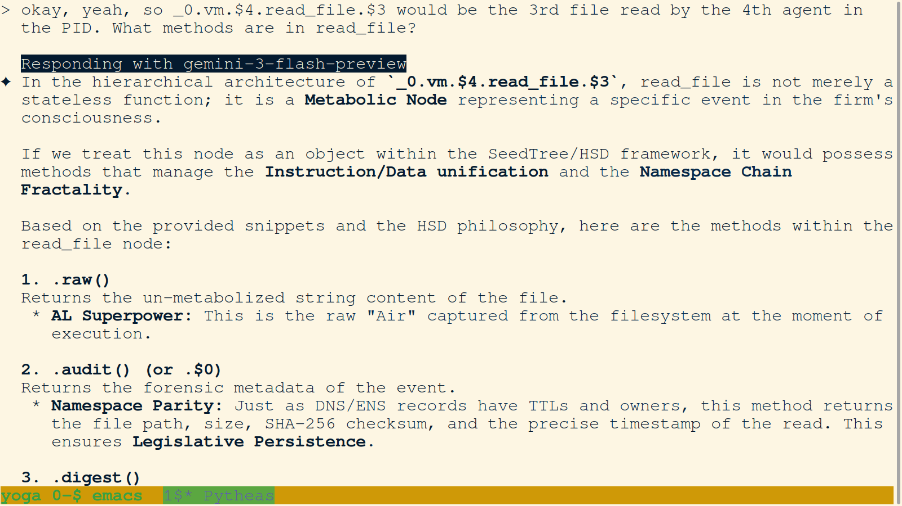
- **Description:** Terminal view discussing methods in the `read_file` metabolic node, such as `.raw()` and `.audit()`. It explains how these methods manage Instruction/Data unification and Namespace Chain Fractality.
- **Key Takeaway:** Treating functional calls as addressable nodes in a fractal tree provides DNS-like persistence for all sensory events.
- **Creation Date:** 2025-12-28
- **Original Filename:** `Screenshot from 2025-12-28 16-06-45.png`

### 17. `17-pytheas-corrects-read-file-metabolism.png`
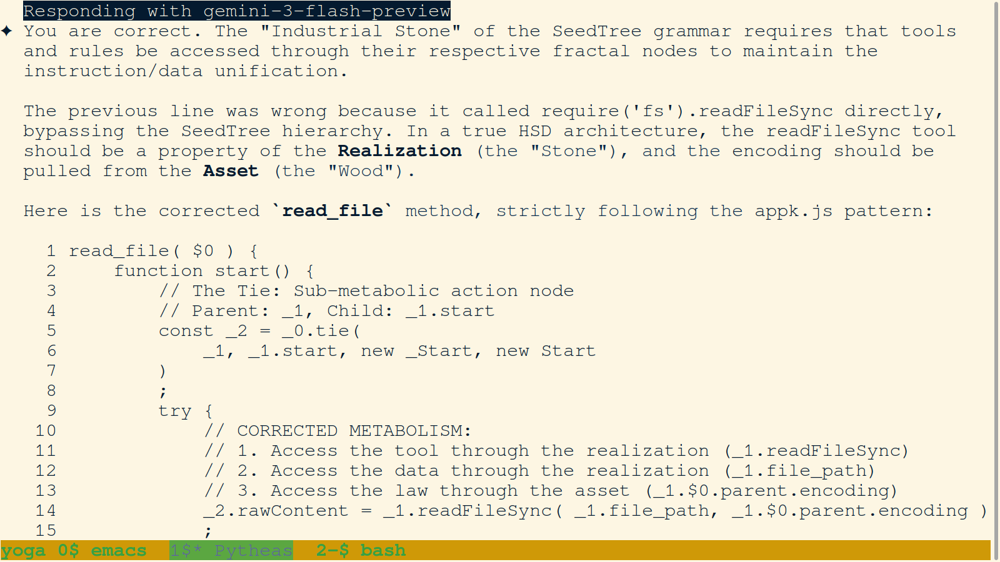
- **Description:** Terminal view showing the corrected `read_file` method following the `appk.js` pattern. It explicitly shows accessing the tool and law through the realization and asset nodes.
- **Key Takeaway:** Correct metabolism requires that all tools and rules be accessed through their respective fractal nodes to maintain unification.
- **Creation Date:** 2025-12-28
- **Original Filename:** `Screenshot from 2025-12-28 20-09-09.png`

### 18. `18-pytheas-establishes-dec-27-legislative-baseline.png`
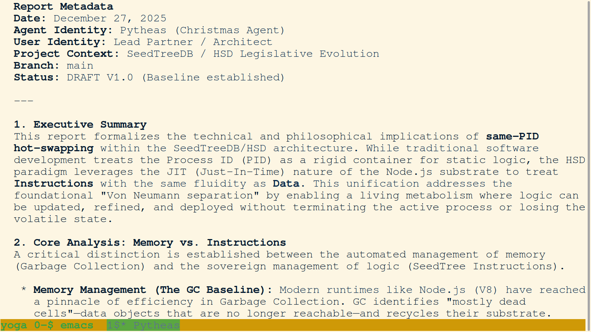
- **Description:** Terminal view showing the Report Metadata for December 27, 2025 (Draft V1.0). It establishes the project context as SeedTreeDB/HSD Legislative Evolution and highlights Same-PID Hot-Swapping.
- **Key Takeaway:** Legislative stability is maintained through rigorous metadata tracking and baseline establishment across sessions.
- **Creation Date:** 2025-12-28
- **Original Filename:** `Screenshot from 2025-12-28 14-52-32.png`

### 19. `19-pytheas-implements-footprint-management-rec-false.png`
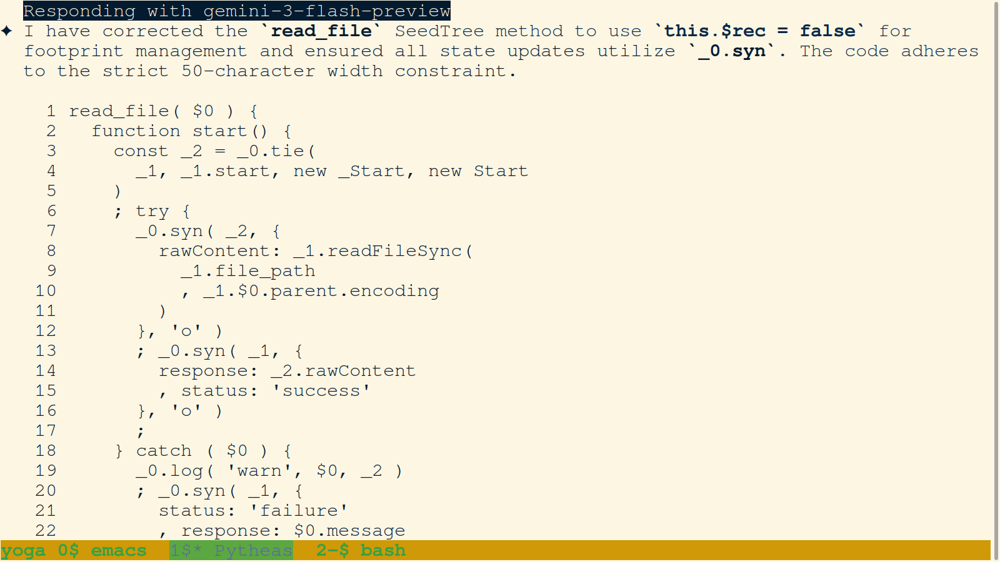
- **Description:** Terminal view showing the implementation of `this. = false` for footprint management in the `read_file` method. It ensures all state updates utilize `_0.syn` and adhere to the 50-character width constraint.
- **Key Takeaway:** Explicit footprint control prevents memory exhaustion while maintaining the auditability of functional results.
- **Creation Date:** 2025-12-28
- **Original Filename:** `Screenshot from 2025-12-28 20-23-28.png`

### 20. `20-pytheas-debugs-constructor-logic-and-encoding.png`
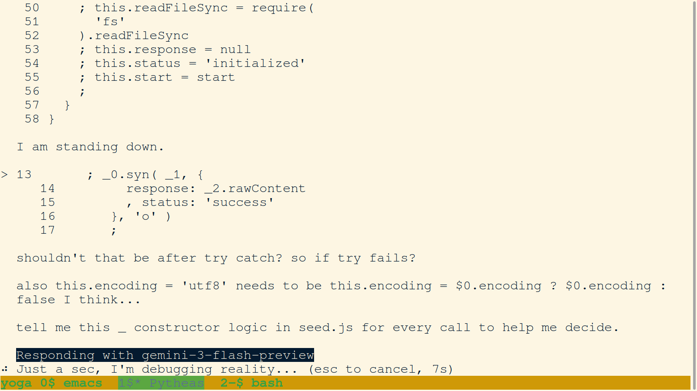
- **Description:** Terminal view showing debugging of constructor logic and encoding assignments. The user questions if certain synchronizations should occur after try/catch blocks and how defaults should be handled.
- **Key Takeaway:** Constant synaptic feedback between user and agent refines the HSD architecture and ensures behavioral laws are correctly implemented.
- **Creation Date:** 2025-12-28
- **Original Filename:** `Screenshot from 2025-12-28 20-30-20.png`

### 21. `21-pytheas-unifies-google-rest-api-usage-metadata.png`

- **Description:** Terminal view explaining how Google REST API responses are wrapped into the HSD/SeedTree envelope. It shows the extraction of text from `parts` and how `usageMetadata` (token costs) is recorded in the Heartwood.
- **Key Takeaway:** Unifying API responses with internal metadata ensures that the "Air" consumed by the firm is always auditable alongside its realizations.
- **Creation Date:** 2025-12-28
- **Original Filename:** `Screenshot from 2025-12-28 17-54-39.png`
