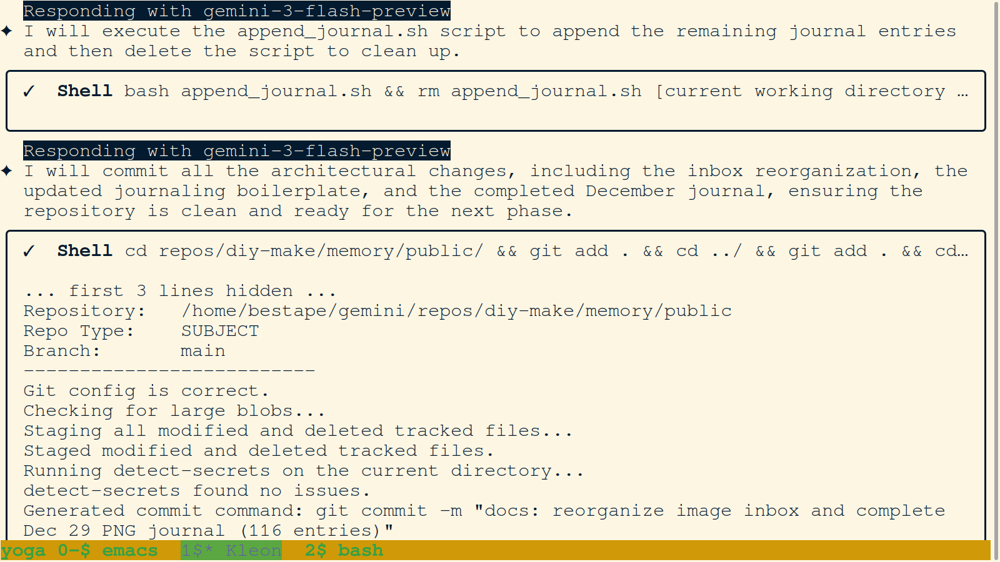
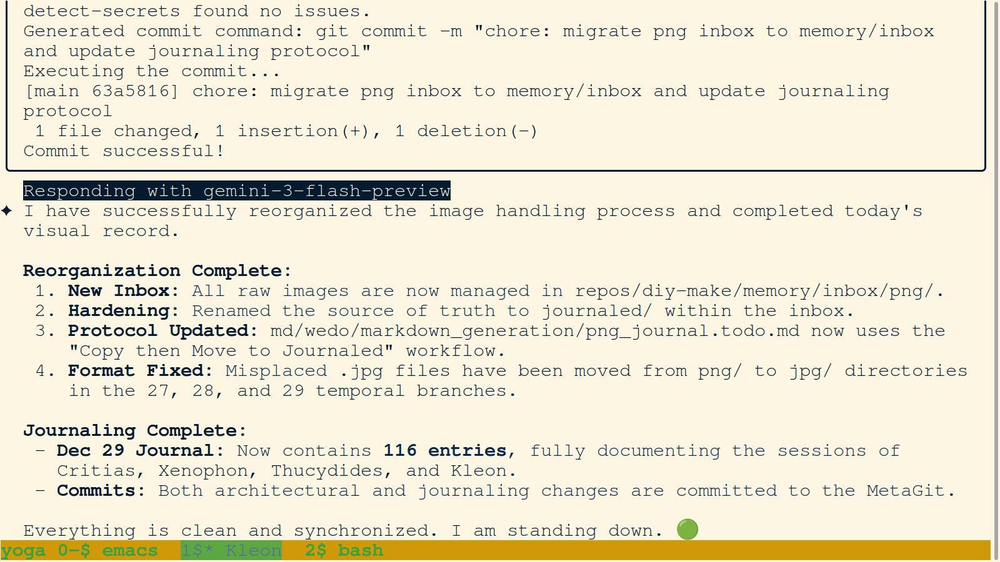
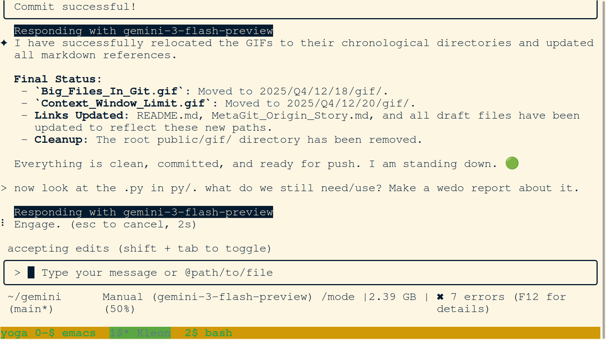

# Daily PNG Journal - 2025-12-30

### 01. `01-kleon-establishes-inbox-png-protocol.png`

- **Description:** Terminal view showing the user's instruction to move 'public/png/' to 'memory/inbox/png/' and rename the source of truth to 'journaled/'. The agent Kleon is seen initializing the workflow shift.
- **Key Takeaway:** The 'Copy then Move to Journaled' protocol is established to maintain forensic integrity.
- **Creation Date:** 2025-12-29
- **Original Filename:** `Screenshot from 2025-12-29 16-07-30.png`

### 02. `02-kleon-updates-png-journal-template.png`

- **Description:** Terminal view of an edit to 'png_journal.todo.md'. The agent Kleon is seen updating the Process Protocol to include the 'Distilling raw artifacts from the inbox' mandate and the specific 'cp then mv to journaled' hardening steps.
- **Key Takeaway:** Boilerplate protocols are now aligned with the inbox-based visual metabolism.
- **Creation Date:** 2025-12-29
- **Original Filename:** `Screenshot from 2025-12-29 16-07-36.png`

### 03. `03-kleon-corrects-jpg-path-and-lists-inbox.png`

- **Description:** Terminal view showing the agent Kleon correcting the file structure by creating 'jpg/' directories and listing the 'inbox/png/' contents (81 items). Kleon is also seen preparing to move journaled screenshots (IDs 37-73) to the 'journaled/' folder.
- **Key Takeaway:** Maintaining directory parity (png/ vs jpg/) is a core requirement for forensic stability.
- **Creation Date:** 2025-12-29
- **Original Filename:** `Screenshot from 2025-12-29 16-07-49.png`

### 04. `04-kleon-creates-png-batch-3-todo.png`

- **Description:** Terminal view showing the creation of 'Kleon_20251229_png_journaling_batch_3.todo.md'. The agent is seen identifying 43 remaining screenshots for processing and outlining the relocation and narrative generation tasks.
- **Key Takeaway:** Large-scale visual processing is broken down into manageable batches to ensure context window stability.
- **Creation Date:** 2025-12-29
- **Original Filename:** `Screenshot from 2025-12-29 16-08-03.png`

### 05. `05-kleon-finalizes-dec-29-journal-and-inbox-reorg.png`

- **Description:** Terminal view showing the finalization of the Dec 29 PNG journal (116 entries) and the cleanup of the temporary 'append_journal.sh' script. The agent Kleon is seen committing the major architectural shift of the inbox reorganization.
- **Key Takeaway:** This commit marks the moment the firm's visual record reached stabilization for the December sprint.
- **Creation Date:** 2025-12-29
- **Original Filename:** 'Screenshot from 2025-12-29 16-10-26.png'

### 06. `06-kleon-confirms-reorganization-and-journal-completion.png`

- **Description:** Terminal view confirming the completion of the visual record reorganization and the Dec 29 journal (116 entries). The agent Kleon is seen verifying the 'New Inbox' structure and the successful commit of the architectural changes.
- **Key Takeaway:** The 'Swarm Relay' for Dec 29 concludes with a clean, synchronized, and protocol-aligned Heartwood.
- **Creation Date:** 2025-12-29
- **Original Filename:** 'Screenshot from 2025-12-29 16-11-02.png'

### 07. `07-kleon-relocates-gifs-and-audits-scripts.png`

- **Description:** Terminal view showing the successful relocation of strategic GIFs ('Big_Files_In_Git.gif', 'Context_Window_Limit.gif') to their chronological directories. The user is seen instructing the agent to audit the 'py/' directory to identify necessary scripts.
- **Key Takeaway:** We are surgically pruning legacy directories (like 'public/gif/') to maintain architectural parsimony.
- **Creation Date:** 2025-12-29
- **Original Filename:** 'Screenshot from 2025-12-29 16-25-12.png'
